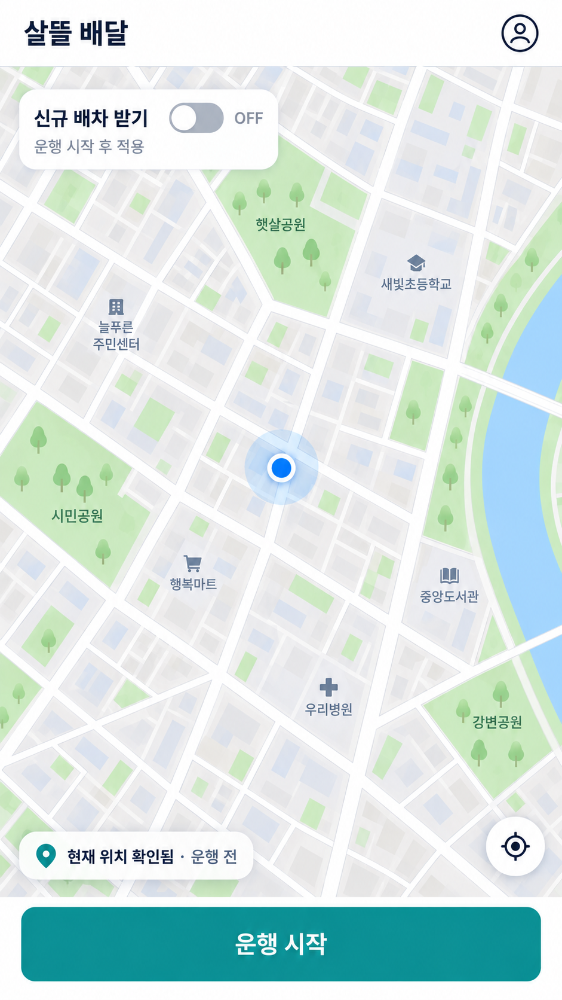
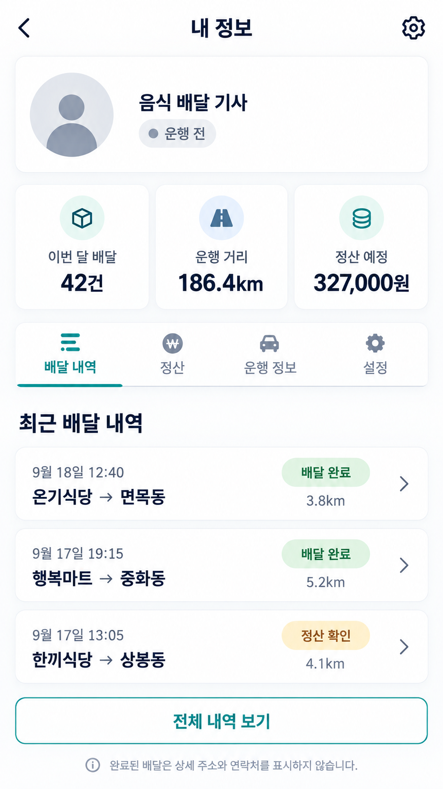

[기획 · 운영·음식 배달 기사 UI/UX · PLAN-OPERATIONS-FOOD-DRIVER-MAP-HOME · r11]

# 음식 배달 기사 지도 중심 첫 화면

> 화면 이미지 경계: 이 문서에 연결된 모바일 이미지는 모두 `SampleOnly / NotApprovedVisual / NotImplementationSpec`인 탐색용 샘플이다. Git 커밋은 시안 승인이나 구현 지시를 뜻하지 않는다. [샘플 이미지 대장](../../../../assets/planning/README.md)

- 기획 ID: `PLAN-OPERATIONS-FOOD-DRIVER-MAP-HOME`
- 기획 분야: 운영·음식 배달 기사 UI/UX
- 기획 판본: `r11`
- 상태: `Draft / MapFirstConfirmed / MyInfoEntryTopRightConfirmed / DeliveryHistoryDefaultConfirmed / HistoryDetailConfirmed / PayoutBreakdownDefaultExpandedCollapsible / FrozenPayoutBreakdownConfirmed / BaseDistanceWeatherDemandSeparated / StandardRowsAlwaysVisibleConfirmed / NotAppliedZeroDistinguishedFromMissingEvidence / GrossDeductionNetSeparated / MonthlyInsuranceFinalizationConfirmed / PlatformShareNeverDeductedFromDriver / PlatformContributionSecondaryDisclosureConfirmed / ExpectedAndSettlementSeparated / DriverHoldLabelSimplifiedConfirmed / CustomerCenterInquiryConfirmed / InternalHoldReasonOperatorOnly / HistoricalNoRecalculationConfirmed / RestaurantRelationshipBadgeConfirmed / DriverVisibilityControlConfirmed / ExistingPricingLedgerPartiallyMapped / StatutoryDeductionLedgerMissing / FoodHistoryProjectionRequired / PayoutBreakdownContractRequired / OperationalLegalReviewRequired / CurrentScreenPlanningClosed / FcmPrimaryConfirmed / SignalRClientRemoved / FirebaseConfigurationWaiting / ProductImplementationPartial`
- 상위 역할 기획: [하나의 운영 원장과 역할별 OS 작업공간](../../시스템/PLAN-SYSTEM-ROLE-PERSPECTIVE-OPERATING-WORKSPACES/README.md)
- 배차 의미 정본: [운영 배차 공통 코어](../PLAN-OPERATIONS-DISPATCH-CORE/README.md)
- 음식점 관계 기준: [음식점과 배달 기사가 함께한 배달 관계](../PLAN-OPERATIONS-FOOD-RESTAURANT-RIDER-RELATIONSHIP/README.md)
- 지급 상세 기준: [음식 배달 완료 내역의 기사 지급 구성 상세](../PLAN-OPERATIONS-FOOD-DRIVER-PAYOUT-DETAIL/README.md)
- 다음 질문: 없음. 현재 기사 첫 화면·내 정보·지급 상세 문답은 닫고 제품 계약 구현 뒤 다시 연다.

## 1. 사용자 요구

음식 배달 기사 앱은 카드형 포털이 아니라 지도가 첫 화면이다.

- 화면 대부분은 현재 위치와 주변 도로를 보여 주는 지도다.
- 왼쪽 상단에는 `신규 배차 받기` ON/OFF 토글을 둔다.
- 화면 하단에는 큰 `운행 시작` 버튼을 고정한다.
- 배차 제안과 현재 수행 건은 별도 홈 카드로 밀어내지 않고 지도 위 상태·경로·아래 sheet로 연결한다.

## 1.1 첫 모바일 시안



이 이미지는 운행 전 첫 화면의 정보 계층을 판단하기 위한 기획 시안이다. 실제 `FDriverApp` 렌더, Android 네이티브 지도, GPS·서버 연결이나 제품 구현 증거가 아니다.

## 1.2 내 정보·배달 내역 모바일 시안



오른쪽 상단 사람 아이콘은 `내 정보` 진입점이다. 누르면 지도 위에 작은 팝업만 띄우지 않고 별도 화면으로 이동하며, 기본 탭은 `배달 내역`이다. 시안의 건수·거리·금액은 정보 계층을 확인하기 위한 예시이며 실제 기사 원장이나 정산 결과가 아니다.

## 2. 첫 화면 구조

```text
┌──────────────────────────────┐
│ [신규 배차 받기  OFF/ON]     │  ← 왼쪽 상단
│                    [내 정보] │
│                              │
│          지도                │
│    현재 위치·도로·거점       │
│    선택된 픽업·전달 경로     │
│                              │
│  새 배차가 있을 때만 배너    │
│                              │
│ [          운행 시작         ]│  ← 하단 고정
└──────────────────────────────┘
```

- 지도는 로그인 뒤 기본 진입 화면이며 현재 위치 권한이 없으면 빈 지도를 가짜 위치로 채우지 않고 권한 안내를 표시한다.
- `신규 배차 받기` 토글은 기사 본인의 수신 의사다. ON이어도 서버의 위치·운행·자격·중복 수행·연결 상태 판정을 통과해야 실제 후보가 된다.
- OFF는 새 제안과 제안 타이머를 멈추지만 이미 수락한 배달을 취소하거나 숨기지 않는다.
- 연결 오류가 발생해도 사용자의 ON 의사를 자동 OFF로 바꾸거나 기사 거절로 기록하지 않는다.
- 하단 `운행 시작`은 기사 운행 세션과 위치 갱신을 시작하는 서버 Command 진입점이다. 토글과 같은 상태로 합치지 않는다.
- 현재 수행 건이 있으면 지도에 해당 픽업·전달 경로와 다음 허용 행동을 우선 표시한다.
- 새 제안은 지도 상단 배너나 마커로 알리고, 누르면 음식점·전달지·예상 거리·예상 지급액 상세를 연다.
- 배차 제안 상세의 음식점 이름 아래에는 서버에 확정된 `함께 완료한 배달 N회`를 작은 관계 배지로 표시하고, 현재 제안은 `N+1번째 후보`로 구분한다.
- 관계 배지를 누르면 해당 음식점과 함께 완료한 배달 목록을 연다. 음식점이 기사 상대 공개를 껐거나 설정을 확인할 수 없으면 배지와 진입점을 표시하지 않는다.
- 오른쪽 상단 사람 아이콘은 `내 정보`로 이동한다. 지도 운행 화면과 계정·이력 확인 화면을 한 화면에 과도하게 섞지 않는다.

## 2.1 내 정보 화면 구조

```text
내 정보
  → 기사 역할·현재 운행 상태
  → 이번 달 배달 건수 / 운행 거리 / 정산 예정 요약
  → 배달 내역(기본) / 정산 / 운행 정보 / 설정
  → 최근 배달 목록
  → 배달 한 건 상세
```

- `배달 내역`은 완료·진행 원장을 새로 복제하지 않고 음식 배달 원장의 기사 관점 조회 결과다.
- 목록은 완료 시각, 픽업 주체와 거친 도착 지역, 상태, 해당 업무의 근거 있는 거리만 표시한다.
- 완료 건을 열면 수락·픽업·전달·수령 확인 시각, 기사 기본 지급액, 거리 추가 지급액, 기상 할증, 한시 수요·피크 할증, 기타 확정 조정, 총 지급 예정액·정산 상태와 사건·보류 여부를 같은 업무 안정 ID로 조회한다.
- 지급 구성은 제안 시점에 원장에 동결된 항목만 표시하며 현재 정책으로 과거 금액을 다시 계산하지 않는다.
- 표준 지급 행은 항상 표시하고 `0원·미적용`, `세부 근거 없음`, `확인할 수 없음`을 구분한다.
- 지급 구성 카드는 기본 펼침으로 열고 기사가 원하면 접을 수 있다.
- `공제 전 기사 지급액 → 기사 부담 법정 공제 → 실지급 예정액` 순서로 보여 준다. 법정 공제는 서버가 적용 대상으로 판정한 사업소득세·개인지방소득세·고용보험·산재보험만 표시한다.
- 월 보수로 확정되는 보험료는 완료 직후 `정산 시 확정`, 정산 뒤 실제 공제액으로 바꾼다. 플랫폼 부담 보험료는 기사 실지급액에서 차감하지 않는다.
- 플랫폼 부담 보험료는 기본 지급 상세에서 숨기고 `보험료 납부 내역`을 열었을 때만 `플랫폼 부담 · 기사 실지급액에서 차감하지 않음`으로 보여 준다.
- `운행 거리`는 단말이 임의로 누적한 GPS 길이가 아니라 서버가 인정한 업무별 경로 거리 또는 검증된 운행 거리의 합계다. 근거가 없으면 `집계 준비 중`으로 표시한다.
- `정산 예정`과 확정·지급 완료 금액을 섞지 않는다. 지급 원장 상태를 함께 표시한다.
- 지급이 보류된 경우 기사 화면에는 `지급 보류`만 표시한다. 상세 원인 대신 `고객센터 문의` 전화 진입점과 문의용 배달 번호를 제공하며 내부 보류 코드와 귀책 추정은 운영자 영역에 둔다.
- 완료 뒤에는 주문자의 상세 주소·연락처·정밀 좌표를 목록과 상세에서 제거한다. 과거 원시 GPS 이동 궤적도 기본 보관·표시하지 않는다.

## 3. 상태 조합

| 운행 상태 | 신규 배차 토글 | 첫 화면 의미 |
| --- | --- | --- |
| 운행 전 | OFF | 지도 확인, 하단 `운행 시작` |
| 운행 전 | ON 후보 | 운행 시작 뒤 적용할 의사인지 여부는 다음 문답 |
| 운행 중 | ON | 서버 판정을 통과하면 신규 제안 수신 가능 |
| 운행 중 | OFF | 새 제안은 받지 않고 이미 수락한 업무는 계속 수행 |
| 운행 중·수행 건 있음 | ON/OFF | 수행 건의 경로·다음 행동이 지도에서 최우선 |
| 연결 지연 | 사용자 의사 보존 | 실제 배차 가능 상태는 별도 표시, 거절·무응답으로 귀속하지 않음 |

## 4. 기존 코드 대조

| 기획 요소 | 현재 근거 | 판정 |
| --- | --- | --- |
| 네이티브 지도·교통·현재 위치·마커·경로 | `FDriverApp/Pages/MainPage.xaml`, `FDriverNativeMapView` | `O` |
| 운행 시작·종료와 위치 갱신 | `MainPageModel.ToggleWorkCommand`, `음식배달기사운행ViewModel` | `O` |
| FCM 신규 배차 힌트와 10초 서버 조회 복구 | 서버 `FcmDriverRecommendationPushService`, `기사알림Controller`; 앱 `MainPageModel` | `부분` — 서버 전송·token API와 앱 polling은 존재하나 `kr.ssalddel.fdriver`용 Firebase 설정·Android 수신 adapter·장치 증거가 없음 |
| 새 배차 배너와 상세 진입 | `MainPage.xaml`, `OpenNewRecommendationsCommand` | `O` |
| 앱 `/`에서 지도로 바로 진입 | 현재 `/`는 `FDriverHome.razor` 카드형 홈 | `X` |
| 왼쪽 상단 독립 `신규 배차 받기` 토글 | 현재 운행 시작/추천 대기 종료가 한 버튼에 결합 | `X` |
| 하단 고정 `운행 시작` 단일 주요 행동 | 현재 작업 요약 영역 안의 토글 버튼 | `부분` |
| 오른쪽 상단 `내 정보` 진입 | `MainPage.xaml`의 `내 정보`, `OpenProfileCommand` | `부분` — 현재는 같은 화면 요약 구역 스크롤·상태 문구만 변경 |
| 기사 메뉴·배달 내역·거리 표시 참고 구조 | `DriverApp`의 `메뉴Page`, `배달내역Page` | `O` — 화물 기사 관점이므로 화면 구조만 참고 |
| 음식 배달 월 정산 건수 | `배달기사월정산응답` | `O` — 현재 계약은 배차건수·이용료·결제완료 중심 |
| 음식 배달 완료 이력·월 누적 운행거리 조회 | 전용 계약·화면을 확인하지 못함 | `X` |
| 지급 총액·기상 할증·피크 할증·정책 판본 | `FoodDeliveryDriverWorkspaceDto`, `운송원장` | `부분` — 진행 업무와 동결 원장에 존재 |
| 기사 기본 지급액과 거리 추가 지급액의 분리 | 현재 `기사기본거리지급액`에 합산 | `X` |
| 완료 배달 지급 구성 상세 조회 | 확인되지 않음 | `X` |
| 업무 경험 비공개 기록·친구 요청 기반 | `WorkRelationshipSnapshots`, 업무 관계 기반 친구 요청 | `O` — 음식점-음식 배달 기사 완료 횟수는 별도 필요 |
| 배차 제안의 음식점 관계 배지 | 확인되지 않음 | `X` |
| 지도·내 정보 모바일 기획 이미지 | 2개 생성 | `O` — 기획 시안만 해당 |

`O`는 코드가 존재한다는 뜻이며 실제 Android 지도 렌더·서버 연결·현장 사용이 검증됐다는 뜻이 아니다.

## 5. 권위와 안전 경계

- 앱은 수신 의사와 운행 시작 Command를 서버에 보낼 뿐 배차를 자체 확정하지 않는다.
- 토글 ON은 일자리·배차·최소 수익 보장이 아니다.
- 토글 OFF는 진행 중 배달의 책임 해제나 자동 취소가 아니다.
- 현재 배달을 수행 중이면 토글보다 현재 경로·픽업·전달 행동이 우선한다.
- 위치 권한 거부·GPS 결손·네트워크 지연은 기사 책임 거절로 기록하지 않는다.
- 주행 중에는 긴 문장과 작은 조작을 줄이고, 제안 상세·정산·설정은 정차 뒤 여는 보조 화면으로 둔다.
- 내 정보 화면은 진행 중 배달의 주소·연락처를 장기 이력으로 복사하지 않는다.
- 화물 기사 앱의 배달 내역 UI를 재사용할 수는 있지만 화물 운송 상태·정산 의미를 음식 배달에 그대로 적용하지 않는다.
- 음식점과 함께한 횟수는 배차 추천 점수·지급액·수락 압력으로 사용하지 않으며 친구 관계로 자동 전환하지 않는다.

## 확정

- 음식 배달 기사 앱의 첫 화면은 지도다.
- 왼쪽 상단에 `신규 배차 받기` ON/OFF 토글을 둔다.
- 하단에 큰 `운행 시작` 버튼을 둔다.
- 운행 상태와 신규 배차 수신 의사를 서로 다른 상태로 관리한다.
- OFF여도 이미 수락한 배달은 계속 표시하고 완료한다.
- 기존 `FDriverApp` 지도·위치·경로·실시간 배차 코드를 재사용한다.
- 오른쪽 상단 사람 아이콘을 `내 정보` 진입점으로 사용한다.
- 내 정보의 기본 탭은 `배달 내역`이며 `정산`, `운행 정보`, `설정`으로 이동할 수 있다.
- 설정에는 `음식점에 함께한 배달 횟수 표시`를 두고 기본값은 ON으로 하되 기사 본인이 언제든 끌 수 있다.
- 최근 배달 목록에서 한 건의 시간·상태·근거 거리와 상세를 확인할 수 있게 한다.
- 배달 상세는 기사 기본 지급, 거리 추가, 기상 할증, 수요·피크 할증, 기타 확정 조정과 총액·정산 상태를 분리해 보여 준다.
- 과거 상세는 제안 시점의 동결 금액만 사용하며 세부 근거가 없는 과거 자료를 현재 정책으로 역산하지 않는다.
- 완료 건의 상세 주소·연락처와 원시 GPS 이력은 표시하지 않는다.
- 배차 제안과 배정 상세에서 해당 음식점과 함께 완료한 배달 횟수를 확인할 수 있게 한다.

## 미정

- 운행 전 토글 조작을 허용할지 운행 시작 뒤에만 허용할지
- 운행 시작 뒤 하단 버튼을 `운행 중` 상태 표시와 `운행 종료` 중 어떤 구조로 바꿀지
- 진행 중 배달이 있을 때 아래 sheet를 자동으로 얼마나 펼칠지
- 월 운행 거리의 정본 자료원과 집계 주기
- 배달 한 건 상세에서 과거 경로 지도를 어느 수준까지 제공할지
- 완료 이력의 보존 기간과 기사 본인 내보내기 범위
- 관계 상세에서 최근 함께한 완료 내역을 기본 몇 건까지 보여 줄지
- 실제 Android 지도 화면의 크기·안전 영역·한 손 조작 검증

## 다음 질문 하나

없음. 현재 기사 첫 화면·내 정보·배달 내역·지급 상세의 정보 계층을 확정했으므로 제품 계약 구현 뒤 다시 연다.
