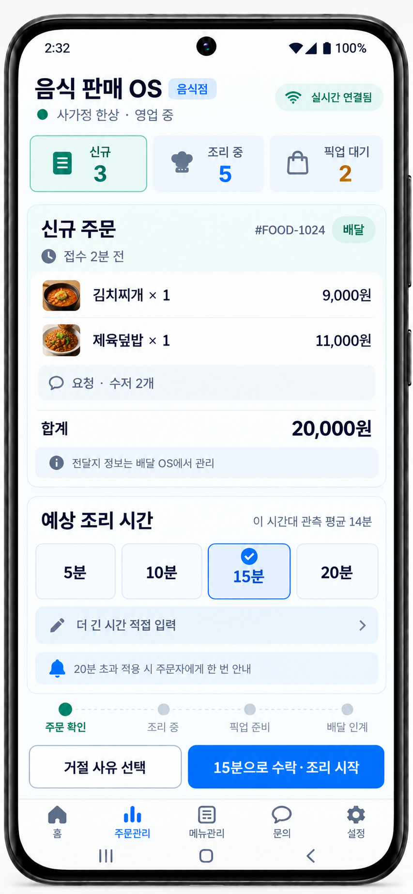

[기획 · 운영·음식 판매 UI/UX · PLAN-OPERATIONS-FOOD-SALES-ORDER-DESK · r5]

# 음식 판매 OS 주문 처리 화면

- 기획 ID: `PLAN-OPERATIONS-FOOD-SALES-ORDER-DESK`
- 기획 분야: 운영·음식 판매 UI/UX
- 기획 판본: `r5`
- 상태: `Draft / ExistingRestaurantDeskFlowMapped / FirstMobileVisualDraftGenerated / ExistingFoodOrderAuthorityReused / RolePerspectiveWorkspaceBound / FiveTenFifteenTwentyChoicesConfirmed / Over20MinuteInAppAndPushConfirmed / AssignedDriverRelationshipBadgeConfirmed / CompletedDeliveryCountOnlyConfirmed / RelationshipBadgeDetailConfirmed / RestaurantVisibilityControlConfirmed / DefaultVisibleConfirmed / PreferenceFailureFailClosed / RelationshipNoDriverSelectionAuthorityConfirmed / FoodRestaurantDriverRelationshipProjectionRequired / RelationshipVisibilityPreferenceRequired / MobileProductImplementationDeferred`
- 사용자 요구: 글로 존재하던 음식점의 주문 접수·확인·조리시간 선택·수락/거절·조리·픽업 준비 흐름을 화면으로 구체화하고, 관련 기획과 현재 코드 위치를 결속하여 후속 Codex 구현이 대화 기억 없이도 같은 의도를 읽게 한다.
- 상위 운영 경계: [화물운송 OS와 음식배달 OS](../PLAN-OPERATIONS-LOGISTICS-OS/README.md)
- 조리시간·알림 정책: [운영 배차 공통 코어](../PLAN-OPERATIONS-DISPATCH-CORE/README.md)
- 모바일 운영자 정보 계층: [지역 운영 생명주기 E2E](../../시스템/PLAN-SYSTEM-REGIONAL-OPERATIONS-E2E-SCAFFOLD/README.md)
- 역할별 작업공간 기준: [하나의 운영 원장과 역할별 OS 작업공간](../../시스템/PLAN-SYSTEM-ROLE-PERSPECTIVE-OPERATING-WORKSPACES/README.md)
- 음식점 관계 기준: [음식점과 배달 기사가 함께한 배달 관계](../PLAN-OPERATIONS-FOOD-RESTAURANT-RIDER-RELATIONSHIP/README.md)
- 원장 내비게이션 기준: [3단계 클라이언트 내비게이션](../../../../Architecture/ThreeStageClientNavigation.md)
- 관련 WI·PlayableLoop: 없음. 운영 음식 주문 원장의 역할 화면이며 Unity PlayableLoop나 새 게임 권위를 만들지 않는다.
- Graph Map 영향: `NoImpact`. 주문·조리·배달 원장 관계를 화면에서 읽지만 공간 Graph Map이나 Unity 배치를 변경하지 않는다.
- 다음 질문: 주문을 수락한 뒤 같은 카드가 `조리 중` 작업 카드로 전환될지, 수신함으로 돌아가 별도 조리 보드에서 이어갈지 정한다.

## 1. 화면 명칭과 권위 경계

`음식 판매 OS`는 음식점 담당자가 자기 음식 주문과 조리 준비 업무를 이해하기 위한 제품·화면 명칭이다. 현행 서버에는 별도 `FoodSalesOS` 안정 식별자가 없으므로 이 기획만으로 새 운영 권위를 만들지 않는다.

이는 역할별 OS 작업공간이며 별도 서버 상태기나 중복 원장을 뜻하지 않는다. 주문자·음식점·기사는 같은 음식 주문·배달 연결 원장을 서로 다른 조회 결과와 `AvailableActions`로 본다.

첫 구현은 기존 `FoodDeliveryOS`의 초기 단계 가운데 다음 범위를 역할 화면으로 묶는다.

```text
음식 주문
  → 음식점 응답
  → 조리
  → 픽업 준비
  → 음식 배달 원장으로 인계
```

- 음식 주문 원장은 주문 내용·음식점 수락/거절·조리 준비를 소유한다.
- 음식 배달 원장은 기사 후보·배차·픽업·전달·수령 확인을 소유한다.
- 음식 판매 화면은 배달 인계 상태를 읽을 수 있지만 기사를 선택하거나 배차를 확정하지 않는다.
- 별도 `FoodSalesOS` 서버 경계가 필요해지면 원장·책임·종료 조건을 별도 기획에서 승인하기 전까지 이름만으로 분리하지 않는다.

## 2. 첫 화면 시안



이 이미지는 제품 구현 증거가 아니라 화면 구조를 검토하는 기획 시안이다. 이미지의 주문·가격·상호는 합성 표본이다.

### 화면 진입

```text
서버 신규 주문 Event
  → 음식점 실시간 알림
  → 신규 주문 수신함
  → 주문 한 건 선택
  → 서버에서 정확한 주문번호 재조회
  → 주문 처리 화면
```

실시간 알림이 끊기거나 앱이 재시작돼도 서버 재조회가 수신함을 복구한다. 화면 알림만으로 주문을 새로 만들거나 수락 처리하지 않는다.

### 화면에 표시할 것

- 신규·조리 중·픽업 대기의 역할별 업무 건수
- 주문번호, 접수 경과시간, 배달/직접수령 구분
- 메뉴·수량·단가·합계와 주문 요청사항
- 상품·시간대 기준 참고 조리시간과 그 근거가 참고값이라는 설명
- `5분 / 10분 / 15분 / 20분` 빠른 선택
- 더 긴 시간 직접 입력 진입점
- `20분 초과 적용 시 주문자에게 한 번 안내` 설명
- 거절 사유 선택과 선택된 시간으로 `수락·조리 시작`
- `주문 확인 → 조리 중 → 픽업 준비 → 배달 인계` 단계
- 기사 배정 뒤 `배달 인계` 카드의 `함께 완료한 배달 N회 · 이번이 N+1번째 예정` 관계 배지
- 관계 배지 클릭 시 해당 기사와 함께 완료한 배달 목록, 설정의 `기사에게 함께한 배달 횟수 표시` ON/OFF

### 화면에서 하지 않을 것

- 주문자의 전체 이름·전화번호·정확한 전달 주소·정밀 위치 노출
- 음식점이 기사를 직접 선택하거나 배차·재배차 확정
- 관계 횟수를 근거로 기사 교체·고정·우선 배차 요구
- 제안 만료를 특정 기사 무응답·귀책으로 표현
- 화면만으로 수락·거절·조리 완료·픽업 준비를 확정
- 결제 전표·기사 지급·회사 손익을 주문 처리 화면에서 승인

## 3. 주문 처리 폐루프

### 수락 경로

```text
주문 상세 확인
  → 5·10·15·20분 또는 더 긴 시간 선택
  → 수락·조리 시작
  → 서버 권한·현재 상태·멱등 키 검증
  → 음식 주문 원장에 수락·적용 조리시간 기록
  → 배차 준비 Event·Outbox
  → 같은 주문 정본 재조회
  → 전표 출력 준비
  → 조리 중 작업으로 전환
```

- 선택 버튼은 입력 편의일 뿐 확정값은 서버가 동결한 `적용조리분`이다.
- 적용값이 정확히 20분이면 초과 알림을 보내지 않는다.
- 적용값이 20분을 넘으면 앱 내부 알림 원장을 만들고, 주문 진행 알림을 허용한 주문자에게 같은 사건의 모바일 푸시를 한 번 병행한다.
- 같은 주문·알림 revision은 멱등하게 한 번만 발송한다. 조리시간이 바뀌면 주문 상세의 예상 시각은 갱신하되 같은 임계 알림을 반복하지 않는다.

### 거절 경로

```text
거절 사유 선택·필요 설명
  → 서버 권한·현재 상태·revision 검증
  → 음식 주문 원장 거절 기록
  → 배차 생성 안 함
  → 주문자에게 최소 결과 안내
  → 정본 재조회
```

거절은 품절·영업 종료·조리 용량 부족 등 주문자가 이해할 수 있는 사유를 사용한다. 화면이 자유문만으로 귀책·보상·환불을 임의 확정하지 않는다.

### 조리·픽업 준비 경로

```text
조리 중
  → 필요 시 조리시간 변경
  → 픽업 준비 완료
  → 배달 인계 상태 조회
```

기사 배정은 조리 완료가 아니다. 음식점이 `픽업 준비 완료`를 기록한 뒤에도 기사 픽업과 고객 전달은 음식 배달 원장에서 별도로 확정한다.

## 4. 현재 코드 존재 대조

| 기획 요소 | 현재 코드 | 판정 |
| --- | --- | --- |
| 신규 주문 수신함·미확인 건수 | `RestaurantDeskApp/Components/Pages/OrderInbox.razor` | `O` |
| SignalR 실시간 수신·재연결 뒤 재조회 | `음식점주문SignalRClientService`, `OrderInbox.razor` | `O` |
| 주문 한 건 서버 조회·상세 | `OrderDetail.razor`, `음식점주문DeskService` | `O` |
| 주문 수락·거절과 서버 정본 재조회 | `음식점주문DeskService`, 음식 주문 Controller·Command | `O` |
| 조리시간 서버 결정·동결 | `음식점조리시간Service`, `음식점주문수락CommandHandler` | `O` |
| 빠른 선택 `5 / 10 / 15 / 20분` | 현재 `10 / 15 / 20 / 30 / 45분`, 직접 입력은 `1~180분` | `부분` |
| 전표 초안·출력 준비 | `음식점전표DraftFactory`, `AcceptAndPrintAsync` | `O` |
| 조리시간 변경·픽업 준비 완료 | `음식점주문진행Policy`, `OrderDetail.razor` | `O` |
| 배달 인계 상태 표시 | `OrderDetail.razor`의 배달 인계 카드 | `O` |
| 업무 경험 비공개 기록·친구 요청 기반 | `WorkRelationshipSnapshots`, 업무 관계 기반 친구 요청 | `O` — 음식점-음식 배달 기사 완료 횟수는 별도 필요 |
| 배정 기사와 함께 완료한 배달 횟수 | 확인되지 않음 | `X` |
| 20분 초과 주문자 앱 알림·푸시 | 승인된 기획만 존재 | `X` |
| 이 모바일 화면 | 현행 `RestaurantDeskApp`은 Windows 전용 MAUI Blazor Hybrid | `X` |

`O`는 코드가 존재한다는 뜻이며 실제 운영 준비·완성도·모바일 장치 검증을 뜻하지 않는다. 현행 Windows 화면을 모바일로 옮길 때 기존 Service·Contract를 재사용하고 두 번째 주문 처리 경로를 만들지 않는다.

## 5. 후속 화면 묶음

| 화면 ID 후보 | 역할 | 우선순위 |
| --- | --- | --- |
| `food-sales.order-inbox.v1` | 신규·조리 중·픽업 대기 목록 | `P0` |
| `food-sales.order-decision.v1` | 주문 확인, 조리시간 선택, 수락·거절 | `P0` |
| `food-sales.cooking-workboard.v1` | 남은 준비시간, 조리시간 변경, 픽업 준비 완료 | `P1` |
| `food-sales.pickup-handoff.v1` | 배달 인계·기사 도착·픽업 결과 읽기 | `P1` |
| `food-sales.exception-detail.v1` | 취소·재조리·장기 지연·복구 | `P2` |

이 ID는 화면 기획 후보이며 route·API·저장 안정 ID로 아직 확정하지 않는다.

## 확정

- 첫 시안은 주문 도착 직후 음식점 담당자의 판단 화면이다.
- 빠른 선택은 `5 / 10 / 15 / 20분`이다.
- 20분 초과 적용값은 앱 내부 알림과 허용된 모바일 푸시로 주문자에게 한 번 안내한다.
- 음식 판매 화면은 주문·조리 준비를 다루고 기사 배차 권위를 갖지 않는다.
- 기존 글 기획·서버 원장·현재 코드와 이미지 시안을 이 문서에서 연결한다.
- 기사 배정 뒤 음식점은 해당 기사와 함께 완료한 배달 횟수를 볼 수 있지만 이를 기사 선택·배차 우선순위에 사용할 수 없다.
- 기사가 상대 공개를 끄거나 설정을 확인할 수 없으면 음식점 화면에서 관계 배지와 상세 진입을 숨긴다. 음식점도 자기 관계 횟수를 기사 화면에 보여 줄지 기본 ON 상태에서 끌 수 있다.

## 미정

- 수락 뒤 같은 화면을 조리 카드로 바꿀지 별도 조리 보드로 돌아갈지
- 여러 주문이 동시에 들어왔을 때 조리 우선순위 추천과 수동 재정렬 범위
- 직접수령 주문의 픽업 확인 방식
- 거절 사유의 첫 고정 목록과 자유 설명 병행 방식
- 모바일 음식점 앱을 기존 Windows 프로젝트의 새 target으로 둘지 공유 UI를 사용하는 별도 얇은 Host로 둘지
- 관계 상세에서 최근 함께한 완료 내역을 기본 몇 건까지 보여 줄지

## 다음 질문 하나

주문을 수락한 뒤 이 화면을 그대로 `조리 중` 카드로 바꾸어 남은 시간과 `픽업 준비 완료`를 보여 줄까?

추천은 같은 주문 화면을 유지하는 안이다. 수락 직후 서버 정본을 다시 읽어 버튼 영역만 `남은 준비시간 / 조리시간 변경 / 픽업 준비 완료`로 교체하면 담당자가 방금 처리한 주문을 잃지 않고, 별도 화면 전환도 줄일 수 있다.
