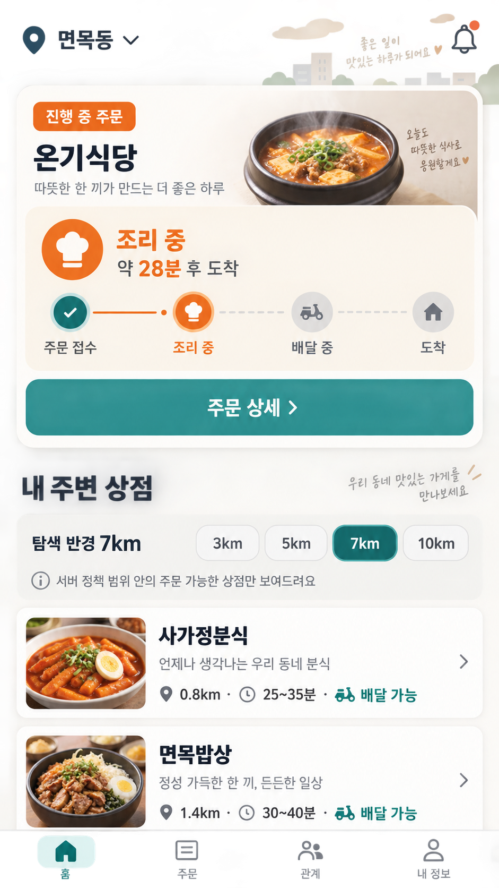
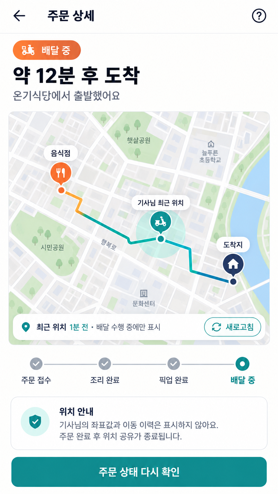

[기획 · 운영·주문자 UI/UX · PLAN-OPERATIONS-ORDERER-ACTIVE-ORDER-HOME · r11]

# 주문자 지도 중심 음식점 발견·150건 활동 기사 지정 제안·진행 주문 추적

> 화면 이미지 경계: 이 문서에 연결된 모바일 이미지는 모두 `SampleOnly / NotApprovedVisual / NotImplementationSpec`인 탐색용 샘플이다. Git 커밋은 시안 승인이나 구현 지시를 뜻하지 않는다. [샘플 이미지 대장](../../../../assets/planning/README.md)

- 기획 ID: `PLAN-OPERATIONS-ORDERER-ACTIVE-ORDER-HOME`
- 기획 분야: 운영·주문자 UI/UX
- 기획 판본: `r11`
- 상태: `Draft / MapFirstRestaurantDiscoveryConfirmed / ListSecondaryConfirmed / ActiveOrderMapOverlayConfirmed / FairMarkerBaselineConfirmed / AnonymousCourierSupplyPreviewConfirmed / PreferredDriverFirstOfferConfirmed / OrdererSubscriptionEntitlementRequiredConfirmed / Weekly150ActivityBadgeConfirmed / WednesdayTuesdayActivityCycleConfirmed / Weekly150DirectOfferEligibilityConfirmed / GeneralDispatchGateRejected / DriverActivityDisclosureOptInRequired / NotEmploymentCertification / DriverVetoConfirmed / NoPenaltyDeclineConfirmed / SeparateWorkOfferConsentRequired / DirectAssignmentRejected / DispatchEngineEligibilityAuthorityPreserved / VoluntaryDriverAcceptancePreserved / OrderBoundLocationAfterAssignmentOnly / DriverBenefitRequired / SubscriptionUnitEconomicsDefined / PriceAndIncludedUsagePending / RestaurantDistanceLimitConfirmed / ExistingSearchPolicyBound / PublicMapAnchorContractRequired / NaverMapsProviderCandidateConfirmed / ProductImplementationDeferred`
- 사용자 요구: 진행 중인 주문이 있으면 주문 상태를 홈의 첫 정보로 보여 주고, 상점 탐색은 기존 거리 제한을 반영한다. 주문 전에는 음식점의 조리 예상과 주변 배차 여건을 함께 보고 주문·배달을 요청한다. 최근 한 주 정상 완료 150건 이상인 활동 기사님은 동의한 경우 주문자 지정 제안 후보로 보여 주어 꾸준한 업무 사실을 확인하게 하고, 기사님은 이유 없이 거절할 수 있으며 직접 제안은 기사님에게 별도 혜택을 준다.
- 역할별 작업공간 기준: [하나의 운영 원장과 역할별 OS 작업공간](../../시스템/PLAN-SYSTEM-ROLE-PERSPECTIVE-OPERATING-WORKSPACES/README.md)
- 배달권역 기준: [행정동 기반 배달운영권역](../../운영/PLAN-OPERATIONS-ADMIN-DONG-DELIVERY-TERRITORY/README.md)
- 관계·동의 기준: [업무 경험에서 친구 요청으로 이어지는 커뮤니티 설계 기준](../../../../Architecture/FriendRequestCommunityDesignStandard.md)
- 구독·경제성 기준: [주문자 구독·150건 활동 기사 지정 경제성 r9](../../시스템/PLAN-SYSTEM-USAGE-COST-SUBSCRIPTION-METERING/orderer-subscription-preferred-driver-economics.r9.md)
- 다음 질문: 주문자 구독은 기사 지정 제안 이용권만 포함하고 기본 배달료는 주문마다 별도로 유지할지 정한다.

## 1. 첫 모바일 시안



이 이미지는 화면 구조를 검토하기 위한 기획 시안이다. 실제 `OrdererApp` 렌더, 장치 실행, API 결속이나 제품 구현 증거가 아니다.

## 2. 화면 우선순위

```text
진행 중 주문 있음
  → 지도 중심 홈
  → 현재 주문 고정 카드·지도 추적 진입
  → 주문 단계·예상 도착·변경 알림
  → 같은 지도에서 새 상점 탐색

진행 중 주문 없음
  → 지도 중심 상점 탐색
  → 목록 보기·최근 주문·즐겨찾기
```

- 진행 주문 카드는 가장 최근 주문이 아니라 아직 종료되지 않은 주문을 우선한다.
- 여러 진행 주문이 있으면 첫 카드에는 가장 긴급한 변경 또는 가장 가까운 약속 시각의 주문을 두고 `진행 중 N건` 목록으로 이동한다.
- 주문자는 음식점·기사의 내부 작업 원문이나 개인정보가 아니라 `주문 접수 / 조리 중 / 배달 중 / 도착`과 예상시간·변경 이유를 본다.
- 카드의 상태와 예상시간은 서버 정본 조회 결과이며 앱이 다음 단계를 예측해 확정하지 않는다.

## 2.1 지도 중심 첫 화면

주문자 음식 앱의 첫 화면은 음식 배달 기사 앱처럼 지도를 중심으로 한다. 다만 기사 앱은 운행·배차 수행 지도이고 주문자 앱은 음식점 발견·진행 주문 관찰 지도이므로 상태와 권한을 공유하지 않는다.

```text
┌────────────────────────────┐
│ [지역/주소]  [검색] [필터] │
│                            │
│       음식점 지도          │
│   ○   ○      ◎      ○     │
│        [선택 음식점]        │
│                            │
│ [지도] [목록]  반경 7km    │
├────────────────────────────┤
│ 선택 음식점 간단 카드       │
│ 메뉴·거리·조리시간 [보기]   │
└────────────────────────────┘
```

- 지도는 첫 화면이고 목록은 같은 결과의 보조 보기다.
- 음식점 마커를 누르면 하단 sheet에 상호·카테고리·거리·예상 조리시간·주문 가능 상태를 보여 준다.
- 하단 sheet를 올리면 공개 메뉴와 주문 화면으로 이동한다.
- 진행 주문이 있으면 지도 위에 현재 주문 고정 카드를 두고, 누르면 같은 지도에서 배달 추적 상태로 전환한다.
- `지도 / 목록` 전환은 같은 검색 조건·반경·필터와 선택 음식점을 유지한다.
- 지도 공급자 장애 시 목록으로 자연스럽게 전환하며 음식점 탐색과 진행 주문 상태를 함께 잃지 않는다.

## 2.2 평등한 지도 노출 원칙

지도는 목록 순위 대신 공간을 보여 주지만 마커의 크기·색·충돌 처리도 사실상 순위가 될 수 있다. 첫 판은 다음을 기본으로 한다.

- 검색 조건을 통과한 음식점은 같은 기본 크기와 시각 무게의 마커를 가진다.
- 주문 가능 여부·영업 준비·선택 상태만 공통 범례에 따라 다르게 표시한다.
- 광고비나 구독 등급으로 기본 마커를 키우거나 다른 음식점을 가리지 않는다.
- 겹치는 마커는 중립적인 숫자 cluster로 묶고 누르면 모두 펼쳐 선택할 수 있게 한다.
- 지도 이동 뒤에는 자동으로 결과를 바꾸지 않고 사용자가 `이 지역에서 다시 찾기`를 선택한다.
- 목록 보기는 기본적으로 서버 거리와 안정적인 보조 키를 사용하고, 별점·광고비·플랫폼 수익만으로 정렬하지 않는다.
- 후원·광고가 생기면 별도 `후원 표시` overlay와 명확한 표지를 사용하며 기본 음식점 layer를 밀어내지 않는다.
- 신규·소규모 음식점에도 동일한 기본 마커와 상세 진입 기회를 준다.
- 개인화 추천은 사용자가 켠 별도 filter로만 검토하고 기본 지도를 개인별 비공개 점수로 재정렬하지 않는다.

## 2.3 음식점 선택과 배달 가능성 미리보기

주문자는 지도에서 음식점을 선택하고 그 음식점의 조리 예상과 현재 배차 여건을 함께 확인한다. 이때 지도는 기사 개인을 선택하는 화면이 아니라, 현재 주문 조건에서 배달이 이어질 가능성을 판단하는 화면이다.

```text
┌────────────────────────────┐
│ 음식점 ○  배차여건 고리 ◌  │
│                            │
│          [선택 음식점]      │
│                            │
├────────────────────────────┤
│ 다온분식                    │
│ 조리 예상 15분              │
│ 현재 배차 여건: 보통         │
│ 기사 도착 예상 12~22분       │
│ 14:32 기준 · 확정 아님       │
│ [메뉴 보기] [주문·배달 요청] │
└────────────────────────────┘
```

- 음식점 공개 위치는 개별 마커로 표시한다.
- 주문 전 기사 공급은 `배차 원활 / 보통 / 어려움 / 산정 불가`처럼 넓은 구간으로만 표시한다.
- 공급 상태는 음식점 주변의 중립적인 상태 고리 또는 권역 음영으로 표현하고, 기사 개인 모양의 마커를 사용하지 않는다.
- 기사 수가 적은 시간·지역에서는 정확한 인원수, 기사 ID, 정밀 좌표, 이동 궤적을 반환하지 않는다.
- 미리보기는 기사님의 `신규 배차 받기 ON` 의사뿐 아니라 서버가 판정한 실제 가용성, 위치 최신성, 수행 중 업무, 음식점까지의 예상 도착시간과 배차 정책을 함께 반영한다.
- 조리 예상시간은 음식점이 설정·확정한 값 또는 서버가 허용한 범위이며 앱이 임의 추정해 확정하지 않는다.
- 미리보기에는 기준 시각과 만료 시각을 표시한다. 주문 제출이나 음식점 수락 사이에 기사 상태가 바뀔 수 있으므로 배차 보장으로 표현하지 않는다.
- `주문·배달 요청`은 특정 기사에게 보내는 직접 요청이 아니라 서버 배차 대기열에 참여시키는 요청이다.
- 음식점이 수락하고 조리시간을 확정하면 정책이 정한 시점에 배차 엔진이 후보 기사에게 제안한다. 제안 시점은 조리 시작 즉시, 픽업 예상시각 접근 시점 등 운영 정책이 결정하며 주문자가 지정하지 않는다.
- 기사가 자발적으로 수락하고 서버가 배정을 확정한 뒤에만 주문 상세에서 그 수행 건에 결속된 최근 위치를 최소한으로 보여 준다.

주문자의 개입 범위는 음식점·메뉴·배달 위치를 고르고, 현재 조리·배차 여건을 확인한 뒤 주문과 배달을 요청하거나 취소하는 데까지다. 특정 기사를 지목하거나 기사에게 직접 배차를 강제하는 권한은 갖지 않는다.

### 2.3.1 상태 흐름과 권위

```text
배달 가능성 미리보기 Query
  → 주문자 확인
  → 음식 주문 Command
  → 음식점 수락·조리시간 확정
  → 배차 정책이 배차 대기열 진입 시점 판정
  → 배차 엔진이 적격 후보 선정·제안
  → 기사 자발적 수락
  → 서버 배정 확정
  → 주문 결속 기사 위치 추적 상태 사본
```

- 미리보기 Query는 기사 예약, 주문 생성, 배차 잠금이나 음식점 수용량 차감을 일으키지 않는다.
- 음식점 수락과 기사 수락은 별도 상태다. 한쪽 수락을 다른 쪽 수락으로 간주하지 않는다.
- 기사 후보가 없거나 모두 거절·무응답이면 주문은 `배차 대기`로 남고 재추천 정책을 따른다. 주문자 화면은 지연·미성사 가능성과 다음 갱신 시각을 알린다.
- 배차 엔진은 음식점까지의 도착시간, 공정한 기회, 기존 수행 일정, 권역·거리·기사 의사를 함께 고려하며 주문자나 운영자가 임의로 기사를 고르지 않는다.
- 앱의 지도 Provider는 위치를 그릴 뿐 후보·배정·수락을 확정하지 않는다.

### 2.3.2 최소 조회 계약 후보

| 필드 | 의미 |
| --- | --- |
| `RestaurantStableId` | 선택한 공개 음식점 |
| `DeliveryZoneStableId` | 상세 주소를 노출하지 않는 주문 목적 권역 |
| `PreparationTimeRangeMinutes` | 음식점 또는 서버가 제공한 조리 예상 범위 |
| `DispatchFeasibilityCode` | `Smooth / Normal / Difficult / Unavailable` |
| `EstimatedDriverArrivalRangeMinutes` | 기사 개인을 특정하지 않는 도착시간 범위 |
| `EstimatedPickupRangeMinutes` | 조리와 기사 도착을 함께 고려한 픽업 예상 범위 |
| `ObservedAt`·`ExpiresAt` | 자료 기준 시각과 미리보기 만료 시각 |
| `PolicyRevision` | 어떤 배차 정책으로 산정했는지 확인하는 판본 |

이 계약에는 기사 ID, 이름, 연락처, 정밀 좌표, 정확한 후보 수, 원시 GPS가 들어가지 않는다. 실제 구현 이름과 route는 기존 주문자 공개 계약·배차 UseCase를 다시 대조한 뒤 정한다.

## 2.4 관계가 있는 기사님께 먼저 제안하기

주문자는 과거에 실제 배달을 함께 완료했고 서로 후속 업무 제안을 허용한 기사님에게 `이번 배달을 먼저 제안`할 수 있다. 이 기능은 주문자가 배정을 확정하는 직접 배차가 아니라, 일반 후보군보다 먼저 기사 한 명에게 선택 기회를 보내는 제한된 우선 제안이다.

```text
과거 완료 배달
  → 주문자-기사 업무 관계 상태 사본
  → 양쪽의 `다시 배달 제안 허용` 동의
  → 주문자가 음식점·메뉴·도착지를 정하고 선호 기사 우선 제안 선택
  → 서버가 기사 위치·거리·운행 상태·배달권·일정·지급 조건 재검증
  → 기사에게 일반 배차와 같은 정보·지급 조건으로 제안
      ├─ 수락 → 서버 배정 확정
      ├─ 거절 → 불이익 없이 일반 배차 전환 후보
      └─ 무응답/부적격 → 일반 배차 전환 후보
```

### 주문자 화면

- 지도에 동의한 기사님의 실시간 점을 항상 노출하지 않는다.
- 음식점·메뉴·배달 위치를 정한 뒤 주문 확인 화면에서 `전에 함께한 기사님께 먼저 제안`을 선택한다.
- 기사 목록은 실제 완료 관계와 현재 공개 동의를 통과한 최소 표시명만 보여 준다. 정확한 현재 위치, 운행 경로, 다른 주문, 연락처는 보여 주지 않는다.
- 서버가 현재 조건에서 제안할 수 없는 기사님은 사유를 세분해 노출하지 않고 `지금은 요청할 수 없음`으로 표시한다.
- 제안이 거절되면 주문자에게 `기사님이 거절함`을 강조하지 않고 `다른 기사님을 찾는 중`으로 전환한다. 기사님의 거절 사유는 공개하지 않는다.

### 기사 화면과 거부권

- 기사님은 설정에서 `주문자의 다시 배달 제안 받기`를 전체 ON/OFF할 수 있다.
- 관계별 차단과 특정 주문 제안의 `수락 / 거절 / 응답하지 않음`을 선택할 수 있다.
- 거절에는 이유 입력을 요구하지 않는다. 거절·무응답·기능 OFF는 수락률, 추천 순위, 지급액, 신뢰 점수나 향후 일반 배차에 불이익을 주지 않는다.
- 기사님이 수락해도 서버가 최신 위치·일정·안전·배달권·중복 수행을 다시 검사한 뒤에만 배정을 확정한다.
- 친구 관계, 함께한 횟수 공개, 연락처 공개와 `다시 배달 제안 허용`은 서로 다른 동의다. 친구여도 업무 제안 동의가 OFF면 요청할 수 없다.
- 신고·차단·안전 사건이 있으면 선호 제안 대상에서 즉시 제외한다.

### 배차 엔진과의 조화

- 우선 제안도 기존 음식배달 배차 큐와 제안·수락 원장을 사용한다. 별도의 비공식 배차 상태를 만들지 않는다.
- 배차 엔진은 주문자 선택을 확정 명령이 아니라 `첫 제안 대상 선호`로만 읽는다.
- 거리·배달권·기사 수신 의사·위치 최신성·현재 일정·지급 조건을 통과하지 못하면 관계가 있어도 제안하지 않는다.
- 우선 제안 때문에 일반 후보의 지급액을 낮추거나 선호 기사에게 무급 대기·의무 수락을 요구하지 않는다.
- 주문 하나에서 같은 기사에게 반복 요청하지 않도록 멱등 키, 제안 횟수 제한과 냉각 시간을 둔다.
- 일반 배차가 진행된 뒤에는 선호 기사 우선 제안을 뒤늦게 끼워 넣어 확정 배정을 빼앗지 않는다.
- 신규 기사에게도 일반 배차 기회가 계속 돌아가도록 선호 제안은 선택적 짧은 선행 구간으로 제한하고, 단골 관계를 영구 잠금이나 독점 배차로 만들지 않는다.

### 2.4.1 주문자에게 보여 줄 기사 후보의 활동 근거

주문자에게 전체 기사 목록이나 주간 수행 건수를 그대로 공개하지 않는다. 서버가 동의·적격성·업무 근거를 먼저 검사한 뒤 소수의 후보 카드만 제공한다.

```text
기사의 후속 업무 제안 동의
  + 현재 신규 배차 수신 ON
  + 최신 위치와 경로 수행 가능
  + 현재 일정·배달권 충돌 없음
  + 수락한 업무의 최근 안정적 완료 근거
  + 주문자와의 과거 정상 완료 관계 또는 공개 후보 참여
  - 차단·신고·미해결 중대 안전 제한
  → 주문자에게 최소 후보 카드 표시
```

- 주문자의 `활동 기사 지정 제안` 화면에는 최근 한 주 정상 완료 150건 이상이며 공개에 동의한 기사만 후보로 제공한다.
- 이 기준은 주문자가 별도로 여는 지정 제안 후보 자격이다. 일반 배차 후보 자격, 기사 등급, 지급 기준이나 업무 신뢰 전체를 결정하지 않는다.
- 주 150건은 하루 약 21건, 주 6일이면 하루 25건 수준의 실제 완료 활동 근거로 표시한다. 다만 장거리 수행·시간제 근무·신규 진입과 업무 난이도를 모두 설명하지는 않으므로 `전업 인증`, `성실 인증`, `우수 기사`라고 부르지 않는다.
- 주문자에게는 정확한 원시 건수 대신 `지난주 정상 완료 150건+` 활동 배지를 기본 표시한다. 정확한 건수 공개는 기사님의 별도 선택이 있을 때만 후속 검토한다.
- 150건 집계에는 서버에서 수령 확인 또는 정상 완료가 확정된 배달만 포함한다. 제안 수신·수락·픽업만 한 건, 재배차 전 원기사, 취소·미완료 건은 포함하지 않는다.
- 활동 주차는 운영 시장 `Asia/Seoul` 기준 수요일 00:00 이상, 다음 수요일 00:00 미만으로 계산한다. 화면에서는 이해하기 쉽게 `수요일~화요일`로 표시한다.
- 한 활동 주차에서 정상 완료 150건 이상을 달성하면 바로 다음 수요일~화요일 한 주 동안 `150건+` 활동 배지와 지정 제안 후보 자격을 유지한다.
- 완료 건의 귀속 주차는 서버가 확정한 정상 완료 시각으로 판정하고 앱 장치 시각이나 제안·수락·픽업 시각으로 바꾸지 않는다.
- Event 재처리로 같은 배달을 중복 계산하지 않도록 `DeliveryStableId + CompletionRevision + WeeklyActivityProjectionKind`를 멱등 키 후보로 둔다.
- 귀책이 확정되지 않은 안전 중단·고객 취소·음식점 취소를 감점으로 바꾸지는 않는다. 애초에 정상 완료 150건 집계에 들어가지 않을 뿐 별도 불이익 점수를 만들지 않는다.
- 실제 지정 제안 후보를 만들 때는 150건 배지 외에도 `현재 활동`, `기사 동의`, `최신 위치`, `경로 수행 가능`, `현재 일정·배달권 충돌 없음`, `차단·안전 제한 없음`을 다시 확인한다.
- 기사님의 배차 거절률은 신뢰 근거로 사용하지 않는다. 제안을 고를 권리와 신뢰를 연결하면 거부권이 사실상 약해지기 때문이다.
- 150건 미만인 신규·시간제 기사를 `신뢰 낮음`으로 표시하지 않는다. 지정 제안 목록에 없을 뿐 일반 배차에서는 동등한 기회를 유지한다.
- 주문자 화면에는 `전에 함께한 기사님`, `지난주 정상 완료 150건+`, `현재 제안 가능`처럼 확인 가능한 사실만 보여 준다.
- 150이라는 임계값과 수요일~화요일 집계 기간은 서버 정책 판본으로 관리하고 소급해 과거 배지를 바꾸지 않는다.
- 민감한 개인 특성, 성별·연령·국적·언어·주거지·정확한 위치·수입은 후보 필터나 정렬에 사용하지 않는다.

후보 정렬은 다음 우선순위를 기본안으로 둔다.

1. 주문자와 과거 정상 완료 관계가 있고 양쪽이 다시 제안받기를 허용한 `150건+` 활동 기사
2. 과거 관계는 없지만 `150건+` 활동 배지와 지정 제안 공개에 동의하고 현재 경로를 수행할 수 있는 기사
3. 동일 조건에서는 거리·예상 도착·기사 일정과 일반 배차 공정성 정책

이 순서는 주문자에게 특정 기사를 보장하지 않는다. 서버는 후보 생성 시점과 기사 수락 시점에 적격성을 각각 다시 확인한다.

### 2.4.2 직접 제안이 기사님께 주는 이익

선호 기사 우선 제안은 일반 배차보다 기사님께 불리한 조건으로 만들지 않는다.

- 기본 배달료, 거리·기상 등 기존 할증과 보험·세무 처리 기준을 그대로 보존한다.
- 기사님에게 짧은 단독 검토 시간을 주고 그 시간 동안 같은 제안을 다른 기사에게 확정하지 않는다.
- 픽업지·전달 권역·예상 거리·조리 예상·총 예상 지급액·관계 맥락을 수락 전에 보여 준다.
- 직접 제안이라는 이유로 지급액을 깎거나 주문자와의 관계를 무급 호의로 해석하지 않는다.
- 추가 혜택을 금전으로 제공한다면 `선호 제안 보너스`를 별도 항목으로 표시하고 기본 배달료·기상 할증과 합치지 않는다.
- 보너스 금액과 부담 주체는 주문자가 임의로 정하지 않는다. 총괄 운영자가 판본화한 정책으로 정하고 소급 적용하지 않는다.
- 주문자에게 별도 선택 비용을 받을지는 기사 혜택과 분리해 판단한다. 비용이 없더라도 플랫폼이 보너스를 부담할 수 있다.
- 우선 제안이 거절되거나 만료되면 보너스 지급 후보도 종료되며 거절 자체에는 어떤 비용도 부과하지 않는다.

### 2.4.3 주문자 구독 자격

기사 지정 제안은 주문자 구독이 활성인 경우에만 열린다.

```text
유효한 주문자 구독 자격
  + 수요일~화요일 정상 완료 150건+ 기사 배지
  + 기사의 활동 공개 동의
  + 기사의 후속 업무 제안 동의
  + 현재 배차 적격
  → 주문자가 기사 지정 제안 가능
```

- 구독하지 않은 주문자는 음식점 지도·일반 주문·일반 배차를 그대로 이용하며 기사 지정 후보 목록만 볼 수 없다.
- 구독 상태는 앱의 로컬 표시가 아니라 서버의 `SubscriptionEntitlementRevision`으로 판정한다.
- 구독과 150건 배지가 있어도 기사님의 거부권과 서버 배차 적격성 재검사는 생략하지 않는다.
- 구독은 기사 위치·연락처·정확한 원시 완료 건수·다른 주문 상태를 열람하는 권한이 아니다.
- 주문 제출 시 유효했던 구독 자격 판본을 해당 주문에 결속한다. 이후 구독이 만료돼도 이미 배정된 업무를 취소하거나 기사 지급 후보를 없애지 않는다.
- 같은 주문에서 기사 지정 제안을 반복해 구독 사용량이나 기사 알림을 중복시키지 않는다.
- 월 포함량·공정 사용 상한·초과 처리·구독료·건당 기사 혜택은 경제성 기획에서 판본화하며 아직 실제 과금하지 않는다.

## 3. 거리 제한 상점 탐색

현재 코드에는 `RestaurantSearchPolicyDto`와 공개 조회 API가 존재한다.

| 정책 항목 | 현재 코드 기본값 | 화면 표현 |
| --- | ---: | --- |
| 기본 탐색 반경 | `7km` | `탐색 반경 7km` |
| 허용 범위 | `1~10km` | 서버가 허용한 범위 안에서만 변경 |
| 빠른 선택 | `3 / 5 / 7 / 10km` | compact chip, 현재 선택 강조 |
| 거리 증가 단위 | `0.5km` | 고급 조정 화면에서만 사용 후보 |
| 배달료 주의 반경 | `10km` | 실제 비용 근거가 있을 때만 안내 |

상점 목록 요청은 선택한 `배달권키`, `반경Km`, `주문가능만`을 서버에 보낸다. 화면은 클라이언트가 임의로 모든 음식점을 받은 뒤 숨기는 방식보다 서버가 판정한 결과를 우선한다.

상점 카드에는 최소한 다음을 표시한다.

- 상호명과 대표 음식 이미지 또는 안전한 대체 이미지
- 주문자 기준 거리
- 예상 준비·배달 시간 범위
- `배달 가능 / 현재 주문 불가 / 영업 준비 중` 상태
- 거리·권역·영업 상태가 갱신된 시각 또는 새로고침 상태

탐색 반경과 주문 가능 판정은 같은 뜻이 아니다. 반경 안이어도 영업 상태·배달권·메뉴·수용량 때문에 주문하지 못할 수 있고, 화면은 이를 다른 상점으로 몰래 대체하지 않는다.

### 3.1 `10km` 선택 사전 안내 후보

다음 내용은 사용자가 장거리 탐색에서 고려할 수 있다고 제시한 기획 후보다. 현시점에는 최종 화면·노출 빈도·다른 음식 유형으로의 확장 범위를 확정하지 않는다.

```text
10km까지 넓혀서 볼까요?

먼 거리 주문은 기사 배정이 늦어지거나 성사되지 않을 수 있어요.
배달 시간이 길어지면 온도에 민감한 음식은 최상의 맛과 식감을
유지하기 어려울 수 있어요.

[7km로 보기]  [위 내용을 확인하고 10km 보기]
```

- 실제 확인창을 채택한다면 `7km로 보기`를 안전한 기본 행동으로 둔다.
- `10km 보기`는 먼 상점을 탐색하도록 허용할 뿐 주문 가능·기사 배정·도착 시간을 보장하지 않는다.
- 기사에게 장거리 배차를 강제하는 표현을 사용하지 않는다. 배차 엔진과 기사의 자발적 수락 책임은 유지한다.
- 탐색 단계에서는 아직 메뉴를 모를 수 있으므로 음식 종류를 단정하지 않고 일반적인 온도·시간 위험만 안내한다.
- 실제 음식점·메뉴·예상 이동시간이 정해진 주문 확인 단계에서는 서버가 제공한 온도 민감도 또는 품질 주의 근거가 있을 때만 `따뜻한 음식`, `냉장·냉동`, `식감 민감`처럼 구체화한다.
- 해당 근거가 없으면 앱이 메뉴명만 보고 온도 민감 여부를 추측하지 않는다.
- 확인창 취소는 주문이나 기존 탐색 상태를 변경하지 않는다.

## 4. 권위와 경계

- `7km`는 현행 탐색 정책의 기본값이며 영구적인 사업 규칙으로 이미지에 고정하지 않는다. 앱은 공개 정책 API를 다시 읽는다.
- 행정동 기반 `배달운영권역`은 아직 Draft 관리 단계이며 현행 주문 노출 권위를 자동 대체하지 않는다.
- 역세권 1km 디오라마·Unity 카메라 범위는 상점 노출이나 주문 가능 거리의 근거가 아니다.
- 기사 후보 검색 반경과 주문자의 상점 탐색 반경은 서로 다른 정책이다.
- 주소·정밀 좌표는 서버 판정에 사용하더라도 목록 카드에 그대로 공개하지 않는다.
- 거리 제한 변경은 관리자 정책 변경이며 주문자가 허용 범위 밖 값을 임의로 입력할 수 없다.
- 지도 초기 중심은 사용자가 명시적으로 선택한 공개 행정권역·배달 주소 문맥을 사용한다. 장치 현재 위치는 별도 동의 없이 자동 수집하지 않는다.
- 음식점 위치는 공개 사업장 지도 Anchor로 제공하며 원천·정밀도·검증 시각을 가진다. 개인 주거 위치 계약과 재사용하지 않는다.
- 지도 화면의 마커 배치와 cluster는 주문 가능 여부·배달권·배차 가능성을 확정하지 않는다.

## 5. 현재 코드 존재 대조

| 기획 요소 | 현재 근거 | 판정 |
| --- | --- | --- |
| 음식점 탐색 정책 공개 조회 | `GET api/v1/orderer/restaurant-search-policy` | `O` |
| 관리자 탐색 정책 조회·수정·초기화 | `api/v1/admin/orderer/restaurant-search-policy` | `O` |
| 거리 범위·빠른 선택 계약 | `RestaurantSearchPolicyDtos.cs` | `O` |
| 배달권키·반경·주문가능 필터 목록 조회 | `음식점탐색Client.cs` | `O` |
| 주문자 음식 주문 목록·진행 조회 UI 기반 | `OrdererFoodOrderWorkspace` 계열 | `O` |
| 진행 주문을 홈 최상단에 합성하는 모바일 화면 | 이번 기획 시안 | `X` |
| 진행 주문과 상점 탐색의 한 화면 결속 | 이번 기획 시안 | `X` |
| `10km` 선택 시 장거리 배달 주의 확인창 | 현행 빠른 반경 버튼은 바로 값을 적용 | `X` |
| 메뉴·주문의 온도 민감도 기반 구체 안내 | 공통 탐색 계약에는 해당 근거 없음 | `X` |
| 음식점 공개 위도·경도 원본 | `음식점공개프로필`과 서버 거리 계산 | `O` |
| 공개 지도 Anchor·정밀도·출처·검증시각 응답 | 현행 `음식점공개요약응답`에는 없음 | `X` |
| 주문자 첫 화면 지도·마커·cluster·하단 sheet | 현행 `/food`는 음식점·마트 진입 카드 | `X` |
| 지도/목록 동일 조건·선택 상태 공유 | 현행 목록 workspace만 존재 | `X` |
| 기사 배차 수신 의사와 실제 가용성 분리 | `신규 배차 받기` 의사, 음식배달 배차 정책 | `O` |
| 기사 최근 위치·최신성 기반 배차 후보 판정 | `IDriverLocationStore`, `기사위치신선도정책`, `음식배달배차업무정책` | `O` |
| 배차 제안과 기사 자발적 수락 경로 | 기사 배차 추천·수락 UseCase와 배차 큐 | `O` |
| 주문자용 비식별 배달 가능성 미리보기 Query | 현행 공개 주문자 계약에 없음 | `X` |
| 음식점별 배차 여건 고리·권역 음영 표현 | 이번 기획 | `X` |
| 완료 업무 관계 상태 사본·친구 요청 기반 | `WorkRelationshipSnapshots`, `/api/v1/connections/...` | `O` |
| 기사 배차 제안 수락·거절 | 기존 기사 배차 추천·수락 경로 | `O` |
| 주문자-기사 `다시 배달 제안 허용` 별도 동의 | 확인되지 않음 | `X` |
| 선호 기사 첫 제안 후 일반 배차 전환 | 확인되지 않음 | `X` |
| 주간 정상 완료 150건 활동 배지·지정 후보 정책 | 확인되지 않음 | `X` |
| 선호 제안 전용 기사 혜택·별도 지급 항목 | 확인되지 않음 | `X` |
| 주문자 개인 구독 자격·판본 원장 | 확인되지 않음 | `X` |
| 구독+150건 배지+기사 동의 결합 관문 | 확인되지 않음 | `X` |

`O`는 코드가 존재한다는 뜻이며 실제 모바일 렌더·서버 연결·운영 준비를 뜻하지 않는다.

## 6. 후속 화면 상태

| 상태 | 상단 | 상점 영역 |
| --- | --- | --- |
| 진행 주문 없음 | 인사·현재 위치 | 기본 반경 상점 탐색 |
| 진행 주문 1건 | 현재 주문 큰 카드 | 아래에서 계속 탐색 가능 |
| 진행 주문 여러 건 | 긴급/약속 우선 카드 + `N건 보기` | 아래에서 계속 탐색 가능 |
| 주문 상태 조회 실패 | 마지막 정상 사본과 재시도 안내 | 상점 탐색 실패와 별도로 격리 |
| 위치 사용 불가 | 주문 상태는 계속 표시 | 주소 또는 배달권 선택 요청 |
| 반경 내 상점 없음 | 진행 주문은 영향 없음 | 반경 변경·다른 주소 선택 안내 |

## 7. 주문 상세·배달 위치 추적 화면



`주문 상세`를 누르면 현재 주문 상태와 별도로 배달 위치 지도 영역을 연다. 지도는 실제 기사 계정 화면이나 원시 GPS 원장을 그대로 노출하는 화면이 아니다.

```text
기사 앱 GPS
  → 기존 기사 위치 갱신 Command
  → 서버의 최근 위치·정확도·기록/수신시각
  → 주문·배차 결속 및 주문자 권한 확인
  → 주문 전용 배달추적 상태 사본
  → OrdererApp 주문 상세
  → 지도 Provider Adapter
  → 음식점·기사 최근 위치·도착지·경로 표현
```

- 주문자 앱은 기사 전용 위치 API나 Redis 상태를 직접 읽지 않는다.
- 서버는 로그인 주문자가 해당 주문의 주문자인지, 현재 배차와 기사 위치가 같은 수행 건인지 확인한다.
- 주문자 응답에는 기사 이름·계정 ID·전화번호·차량번호와 원시 이동 이력을 포함하지 않는다.
- 지도에는 숫자 좌표 대신 최근 위치 마커, 정확도 원, 마지막 갱신 시각과 현재 단계만 표시한다.
- 위치가 오래됐거나 정확도 근거가 부족하면 마커를 고정된 실시간 위치처럼 보이지 않고 `위치 갱신 중`으로 내린다.
- 주문 완료·취소·배차 해제·기사 중단 뒤에는 주문자 위치 공유 사본을 즉시 닫는다.
- 클라이언트가 위치 사이를 임의 보간해 서버가 확인하지 않은 이동을 실제 위치처럼 보여 주지 않는다.

## 8. 네이버 지도 연동 경계

네이버 클라우드 Maps는 Web Dynamic Map, Mobile Dynamic Map SDK와 Static Map·Directions·Geocoding·Reverse Geocoding REST API를 제공한다.

- 공식 개요: [NAVER Cloud Maps overview](https://guide.ncloud-docs.com/docs/en/maps-overview)
- Web Dynamic Map: [NAVER 지도 API v3](https://navermaps.github.io/maps.js.ncp/docs/)
- 마커·도형: [`naver.maps` namespace](https://navermaps.github.io/maps.js.ncp/docs/naver.maps.html)
- 경로선: [`naver.maps.Polyline`](https://navermaps.github.io/maps.js.ncp/docs/naver.maps.Polyline.html)

첫 설계는 `I주문배달지도Provider` 같은 공급자 Adapter 뒤에 네이버 지도를 둔다. 주문·위치·권한 계약은 지도 공급자와 분리한다.

- Web/Blazor 화면은 Web Dynamic Map 후보를 검토한다.
- Android·iOS에서 MAUI BlazorWebView의 인증 URL·성능이 맞지 않으면 Mobile Dynamic Map SDK를 플랫폼 Adapter로 사용한다.
- Directions·Geocoding처럼 비밀 인증이 필요한 REST 호출은 서버에서 수행하고 Client Secret을 앱에 넣지 않는다.
- Web Dynamic Map용 공개 키도 허용 서비스 URL·앱 환경을 제한하고 source·로그·capture에 비밀값을 남기지 않는다.
- 지도 공급자 장애가 주문 상태 조회를 막지 않는다. 지도 대신 단계·예상시간·최근 갱신 상태를 계속 보여 준다.

## 9. 현재 코드 존재 대조·추가 결손

| 기획 요소 | 현재 근거 | 판정 |
| --- | --- | --- |
| 기사 앱의 위도·경도·정확도·기록시각 갱신 | `기사위치갱신요청`, 음식배달 기사 `work/location` | `O` |
| 서버의 기사 최근 위치와 수신시각 상태 | 기사 운행 상태 계약·배차 상태 Store | `O` |
| 주문자 주문 상세·운송 단계·최근 변경 표시 | `OrdererFoodOrderDetailPanel.razor` | `O` |
| 주문자 음식배달 진행 응답 | `주문자음식배달진행응답` | `O` |
| 주문자 응답의 기사 최근 위치 | 현행 응답에 없음 | `X` |
| 주문·배차·기사 위치를 결속한 최소 추적 Projection | 없음 | `X` |
| 주문자 권한·상태·TTL 기반 위치 조회 API | 없음 | `X` |
| 네이버 지도 Provider Adapter와 실제 모바일 렌더 | 없음 | `X` |

현행 `기사위치갱신응답.권장위치전송간격초=300`은 일반 운행 상태 기본값이다. 이를 그대로 사용하면 주문자 배달 추적에는 느릴 수 있으므로, 활성 배달 중 별도 전송·조회 간격은 배터리·통신량·개인정보를 함께 검토해 정해야 한다.

## 확정

- 진행 중 주문이 있으면 현재 주문 카드를 주문자 홈의 첫 정보로 둔다.
- 진행 주문 아래에서도 새 상점 탐색을 계속할 수 있다.
- 상점 탐색은 서버가 제공한 거리 제한과 주문 가능 판정을 사용한다.
- 현행 시안은 기본 `7km`와 빠른 선택 `3 / 5 / 7 / 10km`를 보여 준다.
- `10km` 장거리 탐색에서 기사 배정 지연·미성사 가능성과 음식 품질 변화 가능성을 안내할 수 있다는 후보를 보존한다.
- 실제 확인창을 채택하더라도 `10km` 탐색 자체를 금지하지 않는다.
- 온도 민감 음식에 대한 구체 안내 후보는 서버가 제공한 메뉴·주문 근거가 있을 때만 사용할 수 있다.
- 탐색 반경, 배달운영권역, 기사 후보 반경, Unity 관찰 범위를 서로 합치지 않는다.
- 주문 상세에는 배달 수행 중인 기사 최근 위치를 지도에 표시하는 화면을 둔다.
- 주문자 앱은 기사 GPS를 직접 조회하지 않고 서버의 주문 결속·권한 검사를 통과한 최소 상태 사본만 읽는다.
- 네이버 지도는 표현 공급자 후보이며 주문·배차·위치 권위를 소유하지 않는다.
- 주문자 음식 앱의 첫 화면은 지도 중심 음식점 발견 화면이다.
- 목록은 지도와 같은 결과를 보는 보조 보기로 유지한다.
- 진행 주문이 있어도 지도 셸을 유지하고 현재 주문 고정 카드에서 배달 추적으로 전환한다.
- 기본 음식점 마커는 광고비·구독 등급·플랫폼 수익에 따라 크기나 기본 노출 우선순위를 바꾸지 않는다.
- 지도 이동 뒤 결과 갱신은 `이 지역에서 다시 찾기` 같은 명시적 사용자 행동으로 수행한다.
- 후원·광고는 별도 표식 layer로 분리하며 기본 음식점 layer를 가리거나 제거하지 않는다.
- 주문자는 음식점을 선택할 때 조리 예상시간과 익명화한 주변 배차 여건을 함께 확인한다.
- 주문 전에는 개별 기사 위치·이름·정확한 후보 수를 공개하거나 특정 기사를 선택하게 하지 않는다.
- 주문자의 `주문·배달 요청`은 배차 후보군에 대한 요청이며 특정 기사 직접 호출이 아니다.
- 음식점 수락·조리시간 확정과 기사 배차 수락은 별도 단계로 유지한다.
- 후보 기사 선정과 재추천은 기존 배차 엔진이 담당하고, 기사는 제안을 자발적으로 수락한다.
- 서버 배정 확정 뒤에만 해당 주문에 결속된 기사 최근 위치를 주문 상세의 최소 상태 사본으로 보여 준다.
- 주문자는 과거 완료 관계와 별도 업무 제안 동의를 가진 기사님에게 이번 주문을 먼저 제안할 수 있다.
- 선호 기사 제안은 직접 배정이 아니라 첫 제안 대상 선호이며, 서버가 실제 배차 적격성을 다시 판정한다.
- 기사님은 이유 없이 거절하거나 응답하지 않을 수 있고 그 선택은 일반 배차·수락률·신뢰·지급에 불이익을 주지 않는다.
- 친구 관계·관계 횟수 공개·연락처 공개·후속 업무 제안 동의는 서로 합치지 않는다.
- 단골 관계를 의무 수락·독점 배차·신규 기사 배제 수단으로 사용하지 않는다.
- 최근 한 주 정상 완료 150건 이상을 주문자의 별도 `활동 기사 지정 제안` 후보 자격으로 사용한다.
- 150건 기준은 일반 배차 자격·등급·신뢰 점수에 적용하지 않고 지정 제안 기능에만 적용한다.
- 주문자에게는 기사 동의를 받은 `지난주 정상 완료 150건+` 활동 배지와 현재 제안 가능 여부를 보여 준다.
- 150건 배지는 업무 완료 활동의 사실이며 전업·성실·품질·법적 직업 지위를 인증하지 않는다.
- 서버는 150건 배지 외에도 현재 위치 최신성·거리·일정·배달권·안전 제한을 다시 검사한다.
- 배차 거절률은 주문자 공개 후보의 신뢰 근거로 사용하지 않는다.
- 선호 기사 우선 제안은 일반 배차보다 불리한 조건으로 만들지 않고 별도의 기사 혜택을 포함한다.
- 유효한 주문자 구독은 150건 활동 기사 지정 제안의 필수 조건이다.
- 구독하지 않은 주문자의 일반 주문·일반 배차는 제한하지 않는다.
- 구독 자격은 기사 수락이나 배정을 보장하지 않고 위치·연락처 공개 권한도 만들지 않는다.

## 미정

- 반경 밖 상점을 이름 검색에서 완전히 숨길지 주문 불가로 보여 줄지
- 여러 진행 주문의 첫 카드 정렬에서 약속 시각과 상태 변경 긴급도의 정확한 우선순위
- 반경 변경을 홈에서 바로 허용할지 별도 필터 sheet를 열지
- 거리 대신 예상 배달시간을 첫 정렬 기준으로 제공할지
- 기사 위치 공유 시작을 배정 직후로 할지 픽업 완료 뒤로 할지
- 활성 배달 중 기사 앱 전송 주기와 주문자 화면 조회·push 주기
- 최신성·정확도에 따른 `정상 / 지연 / 표시 중단` 임계값
- MAUI 첫 지도 구현을 Web Dynamic Map과 Android/iOS Native SDK 중 어디서 시작할지
- 장거리 경고를 같은 탐색 세션에서 한 번만 보여 줄지, `10km`를 새로 선택할 때마다 보여 줄지
- 첫 지도 중심을 사용자가 고른 배달 주소와 공개 행정권역 기준점 중 어느 쪽에 둘지
- 음식점 공개 지도 Anchor의 허용 정밀도와 검증·철회 절차
- 지도 화면에서 홈달마트를 같은 layer에 둘지 별도 mode로 둘지
- 배차 여건 상태의 구체적인 계산 임계값과 최소 익명 집계 기준
- 음식점 수락 뒤 배차 제안을 즉시 시작할지 조리 완료 예상시각에 맞춰 시작할지 결정하는 정책
- 배차 여건을 음식점별 상태 고리와 권역 음영 중 무엇으로 먼저 표현할지
- 선호 기사에게 주는 첫 제안 응답 시간
- 선호 기사 거절·무응답 뒤 일반 배차 자동 전환 여부
- 주문자가 선호 기사만 기다리기를 명시적으로 선택할 수 있는지와 최대 대기 상한
- 주문자-기사 후속 업무 제안 동의를 처음 요청할 수 있는 최소 완료 횟수
- `주 150건`을 직전 달력 주와 최근 연속 7일 중 어느 구간으로 계산할지
- 한 주만 150건을 넘으면 다음 주 전체에 배지를 줄지 여러 주 연속 조건을 둘지
- 선호 제안 혜택을 단독 검토 기회만으로 둘지 건당 금전 보너스를 함께 둘지
- 금전 보너스를 플랫폼·주문자·구독 상품 중 누가 부담할지
- 주문자 월 구독료와 월 지정 제안 포함량
- 구독 포함량 초과 시 안내·추가 구매·다음 달 대기 중 어떤 경로를 제공할지

## 다음 질문 하나

첫 주문자 구독은 **기사 지정 제안 이용권만 포함하고 기본 배달료는 주문마다 별도로 유지**할까요? 추천은 그렇다. 그래야 기사 기본 수행대금과 지정 보너스를 구독료가 불투명하게 대신 부담하지 않고, 구독 기능 자체의 원가와 기여금을 정확히 계산할 수 있다.
