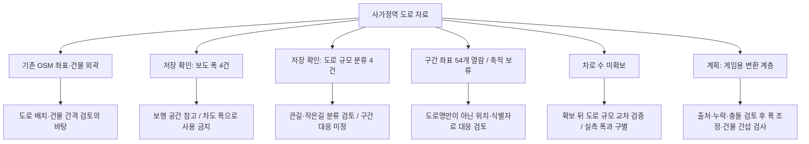

# [기획 · 역 중심 디펜스 · PLAN-GAMEPLAY-NEIGHBORHOOD-DEFENSE · r8]

상태: `Draft / PartialSourceInvestigation / AwaitingDownloadScope`. 2026-09-12. [r7](road-space.r7.md)의 후속으로 사용자가 구간 좌표·차로 자료를 수집하고 정보별 활용을 트리로 설명해 달라고 요청했다. 이 판본은 조사 결과와 수집 차단을 기록한다. 게임 규칙이나 [동결된 준비 구현 r1](README.md)의 승인 hash·작업 명세를 변경하지 않는다.

## 확정 — 저장·조회·미확보를 구분

- 기존 중랑구 보도 폭 4건과 서울시 도로 규모 분류 4건: 로컬 `hongdal-mysql-1 / hongdal_dev`에서 별도 명령으로 **8건 재조회 성공**. 원본 SHA·값·판본·검토보류 상태를 기존 검사기로 대조했다. 이번 신규 DB 저장은 0건이다.
- 현재 Unity 참고 JSON: 도로 선분 2,397개·건물 602개. SHA256 `4B81E60C3C389A69AA765C8CC8D20E4457102C359A5FFBCD7EBDFA880F7E84E3`. `사가정지리MeshBuilder`는 큰길 10, 보행로/계단 1.5, 나머지 4의 **표현용 폭**을 쓰며 실측 폭이 아니다. 코드·Scene은 수정하지 않았다.
- 국가교통정보센터의 공개 지도 조회에서 사가정역 주변 경위도 범위와 겹치는 결과 **54개**를 열람했다. 이는 도로 수나 사가정역 범위의 모든 도로 수가 아니라 해당 조회 레이어의 응답 객체 수다. 신규 원문 파일·DB 축적은 이용조건 확인 때문에 보류했다.
- **공식 차로 수는 아직 확보하지 못했다.** 이름·선 두께·보도 폭으로 대체하거나 추정하지 않았다.

## 공식 출처 확인과 차단

### 다운로드 자료

[공공데이터포털 표준노드링크 15025526](https://www.data.go.kr/data/15025526/fileData.do)은 무료·이용허락범위 제한 없음으로 안내하고 [ITS 다운로드 목록](https://www.its.go.kr/nodelink/nodelinkRef)을 연결한다. 포털 제목의 20210713, 메타데이터 수정일 2025-06-24와 실제 배포 목록의 날짜는 구분한다.

공개 페이지가 사용하는 정상적인 익명 세션/요청 토큰 흐름으로 `getNodeLinkDataFileList`의 2026-08-12~2026-09-12 목록을 조회했다. 결과는 `[2026-08-12]NODELINKDATA.zip`, **257.12MB**, `atchFileId=DF_219`, `nodeFileSeq=0` 한 건이며 목록 설명은 2026-08-12까지 반영된 전국 자료다. 실제 파일을 받은 것은 아니므로 내부 차로 필드·좌표계·지역 완전성·내용 hash는 미검증이다. 다운로드 HEAD 요청은 20초 시간 초과였다.

현재 요청의 지역 표본 범위를 전국 대량 수집으로 자동 확대하지 않았다. 이 파일을 한 번 내려받아 사가정역 범위만 추출하는 방안은 다음 범위 승인 후보다. 승인을 받아도 실제 다운로드 성공과 추출 검증은 별도로 필요하다. 로그인·활용 신청·기관 연락·약관 동의는 하지 않았다.

### 공개 지도 조회

공식 `/map/main` 페이지가 참조하는 `https://its.go.kr:9443/geoserver/ntic/wms?`의 공개 서비스 목록과 그 서비스의 WFS 설명을 확인했다. 도로 표시 레이어 `ntic:vi_mg_etc_lv08`에 다음 제한 조회를 했다.

- `bbox=127.0825,37.5762,127.0942,37.5854,EPSG:4326`, `count=200`.
- `numberMatched=54`, `numberReturned=54`. 조회 범위를 교차하는 선분은 끝점이 범위 밖일 수 있고, 정확한 경계 자르기나 현재 OSM 선분과의 결합을 뜻하지 않는다.
- 필드: `link_id`, `road_rank`, `road_name`, `geom`/GeoJSON `MultiLineString`, `inner_stroke`, `inner_stroke_width`, `outer_stroke`, `outer_stroke_width`.
- 차로 수·실측 도로 폭·관측 기준일은 이 응답에 없다. `stroke_width`는 지도 스타일 값으로 실제 미터 폭이 아니다. 좌표 표본은 경도·위도 순서로 확인했지만 측량 정확도나 전체 자료의 정밀도는 확정하지 않았다.
- WMS의 `N_LEVEL_15`는 WFS 개별 타입으로 찾을 수 없었다. 공개 WFS 목록의 원본 링크 타입 `T_COB_MOCT_LINK_M`도 확인했지만, 설명은 빈 schema였고 제한 조회는 HTTP 500 / 공급원 DB 연결 오류 `ORA-12505`로 실패했다. 인증 요구나 사가정 데이터 부재로 해석하지 않았다. 반복 조회·대체 가짜 값은 사용하지 않았다.

[ITS 저작권보호 안내](https://www.its.go.kr/common/infoPolicyPage?service=copyrightPolicy)에는 복제·변경 제한이 있고, 지도 서비스의 권리 안내 필드는 비어 있다. 다운로드 데이터의 별도 이용허락을 이 지도 서비스 전체에 자동 적용하지 않았다. **웹에서 열람한 54개 객체를 프로젝트용 자료로 저장·재배포·게임 적용할 권리가 확인되었다고 주장하지 않으며 추가 축적을 보류한다.** 문서에는 조사 사실·필드명·건수만 남기고 좌표 응답 원문은 새 파일이나 DB로 보존하지 않았다. 이는 사이트 안내 확인에 따른 작업 경계이며 법률 해석·자문이 아니다.

## 정보 활용 트리

아래는 자료의 사용 목적이지 이미 완성된 변환 파이프라인이 아니다. 기계가 읽을 수 있는 동일 범위의 목록은 [활용 트리 JSON](road-information-usage.r8.json)에 둔다. 현재 Runtime은 이 목록을 읽지 않는다.

자료가 추가되어도 **원본 좌표/속성 → 구간 대응 검토 → 승인된 게임용 변환 → Unity 표현**의 경계는 유지한다. 원본의 폭과 게임 폭을 따로 보관하고 출처·판본·근거를 역추적해야 한다. 골목에서 일반 인원 두 명이 비켜가는 목표는 기존 기획 방향이며 정확한 확대율·충돌 처리·몬스터 이동 가능 판정은 이 조사에서 정하지 않는다. OSM이나 지도 표시를 운영 배차 또는 이동 권위로 승격하지 않는다.

## 검증과 다음 질문 하나

- 기존 가져오기 도구의 읽기 전용 `sagajeong-road-verify`: 8/8. 기록 `artifacts/local/public-data/sagajeong-roads-20260912-r1/verify-20260912121714753.json`.
- 문서 범위 Fast 통과: `artifacts/local/validation/20260912-211905`. JSON 구문·트리 ID 13개 중복 없음·저장 행 합계 8·상대 문서 링크를 별도 확인했고 준비 r1 SHA는 불변이다. 문서 변경이므로 build/test는 생략했다.
- 이번 변경은 r8 문서·활용 트리 JSON·기획 목차·현재 작업의 해당 요약뿐이다. 도구/서버/Core/Unity 코드는 이번 차례에 수정하지 않았다. 실행 화면·새 원문 저장·차로 수 수집·새 DB 저장·commit/push는 수행하지 않았다.
- 다음 질문: **전국 표준노드링크 배포 파일 약 257MB 한 건을 내려받은 뒤 사가정역 주변만 추출하는 범위로 확대할까?** 추천은 지도 조회 응답의 권리를 추정하는 대신 별도 이용허락이 안내된 다운로드 경로를 확인하는 것이다. 비용은 다운로드·보관 용량과 추출 검증 작업이며, 전국 데이터 DB 적재·정기 수집·게임 적용은 포함하지 않는다.
