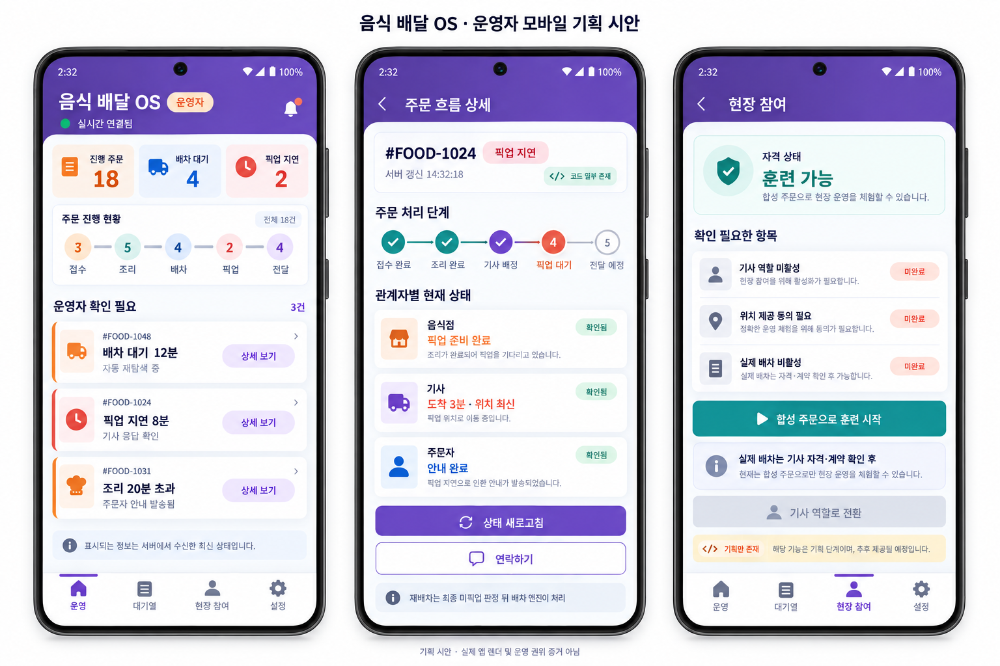
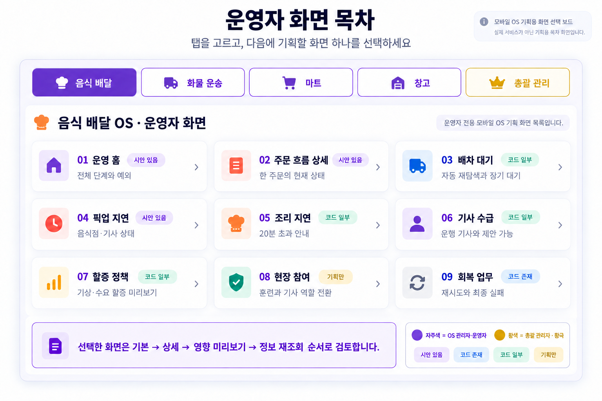
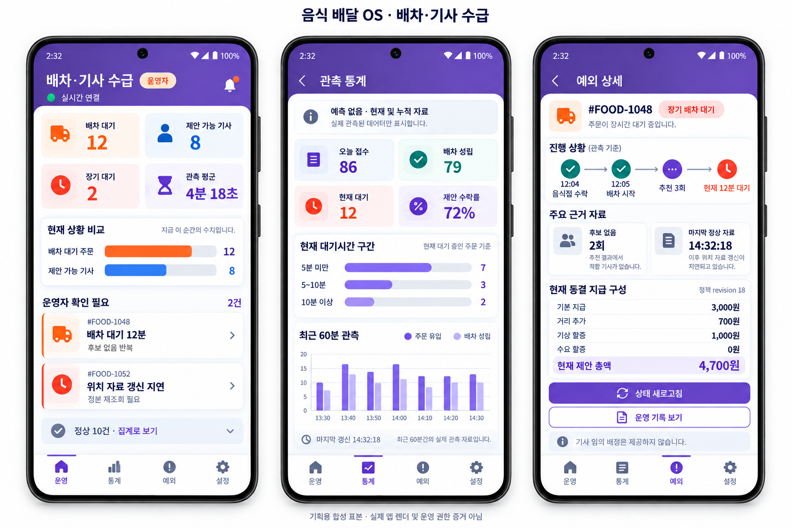

[기획 · 시스템·OS별 운영자 모바일·현장 참여 · PLAN-SYSTEM-OPERATOR-MOBILE-FIELD-PARTICIPATION · r10]

# 이동 중 운영 확인과 운영자 현장 참여

> 화면 이미지 경계: 이 문서에 연결된 모바일 이미지는 모두 `SampleOnly / NotApprovedVisual / NotImplementationSpec`인 탐색용 샘플이다. Git 커밋은 시안 승인이나 구현 지시를 뜻하지 않는다. [샘플 이미지 대장](../../../../assets/planning/README.md)

- 상위 기획: [하나의 운영 원장과 역할별 OS 작업공간 r26](README.md)
- 조사 기준일: `2026-09-18`
- 상태: `Draft / OsOperatorDailyWorkspacePrimaryConfirmed / CrossOsGovernanceSecondaryConfirmed / ManagerPurpleConfirmed / OverallManagerYellowHwanggeukConfirmed / OperatorScreenCatalogGenerated / DispatchQueueAndDriverSupplySeparated / NormalAggregateExceptionDetailConfirmed / ObservedStatisticsOnlyConfirmed / ForecastExcluded / FrozenPayoutDetailSecondaryConfirmed / DispatchSupplyVisualDraftGenerated / Recent60MinutesAndTodaySummaryConfirmed / RiskThenWaitExceptionOrderingConfirmed / CanonicalRefreshBeforeActionsConfirmed / MobileGlancePartiallyImplemented / PhysicalDeviceReviewDeferredByUser / ImageDrivenMobileReviewConfirmed / ExistingFigmaReferencesMapped / FoodDeliveryOperatorVisualDraftGenerated / DriverWorkflowReusable / OperatorFieldParticipationNotImplemented / ExplicitRoleSwitchRequired / ContactChannelOrderAsked / FieldParticipationEntryPlacementCandidate / FirstParticipationModePending`
- 목적: 각 OS 운영자가 이동 중 자기 업무의 흐름과 예외를 짧게 확인하고, 필요한 경우 해당 OS의 현장 역할을 경험해 참여자의 부담을 운영 개선에 반영한다. 총괄 관리자는 일상 처리자가 아니라 정책·권한·재무·OS 간 최종 충돌의 후순위 관리층으로 둔다.
- 다음 질문: 연락이 필요한 예외는 앱 내 메시지를 기본으로 하고 안전 위험·현장 진행 불가에만 전화 진입을 앞세울지 정한다.

## 1. 일상 운영의 중심을 OS별 운영자로 옮긴다

정상 자동화가 작동할수록 총괄 관리자가 매일 직접 처리할 일은 줄어드는 것이 맞다. 앱의 기본 관점은 `전체를 통제하는 총괄 관리자`가 아니라 `자기가 맡은 OS를 돌보는 운영자`다.

```text
로그인
  → 내가 맡은 OS가 하나면 해당 작업공간으로 바로 진입
  → 여러 OS를 맡으면 `내 운영 업무`에서 OS 선택
  → 해당 OS의 정상 흐름·대기·예외·허용 행동 확인
  → 다른 OS가 필요하면 명시적으로 작업공간 전환
```

총괄 관리 기능은 다음 경우에만 연다.

- OS 운영자가 해결할 수 없는 최종 실패 또는 책임 충돌
- 여러 OS에 동시에 영향을 주는 정책·권한·기능 활성화
- 금전 승인·재무 영향·감사·법률·보험처럼 분리 권한이 필요한 결정
- 운영자 배정과 조직 관리

`PlatformOperationsOS`는 이 후순위 교차 관리 셸로 유지하며 음식배달·화물·마트·창고의 일상 생명주기를 흡수하지 않는다.

## 2. 사용자 의도를 두 흐름으로 나눈다

### A. 이동 중 짧은 운영 확인

운영자는 전철·이동 중에도 긴 표나 정책 편집 없이 다음만 빠르게 확인한다.

```text
전체 운영 상태
  → 정상 / 주의 / 긴급
  → OS별 현재 대기·지연·회복 건수
  → 자동 처리 중인지 운영자 판단이 필요한지
  → 필요한 경우에만 상세 원장과 허용 행동
```

정상 업무를 운영자가 매번 승인하지 않는다. 첫 화면은 관찰과 우선순위 판단을 맡고 금전 확정·보상·취소·강제 완료는 권한 있는 상세 화면에서만 연다.

### B. 운영자 현장 참여

운영자가 기사 일을 직접 경험하는 것은 관리자 권한으로 기사 업무를 대신 처리하는 기능이 아니다. 한 사람이 `총괄 운영자`와 `음식 배달 기사` 역할을 함께 보유할 수 있고, 현재 역할을 명시적으로 전환해 각 역할의 기존 원장과 Command를 사용한다.

```text
총괄 운영
  → 현장 참여 진입
  → 자격·계약·보험·위치 동의·운행 가능 상태 확인
  → 음식 배달 기사 역할로 명시적 전환
  → 기존 FDriver 업무 흐름 사용
  → 운행 종료
  → 총괄 운영으로 복귀
  → 비식별 현장 회고와 개선 항목 등록
```

기사 역할에서는 관리자 전용 조작을 숨기고 서버도 기사 권한으로 다시 검증한다. 관리자 토큰으로 배차·픽업·전달을 우회하지 않는다.

## 3. 현재 저장소 대조

| 목표 | 현재 근거 | 현재 판정 |
| --- | --- | --- |
| 이동 중 운영 개요 | `SsalddelAdminApp/Components/Pages/Home.razor`에 이동 중 빠른 확인 목적, 관리자 확인·운송 예외·배차대기·30초 보완 조회가 존재 | `부분 구현` |
| 운송·기사 관제 | `SsalddelAdminApp/Components/Pages/Operations.razor`에 진행 운송·운행 기사·주의 운송·한시 수요 할증·30초 갱신이 존재 | `구현 존재` |
| 모바일 Host와 권한 | `SsalddelAdminApp` MAUI Host, `Session.IsServerAdmin`, 반응형 navigation이 존재 | `구현 존재` |
| Android 빌드 | 저장소 기록상 `net10.0-android` Debug 빌드 경고 0·오류 0 | `빌드 증거 존재` |
| 실제 휴대폰 사용 | 설치·로그인·터치·390px 화면·백그라운드 복귀 증거 없음 | `미검증` |
| 음식 배달 기사 수행 | `FDriverApp`에 운행 시작·종료, 위치 갱신, 제안 수락·거절, 픽업·전달 흐름이 존재 | `재사용 기반 존재` |
| 한 사람의 역할 전환 원칙 | 상위 기획에 명시적 역할 전환과 현재 역할 표시 원칙이 존재 | `기획 존재` |
| 운영자→기사 전환 UI·세션 | 관리자 앱에서 전용 진입점·자격 확인·기사 세션 발급·복귀 화면을 찾지 못함 | `미구현` |
| 운영자 현장 회고 | 대기·인계 마찰·위험·부당 대우를 비식별 개선 항목으로 남기는 전용 계약·화면을 찾지 못함 | `미구현` |

현재 관리자 첫 화면은 사용자의 `이동 중 빠르게 확인` 의도와 이미 상당히 맞는다. 다만 운송 중심 집계가 강하고 음식배달·화물·마트·창고를 같은 `PlatformOperationsOS` 총괄 셸에서 한눈에 비교하는 공통 상태 어휘와 범위 필터는 아직 기획 제안 수준이다.

## 4. 기존 `EducationFieldExperienceOS`와 구분

저장소의 `EducationFieldExperienceOS`는 학생·보호자·학교·현장체험지도자의 교육 현장체험 업무다. 운영자의 기사 업무 이해를 위한 현장 참여와 주체·동의·책임·원장이 다르므로 재사용하지 않는다.

첫 버전은 새 OS를 만들지 않고 다음 두 요소로 구성한다.

- 해당 업무를 소유하는 OS 운영자 작업공간의 `현장 참여` 진입점
- 기존 `FoodDeliveryOS` 기사 역할 작업공간으로의 명시적 역할 전환

현장 회고가 독립 원장과 반복 생명주기를 요구하는지 실제 사용으로 확인한 뒤에만 별도 업무 경계를 검토한다.

## 5. OS별 운영자 모바일의 권장 첫 정보 계층

```text
내 운영 업무
  → 음식 배달 OS 운영
      1. 주문 흐름: 접수 / 조리 / 배차 / 픽업 / 전달
      2. 자동 처리 중: 배차 재탐색 / 재시도 / 회복
      3. 운영자 판단 필요: 장기 지연 / 안전 / 최종 실패
      4. 현장 참여: 자격 상태 / 훈련 / 기사 역할 전환
      5. 상세: 원장 / 연락 / 허용 행동 / 영향 미리보기
  → 화물 운송 OS 운영
  → 마트 운영 OS 운영
  → 창고 운영 OS 운영
```

- 연락처와 정밀 위치는 해당 업무 관계와 권한이 성립한 상세에서만 연다.
- 첫 화면은 사람 한 명의 픽업 건을 전면에 올리지 않고 집계와 예외를 우선한다.
- 마지막 성공 조회 시각과 연결 끊김을 분명히 표시해 오래된 값을 현재 상태처럼 보이지 않게 한다.
- 금액과 회계는 OS 첫 화면에서 숨기고 권한 있는 `재무 영향` 상세 또는 총괄 교차 관리로 들어갔을 때 현재 원장과 시뮬레이션을 분리해 보여 준다.

## 6. 현장 참여의 안전 경계

### 실제 배차를 수행할 때

- 다른 기사와 같은 가입·자격·계약·보험·세무·위치 동의·운행 상태 조건을 적용한다.
- 배차 엔진이 같은 정책으로 후보를 판정하며 운영자라는 이유로 우선 배차하지 않는다.
- 기사 지급·할증·공제·사고·보류 규칙도 동일하게 적용한다.
- 음식점·주문자에게 개인의 관리자 지위를 자동 공개하지 않는다. 특혜나 압박을 만들지 않도록 한다.
- 관리자 권한으로 자신의 배차·지급·분쟁을 승인하지 못하게 이해충돌 관문을 둔다.

### 현장 경험을 운영 개선에 반영할 때

회고는 개인 평가나 기사 감시가 아니라 절차 개선 자료다.

```text
관찰 항목
  - 음식점 대기와 인계 마찰
  - 주차·출입·엘리베이터·안전 문제
  - 주문자 연락과 전달 난점
  - 앱 정보의 부족·오류·과도한 조작
  - 기사에 대한 부당한 언행 또는 존중받은 경험

처리
  → 개인 식별을 최소화한 회고
  → 운영 개선 대기열
  → 정책·UI·교육·파트너 소통 후보
  → 승인된 변경만 운영 적용
```

신고만으로 기사·음식점·주문자의 귀책이나 불이익을 자동 확정하지 않는다. 외부에는 특정 개인의 일화보다 `운영팀이 정기적으로 현장을 경험하고 무엇을 개선했는지`를 비식별 집계로 공개하는 편이 목적에 맞다.

## 7. 장치 검증 보류 중 화면 검토 방식

사용자의 현재 휴대폰이 파손되어 직접 장치 검증은 후순위로 미룬다. 이 결정은 Android 빌드나 실제 장치 증거가 완료됐다는 뜻이 아니다. 장치가 준비될 때까지 다음 네 상태를 모바일 이미지로 검토한다.

```text
기본 상태
  → 상세를 연 상태
  → 허용 행동과 영향 미리보기 상태
  → 실행 성공·실패 뒤 서버 정본을 다시 읽은 상태
```

- 이미지는 정보 계층·문구·버튼 위치·역할 충돌을 판단하는 기획 시안이다.
- 시안의 버튼은 기존 route·계약·권한과 대조해 `코드 존재 / 부분 존재 / 기획만 존재`를 함께 표시한다.
- 실제 앱 렌더, 터치, GPS, 푸시, 백그라운드 복귀, 서버 연결 증거로 승격하지 않는다.
- 다음 시안은 `음식 배달 OS 운영 홈 → 현장 참여 진입 → 자격 상태 확인`을 우선 후보로 둔다.

### 7.1 기존 Figma·코드·기획 시안 대조

라이브 Figma node를 이번 판본에서 다시 편집하지는 않았다. 저장소에 남은 Figma 수렴 문서와 캡처, 현행 제품 코드, 최근 모바일 기획 이미지를 함께 참고했다.

| 참고 | 이번 시안에서 가져온 것 | 그대로 복제하지 않은 것 |
| --- | --- | --- |
| Figma `09 Admin Mobile` 캡처 | 자주색 운영 계열, compact card, 상태·재조회·오프라인 구분 | 총괄 플랫폼 전체를 일상 홈으로 두는 관점 |
| `음식 주문 ID · 역할 화면 상태 확인` | 같은 주문번호, 서버 상태 재조회, 주문자·음식점·기사 관계 | 네 역할을 한 화면에서 직접 조작하는 구성 |
| 음식 판매 OS 시안 | 한국어 상태 카드, 조리·픽업 단계, 역할 색상 | 음식점의 수락·조리 Command |
| 음식 배달 기사 지도 시안 | 기사 역할 전환과 위치 동의의 분리 | 운영자가 기사 권한을 자동 획득하는 흐름 |
| 현행 `SsalddelAdminApp`·음식 주문 코드 | 30초 보완 조회, 운영 예외, 주문·조리·배차·픽업·전달 의미 | 코드에 없는 현장 참여 계약을 구현된 것처럼 표시 |

### 7.2 음식 배달 OS 운영자 모바일 1차 시안



세 화면은 다음 질문을 검토한다.

1. **운영 홈**: 진행 주문·배차 대기·픽업 지연과 주문 생명주기를 요약하고 `운영자 확인 필요` 건만 전면에 둔다.
2. **주문 흐름 상세**: 같은 주문번호에서 음식점·기사·주문자의 서버 확정 상태를 읽고 `상태 새로고침`과 권한 있는 연락만 제공한다. 재배차는 배차 엔진 책임으로 남긴다.
3. **현장 참여**: 기사 역할·위치 동의·실제 배차 활성 여부를 분리하고 첫 후보를 합성 주문 훈련으로 표현한다.

화면의 `코드 일부 존재`와 `기획만 존재` 표시는 구현 상태를 구분한다. 이 이미지는 실제 Figma 최신 node, 제품 앱 렌더, API 결속, 실제 장치, 운영 권위의 증거가 아니다.

### 7.3 역할 색상과 운영자 화면 목차



역할 색상은 상태 색상과 분리한다.

- **자주색**: 음식배달·화물·마트·창고 등 각 OS의 관리자·운영자 작업공간
- **황색**: 여러 OS의 정책·권한·재무·최종 충돌을 조율하는 총괄 관리자, 즉 `황극` 관점
- **주황·빨강**: 지연·주의·위험·사람 확인 필요 상태

따라서 황색은 경고나 우선순위 상승을 뜻하지 않는다. 총괄 관리자 탭·왕관 표식·얇은 강조선처럼 역할 문맥에만 사용하고, OS 운영자는 기존 자주색 계열을 유지한다. 코드의 기존 `PlatformOperationsOS` 식별자나 권위 경계를 바꾸지 않으며, `황극`은 현재 UI 의미와 기획 명칭이다.

화면 목차는 다음 기획 화면을 고르기 위한 선택판이다. 제품 앱의 실제 navigation, Figma 최신 node, API 결속 또는 구현 완료 증거가 아니다.

### 7.4 배차 대기·기사 수급 관제 계층

현행 코드의 `배차대기`는 기사가 쉬며 콜을 기다린다는 뜻이 아니라, 아직 기사 추천·수락이 끝나지 않은 **주문·운송 업무 원장**의 상태다. 기사 쪽은 `신규 배차 받기 ON`, 서버가 판정한 실제 제안 가능 상태, 현재 운행·수행 중 상태로 따로 관리한다.

운영자 화면에서는 두 자료를 한 관제 문맥에서 함께 보되 의미를 합치지 않는다.

```text
배차·기사 수급
  → 현재 요약
      배차 대기 주문 / 제안 가능 기사 / 장기 대기 / 제안 수락률
  → 통계
      중앙 대기시간 / 긴 대기 구간 / 시간대별 수요·공급 / 재탐색 횟수
  → 재무 영향
      동결 기본 지급 / 거리·기상·수요 할증 / 예상 추가 지급액 / 정책 revision
  → 운영자 확인 필요
      장기 무배차 / 후보 없음 반복 / 자료 불완전 / 지급 조건 이상 / 회복 실패
  → 예외 상세
      원장 timeline / 판정 근거 / 최소 관계자 정보 / 허용 행동 / 영향 미리보기
```

- 정상 주문과 정상 운행 기사는 개별 목록을 기본으로 펼치지 않는다. 수치와 추세로만 관찰한다.
- 기사 이름·정밀 위치·연락처는 정상 수급 통계에 사용하지 않는다. 실제 예외 업무 관계와 권한이 성립한 상세에서만 최소한으로 연다.
- 제안 만료를 곧바로 `기사 무응답`이나 기사 귀책으로 표시하지 않는다. 운영 홈은 주문 기준 `배차 대기 장기화`로 집계한다.
- 상세의 재무 정보는 해당 제안에 동결된 지급 구성과 운영 정책의 비용 영향을 설명한다. 회계 전표·정산 지급·소급 변경 권한을 만들지 않는다.
- 운영자는 예외를 확인하고 허용된 정책·재시도·인계 행동을 선택할 수 있지만 특정 기사를 임의 배정하지 않는다. 후보 재탐색과 배차 확정은 기존 배차 엔진과 권한 있는 UseCase가 맡는다.

화면 목차의 `03 배차 대기`는 향후 `03 배차·기사 수급`으로 고쳐 실시간 관제 진입점으로 사용한다. 기존 `06 기사 수급`은 중복 실시간 목록이 아니라 시간대별 제안 가능 기사·수락률·운행량을 보는 후속 통계 화면 후보로 좁힌다. 이미지 자체의 문구 수정은 다음 화면 시안 생성 때 함께 반영한다.

### 7.5 배차·기사 수급 현재 정보 중심 시안



시안은 세 상태를 함께 보여 준다.

1. **실시간 개요**: 배차 대기 주문, 제안 가능 기사, 장기 대기, 현재 관측 평균과 예외 두 건만 표시한다. 정상 건은 `정상 10건 · 집계로 보기`로 접는다.
2. **관측 통계**: 오늘 접수·배차 성립·현재 대기·제안 수락률과 현재 대기시간 구간, 최근 60분의 실제 주문 유입·배차 성립만 표시한다.
3. **예외 상세**: 장기 배차 대기 건의 실제 timeline, 후보 없음 횟수, 마지막 정상 자료 시각과 이미 동결된 지급 구성을 표시한다.

다음은 포함하지 않는다.

- 향후 주문량·기사 수급·배차 성공률 예측
- `30분 예상 추가 지급액` 같은 미래 비용 전망
- 정상 기사 개인의 이름·위치·연락처 목록
- 운영자의 기사 임의 배정
- 화면 수치만으로 회계 전표·정산 지급·귀책을 확정하는 기능

이미지의 숫자와 주문번호는 정보 계층을 검토하기 위한 합성 표본이다. 제품 앱 렌더, 실제 운영 통계, API 결속, 장치 검증 또는 운영 권한 증거가 아니다.

### 7.6 기본 통계 시간 범위

- 기본 상단 요약은 운영시장 `Asia/Seoul` 기준 **오늘 누적**을 보여 준다.
- 변화 추세는 **최근 60분의 실제 관측값**만 보여 준다.
- 어제·최근 7일·사용자 지정 기간은 기본 화면에서 숨기고 통계 상세의 기간 선택으로 연다.
- 조회 기준 시각과 마지막 성공 갱신 시각을 함께 표시하며, 통신 실패 시 오래된 수치를 현재값처럼 갱신하지 않는다.
- 기간을 바꿔도 서버 정본·원장·지급액을 변경하지 않는 읽기 전용 조회다.

### 7.7 운영자 확인 필요 예외 정렬

기본 정렬은 다음 순서로 확정한다.

```text
1. 안전 위험 또는 현장 진행 불가
2. 업무 생명주기 중단·회복 실패
3. 자료 불완전·정본 불일치로 판단 불가
4. 장기 배차 대기·조리 지연·픽업 지연
5. 같은 단계 안에서는 대기시간이 긴 순서
6. 그래도 같으면 마지막 상태 변경 시각이 오래된 순서
```

- 기사 개인의 제안 만료·응답 없음만으로 위험 단계나 기사 귀책을 올리지 않는다.
- 금액이 크다는 이유만으로 안전·업무중단보다 앞에 놓지 않는다. 지급 이상이 실제 정산 차단이나 계약 불일치를 만들 때만 해당 업무중단 단계에 들어간다.
- 정렬 점수는 운영자가 임의로 사람의 순위를 정하는 평가 점수가 아니라 예외 업무를 놓치지 않기 위한 화면 우선순위다.
- 각 카드에는 왜 위에 놓였는지 `안전`, `업무중단`, `판단자료 부족`, `장기대기` 같은 이유를 직접 표시한다.
- 정렬은 표시 순서만 바꾸며 배차 후보 점수·기사 기회·지급·귀책·원장 상태를 변경하지 않는다.

### 7.8 예외 상세의 첫 행동과 revision 관문

예외 카드를 열었을 때 첫 행동은 `서버 정본 새로고침`으로 고정한다.

```text
예외 카드 선택
  → 화면에 보관한 revision과 마지막 갱신 시각 표시
  → 서버 정본 새로고침
  → 같은 업무의 최신 상태·revision·AvailableActions 재조회
  → 예외가 해소됐으면 정상/회복 상태로 복귀
  → 예외가 남아 있을 때만 연락·안전 재시도·OS별 후속 행동 활성화
```

- 새로고침 실패 시 기존 화면은 `마지막 정상 자료`로만 남기고 변경 행동을 열지 않는다.
- 새 revision에서 예외 종류나 책임 OS가 바뀌면 이전 버튼을 폐기하고 최신 `AvailableActions`로 교체한다.
- 운영자가 화면을 열었다는 사실이나 새로고침 자체는 원장 상태·배차·지급·귀책을 변경하지 않는다.
- 자동 복구가 이미 진행 중이면 중복 재시도 대신 현재 처리 상태와 다음 재조회 시각을 보여 준다.
- 연락처는 정본 재조회 뒤에도 실제 업무 관계와 권한이 유효할 때만 제공한다.

## 8. 권장 구현 순서

1. **음식 배달 OS 운영자 화면 검토**: 주문·조리·배차·픽업·전달의 흐름과 운영자 판단 대기열을 이미지로 확정한다.
2. **상태별 모바일 시안 검토**: 현장 참여의 자격 확인·역할 전환·운행 종료·회고 화면을 기본/상세/미리보기/결과 상태로 비교한다.
3. **다른 OS 작업공간 확대**: 화물→마트→창고 순서로 같은 진입 골격을 적용하되 각 생명주기와 권한을 유지한다.
4. **역할 전환 계약**: 다중 역할 사용자, 현재 활성 역할, 전환 가능 조건, 세션·감사·복귀를 정의한다.
5. **합성 현장 참여**: 격리 `Simulation` 주문을 기존 FDriver 흐름으로 수행하고 회고를 남긴다. 실제 배차·지급은 만들지 않는다.
6. **실제 현장 참여**: 같은 기사 자격·계약과 이해충돌 방지가 준비된 뒤 `Operational`에서 제한적으로 연다.
7. **개선 환류**: 비식별 회고가 해당 OS의 운영 개선 대기열과 변경 전후 근거로 이어지게 한다.
8. **교차 관리 셸**: 실제로 여러 OS가 충돌하는 정책·권한·재무·최종 실패만 `PlatformOperationsOS`에서 연결한다.
9. **장치 검증 재개**: 휴대폰이 준비되면 설치·로그인·30초 갱신·통신 중단·백그라운드 복귀·390px 판독성을 확인한다.

첫 두 단계만으로도 이동 중 운영 확인의 실사용 판단이 가능하다. 현장 참여는 관리자 앱 안에 기사 기능을 복제하기보다 기존 FDriver 작업공간으로 안전하게 전환하는 것이 현재 구조와 맞다.

## 확정

- 이동 중 운영 확인과 운영자 현장 참여는 서로 다른 흐름으로 관리한다.
- 운영자 앱은 전체 흐름과 예외를 보며 정상 업무를 매번 수동 승인하지 않는다.
- 현장 참여는 관리자 권한에 기사 권한을 섞지 않고 명시적 역할 전환으로 수행한다.
- 실제 기사 업무는 기존 `FDriverApp`의 서버 권위 흐름을 재사용한다.
- 현장 회고는 사람을 평가하거나 자동 제재하는 자료가 아니라 비식별 운영 개선 자료로 쓴다.
- `EducationFieldExperienceOS`를 운영자 현장 참여에 전용하지 않는다.
- 현재 휴대폰 파손으로 실제 장치 검증은 후순위로 미루고 모바일 이미지 기반 문답을 먼저 진행한다.
- 화면 시안은 제품 코드·장치 실행·서버 결속 증거로 취급하지 않는다.
- 일상 모바일 작업의 중심은 총괄 관리자가 아니라 각 OS 운영자다.
- `PlatformOperationsOS`는 OS 간 정책·권한·재무·최종 충돌을 다루는 후순위 교차 관리 셸이다.
- 여러 OS를 맡은 한 사람은 `내 운영 업무`에서 작업공간을 명시적으로 전환한다.
- 기존 Figma의 정보 구조와 역할 색상은 재사용하되 현행 코드·원장·권한과 충돌하면 코드와 승인 기획을 우선한다.
- 음식 배달 OS 운영자 1차 시안은 운영 홈·주문 흐름 상세·현장 참여 진입의 세 화면을 함께 검토한다.
- 역할 색상은 `OS 관리자·운영자=자주색`, `총괄 관리자·황극=황색`으로 구분하고 주의·위험은 주황·빨강을 유지한다.
- 총괄 관리자 황색은 역할 문맥이며 경고·업무 우선순위·서버 권위를 뜻하지 않는다.
- `배차대기` 주문 원장과 대기·제안 가능 기사 수급은 별도 상태이며 운영 화면에서만 함께 관찰한다.
- 정상 경로는 집계·통계로 보고, 장기 무배차·자료 불완전·지급 조건 이상·회복 실패 같은 예외만 건별 상세로 연다.
- 배차 상세는 통계와 재무 영향을 보여 주되 기사 임의 배정·회계 전표·지급 확정 권한을 갖지 않는다.
- 운영자 배차 화면은 미래 예측보다 현재 서버 정본과 누적 관측 통계를 먼저 정확하게 정리한다.
- 미래 추가 지급액 전망은 제외하고, 예외 상세에서 해당 제안에 이미 동결된 지급 구성만 보조 정보로 표시한다.
- 통계 기본 범위는 `최근 60분 관측 + 오늘 누적 요약`으로 확정한다.
- 예외 목록은 `위험·업무중단·판단 불가·장기 대기` 순으로 나누고 같은 단계에서는 대기시간이 긴 건을 먼저 표시한다.
- 예외 상세는 최신 서버 revision과 허용 행동을 다시 확인한 뒤에만 연락·재시도·후속 조작을 활성화한다.

## 미정

- 첫 현장 참여가 합성 주문 훈련인지 실제 배차인지
- 관리자 앱과 FDriverApp 사이를 한 Host의 역할 전환으로 합칠지 안전한 깊은 링크로 연결할지
- 기사 자격·계약·보험 조건 중 현장 참여 전에 반드시 충족할 최소 집합
- 현장 회고의 보존 기간·열람 권한·신고 원장과의 연결 범위
- 운영팀의 현장 참여와 개선 결과를 외부에 어느 수준으로 공개할지
- 음식 배달 OS 운영 홈에서 `현장 참여` 진입점을 어디에 둘지
- 여러 OS를 맡은 운영자의 기본 진입을 마지막 작업공간 복원으로 할지 `내 운영 업무` 선택 화면으로 할지

## 다음 질문 하나

연락이 필요한 예외는 앱 내 메시지를 기본 진입으로 두고, 안전 위험·현장 진행 불가처럼 즉시 통화가 필요한 경우에만 전화 버튼을 앞세울까?

추천은 그렇다. 일반 예외는 기록이 남는 메시지로 처리하고, 긴급한 현장 상황에서만 전화 접근을 빠르게 제공하는 편이 개인정보 노출과 불필요한 통화를 줄인다.
