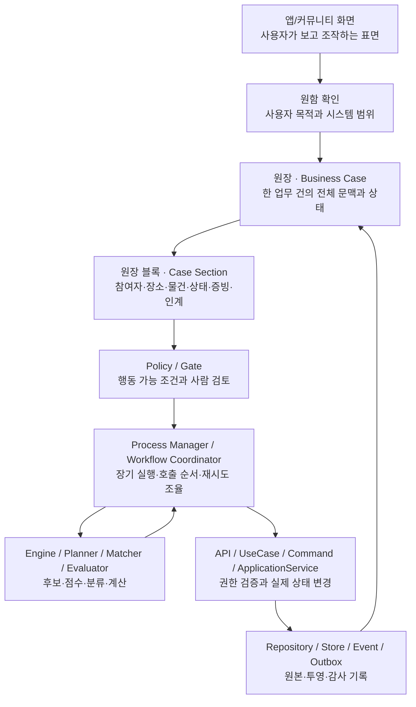
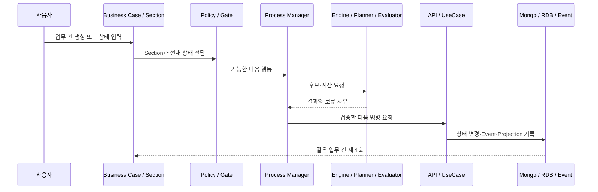

# 업무 실행 책임 모델

이 문서는 살뜰에서 사용자 화면, 원함, 업무 건, 정책, 장기 실행 조율, 판단 도구, 상태 변경과 저장 책임을 구분하는 기준이다.

과거 문서에서 사용한 `HIOPS`와 `하위 OS`는 현재의 기술 역할 이름이 아니다. 기존 Route, 설정 section, Event code, 저장 식별자의 호환값으로는 남을 수 있지만, 새 class·interface·field·parameter·파일 이름은 실제 책임을 나타내는 일반적인 기술 용어를 사용한다. 다만 `화물운송 OS`와 `음식배달 OS`처럼 업무의 전 생명주기를 묶어 사람이 이해하는 제품·운영 경계에는 OS라는 표현을 사용할 수 있다. 이 OS는 단일 실행 class가 아니라 안정 식별자 아래 Process Manager·Coordinator·Engine·UseCase·Store를 조립한 독립 업무 체계다.

관계형 모델의 `DbContext` 소유권과 aggregate별 ERD는 [데이터 모델과 ERD 기준](DataModel/README.md), 코드 접미사와 언어 기준은 [코드 탐색 메타데이터](SsalddelCodeMetadata.md)를 따른다.

## 한 줄 기준

사용자의 원함을 확인하고, 원장(Business Case)과 Case Section으로 업무 문맥을 구조화하며, Policy가 행동 가능 여부를 판정한다. Process Manager와 Workflow Coordinator는 실행 순서를 조율하고, Engine·Planner·Matcher·Evaluator는 후보와 계산 결과만 반환한다. 실제 상태 변경은 API·UseCase·Command·ApplicationService가 수행한다.



## 책임 층위

숫자는 런타임 호출 순서를 강제하는 값이 아니라 책임을 설명하기 위한 탐색 순서다.

| 층위 | 현재 이름 | 주 책임 | 직접 해도 되는 일 | 하면 안 되는 일 |
| --- | --- | --- | --- | --- |
| 7 | 앱/커뮤니티 화면 | 사용자가 업무 상태를 보고 행동을 요청하게 한다 | Case Section 렌더링, 입력, 재조회, API 요청 | 서버 상태를 자체 판단으로 확정 |
| 6.5 | 원함 확인 | 사용자의 목적과 시스템 지원 범위를 맞춘다 | 질문, 보류·검토 필요성, 사용자 책임 안내 | 원함을 계약이나 자동 실행 약속으로 변경 |
| 6 | 원장 · `Business Case` | 한 업무 건의 문맥·참여자·상태·증빙·인계 이력을 보관 | Mongo 원본과 RDB 투영 링크 유지 | 후보 계산이나 외부 실행 직접 수행 |
| 5 | 원장 블록 · `Case Section` | 여러 역할이 함께 이해하는 최소 업무 단위 | 참여자·장소·물건·재고·상태·증빙 구조화 | 하나의 Section이 전체 workflow 독점 |
| 4 | `Policy` / `Gate` | 어떤 행동이 열리는지 판정 | 필수 Section, 선행 Case, 사람 검토 조건 판정 | DB 변경이나 외부 API 호출 |
| 3 | 실행 조율 | 장기 실행과 여러 호출의 순서를 관리 | Process Manager, Workflow Coordinator, Scheduler, 재시도·보류 조율 | UseCase 검증을 우회한 상태 변경 |
| 2 | 판단 도구 | 입력에서 후보와 계산 결과를 만든다 | Engine, Planner, Matcher, Selector, Evaluator, Calculator | 영속 상태 확정, 권한 단독 결정 |
| 1 | 실행 경계 | 검증된 의도를 실제 상태 변경으로 연결 | API, UseCase, Command, ApplicationService, Event/Outbox 발행 | 임시 UI 판단을 정책으로 은닉 |
| 0 | 저장·메시징 | 업무를 재구성할 원본과 투영을 보관 | Repository, Store, Mongo, RDB Projection, Event, Outbox, Audit Log | 화면 편의를 위한 의미 없는 중복 상태 |

## 용어 대응

| 기존 업무·호환 용어 | 현재 기술 용어 | 적용 기준 |
| --- | --- | --- |
| 원장 | `Business Case`, `IBusinessCaseRecord` | 업무 담당자 문맥에서는 ‘원장’을 함께 표기 |
| 원장 블록 | `Case Section`, `IBusinessCaseSection` | UI·Policy·AI·조율 계층이 공유하는 업무 조각 |
| 원장 저장소 | `Business Case Store`, `IBusinessCaseStore` | 기존 Mongo 원본 경로를 Adapter로 재사용 |
| 원장 조회 투영 | `Case Read Model`, `Projection` | 조회·보고·권한용 안정 모델 |
| HIOPS | 업무 실행 책임 모델 | 설계 이력이나 호환 식별자 외 신규 이름 사용 금지 |
| 하위 OS | `ProcessManager`, `WorkflowCoordinator`, `Scheduler` 등 | 실제 책임에 따라 하나를 선택 |
| OS code/config | 호환 Workflow 식별자·설정 key | 외부 계약이므로 별도 migration 없이 변경 금지 |
| 화물운송 OS·음식배달 OS | 전 생명주기를 소유하는 운영 업무 체계 | 제품·기획·모듈 대장에서는 사용하되 단일 기술 역할명으로 사용하지 않음 |
| 엔진 | `Engine` 또는 더 구체적인 판단 역할 | 순수 계산일 때만 Engine 허용 |

코드 주석과 제품 설명은 `원장(Business Case)`, `원장 블록(Case Section)`처럼 한글 의미를 먼저 남긴다. 한글은 업무 의미를 설명하고 영어는 기술 책임과 코드 탐색을 돕는다.

## 원함 확인

원함은 사용자가 바라는 일과 해결하고 싶은 일을 뜻한다. 원함 확인은 Business Case를 만들기 전에 다음을 분명하게 한다.

- 사용자가 해결하려는 일
- 함께 확인하거나 도와야 할 역할
- 시간·장소·수량·비용 같은 조건
- 시스템이 지원할 수 있는 범위
- 사용자가 직접 확인하고 동의해야 하는 범위
- 증빙·결제·신고·분쟁처럼 사람 검토가 필요한 부분

원함 확인은 계약이나 실행 확정이 아니다. 결과는 사용자 목적, 필요한 Case Section, 시스템 지원 범위와 후속 실행 경계를 설명하는 판단 근거로 남긴다.

## Business Case와 Case Section

Business Case는 사람이 이해하는 한 업무 건의 전체 문맥이다. 커뮤니티 대화가 실제 일로 이어질 때 참여자, 장소, 물건, 상태, 증빙, 정산, 인계 같은 Case Section으로 구조화한다.

Case Section은 특정 UI 컴포넌트가 아니다. 화면이 표시하고, Policy가 검사하고, AI와 판단 도구가 근거로 읽고, Process Manager가 다음 단계 판단에 사용할 수 있는 공통 의미 단위다.

기존 `커뮤니티원장Dto`와 MongoDB 필드, 공개 JSON 계약은 호환성을 위해 유지한다. 새 서버 코드는 `IBusinessCaseRecord`, `IBusinessCaseSection`, `IBusinessCaseStore`로 같은 데이터를 읽을 수 있다.

## Policy와 Gate

Policy는 행동 가능 여부를 판정하지만 직접 상태를 바꾸지 않는다.

- 어떤 Section이 필수인가
- 어떤 선행 Business Case가 필요한가
- 어떤 동의와 권한이 필요한가
- 어떤 조건에서 사람 검토가 필요한가
- 어떤 조건에서 후속 UseCase를 호출할 수 있는가

화면 표시 편의를 위한 조건과 실제 상태 전이 조건을 같은 것으로 취급하지 않는다.

## 실행 조율

과거 `하위 OS`로 뭉뚱그렸던 책임은 다음처럼 나눈다.

| 책임 | 사용할 이름 |
| --- | --- |
| 여러 상태 전이와 장기 실행 관리 | `ProcessManager`, 필요 시 `Saga` |
| 여러 UseCase와 외부 Adapter 호출 순서 | `WorkflowCoordinator`, `Orchestrator` |
| 일정·마감 시각에 작업 시작 | `Scheduler`, `BackgroundService`, `Job` |
| 단일 요청의 권한·상태 검증과 변경 | `UseCase`, `Command`, `ApplicationService` |

Process Manager는 재시도·보류·다음 단계와 장기 상태를 조율할 수 있지만, 권한과 현재 상태를 검증하는 UseCase를 우회하지 않는다. 기존 이름이나 설정에 `OS`가 남아 있으면 호환 식별자로 취급하고 새 내부 타입은 책임에 맞는 이름을 사용한다.

현재 예시는 [공동구매 수요·모집 Process Manager](GroupPurchaseDemandProcessManager.md)다. 동의한 개별주문을 집단화하는 장기 실행 상태를 관리하지만 계약·결제·수입 실행을 자동 확정하지 않는다.

## 판단 도구

판단 도구는 영속 상태를 직접 바꾸지 않는다.

| 책임 | 권장 이름 | 결과 예 |
| --- | --- | --- |
| 복합 계산 | `Engine` | 배차·집단화 계산 결과 |
| 후보 계획·배분 | `Planner` | 창고·재고 배분 계획 |
| 후보 매칭 | `Matcher`, `Selector` | 기사·상품·업체 후보 |
| 분류·판정 | `Classifier`, `Evaluator` | 위험·적합·검토 필요 |
| 수치 계산 | `Calculator`, `Estimator` | 거리·비용·시간 추정 |

`Engine`은 입력을 받아 결과를 반환하는 순수 계산 경계에서만 사용한다. DB 저장, 권한 확인, 상태 전이, Event/Outbox 발행을 수행하면 UseCase·ApplicationService·ProcessManager 중 실제 책임으로 이름을 바꾼다.

## 실행과 저장

기본 호출 방향은 다음과 같다.

```text
화면
  -> Controller API
  -> UseCase / Command / ApplicationService
  -> Domain / Infrastructure
  -> DB / Event / Outbox
```

사용자가 직접 누르거나 Process Manager가 후속 작업을 시작해도 최종 상태 변경은 같은 실행 경계를 통과한다. 성공 뒤 같은 stable ID의 Business Case를 다시 조회해 여러 역할이 동일한 상태를 확인하게 한다.

MongoDB Business Case는 유연한 업무 원본을, RDB Projection은 권한·조회·정산·보고·트랜잭션을 맡는다. Event와 Outbox는 멱등하게 재처리할 수 있어야 한다.

## 독립 업무 모듈과 서버 조립

Process Manager는 다른 Process Manager의 상위·하위 계층이 아니다. 각 Process Manager는 자기 업무 상태, Policy, Store Port와 입출력 계약을 가진 독립 업무 모듈이며, 실행 서버는 필요한 모듈만 DI에 등록한다.

- 앞 단계의 Process Manager 구현을 직접 주입하지 않는다.
- 다른 업무영역의 상태는 소비 모듈이 소유한 좁은 Reader·Store Port로 읽는다.
- 같은 서버에서는 Local Adapter로 기존 Store를 연결한다.
- 서버가 분리되면 동일한 Port 뒤에 HTTP·메시지·별도 Projection Adapter를 연결한다.
- Process Manager 등록과 `BackgroundService` 등록을 분리한다.
- 같은 저장소를 사용하는 BackgroundService를 여러 서버에서 실행할 때는 단일 실행 주체나 분산 lease를 둔다.
- 외부 조회나 업무 상태 변경을 일으키는 Job은 실행 직전에 공통 활성화 정책으로 `Operational` 모드, workflow 기능 플래그와 작업별 설정을 함께 확인한다.

현재 서버 조립에서는 `AddSsalddelGroupPurchaseDemandProcessModule`과 `AddSsalddelGroupImportReadinessProcessModule`로 핵심 모듈을 선택한다. 정기 실행은 각각의 `BackgroundProcessing` 등록 메서드로 별도 선택하고, 단일 서버 호환 구성은 같이 수입 준비 Port를 `AddSsalddelGroupImportReadinessLocalAdapters`로 연결한다.

## 판단 데이터 흐름



판단 근거에는 입력 Section, 적용 Policy, 계산 결과, 실행한 UseCase, 실제 결과와 재시도 여부를 남긴다.

## 구현 기준

1. 새 업무 유형은 Business Case의 stable ID, Case Section, 상태와 참여 역할을 먼저 정의한다.
2. 사용자의 원함과 시스템 지원 범위를 실행 전에 확인한다.
3. 행동 가능 조건은 Policy 또는 Gate로 분리하고 저장을 직접 수행하지 않는다.
4. 장기 실행은 Process Manager, 호출 순서 조율은 Workflow Coordinator, 일정 실행은 Scheduler로 구분한다.
5. Engine은 순수 계산에만 사용하고 결과를 후보·점수·사유와 함께 반환한다.
6. 실제 변경은 API·UseCase·Command·ApplicationService가 권한과 현재 상태를 검증한 뒤 수행한다.
7. 성공 뒤 같은 Business Case를 다시 조회하고 Event·Outbox·Projection의 멱등성을 검증한다.
8. 새 코드에는 HIOPS나 모호한 하위 OS를 기술 역할명으로 추가하지 않는다. 업무 전체의 소속은 기존 OS 안정 식별자로 표시하고 실제 type은 ProcessManager·Coordinator·Engine·UseCase·Store 중 책임에 맞게 이름 짓는다. 기존 식별자 변경은 별도 migration과 호환 기간을 둔다.
