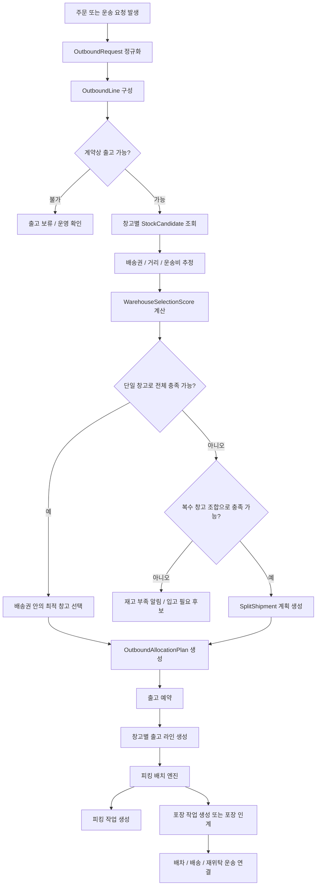
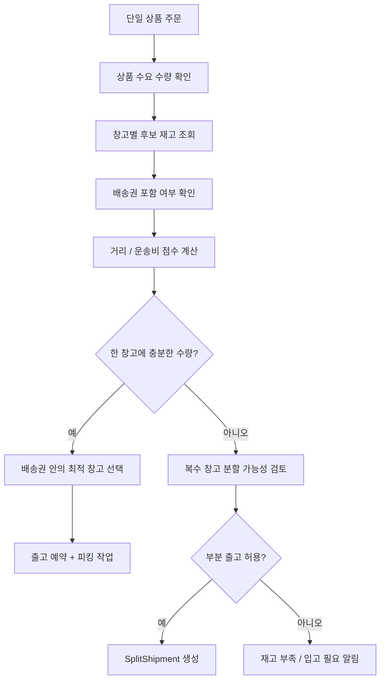
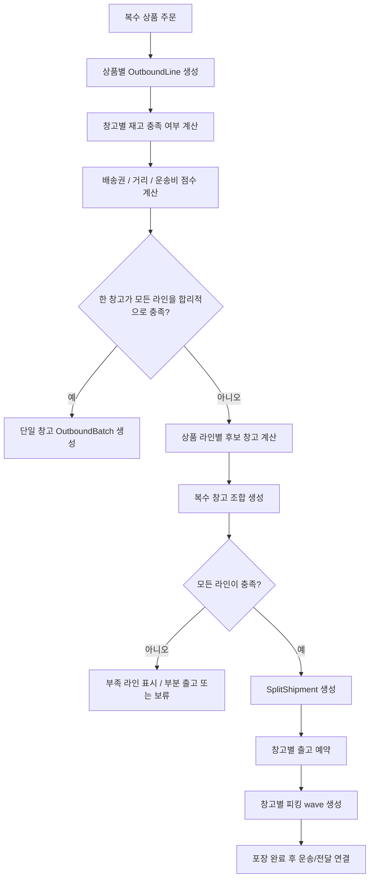

# 출고 배치 엔진

출고 배치 엔진은 주문이나 운송 요청을 받아 어떤 창고의 어떤 재고로 수요를 충족할지 결정하는 계획 계층이다.

단순히 피킹 작업을 만드는 모듈이 아니라, 단일 상품 주문과 복수 상품 주문, 단일 창고 출고와 복수 창고 분할 출고를 모두 판단하는 상위 흐름으로 둔다. 적재대에 있는 물건을 어떤 작업자가 피킹하고, 같은 작업자가 포장까지 할지 또는 별도 포장 작업자에게 넘길지는 하위 `피킹 배치 엔진`이 판단한다.

## 적용 범위

| 범위 | 설명 | 버전 |
| --- | --- | --- |
| 일반 창고 출고 | 판매자/화주의 출고 요청, 주문자 화물/공산품 주문 출고 | `1.5` |
| 창고 출고 연계 운송 | 출고 완료 후 1.0 화물/용달 운송으로 연결 | `1.5` |
| 수입/통관 연계 재고 | HS 코드, 통관 상태, FCL/LCL 판단을 참고해 출고 가능성을 보정 | `2.0` |
| 주문자 집단 공동 주문 | 여러 주문자의 수요를 묶어 공동 출고/분배하는 흐름 | `2.5` |
| 알뜰살뜰 마트 도심 즉시배송 | 도심 창고 재고를 피킹/포장하고 음식 배달 기사 픽업으로 연결 | `3.5` |

## 핵심 개념

| 개념 | 의미 |
| --- | --- |
| `OutboundRequest` | 주문, 운송 요청, 판매 채널 주문 등 출고를 요구하는 상위 요청 |
| `OutboundLine` | 출고 요청 안의 상품별 수요 라인 |
| `StockCandidate` | 특정 창고, 적재함, 로트, 수량을 가진 출고 후보 재고 |
| `WarehouseServiceArea` | 창고가 기본적으로 담당하는 배송권 또는 관할 권역 |
| `WarehouseDistanceEstimate` | 주문자 주소 또는 하차지와 창고 사이의 거리, 예상 이동 시간, 운송비 추정값 |
| `WarehouseSelectionScore` | 재고 충족, 배송권 포함, 거리, 운송비, 작업 가능 시간 등을 합산한 창고 선택 점수 |
| `OutboundAllocationPlan` | 어떤 수요 라인을 어떤 창고/적재 위치 재고로 충족할지 정한 계획 |
| `OutboundBatch` | 같은 창고, 같은 시간창, 같은 작업 조건으로 묶인 출고 작업 단위 |
| `WarehousePickWave` | 작업자가 한 번에 처리할 수 있도록 묶은 피킹 wave |
| `WarehousePickingTask` | 적재함 바코드와 상품 바코드를 확인하며 실제로 꺼내는 작업 |
| `WarehousePackingTask` | 피킹 완료된 물건을 포장하고 출고 가능 상태로 넘기는 작업 |
| `PickingBatchPlan` | 출고 배치 결과를 적재대, 피킹 작업자, 포장 작업자, 처리 방식으로 나눈 현장 작업 계획 |
| `SplitShipment` | 한 주문이 여러 창고 또는 여러 배송 단위로 나뉘는 결과 |

## 판단 원칙

1. 창고에 재고가 있다는 사실은 출고 후보 조건일 뿐, 최종 창고 결정 조건은 아니다.
2. 단일 상품 주문은 먼저 주문자 주소 또는 하차지가 창고의 배송권에 포함되는지 확인한다.
3. 배송권 안에 있는 창고가 재고를 충분히 보유하면 해당 창고를 우선 후보로 둔다.
4. 배송권 후보가 여러 개면 거리, 예상 이동 시간, 운송비, 작업 가능 시간을 점수화해 선택한다.
5. 복수 상품 주문은 한 창고가 전체 수요를 충족할 수 있는지 보되, 그 창고가 주문자와 지나치게 멀면 복수 창고 분할 출고가 더 합리적인지 비교한다.
6. 한 창고에서 전체 수요를 충족할 수 없으면 여러 창고 조합으로 분할 출고 계획을 만든다.
7. 분할 출고는 구매자에게 여러 배송이 발생할 수 있으므로, 배송비와 도착 예정 시각을 함께 계산해야 한다.
8. 재고 수량만 보지 않고 계약상 판매 가능 여부, 보관/통관 제한, 냉장/냉동 조건, 유통기한, 파손주의 조건을 함께 확인한다.
9. 계획이 확정되기 전에는 재고를 차감하지 않는다. 확정 시점에는 `출고 예약`으로 상태를 잡고, 실제 재고 이동은 피킹/포장 완료 흐름에서 처리한다.

## 창고 선택 기준

창고 선택은 `재고 있음`을 1차 필터로 쓰고, `배송권과 거리`를 2차 판단 기준으로 둔다. 이렇게 해야 같은 상품이 여러 창고에 있을 때 운송 비용과 배송 시간을 줄일 수 있다.

| 기준 | 설명 |
| --- | --- |
| 재고 충족 | 해당 창고가 주문 라인의 수량을 충족할 수 있는지 확인한다. |
| 배송권 포함 | 주문자 주소 또는 하차지가 창고의 기본 배송권 안에 있는지 확인한다. |
| 거리 | 창고와 주문자 주소 또는 하차지 사이의 직선거리보다 실제 이동거리 또는 예상 주행시간을 우선한다. |
| 운송비 | 거리, 차량 종류, 냉장/냉동 여부, 묶음 배송 가능성을 반영한다. |
| 작업 가능성 | 창고 운영 시간, 작업자 배정 가능 여부, 피킹/포장 예상 완료 시간을 반영한다. |
| 분할 비용 | 복수 창고 출고 시 배송 단위가 늘어나는 비용과 사용자 불편을 반영한다. |

배송권은 행정구역, 도로명주소 단계, 반경 거리, 직접 그린 폴리곤 중 하나로 시작할 수 있다. 초기에는 운영이 쉬운 행정구역 또는 반경 거리 기반으로 두고, 이후 실제 배송 데이터가 쌓이면 권역을 세분화한다.

### 모집 배달권과 실행 배송권

공동 구매·같이 수입에서 배달권을 나누는 주된 운영 목적은 가까운 수요를 모아 집결, 출고, 차량 적재와 마지막 배송을 효율화하는 것이다. 미국 시장의 Census State·County·Place·ZCTA 키는 이 수요를 미리 묶는 후보이며, 참여자의 상세 주소를 공개하지 않고도 권역별 총수요를 계산하는 데 사용한다.

다만 지리 키가 같다는 사실만으로 효율적인 출고 배치가 되지는 않는다. `UnitedStatesDeliveryScopePlanner`가 만든 후보는 총 수량·중량·부피, 품목 취급 조건, 재고 위치, 공통 배송 시간창과 집결 가능성을 확인한 뒤 이 엔진의 창고 선택과 출고 배치 입력으로 넘긴다. 이후 `WarehouseServiceAreaPolicy`와 거리·비용 추정이 실제 운행권을 다시 검증한다. 공개 최소 참여 인원은 개인정보 보호 기준이며 물류 효율 점수로 사용하지 않는다.

## 기본 흐름

## 단일 상품 주문

단일 상품 주문은 엔진의 가장 단순한 경로다. 같은 상품이 여러 창고에 있을 수 있으므로, 기본 선택 기준은 다음 순서로 둔다.

1. 계약상 판매와 출고가 가능한 재고
2. 주문자 주소 또는 하차지가 배송권 안에 있는 창고
3. 구매자 또는 하차지와 가까운 창고
4. 출고 가능 수량이 충분한 적재함
5. 냉장/냉동/파손주의 같은 취급 조건이 맞는 창고
6. 출고 비용과 예상 배송 시간이 낮은 후보

## 복수 상품 주문

복수 상품 주문은 사용자가 여러 상품을 한 번에 구매한 경우다. 한 창고가 모든 상품 수요를 충족하면 한 번의 출고 배치로 처리한다. 다만 그 창고가 주문자와 멀거나 배송권 밖이면, 가까운 여러 창고로 나누는 편이 더 합리적인지 비교한다. 그렇지 않으면 상품 라인을 창고별로 나눠 여러 출고 요청을 만든다.

## 복수 창고 분할 출고 규칙

복수 창고 분할 출고는 편리하지만, 사용자 경험과 운영 비용이 흔들릴 수 있다. 그래서 기본 규칙은 보수적으로 둔다.

| 항목 | 기본 정책 |
| --- | --- |
| 배송 단위 | 창고가 다르면 기본적으로 배송 단위도 분리한다. |
| 사용자 고지 | 주문자에게 분할 출고, 예상 도착 시각, 추가 배송비 가능성을 표시한다. |
| 포장 단위 | 창고별 포장을 원칙으로 한다. 합포장이 필요하면 별도 집결 창고를 둔다. |
| 부분 출고 | 계약/주문 정책이 허용할 때만 가능하다. |
| 취소 처리 | 피킹 전 취소는 출고 예약 해제, 피킹 후 취소는 운영 확인으로 보낸다. |
| 배차 연결 | 창고별 출고 준비가 완료된 단위만 화물/용달 배차 또는 배송 배차로 넘긴다. |
| 권역 예외 | 배송권 밖 창고는 재고가 충분해도 기본 선택하지 않고, 운영자 승인 또는 비용 우위가 명확할 때만 선택한다. |

## 알뜰살뜰 마트와의 관계

알뜰살뜰 마트는 3.5 범위지만, 출고 배치 엔진의 개념을 재사용한다. 다만 알뜰살뜰 마트는 도심 즉시배송 특성이 있으므로 다음 차이가 있다.

- 가까운 창고와 빠른 포장 가능성을 더 강하게 본다.
- 도심 창고는 장소가 협소할 수 있으므로 기본 피킹 배치 옵션을 `피킹포장통합`으로 둔다.
- 피킹 작업자가 피킹한 물량은 작업자 휴대폰 뒤 8자리 바코드 아래에 묶어 포장/픽업 인계 단위로 추적한다.
- 음식 배달 기사 픽업 가능 시각을 피킹/포장 계획에 반영한다.
- 포장 완료 전에도 서버가 예상 완료 시각을 기준으로 사전 배차를 만들 수 있다.
- 여러 창고 분할 출고는 즉시배송 경험을 해칠 수 있으므로 기본 비활성으로 둔다.

### 생활권 소형 물류거점

[생활권 소형 물류거점 기획](../AI/Planning/공통/PLAN-OPERATIONS-NEIGHBORHOOD-MICRO-HUB/README.md)의 Pilot은 기존 `창고`에 `임시보관소`로 연결한다. 출고 배치 엔진은 별도의 거점 전용 선택 권위를 만들지 않고, 실제 입고 재고·판매 가능 계약·배송권·거리 조건을 충족할 때만 이 연결 창고를 일반 후보처럼 평가한다.

생활권 거점의 수용량 예약은 공간의 건수·중량·시간 한도이고, 출고 예약은 상품 재고의 수량 한도이므로 서로 대신하지 않는다. 두 예약을 함께 사용하는 실제 주문 흐름은 후속 Adapter에서 같은 업무 고유 식별자와 멱등성 키로 묶어야 한다. 현재 Simulation 첫 절편은 두 원장을 자동으로 동시 확정하지 않는다.

### 생활권 소형 물류거점

[생활권 소형 물류거점 기획](../AI/Planning/공통/PLAN-OPERATIONS-NEIGHBORHOOD-MICRO-HUB/README.md)의 Pilot은 기존 `창고`에 `임시보관소`로 연결한다. 출고 배치 엔진은 별도의 거점 전용 선택 권위를 만들지 않고, 실제 입고 재고·판매 가능 계약·배송권·거리 조건을 충족할 때만 이 연결 창고를 일반 후보처럼 평가한다.

생활권 거점의 수용량 예약은 공간의 건수·중량·시간 한도이고, 출고 예약은 상품 재고의 수량 한도이므로 서로 대신하지 않는다. 두 예약을 함께 사용하는 실제 주문 흐름은 후속 Adapter에서 같은 업무 고유 식별자와 멱등성 키로 묶어야 한다. 현재 Simulation 첫 절편은 두 원장을 자동으로 동시 확정하지 않는다.

## 코드 배치 방향

초기 구현 시에는 다음 경계를 권장한다.

| 계층 | 후보 이름 | 역할 |
| --- | --- | --- |
| Application | `CreateOutboundBatchPlanCommand` | 주문/운송 요청을 출고 배치 계획으로 변환 |
| Application | `OutboundBatchPlanResult` | 단일/분할 출고 계획 결과 DTO |
| Service | `OutboundBatchEngine` | 후보 재고 조회, 창고 조합, 출고 예약 계획 |
| Service | `WarehouseServiceAreaPolicy` | 창고 배송권 포함 여부와 권역 예외 판단 |
| Service | `WarehouseDistanceCostEstimator` | 주문자 주소와 창고 간 거리, 예상 시간, 운송비 추정 |
| Service | `피킹배치Engine` | 확정된 창고별 출고 라인을 적재대, 피킹 작업자, 포장 작업자 단위로 변환 |
| Domain | `OutboundReservation` | 출고 예약 상태 |
| Domain | `OutboundBatch` | 창고별 작업 묶음 |
| Domain | `SplitShipment` | 복수 창고 또는 복수 배송 단위 정보 |

`피킹배치Engine`은 출고 배치 엔진의 하위 실행 계층으로 본다. 즉, 출고 배치 엔진이 “어느 창고의 어느 재고를 쓸지”를 정하고, 피킹 배치 엔진이 “현장에서 누가 어느 적재대 물건을 피킹하고, 포장을 같은 사람이 할지 별도 작업자에게 넘길지”를 정한다.

## 피킹 배치 엔진

피킹 배치 엔진은 출고 배치 결과를 창고 현장 작업자가 바로 수행할 수 있는 작업 단위로 바꾼다.

| 처리 방식 | 의미 |
| --- | --- |
| `피킹만` | 피킹 작업만 생성한다. 포장 연결은 별도 흐름에서 처리한다. |
| `피킹포장통합` | 같은 작업자가 피킹한 물량을 포장까지 이어서 처리한다. |
| `피킹포장분리` | 피킹 작업자는 물건을 꺼내고, 별도 포장 작업자에게 인계한다. |

현재 서버 골격은 `Ssalddel.Contracts/Common/Warehouse/PickingBatchDtos.cs`, `I피킹배치Engine`, `피킹배치Engine`에 둔다. 이 엔진은 DB 상태를 직접 바꾸기보다 출고 라인, 적재대/보관 위치, 작업자 후보, 작업자 부하를 받아 피킹 작업과 포장 작업 배정 결과를 반환한다.

창고별 옵션은 `피킹배치창고옵션`으로 표현한다. 같은 플랫폼 안의 창고라도 어떤 곳은 피킹 작업자가 포장까지 처리하고, 어떤 곳은 피킹과 포장을 분리할 수 있으므로 엔진은 라인별 창고 옵션을 우선 적용한다. 알뜰살뜰 마트 도심 창고는 `알뜰살뜰 마트도심창고여부=true`와 `피킹포장통합`을 기본값으로 남긴다. 상품 바코드 검증이 켜진 창고에서는 출고 작업의 상품 바코드와 현재 적재 상품 바코드가 일치하지 않으면 피킹 작업을 만들지 않고 미배정 사유로 남긴다.

피킹 작업자의 `휴대폰뒤8자리`는 작업자 묶음 바코드로 사용한다. 피킹 완료된 상품은 이 바코드 아래에 묶이고, 같은 작업자가 포장까지 이어서 처리하는 알뜰살뜰 마트 흐름에서는 이 값이 포장/기사 픽업 인계 단위의 현장 식별값이 된다.

WarehouseManagerApp의 `피킹 배치` 화면은 작업자 쪽 첫 화면 골격이다. 작업자는 자신에게 배정된 상품과 적재대를 보고, 적재대 위치 바코드를 스캔한 뒤 해당 적재대의 할당 상품을 선택하고 상품 바코드와 수량을 입력해 피킹 완료를 기록한다.

## 남은 결정 사항

- 복수 창고 출고 시 주문자가 반드시 분할 배송을 승인해야 하는지
- 창고 배송권을 행정구역, 반경, 도로명주소 단계, 폴리곤 중 무엇으로 먼저 관리할지
- 배송권 밖 창고가 운송비 면에서 더 유리할 때 자동 선택을 허용할지
- 한 창고로 합포장하기 위한 중간 집결 흐름을 둘지
- 부분 출고를 허용할 주문/계약 유형
- 냉장/냉동 상품의 창고 조합 우선순위
- 유통기한 임박 재고를 우선 출고할지 여부
- 출고 예약 후 취소 수수료 또는 작업 보상 정책
