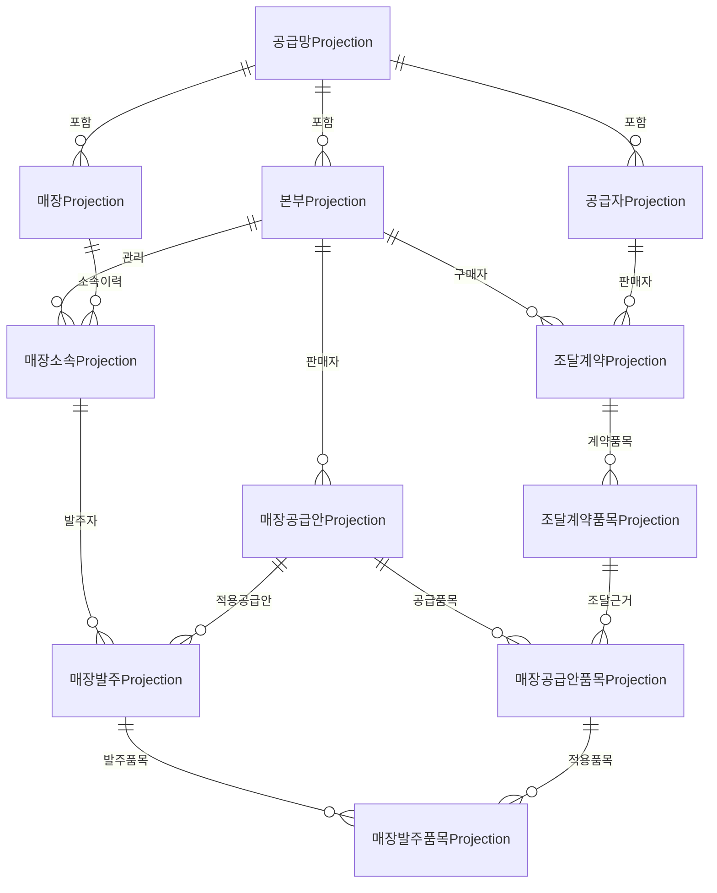

# 프랜차이즈 공급망 Simulation 사본 기반

## 목적과 경계

첫 범위는 외부 가상 프랜차이즈 본부가 공급사와 조달계약을 맺고,
소속 매장이 본부 공급안에서 식자재를 발주하는 합성 Simulation이다.
실제 업체·계약·주문·배차·입고 원장을 만들거나 변경하지 않는다.

권위 상태는 `경영SimulationSessionAggregate`의 공급망 모듈이 소유한다.
이 문서의 관계형 표는 세션 상태에서 다시 만들 수 있는 읽기 전용
Projection이다. Controller나 Repository가 Projection 표를 직접 수정해 업무를
진행해서는 안 된다.

## 첫 상업 흐름

첫 세로 조각은 `HeadquartersResale + HeadquartersFleet`로 고정한다.

1. 본부와 공급사가 조달계약 및 조달계약품목을 확정한다.
2. 본부가 조달품목을 근거로 매장공급안 및 매장공급안품목을 만든다.
3. 소속 매장은 공급안에 대해 발주한다.
4. 발주 수락·자체 배송·도착·검수는 다음 세로 조각에서 별도 상태로 연결한다.

본부–공급사 거래와 본부–매장 거래는 서로 다른 계약·가격·SKU를 가진다.
매장 발주가 공급사의 조달계약을 직접 참조하지 않는다. 공급사 매장 직납은
별도 상업 흐름으로 확장하기 전까지 이 첫 범위에서 사용할 수 없다.

## 관계

모든 기본키와 외래키는 `SessionStableId + NetworkStableId` 범위를 포함한다.
따라서 같은 표본 Stable ID를 다른 세션에서 재사용할 수 있고, 다른 세션·공급망·
본부·공급안의 행을 한 계약이나 발주에 섞을 수 없다. Stable ID 열은
`ascii_bin`으로 비교해 애플리케이션의 대소문자 구분과 DB의 비교 의미를 맞춘다.
본부·매장·공급자 코드, 계약·공급안·발주 번호와 양쪽 SKU처럼 유일성이 있는
업무 키는 `utf8mb4_bin`으로 비교해 `StringComparer.Ordinal` 규칙을 유지한다.

## 수량과 과거 사본

품목은 다음 값을 분리한다.

- 발주 단위: `BOX`
- 포장 내용 수량: `10`
- 포장 내용 단위: `KGM`
- 단위 변환 규칙 판본

발주품목은 상품·SKU·품목명·단위·포장 내용 수량·변환 판본·단가·통화와
요청량을 사본으로 남긴다. 계약이나 공급안이 바뀌어도 과거 발주 의미가
달라지지 않는다. 발주에는 납품지, 상업 흐름, 이행 모형, 판매 본부,
요청 payload SHA-256도 함께 남긴다.

표본의 상품 식별자는 `product:ingredient:chicken`,
`product:ingredient:rice`, `product:ingredient:beef`이며 각각
`BOX/10 KGM`, `BAG/20 KGM`, `BOX/5 KGM`으로 연결한다. 이 값은 메뉴 분석의
정식 canonical ID가 아니라 `product-identity-state:SimulationScopedCandidate`
계보를 가진 Simulation 범위 후보다. root·조달계약품목·공급안품목 Projection은
정렬한 `SourceStableIds` JSON을 보존하므로 이 경계와
`source:menu-ingredient-estimate:r1` 추정 근거를 DB 조회 뒤에도 잃지 않는다.

## 명령과 저장 경계

`/api/simulation/v1/sessions/{sessionStableId}/franchise-supply` 아래에서 초기화,
조달계약, 매장공급안, 매장발주의 Preview와 Confirm을 분리한다. Confirm은
`ClientRequestId`, `ExpectedRevision`, Preview hash를 검증하며 같은 요청 재시도는
기존 결과를 반환하고 같은 ID의 다른 payload와 다른 종류의 세션 명령은 거부한다.
DB의 ASCII·길이·통화·decimal·unique 제약에 맞지 않는 입력과 매장 의미장소와
다른 납품지, 세션 수명을 벗어난 납품 tick은 Preview 단계에서 차단한다.

save/replay는 `simulation-save.v33`에서 최종 공급망 상태와 각 Confirm 전이를
hash에 포함한다. replay는 전이를 다시 적용한 상태와 봉인된 최종 상태를 비교하며
복원 뒤에도 `ClientRequestId` receipt를 유지한다.

Projection writer는 Confirm 성공 뒤에만 동작한다. MySQL에서는 세션+공급망
advisory lock과 root `FOR UPDATE`를 얻고 `SourceSessionRevision` 및
`ProjectionRevision`을 비교한 다음, 해당 범위 11개 표를 한 transaction에서
교체한다. 늦게 도착한 과거 재시도는 no-op이고 같은 revision의 다른 상태는
충돌이다. Session DB가 꺼져 있으면 명시적인 disabled/no-op writer를 사용하며
Aggregate가 계속 권위 상태다.

## 단계

1. **완료 — DB 관계 기반:** 11개 Projection 표, 복합 외래키, 수량·가격 제약,
   migration을 구현했다.
2. **완료 — Session Aggregate와 API:** Preview→Confirm, `ClientRequestId`,
   `ExpectedRevision`, V33 save/replay/hash, Confirm 뒤 Projection 원자 교체를
   구현했다. 실제 MySQL migration, HTTP Preview→Confirm, DB Projection 조회를
   같은 실행에서 확인했다.
3. **다음 — 자체 배송:** 발주 수락과 배송 이행·기사 배차·매장 도착·검수·
   부분 인수를 서로 다른 상태로 연결한다. 도착만으로 인수를 확정하지 않는다.
4. **Unity 표현:** 서버가 만든 비식별 읽기 사본으로 본부·매장·차량·발주 묶음을
   표현한다. Unity 객체와 애니메이션은 업무 완료의 근거가 아니다.
5. **운영 전환 검토:** 실제 당사자·계약·권한·납품지와 법적·운영 요건이 정해진
   뒤에만 Operations 원장과 명시적으로 연결한다.

현재 단계에는 기사·차량·배송·발주 수락·도착·검수·부분 인수 상태와 Unity
Adapter·화면이 없다. InMemory 회귀는 저장 실패 시 기존 행 비누출과 범위 격리를
검증했고, 실제 MySQL의 정상 transaction 교체도 확인했다. 강제로 중간 저장을
실패시킨 MySQL rollback 시험과 두 연결의 동시 역전 경합 시험은 아직 수행하지
않았다.
