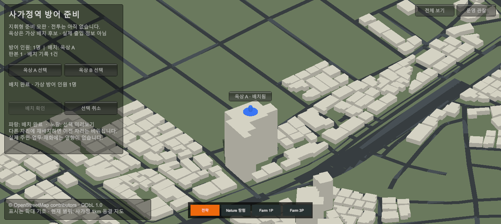

# 사가정역 방어 준비 · 옥상 배치

날짜: 2026-09-12. 관련 방어 구현·화면 증거는 로컬 커밋으로 정리했고 원격 push는 하지 않았다. [기획](../AI/Planning/시스템/PLAN-GAMEPLAY-NEIGHBORHOOD-DEFENSE/README.md) · [구현·검증 상세](../AI/Planning/시스템/PLAN-GAMEPLAY-NEIGHBORHOOD-DEFENSE/implementation.r1.md)

기존 사가정 1km 디오라마에 운영 관찰과 분리된 방어 준비 화면을 추가했다. 후보 두 곳 중 하나를 선택하고 확인하면 가상 인원 한 명의 배치가 기록된다. 다른 자리로 옮기면 이전 자리를 비우며, 운영 화면에 다녀와도 같은 준비 세션의 배치는 유지된다.

실제 Play Mode의 ScreenCapture이며 OnGUI를 포함한다. 이름표가 인원을 가리던 위치를 30px 위로 수정했다. 파란 원과 캡슐은 확대된 가상 기호다. 실제 주민·건물 출입·옥상 안전·사격 가능성을 뜻하지 않는다.

[B 재배치 후 운영 화면을 다녀온 전체 화면](../assets/changes/2026-09-12-station-defense-preparation/whole-b.png)에서도 판본 2·기록 2건과 B 배치가 유지된다.

준비→선택→확인→재배치→운영 복귀→재진입은 View API 직접 호출로 검증했다. 자동 마우스 입력 전달은 상태 전이가 확인되지 않아 실제 클릭 성공은 미검증이다. 전투·몬스터·이동·사격·바리케이드·보급·피해·영속 저장은 아직 없다.

확인 경로: 공식 `SimulationWorldShell`에서 Play → 메뉴 `Ssalddel/통합 월드/운영 관찰/사가정 전체 보기` → 우상단 `역 방어 준비`. 컴포넌트/Play 종료 시 준비 세션은 폐기한다.

Core·Unity 집중 시험과 기존 회귀 문제의 정확한 범위는 구현 기록을 따른다. canonical 시작의 MissingScript·ReplayHashMismatch·외부 서버/Session 진단은 별도로 남아 있어 프로젝트 전체 정상 완료를 선언하지 않는다. 운영 데이터·실GPS·공개 인물 정보는 게임에 연결하지 않았다.
