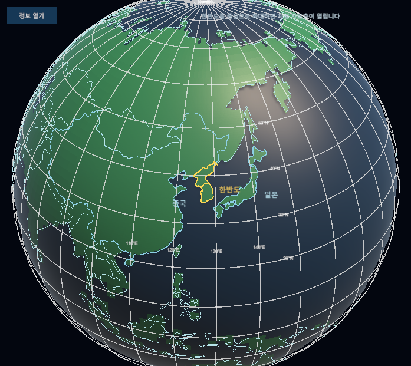
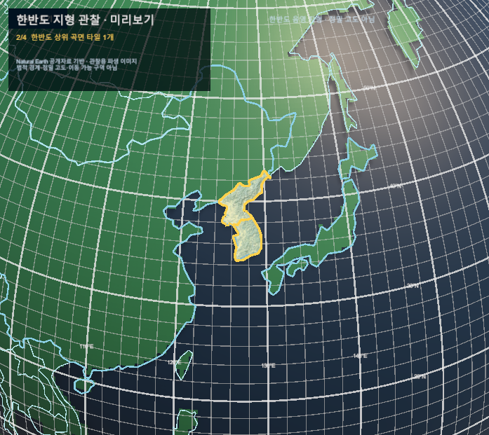

# 지구본 위경도 기준선

- 2026-09-22, 구현 확인용 실제 Game View. 확정 UI 시안·정식 배포가 아니며 commit·push 전이다.
- canonical `SimulationWorldShell`의 기존 구면에 흰색 위도/경도선을 표시한다. 전체 10도, 가까운 화면 2도. 관측값의 해상도나 실제 수온 분포를 뜻하지 않는다.
- 카메라 API로 거리 53→37→53, 간격 10→2→10도와 선 수 259 유지 확인. 실제 마우스·터치 입력 검증은 아니다.
- 새 시험 4/4, 기존 지구본 21/21 및 최종 재컴파일 성공. 기존 월드 종료 오류는 남아 있다.
- [기획·검증 상세](../AI/Planning/시스템/PLAN-SYSTEM-GLOBE-FISHERIES-OBSERVATION/globe-graticule.implementation.r7.md)

## 전체: 10도 격자

## 확대: 2도 보조 격자

