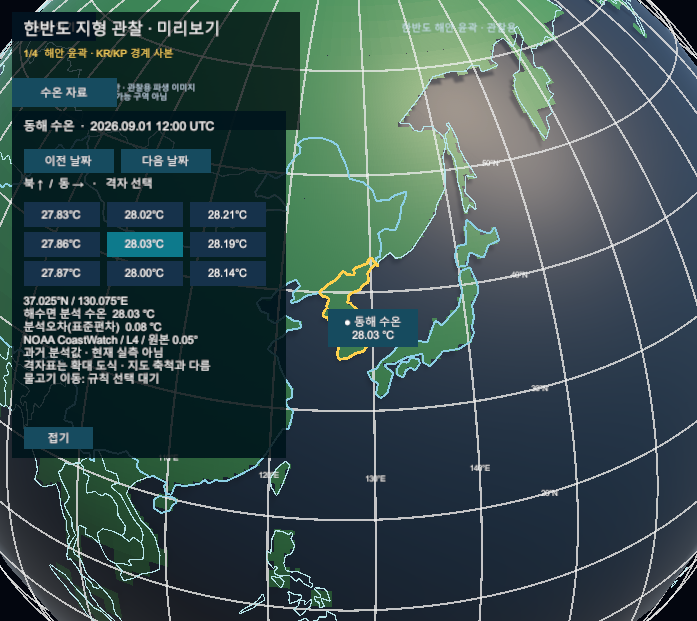
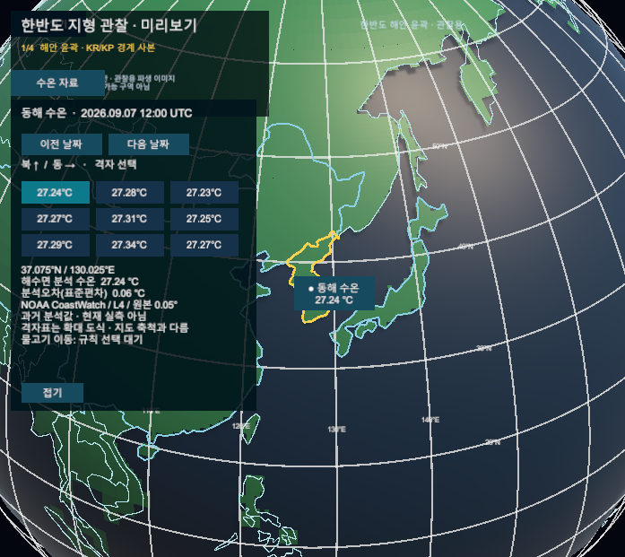

# 지구본 과거 수온 사본

- 2026-09-22 실제 canonical `SimulationWorldShell` Game View. UI 확정 시안·공개 배포가 아닌 Editor 검토용이며 커밋 전이다.
- NOAA L4 2026-09-01~07 분석 수온을 기존 MySQL에서 검증하고 날짜·9개 격자·위경도로 표시했다. 현재 실측이나 실제 어군 이동 정보가 아니다.
- 날짜/격자/접기는 API 직접 호출로 확인했다. 물리 마우스·터치 검증이 아니다. 물고기 이동은 규칙 선택 대기다.
- [기획·검증·재현](../AI/Planning/시스템/PLAN-SYSTEM-GLOBE-FISHERIES-OBSERVATION/temperature-globe-binding.implementation.r8.md)

## 9월 1일 중앙 격자

## 9월 7일 북서 격자

