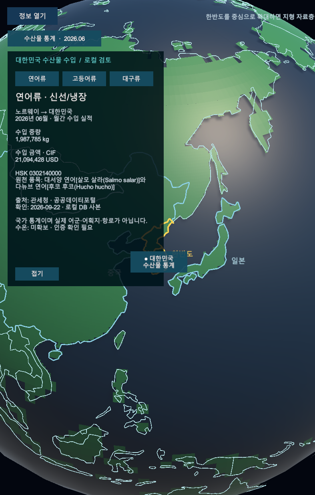

# 지구본 수산물 통계 로컬 미리보기

- 상태: 2026-09-22, 로컬 검토 프로토타입. 확정 UI 시안·정식 배포가 아니다. 커밋·push 없음.
- 대상: canonical `SimulationWorldShell`, Editor Play Mode. 서버 원본/DB 12행을 재검증한 동결 사본 중 수입 지표를 표시한다.
- 화면: 대한민국 표식과 통계 열기 → 연어류·고등어류·대구류 카드 → 접기. 나라/기간/중량/금액/출처를 표시하고 수온은 미확보로 남긴다.
- 증거: 실제 `ScreenCapture.CaptureScreenshot` Game View 프레임. 입력은 버튼 이벤트 직접 호출이며 물리 마우스·터치 검증과 구분한다.
- 검증: CLI build, Unity 재컴파일, EditMode 6/6. 기존 월드 종료 부모 변경 오류 1건은 미해결. 게임/업무 권위 불변을 설계 경계로 유지하며 전체 통합 시험 성공을 주장하지 않는다.
- [기획·재현 방법](../AI/Planning/시스템/PLAN-SYSTEM-GLOBE-FISHERIES-OBSERVATION/globe-trade-preview.implementation.r6.md)

