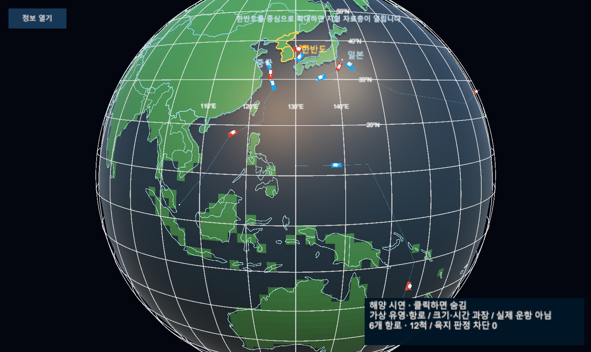
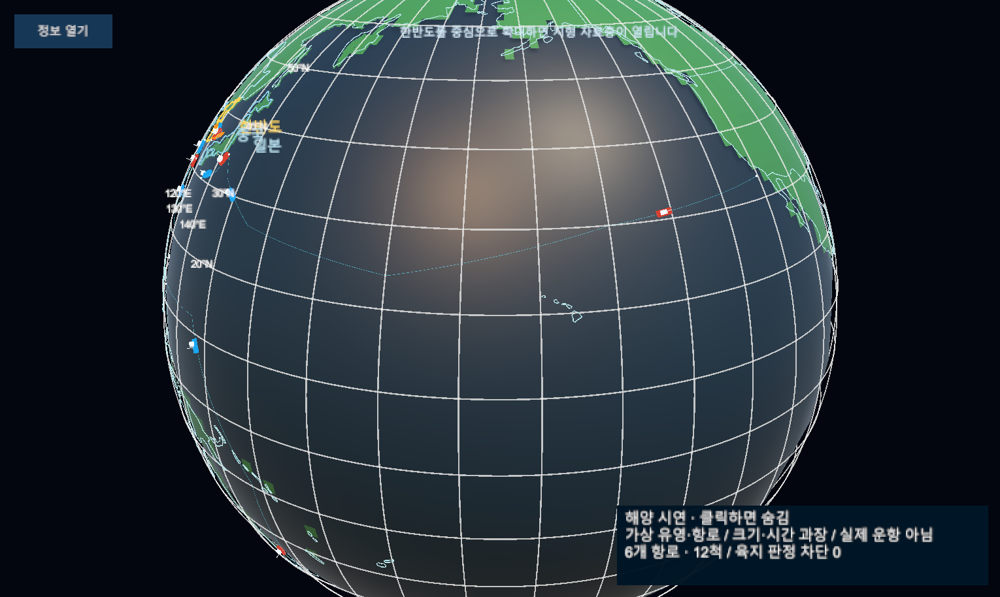

# 세계 해역 선박 시연

로컬 Editor 샘플이며 확정 시안·실제 AIS·운항 항로가 아니다. 기존 지구본에 동해, 중국 연안, 중국·동남아, 일본 주변, 일본·미국 태평양, 서태평양·호주 총 6개 가상 항로와 12척을 배치했다. 객체는 재사용하며 계속 왕복한다.

[기획·검증 r11](../AI/Planning/시스템/PLAN-SYSTEM-GLOBE-FISHERIES-OBSERVATION/international-ships.implementation.r11.md). 실제 SimulationWorldShell Play Mode 자동 시간 진행 중 ScreenCapture 캡처. 카메라 관점은 API로 이동했다. 기존 서버 연결 오류는 별도이며 새 Scene 저장·빌드·커밋은 수행하지 않았다.

## 아시아·호주

## 태평양·미국 방향

