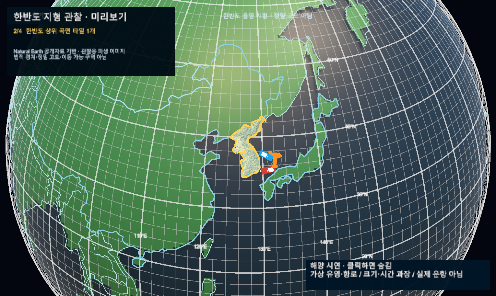

# 지구본 물고기·선박 연출

- 확정 시안이 아닌 로컬 Editor 샘플. 실제 `SimulationWorldShell` Play Mode의 Game View 캡처이며 생성 이미지가 아니다. 커밋 전.
- 물고기 3개는 수면 위아래로 움직이고 꼬리를 흔든다. 선박 2척은 합성 해상 경로를 왕복한다. 크기·속도·위치는 과장 연출이며 실제 어군·항로·항구·운항 가능성을 뜻하지 않는다.
- 자동 시계 진행과 선박 이동을 확인한 뒤 비교 캡처는 연출 시각을 고정했다. [판본·검증 r10](../AI/Planning/시스템/PLAN-SYSTEM-GLOBE-FISHERIES-OBSERVATION/marine-motion.implementation.r10.md).
- 새 Scene/DB/API/운영 상태 변경 없음. 모델 외형·크기 겹침은 후속 마감 대상. 기존 서버 연결 오류로 전체 Console 0은 아니다.

## 부상 — 연출 시각 1.4초

## 잠수 — 연출 시각 4.28초

첫 물고기는 수면 아래에 가려지고, 다른 물고기는 각자 다른 주기로 부상한다.

## 왕복 — 연출 시각 29초

