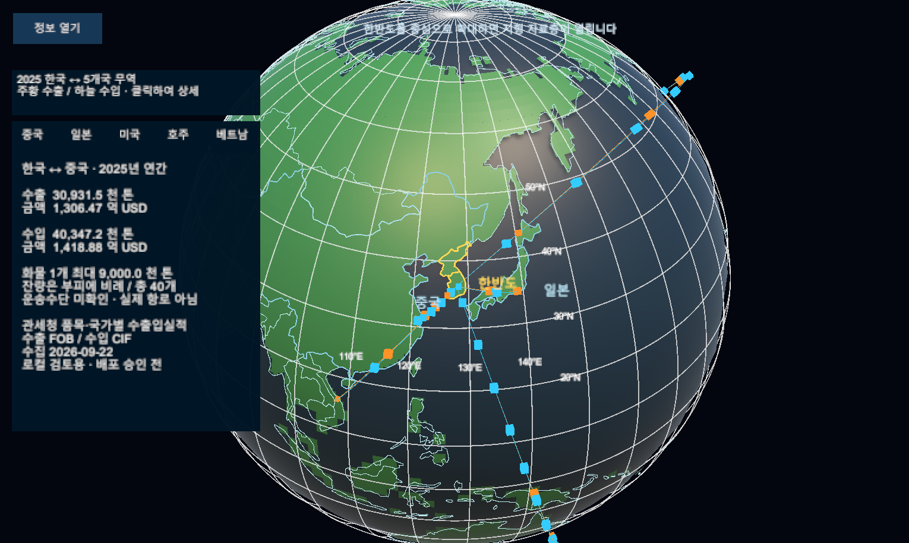
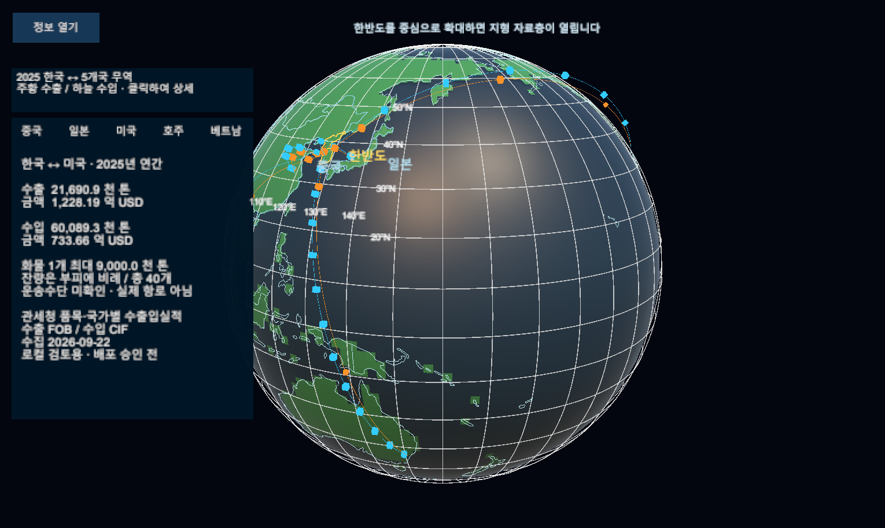

# 2025년 국가 무역 · 실제 자료 기반 지구본 관찰

2026-09-23, 구현용 로컬 샘플. 확정 UI 디자인·실제 항로·선박/항공기 운항 화면이 아니다. 커밋 전.

- [자료·코드·검증 r14](../AI/Planning/시스템/PLAN-SYSTEM-GLOBE-FISHERIES-OBSERVATION/trade-data-binding.implementation.r14.md).
- 실제 canonical `SimulationWorldShell` Play Mode의 Game View를 ScreenCapture로 캡처했다. 새 Scene이나 생성 이미지를 사용하지 않았다.
- 주황 수출, 하늘 수입. 상징 화물 40개는 동일 중량 배율과 잔량 부피를 쓰며 실제 운송수단은 미확인이다. 곡선은 국가 간 통계 관계이고 좌표는 대표 연출점이다.
- 카드의 수집 날짜는 UTC 2026-09-22이며 한국 날짜는 2026-09-23이다. 기준 자료는 2025년 연간이다.
- 국가 선택/접기 동작은 Button.onClick 호출 검증. 실제 마우스 입력과 구분한다. 기존 서버 세션 오류를 고친 화면은 아니다.

## 아시아·중국 상세

## 태평양·미국 상세

