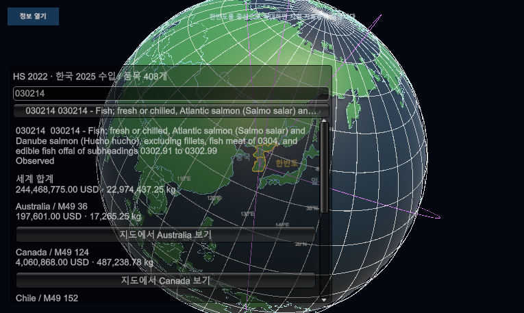
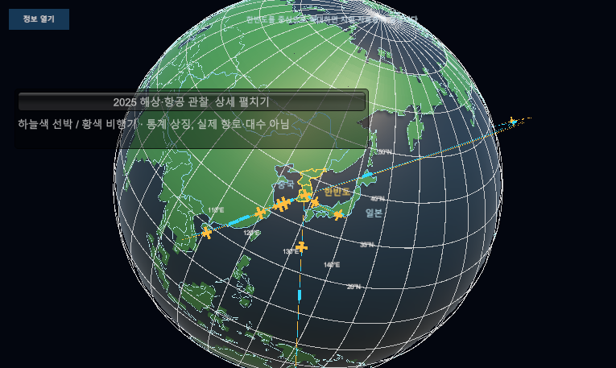
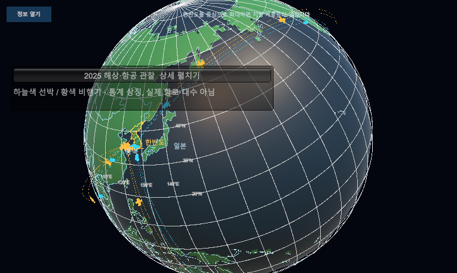

# 2025년 해상·항공 DB 사본 관찰

## HS 중심 조회 추가

[r19](../AI/Planning/시스템/PLAN-SYSTEM-GLOBE-FISHERIES-OBSERVATION/hs-centered-query.implementation.r19.md): HS408개 검색, 대표 품목030214의 수입 통계·상대국 연결선. 실제 Play 캡처이며 최종 UI 시안은 아니다. 수출·HS별 운송수단은 미결속이다.

## 기울기 교정 후

북극 오른쪽 23.5도 표시·자전축 유지. 지구본 시험 22/22, 실제 Play 확인. 공전면의 천문 모사는 아니다.

- [구현과 검증 r17](../AI/Planning/시스템/PLAN-SYSTEM-GLOBE-FISHERIES-OBSERVATION/transport-preview.implementation.r17.md).
- 실제 SimulationWorldShell Play Mode, 선박 10개·비행기 10개. 흐름별 고정 1개로 실제 대수나 물동량 비례가 아니다. 국가 간 곡선은 실제 항로가 아니다.
- 아래는 ScreenCapture로 확인한 실제 Game View다. Pipeline screenshot의 `game.png`는 주 카메라를 선택해 다른 배경을 촬영했으므로 최종 화면 증거로 사용하지 않는다.
- 시험 8/8, 이동·반복 로드·객체 수 불변 확인. 물리 클릭·정식 빌드 미검증. 기존 서버 오류는 별도이며 전체 Console 0 아님. 커밋 전.

