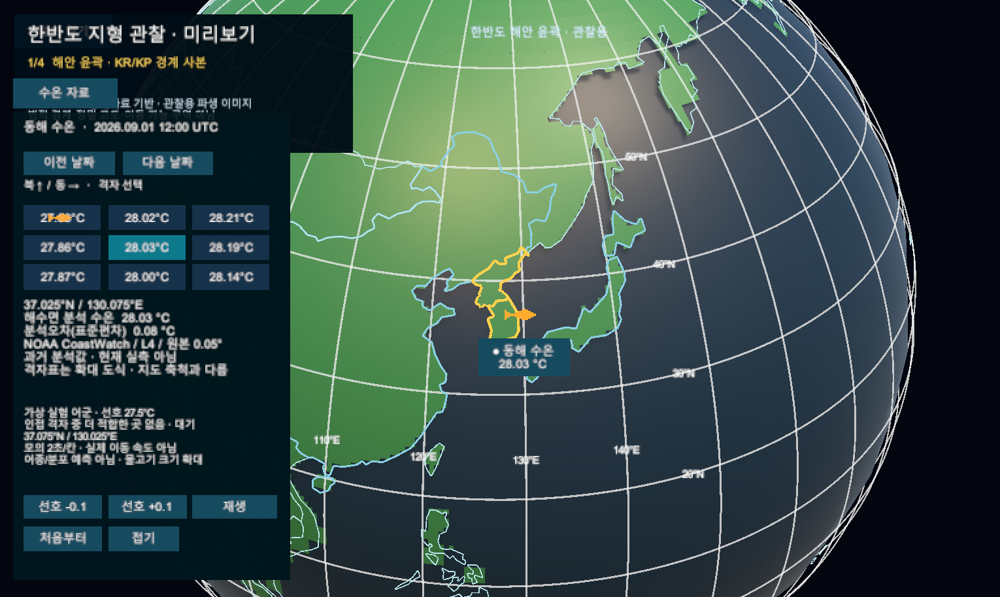

# 수온 반응 가상 실험 어군

- 로컬 Editor 실험·실제 Game View. 확정 시안/실제 어종/어군 위치 예측/공개 배포 아님. 커밋 전.
- 동일 NOAA 과거 수온 사본에서 사용자가 지정한 선호값과의 차이가 더 작은 상하좌우 격자로 이동한다. 2초/칸은 실제 속도가 아니다. 지구본 물고기는 위치를 나타내는 확대 기호이며 오른쪽/왼쪽 이동의 판독은 카드의 확대 격자로 보조한다.
- 실제 Play Mode 자동 시간 진행, 선호 버튼 onClick 호출·정지·날짜 변경·초기화 확인. 물리 입력·빌드 검증은 아니다. [기획·검증 r9](../AI/Planning/시스템/PLAN-SYSTEM-GLOBE-FISHERIES-OBSERVATION/virtual-temperature-school.implementation.r9.md).

## 선호 27.5°C: 중앙에서 북서쪽으로

## 선호 28.2°C: 초기화 후 북동쪽으로

