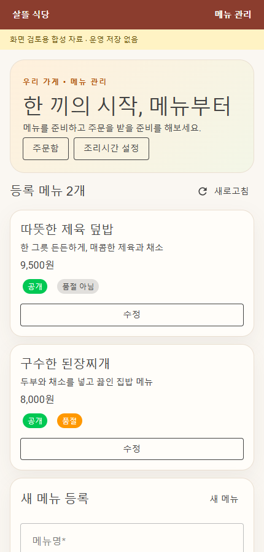
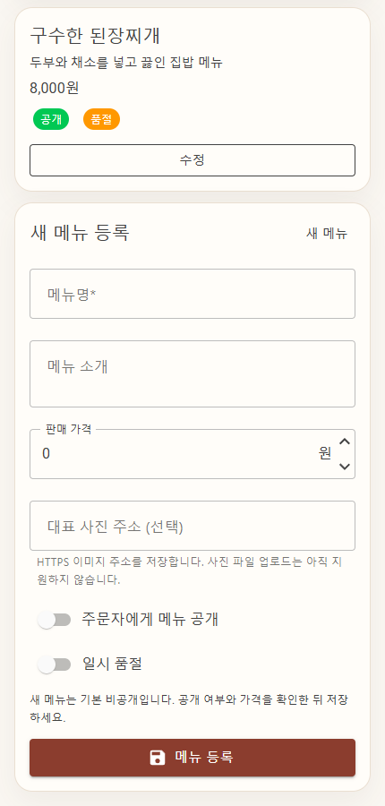

# 음식점 메뉴 화면 캡처 (2026-09-27)

확정 디자인이 아닌 검토용 샘플 화면이다. 실제 제품 Menus.razor를 링크한 로컬 미리보기를 Headless Edge 430×900으로 렌더했다. 합성 메뉴와 메모리 전용 Client이며 Android 실기기·운영 API·DB 저장 검증은 아니다.

## 메뉴 목록

## 메뉴 등록

같은 화면을 아래로 스크롤한 모습이다.

미리보기의 정적 자산이 HTTP200이면서 빈 응답이던 문제를 UseStaticWebAssets/UseStaticFiles 설정으로 보완했다. MudBlazor CSS 규칙 3,947개 로드, 가로 넘침 없음, 페이지 JavaScript 예외 0을 확인했다. 네이티브 브라우저 제어 연결 실패와 구분되는 로컬 headless 렌더 검증이다. 이번에는 저장 버튼 실행이나 Android 재빌드는 수행하지 않았다. commit·push·배포 없음.
