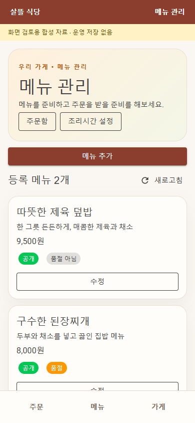
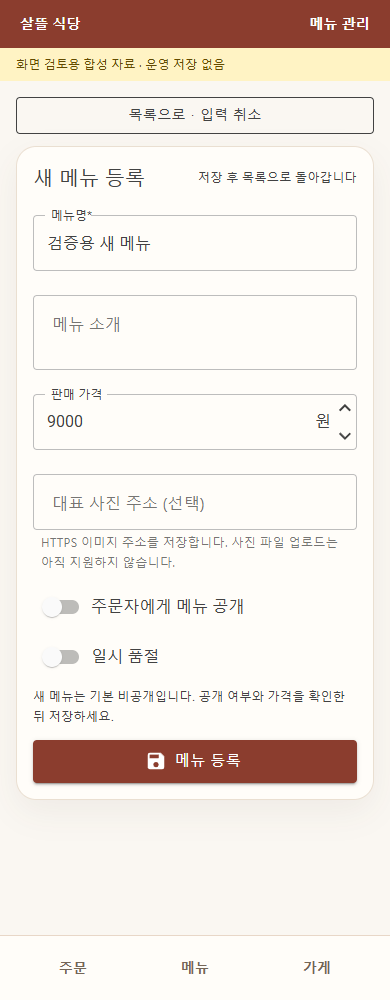

# 음식점 기본 탐색 — 검토용 샘플

제품 Razor를 링크한 합성 로컬 미리보기의 Headless Edge 캡처다. Android 실기기나 운영 데이터 화면이 아니다. 메뉴 목록→입력→등록/수정→목록 복귀와 입력 중 내부 이동 차단을 실제 버튼으로 확인했다. 미리보기의 주문/가게 목적 화면은 호스팅하지 않으며 제품 전체 navigation 검증은 아니다.

정산 연결은 미완료이며 실제 돈을 움직이지 않았다. [구현·검증 범위](../AI/Planning/시스템/PLAN-SYSTEM-REGIONAL-OPERATIONS-E2E-SCAFFOLD/restaurant-navigation.r4.md).
