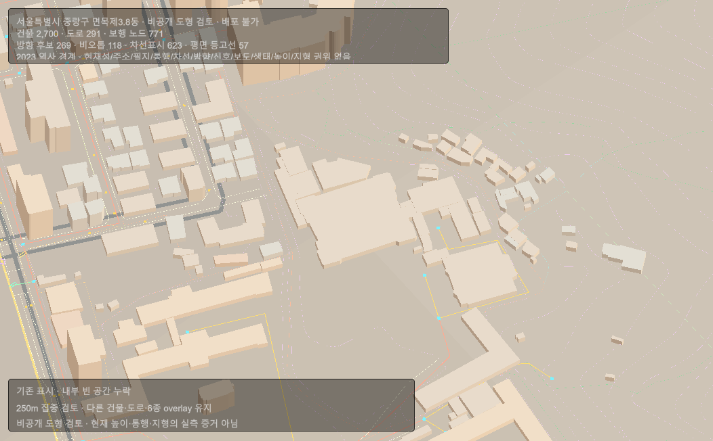
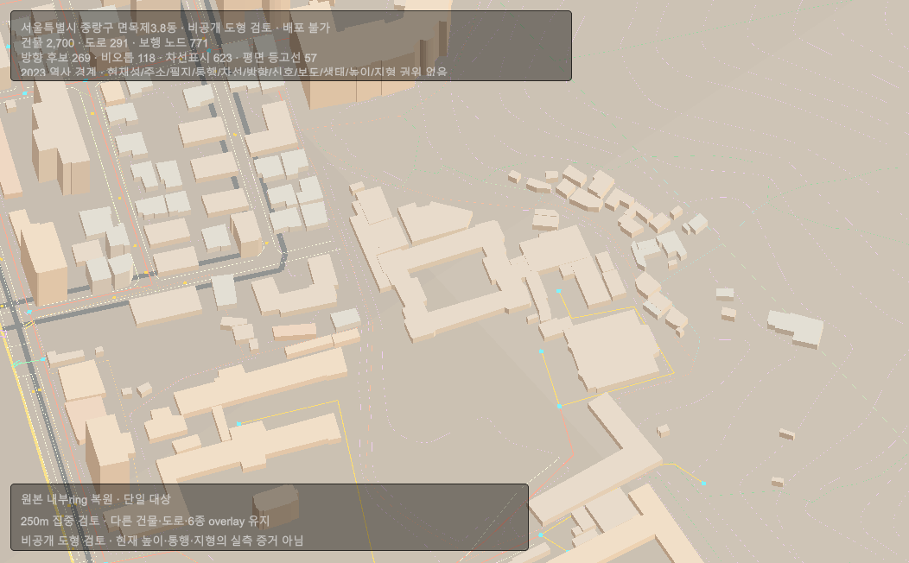
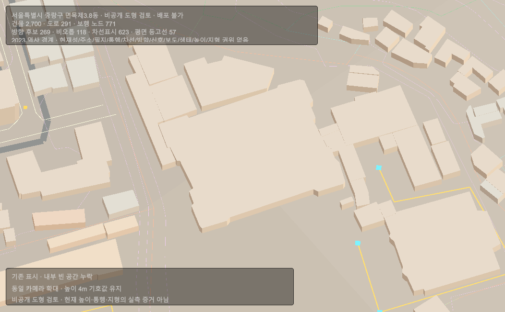
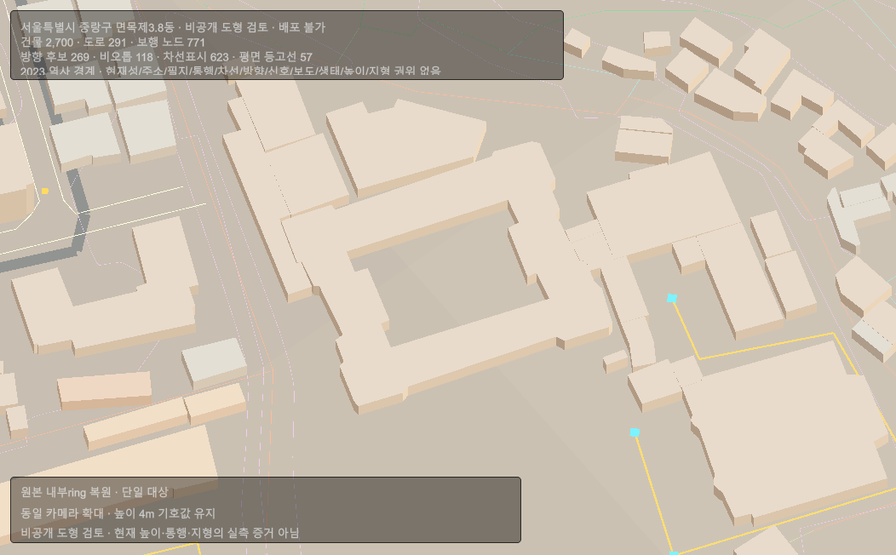

# 행정동 디오라마 원본 내부 경계 보완

사용자의 최신 우선순위에 따라 기존 행정동 디오라마의 형상 결손을 먼저 보완한다. [승인 범위 r40](../AI/Planning/시스템/PLAN-SYSTEM-ADMIN-DONG-DIORAMA/focused-building-ring-refinement.implementation.r40.md)의 첫 대상은 면목제3·8동 한 건물의 원본 내부 ring 누락이다. 기존 30개 동 자료와 완성된 음식 생활 표본은 보존한다.

## 찾은 결손과 이번 보완

| 항목 | 현재 자료·결손 | 이번 처리 |
| --- | --- | --- |
| 건물 내부 경계 | 원본은 폐합 외곽33점·내부13점인데 기존 LargestExteriorOnly 표시에는 외곽32점만 전달 | 원본 ring으로 내부 영역을 제외한 지붕44삼각형과 내벽12개 선분을 표시 |
| 건물 높이 | 원천 높이 부재로 생성기가 4m를 넣은 건물35,891개가 기존 consumer에서 `SourceHeight`로 오분류됨. 첫 대상도 해당 | 수치 높이·기존 팔레트는 유지하고 정확한 출처 표식의4m만 `SymbolicFallback4m`으로 정정. 다른 높이/종류의 첫 대상 사본은 거부 |
| 도로·보도·출입구 | 기존 중심선·차선·후보 점은 있으나 동일 세대 실폭/보도/출입구 결속은 부족 | 실제 수치·출입구 위치를 만들어 채우지 않음 |
| 지형 높이 | 수평 등고선과 공식 필드 해석은 있지만 수직 메타데이터와 consumer 결손 | 기존 평면 흔적과 지형 적용 차단 유지 |

단일 대상은 `region:kr:hjd:1126057500 / vworld:al-d010:0000208470354536004400000000`이다. 외곽 면적2465.611649㎡에서 내부797.291545㎡를 제외하면 지붕1668.320104㎡다. 이는 원본 도형의 면적이며 실제 대지·면적대장·안뜰·사용 가능 면적의 확정이 아니다.

## 출처와 불변 검토 세대

- 원본: 동결 `AL_D010:Seoul:20260809`, EPSG:5186, ZIP135,675,376 bytes, SHA-256 `674C5A9583996DD6B8946525EDAD8197BE79A634F1DB00D39E2B3133D0D2A755`.
- 원본 695,761행을 읽고 대상 순번192028·동일 식별자1회·외곽 정확 동등을 확인했다.
- 공통 ENU 원점37.580912/127.088502, 영점 고도, offset0, 1u=1m. 새 내부/지붕 입력은1mm 정수이며 수치 정밀도가 원본의 측량 정확도를 뜻하지 않는다.
- 기존 r7 세대 `13A3B1C6D7854D1A4A03BFDFDD7766966D9B4B447F3E7FB3C662555707C7B753`, 기존 번들 SHA `E1DBB3B99347B4139DE157274C84C881E9821A49BF064BB579813F347925E28A`를 읽기만 한다.
- 새 별도 입력 세대 `52F93961D7628D5CF31FAF75F2286FD7CEC8A55D79C4CC77D67FA4E059F8BA86`, `review.json` 파일 SHA `39B0DE341154FF7A0A1D847C3D8E54F6E9853EA22646720A148B3B0A1F9AA1D6`.
- 로컬 경로: `artifacts/local/validation/admin-dong-focused-building-ring-review/r1/input/generations/52f93961d7628d5cf31faf75f2286fd7cec8a55d79c4cc77d67fa4e059f8ba86/`.

원본 권리 상태는 `RightsConflictUnresolved`다. 기존 허용된 로컬 비공개 도형 검토와 공개·배포·current·DB·Runtime·Traversal·Gameplay·Collider·출입구/안뜰 의미 권한을 분리하며, 후자는 모두 false다. 원본 기준일과 현재 현장의 일치도도 새로 확정하지 않는다.

## 구현과 자료 검증

새 생성기 `eng/neighborhood/administrative_dong_focused_building_ring_review_r1.py`는 단일 대상만 재추출·삼각분할한다. 기존 전지역 미완성 내부 ring 초안은 수정하거나 실행하지 않았다. `build → 원본 재추출 verify → build 재실행`에서 지붕 union 누락·중복·내부 겹침 모두0㎟, 두 번째 build 변경0을 확인했다. 합성 실패·정합 시험12/12와 좁은 Fast `20261002-185305`가 통과했다. 이 Fast는 dotnet build/test를 생략하는 경로 검사이며 자료 시험은 별도다.

Unity 신규 읽기 전용 계약 `행정동건물내부Ring검토Models.cs`는 대상/출처/좌표계/권위·외곽·기호 높이와 삼각분할을 검증하고 배열을 복사한다. 기존 `행정동디오라마검토MeshBuilder.Build`와 `View.BuildFromSnapshot`의 명시적 선택 인자로 한 건물만 바꾼다. 입력이 없으면 기존 출력 경로를 유지한다. View의 지붕/내벽 ray 선택과 윤곽도 새 빈 영역을 보존한다. 원본 Snapshot과 Core를 수정하지 않는다.

실제 입력 결속 과정에서 높이 출처 오류를 발견했다. r7의61,897개 중26,006개는 원천 양수 높이가 있고35,891개는 생성기가 넣은4m다. 후자는 `EvidenceKindCode`의 정확한 `:SymbolicHeightFallback` 접미사로 구별되는데, 기존 consumer는 양수라는 이유만으로 실제 높이로 분류했다. 이 접미사와4m가 함께 있을 때만 기호 높이로 정정하며 누락/다른 수치는 거부한다.28,415개는 층수도 있지만 이번에는 층수×3m로 소급 변경하지 않는다. 실제 원천 높이4m는 `SourceHeight`를 유지한다. 기존4m와 팔레트는 보존하므로 자료에 없는 높이를 새로 만들지 않는다.

집계는 고정 r7의30번들 SHA와 고유 건물 식별자를 대조한 독립 감사이며, 원천 생성 감사 `artifacts/local/public-data/admin-dong-diorama-northeast-seoul-20260914-r2/audit.json`의 `buildings.assigned`/`buildings.symbolicHeightFallback`과 일치한다. 해당 감사 파일 SHA는 `57876C41A78189EB4D416DA9E11D022207573BE2BAFA20A8D3C846A9FA1A8AF6`다. 이는 높이 결측 현황이며35,891개 실제 높이를 새로 확보하거나30개 동 화면을 이번에 다시 검토했다는 뜻이 아니다.

실제 면목제3·8동 입력2,700건물·291도로·4batch의 확장 삼각형/RGBA 순서 대조에서 대상 전후57,651개/23,881개 삼각형이 완전히 동일했다. 변경 범위는 기존 지붕30삼각형을 내부 벽24+지붕44삼각형으로 바꾼 부분뿐이다. 기존 외벽·비대상 형상/색은 동일하고 정점158,412→158,472, 인덱스244,686→244,800이며 batch4개는 유지한다. 신규 Unity 집중 시험23/23과 기존 행정동 회귀44/44가 통과했다. 층수 유무와 관계없이 정확fallback의4m 보존, 잘못된fallback 수치 거부, 실제 원천 높이4m 구별·self-touch·비인접 선분 중첩·1mm 작은 교차 거부를 포함한다.

독립 소스 검토에서 내부 경계가 비인접 선분에 닿는 잘못된 합성 도형을 Factory가 받아들이는 빈틈을 재현했다. 비인접 선분의 접촉·겹침을 거부하고, 작은 교차도 각 cross 부호를 직접 대조하도록 수정했다. 같은 반례의 수정 후 진단은 `FocusedBuildingRingRingSelfIntersection`, 실제 고정 원본은 계속 `FocusedBuildingRingPrivateReviewReady`다. 원본 재추출 verify에서도 변경0·면적/중복/내부 침범0을 다시 확인했다. 최소 계약 stub을 사용한 독립 감사와 실제 Unity 시험은 별도로 기록한다.

실제 Game View 검토에서 기존 지구본 Renderer가 같은 표시 Layer30을 공유하는 문제가 발견돼, 기존 Renderer의 사용 여부를 확인한 별도Layer28에 새 임시 비교 host만 격리했다. 기존 Controller를 비활성화하면 선택/미리보기/커서 상태가 바뀔 수 있으므로 비교 도구의 Controller 차단을 제거하고 Camera/Canvas만 최소 표시 격리한다. 기존 사가정 GUI는 선택 상태를 바꾸지 않는 `ExternalGeometryReviewUiHidden`의 원래값을 보관하고 되돌린다. 종료 복원과 Console 결과는 마지막 실행 증거로 확인한다.

## 실제 Unity 전후 화면

Unity6000.5.6f1의 canonical `SimulationWorldShell`에서 실제 Play Mode/Game View를4장 캡처했다. 같은 쌍은 카메라 위치·각도·배율·mask·배경이 동일하며 중앙 대상의 내부 빈 공간과 벽이 달라진다. 기존2,700건물·291도로·6종 overlay를 유지했다. 원본·공유 입력은 변경하지 않았고 물리 마우스/키보드 수동 조작 시험은 아니다.

| 250m 집중 보기 — 기존 | 250m 집중 보기 — 보완 |
| --- | --- |
|  |  |

| 동일 카메라 확대 — 기존 | 동일 카메라 확대 — 보완 |
| --- | --- |
|  |  |

직접 확인은 Unity 메뉴 `Ssalddel → 디오라마 → 면목제3·8동 내부 경계 보완`에서 canonical Scene을 연 뒤 Play Mode의 `비공개 비교 열기`를 사용한다. 준비 후 `보완`/`확대` 버튼으로 같은 자료의 전후를 볼 수 있다. 변경된 Scene은 자동 저장하지 않으며 자료 파일이 다른 판본이거나 전용 표시Layer가 사용 중이면 거부한다.

## 종료 복원과 실행 한계

- 대상 선택의 Renderer5개는 모두Layer28이고 새 카메라에 포함됐다. 빈 영역의 수직 ray는 기존 표시에서 대상 건물에 닿지만 보완 뒤에는 닿지 않는다.
- 종료 때 Camera/Canvas18개의 enabled와 기존 GUI 숨김 값을 복원했다. 표시/GUI/Controller enabled/root active 불일치는 모두0, 비교 host는 제거됐으며 SceneDirty=false다. canonical Scene SHA는 전후 `C31167703C4A7683DA374E237CBA3C9584A5F1DE4B5FB5746939A3632635AC65`로 같다.
- r7의30번들·index/completion·기존 사가정 입력/게임 결속·Scene을 포함한35개 파일 해시가 유지됐다. 환경변수5개도 기존 null을 유지했고 Editor는 깨끗한 canonical EditMode로 반환했다.
- Console에는 기존 Scene/server 초기화 오류9건과 종료 시 기존 OSLifecycle SetParent 오류2건이 남았다. 원본 스택을 따로 보존했으며 신규 ring/helper 스택 오류는0이다. 전체 운영 Scene 정상·실운영 통합 완료로 승격하지 않는다.
- 마지막 좁은 Fast `20261002-194025`와 Task `20261002-194027`은12경로 diff 검사에 통과했다. 두 검사는 build/dotnet test를 생략했고 자료12개/Unity67개 시험과 실제 화면은 별도 실행 증거다. 새 문서 링크8개, 갤러리 사본4개 해시, 원본 검토 JSON/Scene 불변도 확인했다.

상세 실행 기록은 Unity 저장소 `artifacts/administrative-dong-building-inner-ring-r1/verification-r4.json`과 `verification-summary-r4.json`, 공유 저장소 `artifacts/local/validation/admin-dong-focused-building-ring-review/r1/root-final-verification.json`에 있다. 자료의12개 시험·반례 감사·실제 원본 검증은 서로 다른 증거로 보존한다.

## 다음 보완과 규칙 대조

첫 구역의 전후 판독이 끝나면 인접 건물·골목에서 실제 원본에 있는데 화면에 빠진 외곽/multipart, 높이 근거, 실도로 폭·보도·출입구를 순서대로 대조한다. 기존 촬영 자료의 미검토를 촬영 누락으로 단정하지 않으며 추가 촬영이 필요할 때 위치·방향·항목으로 안내한다.

독립 규칙/Graph 감사에서 단일 대상 표시 보완은 기존 출처·시간·좌표계·권위 분리와 결손 명시를 지지하며 새 Graph 의미·WI·Goal을 요구하지 않았다. 규칙 Validate는 기존12 Candidate / Provisional0 / Accepted0로 통과했다. 같은 근거를 다른 동의 공통 형상 규칙으로 적용하거나 E를 승격하지 않는다. 새 디오라마 규칙 후보 없음. 원본·DB·Scene 저장·commit/push·공개 배포는 이번 범위에서 변경하지 않는다.
