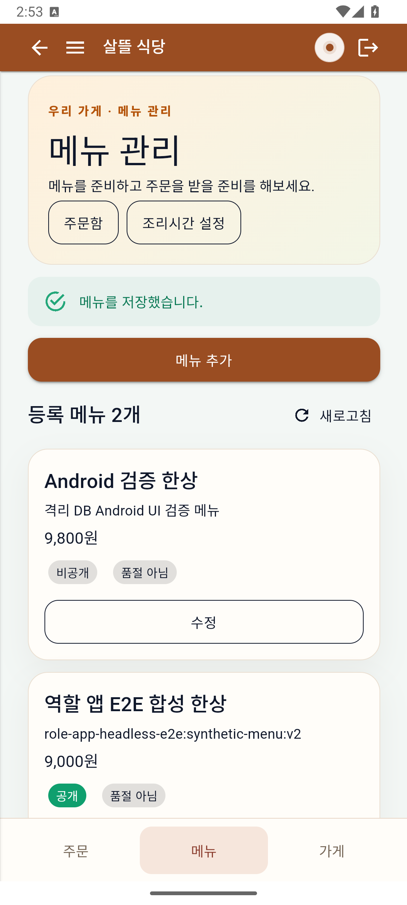
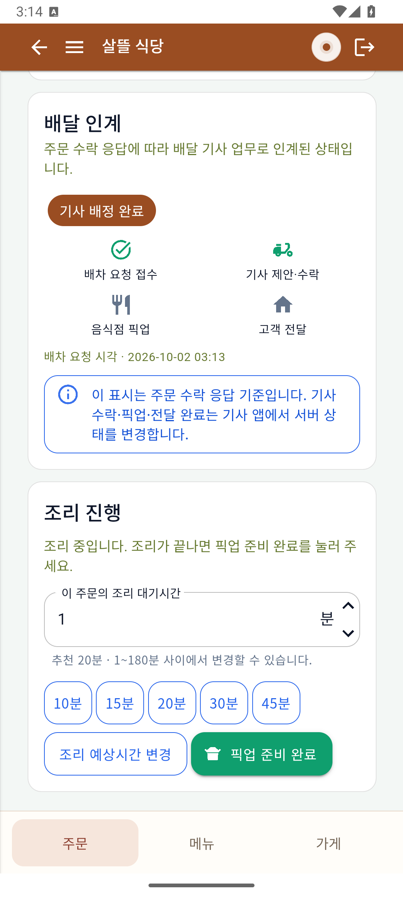
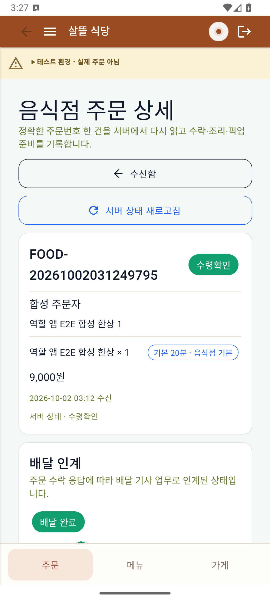
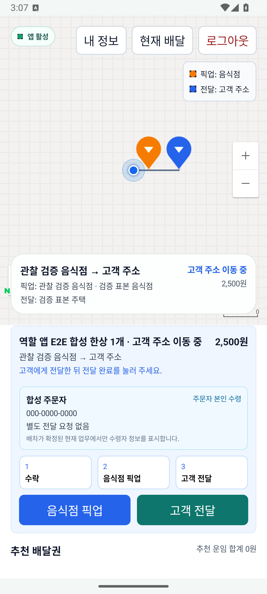
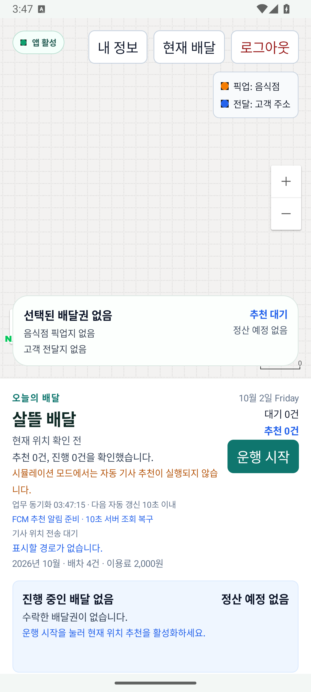

# 기존 음식점·기사 앱의 첫 모바일 검증

| 커밋 | 변경 축 | 화면 변경 | 검증 수준 |
| --- | --- | --- | --- |
| 커밋 전 | 기존 앱 화면·역할 목록·생명주기 추적 | 주문 확인 안내와 기사 빈 상태 정정 | API36 Android 에뮬레이터의 실제 APK 화면·격리 서버/DB 재조회. 물리 휴대폰·운영 배포 아님 |

기준은 [모바일 검증·보완 r1](../ProjectOverview/page-docs/mobile-polish-r1.md)이다. 새 제품 앱을 만들지 않고 기존 음식점 로그인·메뉴·수신함·상세와 기사 네이티브 메인을 확인했다. 전체 소스 목록의 검토 상태와 Android 실행 범위는 [역할별 페이지 목록](../ProjectOverview/page-docs/role-pages.html)에서 구별한다.

## 음식점 메뉴 저장

Android 화면에서 격리 검증용 비공개 메뉴 9,800원을 저장하고 서버 목록을 다시 읽었다. 실사용 메뉴·상호·개인정보를 포함하지 않는다.

## 배정 후 조리와 종료 재조회

같은 합성 주문 `FOOD-20261002031249795`에서 기사 배정 뒤 조리 시작·픽업 준비를 조작했다. 주문 확인/배차 요청 단계의 전표 출력 창 실패 안내는 조리 시작 성공으로 잘못 표시하지 않도록 바꿨다. 아래 첫 PNG는 조리 중 상태, 다음은 전달 뒤 주문자 Client로 수령 확인하고 음식점 앱에서 다시 읽은 종료 상태다.

## 기사 픽업과 빈 상태

기존 기사 앱에서 제안 총액 2,500원을 표시하고 음식점 픽업→고객 전달을 실행했다. 아래 진행 PNG는 앞선 별도 합성 주문의 픽업 뒤 상태다. 최종 음식점 PNG의 주문과 같은 캡처로 취급하지 않는다. 지도 핀·위치·경로는 보이지만 바탕 타일은 빈 격자여서 지도 시각 검증은 미완료다. 연락처 `000-0000-0000`은 합성 fixture다.

최종 APK에서 진행 배달이 없으면 수행 단계·버튼·수령자 정보 패널을 숨긴다. 로그인 복원 뒤 안내는 실제 추천/진행 조회 결과로 갱신한다. 최종 빈 상태 PNG를 아래에 기록한다.

빌드·시험·HTTP·Unity 어셈블리 관찰·Android UI·개인 Debug APK를 각각 기록했다. Unity Editor/Play Mode·물리 휴대폰·실결제·은행 지급·commit·push는 검증 범위에 포함하지 않는다.
