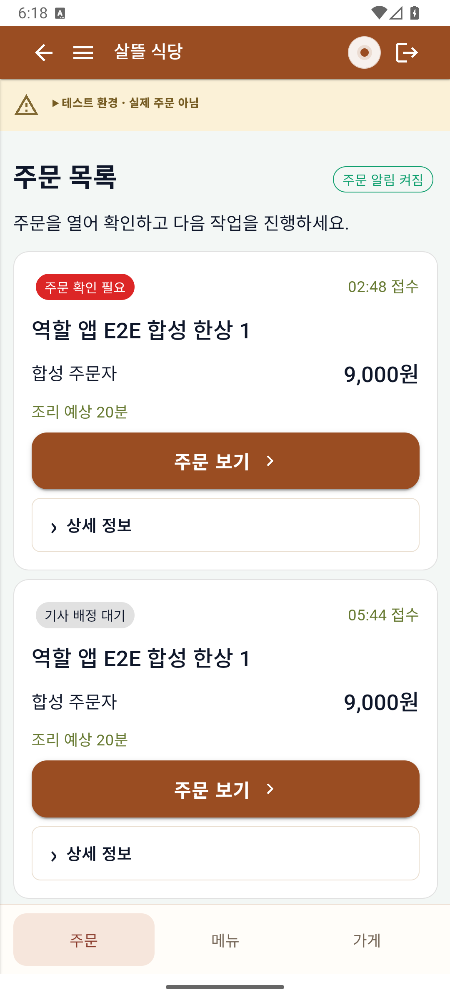
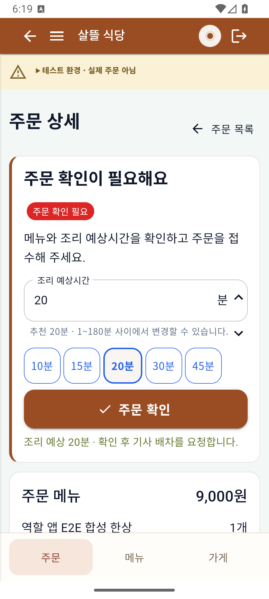
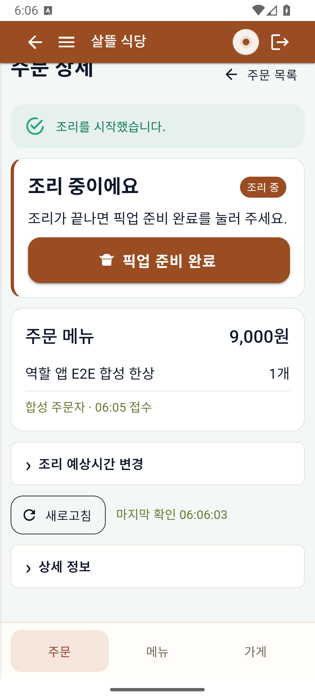
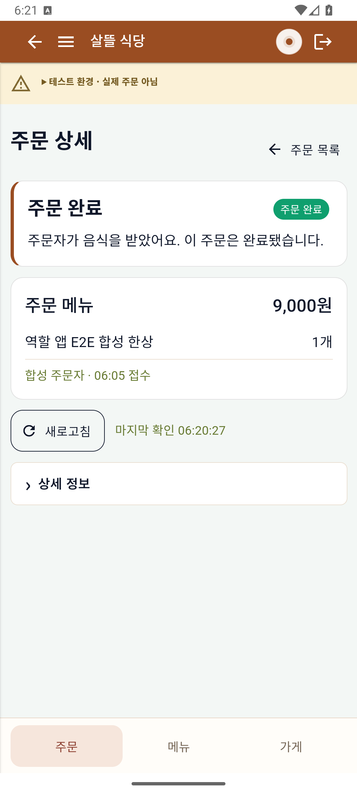
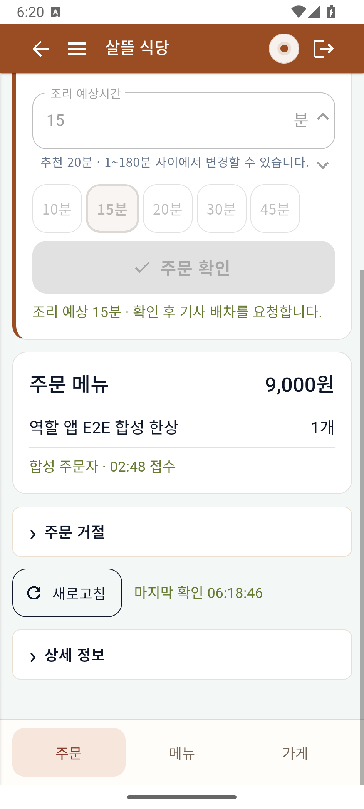

# 음식점 주문 목록·상세의 다음 행동 강조

| 커밋 | 변경 축 | 화면 변경 | 검증 수준 |
| --- | --- | --- | --- |
| 커밋 전 | 기존 음식점2페이지·CSS·표시 계약 | 현재 상태·강조 버튼·보조 영역 접기 | 실제 Android 에뮬레이터 APK·같은 합성 주문의 서버 저장/재조회. 물리 휴대폰 미검증 |

[구현 r65](../AI/Planning/시스템/PLAN-SYSTEM-FRANCHISE-OPERATIONS/restaurant-order-usability.implementation.r65.md), [검증 범위·판본 기록](../ProjectOverview/page-docs/restaurant-order-usability-r1.md)을 기준으로 기존 앱을 보완했다.

## 최종 APK의 주문 목록과 확인 화면

상태·메뉴·금액·접수시각과 `주문 보기`를 먼저 표시한다. 상세는 현재 단계와 강조 버튼 하나를 보여주고 주문번호/배차 설명·거절을 접었다. 아래 확인 필요 화면은 기존 별도 합성 주문의 조회이며 수락·거절하지 않았다.

## 같은 주문의 조리와 완료 재조회

`FOOD-20261002060514840`의 기사 배정 뒤 조리 시작을 실제 Android에서 눌렀다. 첫 PNG는 첫 APK의 조리 중 상태다. 이후 기사·주문자 기존 Client로 픽업/전달/수령을 확인하고, 두 번째 PNG는 최종 APK에서 같은 주문을 다시 읽은 완료 상태다. 전체 생명주기를 최종 APK로 반복했다고 표시하지 않는다.

## 읽기 실패와 처리 차단

최종 APK에서 연결 실패 시 마지막 주문 내용을 유지하고 강조 버튼을 막는다. 연결 복원·재조회 후 안내가 사라지고 버튼이 다시 활성화됐다.

360px·412px 가로 넘침 없음, 강조52px·보조48px를 확인했다. 집중27/27 통과. 전체 시험은 기존7실패가 유지돼5,515/5,522 통과다. 인쇄·실기기·실결제·실지급·공개 Release는 미완료다.
