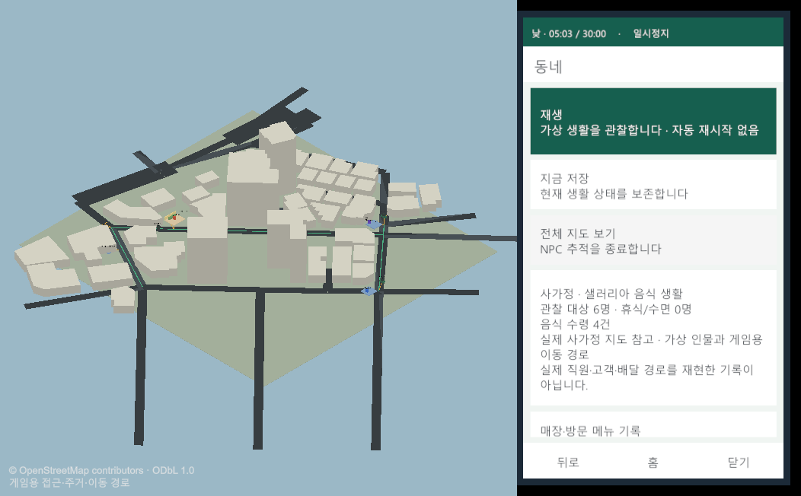

# 사가정 샐러리아 음식 생활 관찰

사용자가 방문한 매장을 출발점으로 기존 가상 음식 배달 생활을 실제 사가정 참고 지도 안에 표시했다. 음식점 담당 1명·기사 3명·주민 2명이 기존 Simulation Core의 주문·조리·픽업·전달·수령·복귀 상태에 따라 움직인다. 전체 조망, 선택한 NPC 추적, 일시정지·저장, 과거 방문 설명을 제공하는 로컬 Unity 관찰 표본이다.

- [승인 범위 r6](../AI/Planning/시스템/PLAN-SYSTEM-OBSERVER-WORLD/sagajeong-food-life.implementation.r6.md) · [Graph 검토 반환](../AI/Planning/시스템/PLAN-SYSTEM-OBSERVER-WORLD/graph-map-review.r6.md)
- 기존 `SimulationWorldShell`과 1800Tick/30분 생애를 재사용한다. 처음에는 정지 상태이며 사용자가 재생해야 진행한다. 미접속 시간 따라잡기와 완료 전 무제한 재시작은 제공하지 않는다.
- 저장 슬롯은 `sagajeong-food-life-r1-primary`다. 기존 합성 동네 프로필과 슬롯, 운영 API·DB·Core 규칙은 보존한다.

## 시작과 관찰

Unity 프로젝트 `C:/Users/user/ssalddel`에서 메뉴 **Ssalddel → 관찰 → 사가정 샐러리아 음식 생활**을 선택한다. 기존 공식 Scene을 열고 새 프로필로 Play Mode에 진입한다. 다른 Scene에 미저장 변경이 있으면 시작을 보류한다. 메뉴 도구는 Scene을 저장하지 않고 Play 종료 시 이전 환경변수를 복원한다.

오른쪽 휴대폰의 **동네 → 재생**으로 시작한다. **전체 조망**으로 주변을 보고, **NPC**에서 대상을 읽은 뒤 **이 NPC 따라가기**를 눌러 카메라를 전환한다. NPC 카드를 읽는 것만으로 추적하거나 세계 상태를 바꾸지 않는다. **방문 기록**에서 상호·주소·역사 메뉴를 확인하고 **일시정지/저장**으로 현재 상태를 보존한다. 새 모드의 정책·운영지도 메뉴와 숨겨진 정책 명령은 거부한다.

## 실제 자료와 가상 생활의 관계

| 자료 | 이번 사용과 한계 |
| --- | --- |
| 2026.09.28 방문1 | 샐러리아 샌드위치&샐러드&포케 사가정점, 서울 중랑구 용마산로51길 50 1층, 방문1회·동시 픽업2건의 역사 설명 |
| 역사 메뉴 | 훈제오리 포케 / 비뷰 음료&토핑 / 제로 힐링티 / 오리지널 닭가슴살 샌드위치. 현재 NPC의 감자 스튜 주문과 구분 |
| `sagajeong-reference.r3` | 기존 OpenStreetMap 참고 도로·건물. 위경도와 주소를 해당 건물 수준 위치에 결속하며 실제 출입구·주차·배송 경로로 승격하지 않음 |
| 새 게임 공간 결속 | 도로 참고 재구성과 게임용 접근·주거·휴식 경로. Core 합성 좌표를 읽기 전용으로 투영하며 미등록 위치에서 표시와 진행을 차단 |
| 인물·외관 | 전원 가상 인물과 단순 도형. 실사 사진·얼굴 없음. 음식점 외관 표식은 독립 객체로 숨길 수 있고 상호·역사 기록은 별도 보존 |

지도 출처는 [OpenStreetMap API](https://api.openstreetmap.org/api/0.6/map?bbox=127.0825,37.5762,127.0942,37.5854), 이용조건은 [OpenStreetMap 저작권·ODbL 안내](https://www.openstreetmap.org/copyright)다. 이번에는 기존 동결 사본을 사용했으며 현재 현장의 최신 상태를 새로 수집한 작업이 아니다. 기존 출처 대장 `source-receipt:station-diorama:sagajeong:osm-spatial-reference.r3`는 자료 기준일·수집 시각 미확인 상태를 보존한다. Unity 지도 파일 SHA-256은 `4B81E60C3C389A69AA765C8CC8D20E4457102C359A5FFBCD7EBDFA880F7E84E3`다. 파일 내부 `rawSha256`은 원자료 hash이며 Unity 파일 hash와 서로 다른 값이다.

주소 건물 `osm:way:1256615245` 안의 기록 좌표(위도37.5802023 / 경도127.0892977)를 WGS84-ECEF-ENU 영점 고도로 변환해 `(628.35823555,-46.91676589)`에 결속했다. 새 자료에는 지도 판본·hash·좌표계·권위·주소·건물 포함 여부·도로 연결·접점 연속성을 검사하는 코드가 있다. 이 검사는 현행 공식 주소 건물/필지·출입구 조사나 수치 측량을 대신하지 않는다.

## 검증

| 층 | 결과 |
| --- | --- |
| 공유 패키지 집중 | 36/36 통과. 새 관찰 프로필11·기존 관찰25 포함 |
| 공유 패키지 전체 | 970/970 통과, `Ssalddel.Unity.slnx` build 통과 |
| 표준 검사 | 최종 공유 소스 Fast `20261002-175311`, Task `20261002-175449` 통과. 생성 코드 책임 맵은 공식 생성기를 통해 새 선언2개만 반영 |
| Unity EditMode | 관련23/23(새13·기존 휴대폰9·RuntimeAdapter1) 통과. 최종 표시 소스의 새13/13도 통과. 300Tick 두 주민 각각 음식수령2회 이상, 별도 슬롯 저장/재진입 및 정책 거부 확인 |
| 30분 상태 투영 | 자동 시험에서 1800Tick 전체6인·차량3대 위치, 수령 반복과 귀가 검증. 실제30분 연속 플레이 증거와 구별 |
| 실제 Play Mode / Game View | 최종 격리 슬롯에서 303Tick/Revision636·UI Revision636, 두 주민 각각 음식수령2회·자동 Tick 저장303회+명시 저장1회·정지 확인. 같은303Tick/r636와 원장 hash로 저장 재진입·정지 복원. 실제 매장 라벨/기사 추적 가시성 확인 |

Unity 첫 집중 시험에서 Tick430 기사의 기존 휴식 복귀 위치가 등록 도로선을 벗어나는 문제를 찾았다. Core 동작을 바꾸지 않고 해당 기사·근무점·복귀 단계에만 적용되는 좁은 게임용 휴식 투영을 추가했다. 일반 미등록 위치는 계속 거부한다. 이후 23/23 및 1800Tick 위치 검사가 통과했다.

첫 실제 Game View에서는 기존 지구본 카메라(depth1000)와 사가정 운영 카메라(depth200), 허브/해양 UI가 새 관찰 카메라(depth100)를 덮는 간섭을 확인했다. 새 모드 동안 카메라·Canvas와 명시한 기존 표현/입력 컴포넌트의 `enabled` 값을 보관해 격리하고 종료 때 복원한다. Core·운영 Controller를 끄거나 Scene을 저장하는 방식은 사용하지 않는다. 음식 생활 화면의 요약은 배경 보조주체까지 합친9명에서 관찰 대상6명으로 고쳤고, 기록이 늘어도 저장에 접근하도록 저장 버튼을 재생 바로 아래로 이동했다.

303Tick 정지 원장의 SHA-256은 `EAD7CCE54AAF8E1C9B902CF4FE77AC98FAAD9E634478A3CF153EE6BB54902879`다. 기존 화면 복원 함수 시험 전후 같은 Tick/revision/hash를 보존했고 원래 `enabled` 값 불일치0·Scene dirty=false를 확인했다. 표시 전환으로 Core 상태를 바꾸지 않았다. 재생·정지·명시 저장·추적 버튼은 Unity InputSystem의 포인터 입력 주입으로 검증했으며, 일부 페이지 진입은 공개 UI 함수 호출이다. 물리 마우스/키보드 수동 완주로 승격하지 않는다.

추적 중 일부 참고 건물이 기사를 가리는 실제 지점을 확인해 해당 새 Renderer만 잠시 숨기는 표시를 추가했다. 전체 조망 때 복원하며 원문 건물 도형·높이·도로와 Core 통행 권위는 바꾸지 않는다. 매장 제목도 NPC의 상태 라벨과 분리했다. 표시 보완 뒤 같은303Tick/r636/hash로 재진입해 정지 상태·두 주민 수령2회를 복원했고 최종 실제 PNG에서 도형과 글자의 가시성을 다시 확인했다.

외관 표식 숨김도 실제 화면에서 확인했다. 작업대·낮은 벽만 사라지고 상호·역사 카드·가상 담당자는 보존된다. 같은303Tick/r636/hash를 유지했고 최종 재진입의 실행 중 Console 오류도0건이었다. 외관을 복원하고 전체 조망으로 돌아가면 참고 건물38개가 모두 표시됨(숨김0)을 확인했다. 첫/최종 Play 종료에서는 기존 `다중Os생명주기검증Layer.Clear`/`운영관찰WorldController.OnDisable`의 `SetParent` 정리 오류2건을 별도로 보존했다. 실행 중0건을 전체 Scene 생명주기 오류0건으로 표현하지 않는다.

검증 뒤 Play Mode를 종료하고 Saga/격리 저장경로 환경변수를 해제했다. `RunInBackground`는 프로젝트 설정true를 유지한다. Scene dirty=false이며 기존 Scene 파일 SHA-256 `C31167703C4A7683DA374E237CBA3C9584A5F1DE4B5FB5746939A3632635AC65`와 원문 지도 hash를 보존했다. 사용자 기존 슬롯 대신 `artifacts/sagajeong-food-life-r1/play-slot-final`에서 검증했다.

실제 실행 기록은 08:57:33~09:06:38 UTC의 약9분5초 구간이며 표본 시각은303Tick/5분3초다. 매 Tick 저장·명령 대기를 포함하므로 표본 시간과 벽시계 시간은 같지 않다. 실제30분 연속 완주로 보고하지 않으며 전체1800Tick 종료·귀가 증거는 자동 시험이다.

원시 로그와 시험 산출물은 각 저장소의 `artifacts/` 아래 로컬 보관이며 Git 대상이 아니다. 공유 검증 원본은 `Hongdal/artifacts/local/validation/20261002-175449/`, Unity 시험은 `ssalddel/artifacts/sagajeong-food-life-r1/editmode-focused-r2.xml`이다. 공간 담당의 독립 실행 대장은 같은 Unity 산출물 폴더의 `공간-실행-검증.md`와 `world-validation.json`이며, 최종13/13 시험·원장5회 동일성·화면 복원 불일치0·원문 hash·종료 환경을 재확인했다. 대표 PNG 원본 해시는 `capture-manifest.json`에 있다.

## 실제 Game View

Unity 6000.5.6f1 canonical Scene의 Play Mode에서 `ScreenCapture.CaptureScreenshot`으로 uGUI를 포함해 캡처했다. 카메라 단독 렌더와 구분하며 원본과 문서 사본의 SHA-256이 일치한다. 아래 대표 화면은 최종 표시 보완 뒤 저장 재진입한303Tick/05:03 정지 상태다. 물리 마우스·키보드의 수동 검증으로 표현하지 않는다.

| 실제 화면 | 원본 사본 |
| --- | --- |
| 초기 화면 격리 검증 · Tick0 정지 | [시작 화면](../assets/changes/2026-10-02-sagajeong-food-life-r1/01-start-game-view.png) |
| 기사1 명시 추적 · 01:14 진행 중 | [NPC 추적](../assets/changes/2026-10-02-sagajeong-food-life-r1/02-courier-follow.png) |
| 과거 상호·주소·메뉴 · 01:26 진행 중 | [방문 기록](../assets/changes/2026-10-02-sagajeong-food-life-r1/03-historical-menu.png) |
| 주민A 반복 수령·식사 기록 · 04:52 진행 중 | [수령 반복](../assets/changes/2026-10-02-sagajeong-food-life-r1/08-resident-repeat-receipt.png) |
| 최종 표시 보완·저장 재진입 · 05:03 정지 | [매장 위치와 라벨](../assets/changes/2026-10-02-sagajeong-food-life-r1/09-restaurant-cutaway.png) |
| 최종 표시 보완·기사1의 마트 주문 이동 · 05:03 정지 | [가림 없는 NPC 추적](../assets/changes/2026-10-02-sagajeong-food-life-r1/10-courier-cutaway.png) |
| 게임 외관 표식만 숨김 · 같은05:03 정지 | [외관 분리](../assets/changes/2026-10-02-sagajeong-food-life-r1/11-facade-neutral.png) |
| 전체 조망·참고 건물38개 모두 복원 · 같은05:03 정지 | [재진입 전체 조망](../assets/changes/2026-10-02-sagajeong-food-life-r1/12-reentry-overview.png) |

## 코드 관계와 남은 범위

- 공유 표현: `Ssalddel.Unity/Runtime/Observation/사가정음식생활관찰Profile.cs`와 `동네관찰Presenter.cs`가 역사 카드·6인·관찰 전용 표시 문맥을 만든다.
- Unity 실행: `SimulationWorldLocalRuntimeScope`, `동네관찰RuntimeAdapter`, 기존 관찰 Controller/휴대폰 Binding/View가 명시 프로필·별도 저장·입력 경계를 연결한다.
- Unity 공간: `사가정음식생활공간Binding.cs`, `SagajeongFoodLifeBinding.json`, `사가정음식생활View.cs`가 동결 지도와 게임 경로·위치·카메라·단순 인물을 연결한다.
- Unity 진입: `Editor/사가정음식생활관찰진입.cs`가 기존 공식 Scene으로 명시 진입한다. Scene·Prefab·운영 DB를 새로 만들지 않았다.

정교한 인물·조리 애니메이션, 실측 외관·출입구, 다른 매장/행정동 확장, 모바일 배포는 후속 범위다. 기존 Graph의 WI 판본/인계 hash와 형식 이행 문제로 공식 Graph 등록은 `Blocked`이며, 이번 승인된 로컬 제품 구현과 분리한다. 신규 WI·Goal·E 단계는 자동 등록/승격하지 않았다.

종료 시 기존 [디오라마 규칙 대장](../../eng/execution-ledgers/station-diorama-evidence-rules.json)의 `source-simulation-presentation-separated`, `presentation-toggle-does-not-mutate-authority`, `cross-station-fallback-forbidden`, `game-view-is-presentation-evidence-only` 후보와 대조했다. 각각의 기존 근거를 지지하며, 실제 통행·수치 형상 정밀화와 다른 역에서의 검증으로 일반화하지 않는다. 후보 무효화·새 반례 등록·공통 적용을 수행하지 않았다. **새 디오라마 규칙 후보 없음.** commit·push·공개 배포는 하지 않았다.
