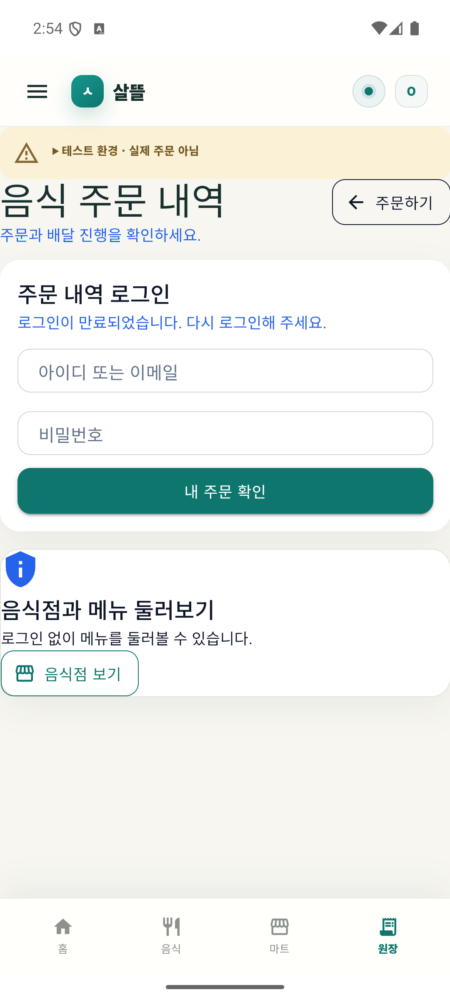
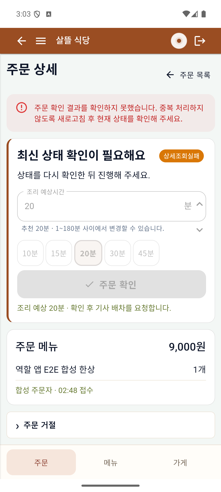
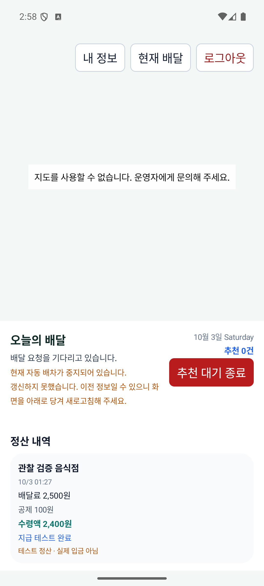
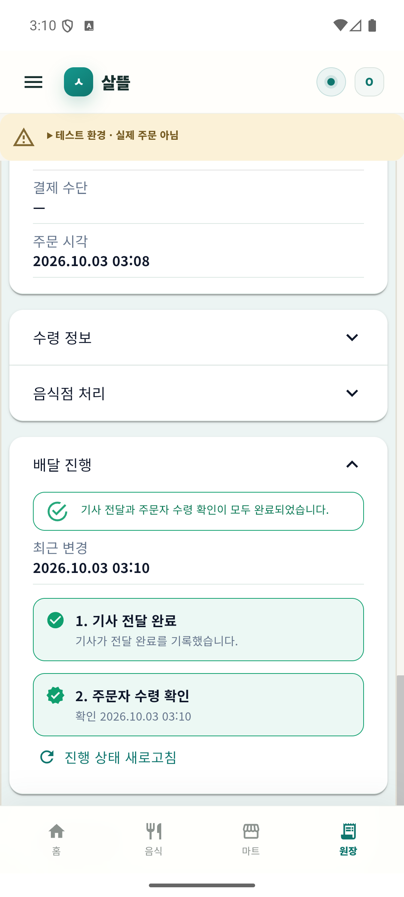
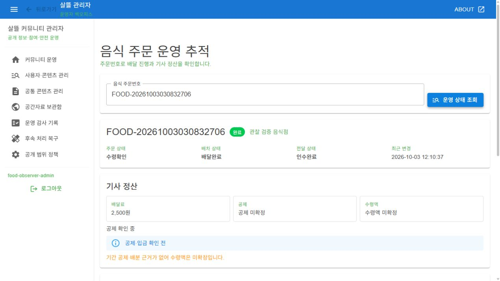

# 기존 앱 사용 흐름 안정화

| 커밋 | 화면 변경 | 검증 수준 |
| --- | --- | --- |
| 커밋 전 | 주문자·음식점·기사의 인증 실패 복귀, 통신 오류 재시도와 명령 실패 후 재조회 보완 | 최종 Debug APK3개 Android 에뮬레이터 실행, 실제 관리자 웹. 관련127/127·전체 build 통과. 전체5,648/5,655, 작업 전과 같은7실패 |

[코드·페이지·검증 연결](../ProjectOverview/page-docs/app-flow-stability-r1.md). 새 페이지·API·DB·요금 정책을 추가하지 않고 기존 r2 구성을 유지했다. 아래는 합성 계정/주문의 실제 실행 화면이다.

## 실패와 복귀

주문자는 최종401 뒤 개인 목록을 지우고 로그인 입력으로 돌아온다. 음식점은 주문 확인 명령503 뒤 상태를 다시 확인할 때까지 중복 처리를 차단한다. 기사는 workspace503 뒤 기존 로그인을 유지하면서 정보가 오래됐을 수 있음을 알린다. 세 역할 모두 재로그인/재조회 복구를 확인했다. 제어된 서버 응답이며 실제 인터넷 단절이나 시계에 의한 만료는 아니다.

| 주문자 인증 복귀 | 음식점 명령 실패 |
| --- | --- |
|  |  |

## 같은 주문의 완료와 정산 조회

`FOOD-20261003030832706`의 음식점 확인→기사 수락→조리/픽업 준비→기사 픽업/전달→주문자 수령 확인을 최종 Android APK 화면에서 수행했다. 주문 등록과 합성 위치 준비는 기존 Client/HTTP이며 주문 등록 UI 증거는 아니다. 아래 수령 완료는 실제 주문자 MAUI shell이다.

관리자는 실제 SsalddelAdmin 호스트에서 동일 주문의 완료와 배달료2,500원을 조회했다. 기존 DevelopmentBootstrap에 정상 합성 계정 로그인 결과를 적용했으며 관리자 로그인 입력 조작 증거와는 구별한다. 기간 공제 근거가 없는 새 주문은 공제·수령액 미확정으로 유지했다. 실제 송금이나 새 모의 지급을 실행하지 않았다.

물리 휴대폰·유효 지도 타일·실제 경로·운영 주문/DB migration·은행 지급은 미검증이다. Observer의 만료 추천 재처리 제한과 native UI dump 카운트다운 충돌은 기준 문서에 별도로 기록했다. 원시 근거/소스 지문/APK는 Git 제외 `artifacts/local/app-flow-stability-r1/`, 최종 Task는 `artifacts/local/validation/20261003-120201/`다. 영상·MYBOX·commit/push는 변경하지 않았다.
