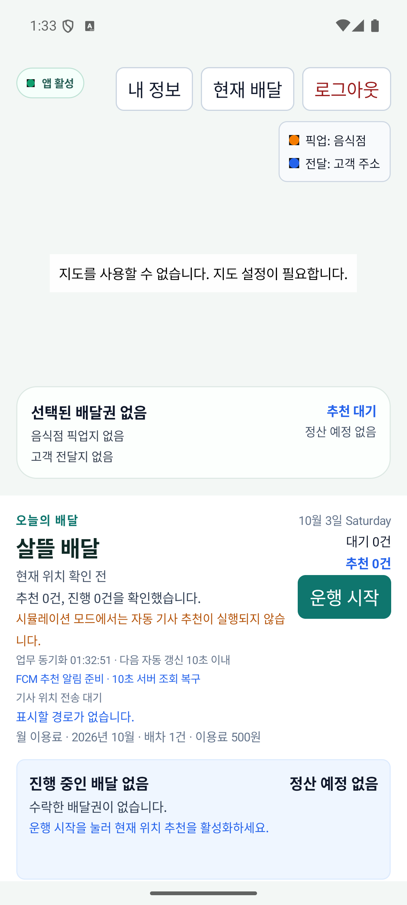
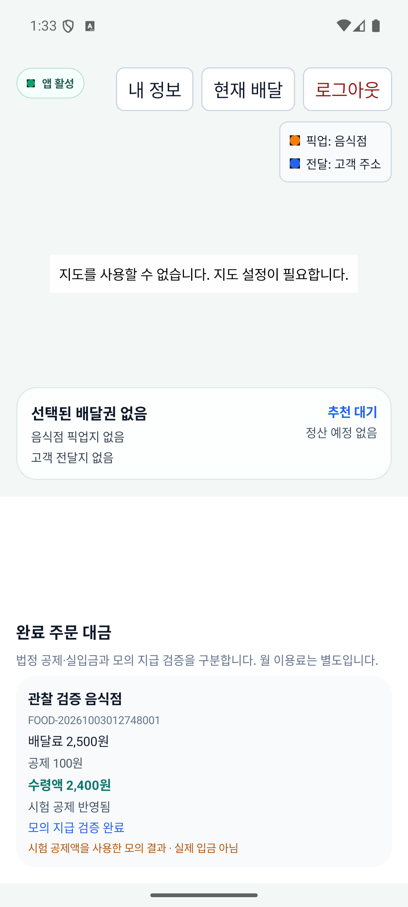

# 기존 앱 주문 갱신·기사 지도·주문별 정산 보완

| 커밋 | 변경 축 | 화면 변경 | 검증 수준 |
| --- | --- | --- | --- |
| 커밋 전 | 주문 갱신·지도 준비·주문 대금 | 기사 완료 주문 정산 카드와 지도 설정 안내, 관리자 모의 지급 입력 | 실제 Android 에뮬레이터의 기사 APK 화면·격리 HTTP/DB. 주문자·관리자 화면은 코드/시험·앱 Client 검증이며 실제 UI 조작 미검증 |

기준과 페이지→코드→DB 연결은 [기존 앱 보완 r1](../ProjectOverview/page-docs/app-gap-improvements-r1.md)에 있다. 기존 화면·인증·주문 API를 확장했다.

## 지도 설정과 월 이용료

유효한 Android NAVER SDK ID가 없는 현재 PC에서 설정 안내가 지도 영역 중앙에 표시되고 상단 버튼과 겹치지 않는다. 실제 타일 로딩 성공은 미검증이다. 아래 월 이용료 500원은 별도 기존 원장이며 배달료나 기사 수령액이 아니다.

## 완료 주문 대금

같은 합성 주문 `FOOD-20261003012748001`을 앱 Client로 전달 완료·수령 확인하고 명시적 100원 시험 공제를 사용했다. 모의 실패→재시도 성공→동일 키 재호출 뒤 기사·관리자가 같은 증빙을 재조회했고, MySQL에서도 정산 1개와 실패/성공 증빙 2개를 독립 확인했다. 배달료 2,500원·시험 공제 100원·모의 수령액 2,400원이다. 법정 공제·은행 지급 계산이나 실제 입금 증거가 아니다.

Android 기사 앱에서 로그인 복원·정산 재조회·스크롤을 수행해 주문번호·세 금액·모의 성공·실입금 아님 안내를 함께 확인했다.

검증 서버는 Development+Simulation, 전용 DB와 합성 주소/기사만 사용한다. 0.250km는 명시적 `FoodObserverSimulationRouteFixture` 입력이며 실제 지도 API·주행 측정 결과가 아니다. 실운영 DB migration·실송금·물리 휴대폰·유효 SDK 타일 성공·commit/push는 이번 증거에 포함하지 않는다.
