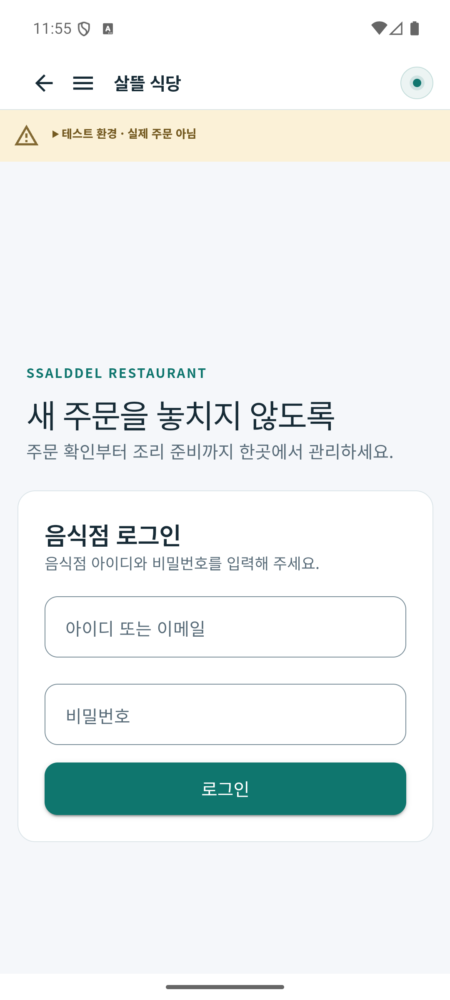
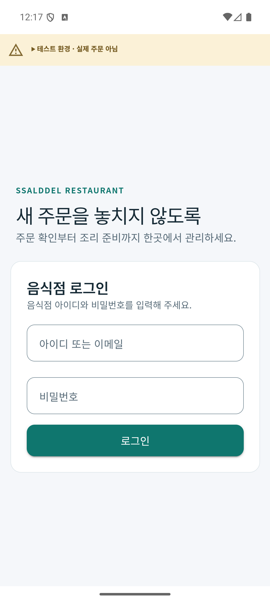
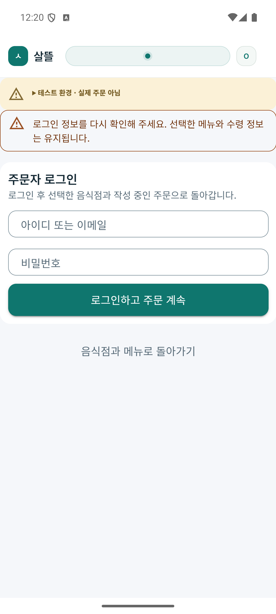
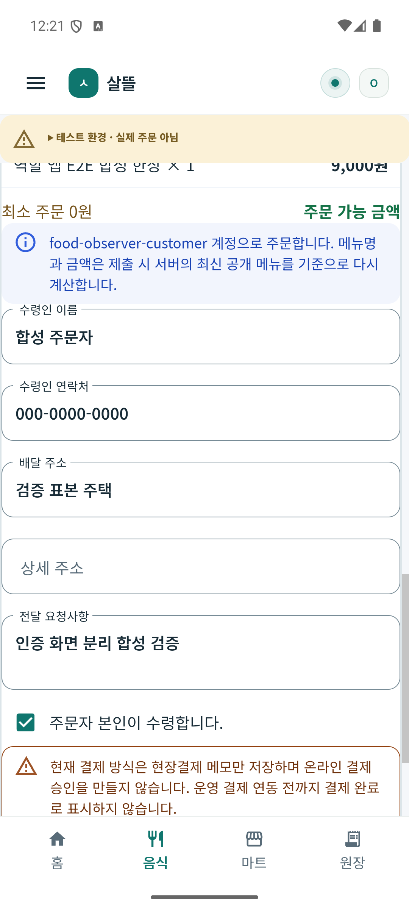

# 로그인·업무 화면 책임 분리 r1

로그인 중에 업무 메뉴·주문 작성·창고 작업 정보가 함께 나타나던 화면을 분리했다. [기준·책임 카드·코드/DB](../ProjectOverview/page-docs/auth-workspace-separation-r1.md)에 따라 음식점·판매자·운영자·기사 로그인은 독립 Layout을 사용한다. 주문자 음식/마트·공동구매, 화주 홈과 창고 인증은 같은 route 안에서 인증과 업무를 배타적으로 조립한다. 로그인 완료는 업무 복귀만 수행하며 저장·주문 제출·배차 수락을 자동 실행하지 않는다.

## 변경 내용

- 인증 화면은 자격 입력·인증 로딩/오류·로그인·취소/공개 이동을 담당한다. 업무 화면은 메뉴 선택·수령 정보·작업·조회·저장을 담당한다. 인증 중 바깥 셸의 업무 drawer·하단 탭·업무 header도 제외한다.
- 주문자 음식/공동구매는 기존 작성 VM을 보존하고 로그인 성공·취소 후 동일 선택·작성값으로 복귀한다. 동일 요청 ID 보존과 자동 저장 없음은 관련 시험으로 확인한다. 마트는 인증 패널과 로그인된 계정 toolbar를 분리한다.
- 현재 세션이 오래된 홈 snapshot보다 우선한다. 주문자·창고 표시 문맥은 현재 페이지 소유권을 확인해 이전 페이지의 늦은 표시 콜백이 다음 페이지를 바꾸지 못하게 한다. 창고 기존13소비 페이지의 권한 조건과 로그인 후 조회 순서는 보존한다.
- [페이지 원칙](../Architecture/WholeRoadmapPagePrinciple.md#인증과-업무의-경계)과 기존 역할/페이지 README8개에 책임 카드와 코드 연결을 추가했다. 제품49·시험/연결8경로를 검증 소스 지문에 결속했다.

## 검증 상태

| 확인 | 결과 | 범위 |
| --- | --- | --- |
| Fast `20261003-210851` | 관련122/122·전체3.5 build 통과 | 음식/마트/화주·공동구매 frame 실제 Razor 렌더, 기존 작성 복귀, 주문자/창고 표시 소유권 |
| Task `20261003-211015` | 6,071/6,078·전체3.5 build 통과 | 직전 `20261003-203149` 대비 신규39건 통과, 기존7실패 이름/오류/첫 시험 소스 동일, 새 실패0. 전체 게이트 미통과 |
| Android Debug | 음식점·주문자 각각 build/설치 APK SHA-256 일치 | 에뮬레이터 Android36·412 CSS px, 확인한 화면의 가로 넘침 없음 |
| 음식점 실제 화면 | 로그인 자격 입력만 표시 → 로그인 성공 후 `/orders` | 합성 계정, 업무 메뉴/하단 탭은 업무 화면에서 복구 |
| 주문자 실제 화면 | 최종401 → 인증 전용 → 취소/명시 재진입 → 로그인 → 같은 초안 | 선택1개·9,000원·수령인/연락처/주소/메모 보존, 인증 중 검색/작성/업무 메뉴/하단 탭 없음 |

주문자 검증은 격리된 loopback 프록시가 주문 등록 POST에401을 반환하도록 했으며 서버에 새 주문을 등록하지 않았다. 로그인 후 같은 작성값이 나타났고 주문 POST 횟수는1회로 유지되어 자동 재제출이 없었다. 동일 요청 ID는 관련 상태/렌더 시험 근거이며 화면에서 ID를 읽은 결과가 아니다. 취소 복귀 시 익명 상태에는 메뉴 선택과 로그인 CTA가 표시되고 수령 입력은 재로그인 후 복구된다.

검증 후 전용 프록시를 종료하고 ADB5321 연결을 기존 서버로 복원했다. 기존9224연결·서버/DB는 보존했다. 원시 로그·TRX·설치/화면 JSON·전후 소스·소스 지문은 Git 제외 `artifacts/local/auth-workspace-separation-r1/`에 보관한다.

## 실제 화면

음식점 이전 설치본 로그인: 업무 메뉴 버튼이 로그인 화면에도 함께 나타났던 상태다.

수정한 음식점 로그인: 인증 전용 Layout으로 계정 입력만 조립한다.

수정한 주문자 인증: 선택 메뉴·수령 입력·업무 메뉴·하단 탭을 함께 조립하지 않는다.

주문자 재로그인 후 같은 작성값 복구: 실제 고객 정보 대신 합성 계정·수령인·주소를 사용했다.

## 적용 경계

기존 공용 Auth 서비스·공개 탐색·route·서버 권한·작성/멱등 요청 수명을 보존한다. 음식점 기존 로그인 route의 작성 초안 이관·새 returnUrl 계약은 추가하지 않는다. DB 스키마·API·요금·정산은 변경하지 않는다.

판매자·운영자·기사·화주·창고의 새 APK/실제 화면은 이번 실행에서 확인하지 않았다. 공동구매 실제 상품 API와 로그인/저장 흐름 전체도 별도다. 창고 기존13페이지는 소비 조건/컴파일·공통 표시 수명 시험 범위이며 업무 API 콜백 전체의 이탈 수명을 전수 검증하지 않았다. 물리 단말·전수 페이지·운영 배차·실입금까지 검증한 것으로 보고하지 않는다. 다른 dirty 작업·배달 영상/MYBOX를 보존했으며 커밋/푸시하지 않았다.
