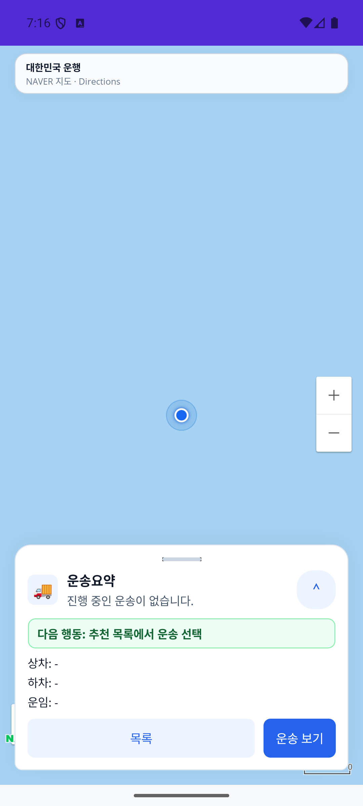

# 화물 연락처·상하차 시간창·국내 기사 설정 r1 (2026-10-03)

| 커밋 | 변화 | 검증 수준 |
| --- | --- | --- |
| 커밋 전 | 실제 상하차 연락처·시간창 전달, 국내 기사 표시, 창고 현장 도착·출고 인계 선행 연결 | 신규50건·관련132/132, 전체 build 통과. 전체5,794/5,801·기존7실패 동일·새 실패0. 실제 Android 국내 표시만 확인, 운송 완주 미검증 |

[페이지 책임·코드·원장 연결](../ProjectOverview/page-docs/cargo-contact-window-r1.md) · [페이지 기준](../Architecture/WholeRoadmapPagePrinciple.md) · [이전 조회 복귀 검증](2026-10-03-cargo-workflow-recovery-r1.md).

## 변화와 목적

화주가 입력한 실제 상차·하차 담당자와 연락처, 시간창의 시작·종료를 서버 의뢰에 전달하고 같은 운송의 기사 상하차 화면에 표시한다. 시간창 네 시각을 다루며 4시간 길이를 강제하는 변경이 아니다. 기존 서버 계약에 맞게 상차 시작/종료는 필수, 하차는 선택이고 부분 입력·역전 구간은 오류로 표시한다. 한국시간 입력→UTC 전달→기사 한국시간 표시를 연결한다. 임의 전화번호나 현재 시각으로 현장 조건을 채우지 않는다. 미지정 정보는 기사 화면에 `시간 미지정`·`연락처 미등록`으로 남긴다.

기사 네이티브 홈의 미국·한국 선택 버튼을 제거하고 `대한민국 운행`과 NAVER provider를 표시한다. 과거 저장된 US 프로필이나 기존 설정 호출도 KR로 정규화한다. 공용 미국 프로필·서버·공공데이터는 보존한다. 이전 조회 복귀 r1의 PopAsync 후 목적 경로 인계, 인증 수명과 상하차 직접 조회 경계는 유지한다.

창고 연계 출고 운송은 현장 도착·출고 상품 인계를 서버 원장으로 확인한 다음 기사 상차 완료로 진행한다. 일반 비창고 운송과 구별하며 기존 출고 인계의 재고 차감·멱등 책임을 유지한다. 새 페이지·API route·요금 정책을 추가하는 작업은 아니다.

## 시험·앱·APK

| 검증 | 이번 판본 상태 |
| --- | --- |
| 소스·책임 | 코드39경로: production26·시험/연결13. 국내 선택 제거·Korea 정책과 기존 복귀 순서 보존. 소스 지문은 비공개 대장에 결속 |
| 신규 집중 시험 | 50건(서버22·화주23·기사/등록 mapper5). 실제 소스에 mock HTTP·EF InMemory를 사용. 의뢰 ID 우선/운송번호 fallback·시간 변환·미지정/역전/필수 조건·창고 선행 차단 등을 검증 |
| 최종 Fast | `20261003-161156`: 전체 `Ssalddel.v3.5.slnx` build 통과·관련132/132 |
| 최종 Task | `20261003-161453`: 전체 build 통과·5,794/5,801·실패7. baseline `20261003-150321`과 실패 이름/메시지/stack 동일·새 실패0. 전체 게이트 미통과 |
| Driver Android APK | Debug publish·에뮬레이터 설치 및 지문 일치. SHA-256 `cd232d0c5a4f81823d07dfda232f79ae7a8634b624611c7638f17215cb60a938` |
| 실제 역할 앱·동일 ID 완주 | 국내 표시만 실제 캡처. 화주 작성 UI·연락처/시간창 펼침·실 HTTP/DB 왕복·화주→기사→창고→상하차 완주는 미검증 |

코드 목록·소스 지문·APK·시험 대조·실행 제한은 Git 제외 `artifacts/local/cargo-contact-window-r1/verification.json`, `code-paths.json`, `source-hashes.json`에 있다. 이전 판본의 API404·Android 입력 ANR와 기존7실패가 해결됐다는 증거는 아니다.

## 실제 화면

최종 APK를 `emulator-5556`, API36·1080×2400·font scale1.0에서 실행해 `대한민국 운행`·`NAVER 지도 · Directions` 표시와 한국/미국 선택 버튼의 부재를 확인했다. 현재 판본의 실제 캡처다. 지도는 파란 배경으로 타일/실제 경로 미검증이며 provider 문구 확인을 지도 정상 실행으로 확대하지 않는다.

화주 작성·상하차 현장 정보의 실제 UI는 미검증이다. 기존 상세 README의 문서용 이미지와 조회 복귀 r1 캡처를 이번 연락처·시간창 표시의 실행 증거로 쓰지 않는다. 물리 기기 검증과 구별한다.

## 남은 확인과 운영 경계

`DomesticTransportWorkflow`/`CargoYongdalV1` 기본 비활성 및 기존 `Simulation` 경계를 유지한다. 최신 Controller feature on/off는 소스와 시험으로 확인했다. 기존5321 서버에는 이번 소스를 재배포하지 않았으므로 이전 API404의 해소나 실제 `FeatureDisabled` 응답 확인을 주장하지 않는다.

창고 재고에서 작성한 의뢰의 하차 담당자는 기존 userId, 전화는 출고 창고 값으로 이어지는 결손이 남아 있다. 실제 하차 수령자 입력 연결은 다음 보완이다. 네이티브 익명 상태의 하단 `진행 중인 운송이 없습니다` 표시는 미확인을 정상 빈 상태와 혼동하는 이전 결손으로 남는다. 위 캡처를 정상 빈 운송 확인으로 쓰지 않는다. 이전 KeyEvent ANR의 원인·해소도 미확인이다.

역할 앱의 실제 동일 ID 입력 왕복·창고 인계 실패/재시도·재고 이동·운송 완주는 별도로 확인해야 한다. 지도 타일·실제 주행·카메라·서명·통화·물리 기기·운영 운송·실결제·은행 지급도 미검증이다. 영상/MYBOX·관련 없는 dirty 작업·커밋·푸시는 변경하지 않았다.
