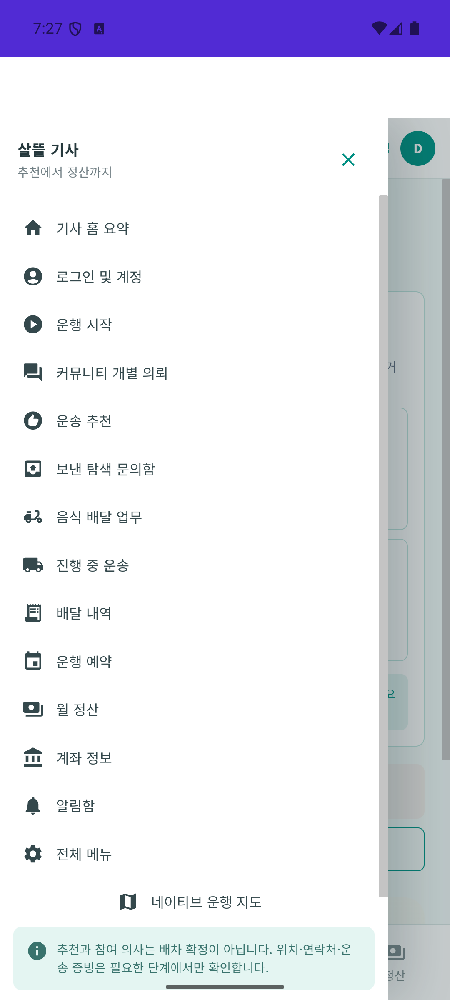
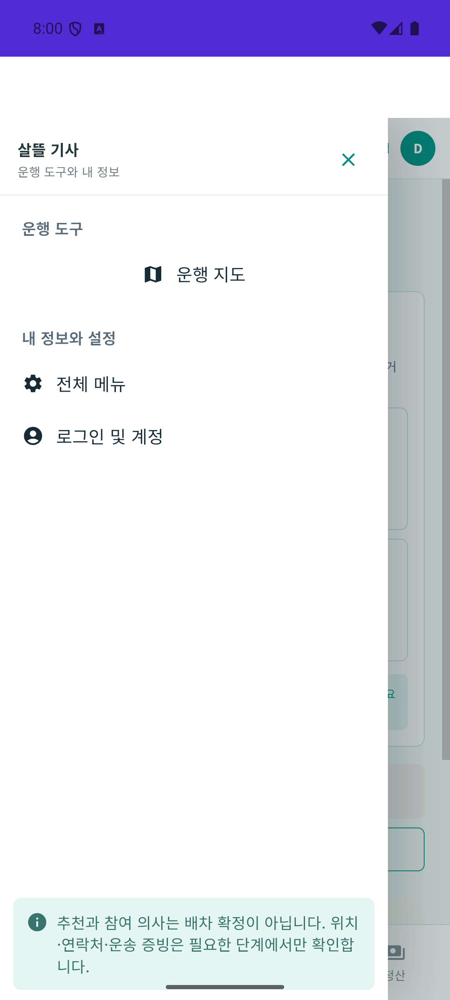
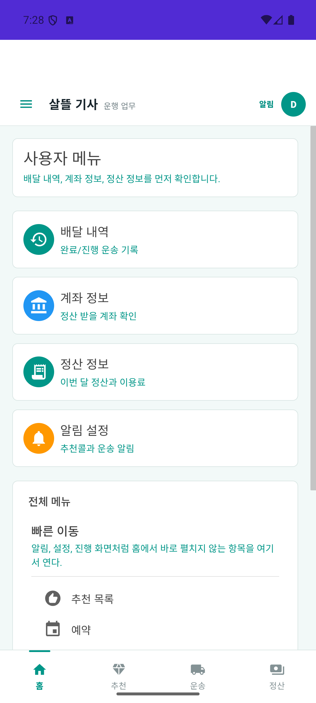
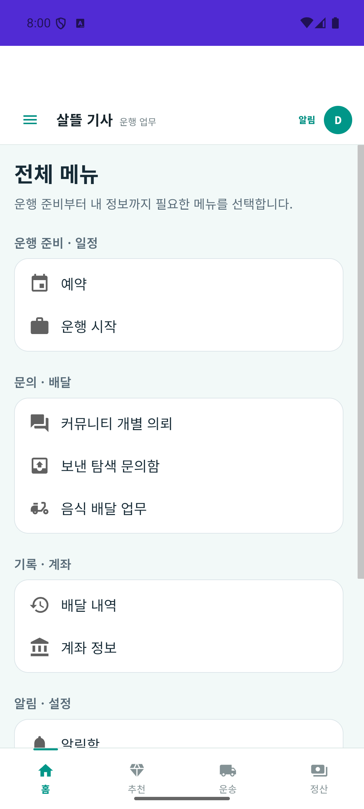
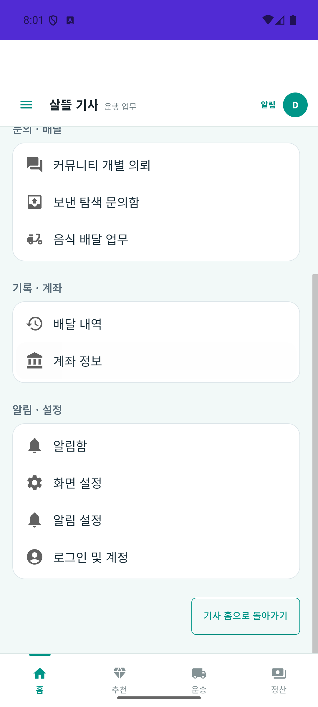
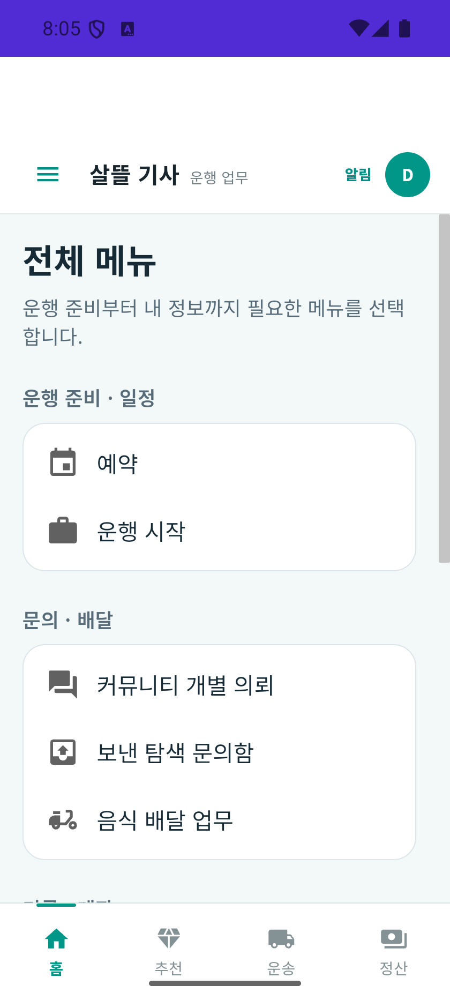
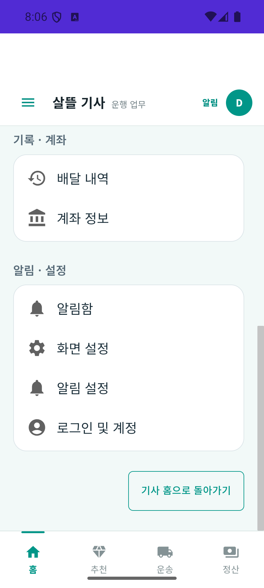

# 기사 메뉴 축약·창고 하차 연락처 r1 (2026-10-03)

| 커밋 | 변화 | 검증 수준 |
| --- | --- | --- |
| 커밋 전 | 기사 중복 메뉴 축약, 창고 실제 하차 연락처·입력 수명·한국시간 전달 연결 | 전체 build·관련150/150·최종 Android 메뉴 확인. 전체 시험의 기존7실패 유지·새 실패0 |

[책임·코드·기존 원장 연결](../ProjectOverview/page-docs/cargo-menu-handoff-r1.md) · [페이지 기준](../Architecture/WholeRoadmapPagePrinciple.md) · [앞선 국내 기사·현장 정보](2026-10-03-cargo-contact-window-r1.md).

## 변화와 목적

기사 drawer의 14개 링크와 지도 버튼, 총 15개 진입을 운행 지도·전체 메뉴·로그인 및 계정 3개로 축약했다. 홈·추천·운송·정산 하단 4개는 유지한다. 전체 메뉴의 4개 계정 카드와 평면 링크를 4목적 묶음의 기본 11행으로 정리하고, 하단 목적지의 반복과 중복 계정 카드를 제거했다. 기존 업무 route·로그인·사용자 가시성·지도 호출·오류·복귀를 보존한다. 메뉴 구조를 바꿨으며 업무 자체를 삭제하거나 한 화면에서 여러 업무를 실행하도록 합친 것은 아니다.

| 전체 메뉴 묶음 | 기본 행 |
| --- | --- |
| 운행 준비·일정 | 예약, 운행 시작 |
| 문의·배달 | 커뮤니티 개별 의뢰, 보낸 탐색 문의함, 음식 배달 업무 |
| 기록·계좌 | 배달 내역, 계좌 정보 |
| 알림·설정 | 알림함, 화면 설정, 알림 설정, 로그인 및 계정 |

실제 APK 확인 중 새 Razor CSS가 MAUI 기본 CSS 수집에 잡혀 웹 번들에서 빠진 것을 발견했다. 다른 MAUI 역할 앱에서 쓰는 `EnableDefaultCssItems=false`를 적용해 웹 전용 scoped CSS를 포함했다. APK 내부 `DriverApp.styles.css`에서 새 메뉴 CSS 3개를 확인하고 다시 설치한 판본의 화면을 대조했다.

기존 창고 재고 인계·출고예정 초안·MAUI 재위탁 생성에 선택 하차 담당자·연락처를 입력할 수 있게 연결했다. 실제 입력을 기존 의뢰의 하차 연락처 열에 저장하며, 미입력을 사용자ID 또는 출고 창고 전화로 채우지 않는다. 상차 창고 정보·권한·수량·각1시간창·같은 출고예정/의뢰ID·단회 재고 예약을 유지한다. 기존 의뢰 재시도에서 새 필드 미전송null은 저장값을 보존하며 명시 변경/공백 삭제는409로 거절한다. 과거 placeholder값의 자동 수정은 하지 않는다.

전송 초안은 UI와 분리된 사본이다. 다른 재고·원장을 선택하면 이전 연락처를 즉시 비우며, 늦은 조회를 적용하지 않고 최신 대상 조회를 이어 간다. 제출 중 입력을 잠그고 실패 시 입력을 보존한다. 공용 날짜·시각은 한국시간으로 입력/검토하고 저장 직전에UTC로 변환하여 기존 기사 한국시간 표시와 맞춘다.

## 코드·시험·APK

| 구분 | 현재 판본 결과 |
| --- | --- |
| 소스 | production16·시험3의 코드19경로. 메뉴6·기사 빌드 설정1·창고 소비7·서버/contract2와 시험3. 비공개 경로/지문 대장에 결속 |
| 신규 시험 | 서버11·창고 입력/수명17의28건. 실제 서비스·공용 ViewModel/mapper·EF InMemory·mock API 사용 |
| 집중 검증 | 입력 잠금 반영 후 Fast `20261003-164141` 전체3.5 build·관련150/150 통과. CSS 포함 설정 반영 후 전체 Task에서도 같은 관련 시험 통과 |
| 전체 Task | 최종 `20261003-165807` 전체3.5 build 통과·5,822/5,829. baseline `20261003-161453`의 기존7실패와 이름·메시지·stack 동일, 새 실패0. 전체 게이트는 미통과 |
| Android APK·실제 메뉴 | 최종 Debug publish·설치 SHA-256 일치. 세 항목 drawer, 네 묶음/11행·하단4개, 네이티브 지도 진입→목록→기존 메뉴 복귀와 스크롤 유지, 명시적 기사 홈 복귀 확인 |
| 실제 창고·운송 완주 | 실제 창고 입력·실HTTP/DB·화주/기사/창고 동일ID 완주 미검증. 단위 시험을 이 실행 증거로 표현하지 않음 |

원시 로그·TRX·소스/API/시험 경로·APK 지문·실제 캡처와 제한은 Git 제외 `artifacts/local/cargo-menu-handoff-r1/`에 보관한다. 로컬 캡처와 설치 APK의 판본을 구별하고 실제 서버 재배포·운영 운송·은행 지급의 증거로 확대하지 않는다.

## 실제 메뉴 전후 화면

Android API36 에뮬레이터의 동일 앱을 비교했다. 기본 1080×2400·density420·글자 설정1.0이며, 기존 로그인 세션 만료 상태에서 메뉴 자체와 화면 이동을 확인했다. 이전 APK와 최종 APK의 지문을 별도로 보관한다. 위 역할 문서의 오래된 캡처와 이번 실행 캡처를 혼합하지 않는다.

| 구간 | 변경 전 | 최종 판본 |
| --- | --- | --- |
| 펼친 메뉴 |  |  |
| 전체 메뉴 |  |  |

320 DIP 폭(840×1866·density420·글자 설정1.0)으로 앱을 다시 실행해 전체 메뉴 상단과 스크롤 후 마지막 행·하단4개 진입을 확인했다. 실행 중 해상도만 바꾸면 기존 WebView가 이전 크기를 유지해 잘리므로, 재실행 후 화면을 기준으로 삼았다. 전후 메뉴 검증 뒤 기본 해상도를 복원했다. 200% 웹 확대나 물리 휴대폰 검증으로 표현하지 않는다.

 

네이티브 지도 진입·복귀 캡처는 비공개 근거에 보관했다. 지도 provider와 화면 진입은 확인했지만 타일·실제 주행 경로는 확인하지 않았다. 익명 운송 요약의 미확인/빈 상태 혼동도 이 결과로 해결되었다고 판단하지 않는다.

## 남은 확인

기존 feature 기본 비활성과 Simulation 경계를 유지한다. 기존5321 food observer를 이번 화물 서버로 재배포하지 않았으며 과거 화물 API404의 실제 해소를 확인하지 않았다. 다음은 별도 격리 환경의 기존 출고예정1건을 실제 역할 앱으로 기사 수락→현장/창고 인계→재고 한 번 차감→상하차→같은ID 완료 조회까지 검증하는 단계다.

실제 창고 입력·모든 상태·물리 단말·지도 타일/실제 경로·전화·카메라/서명·운영 배차·결제·은행 입금은 미검증이다. 이전 Android 입력 ANR와 네이티브 익명 운송 요약의 미확인/빈 상태 혼동을 해결했다는 증거도 아니다. 영상/MYBOX·관련 없는 dirty 작업을 보존했고 커밋·푸시는 하지 않았다.
