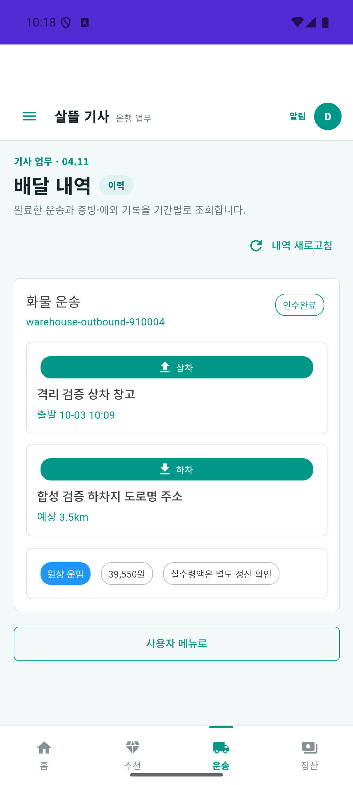

# 화물 견적 저장·기사 표시 보완 (2026-10-03)

| 커밋 | 변화 | 검증 수준 |
| --- | --- | --- |
| 커밋 전 | 기존 견적 계산의 저장·승인/배차 전달, 미확인 값 표시, 정산 원값과 최신 업무 상태 보존 | 전체 build·집중 시험·실제 API/MySQL/Mongo. 역할 앱 전체 UI와 실제 도로 조회는 별도 |

[페이지 책임·코드·DB 관계](../ProjectOverview/page-docs/cargo-pricing-handoff-r1.md) · [앞선 운송 한 건 연결](2026-10-03-cargo-warehouse-journey-r1.md).

## 변화

창고 재위탁 의뢰에는 견적 근거가 없었고 기존 수정 API는 받은 숫자 요금을 저장하지 않았다. 기존 기준운임 계산기로 승인 전 견적을 계산·저장하고 같은 금액과 예상 거리를 기사 조회에 연결했다. 운임/거리 null을 0원/0km로 보이게 하던 표시를 `미확인`으로 바꾸며 확인된 0은 보존한다. 새 페이지는 추가하지 않는다.

견적·대기 배차 금액을 같은 관계형 트랜잭션에 저장하고 승인/수락 뒤 변경을 막는다. 주소 변경은 이전 좌표를 제거한다. 일반 수정은 동일 가격과 정산 조건의 재전송을 변경으로 판정하지 않는다. MAUI 화주 adapter와 초안 복사도 기존 정산값·예상거리·기사 지급 예정 운임을 보존한다. 최상위 운임이 null이면 요금옵션 금액으로 채우지 않아 연락처 수정이 새 운임 변경으로 처리되지 않는다. 최초 생성 기본값과 기존 화물 수정 동작은 유지한다.

동시 PUT 또는 승인 뒤 늦은 Mongo 발행이 이전 금액·승인을 RDB에 되돌리는 경로도 보완했다. Mongo revision을 먼저 확인하고 같은 DB snapshot의 의뢰·운송·구성으로 명시 CAS를 수행한다. 충돌 재시도는 새 원장 값을 읽는다. 서버 관찰본의 marker+digest가 일치하면 업무값 backprojection을 막으며 실제 community 수정과 최초 Mongo-first 생성은 유지한다.

## 검증

| 구분 | 결과 |
| --- | --- |
| 집중 | 최종 Fast `20261003-192548`, 관련 103/103 통과. 수정/권한/승인 차단·주소 좌표·null/0 표시·발행 순서 역전·최신 승인 보존·community 수정·배차 뒤 미확인 운임의 연락처 수정 포함 |
| 전체 Task | 최종 `20261003-192729`, 전체3.5 build 통과·5,985/5,992. 앞선 `20261003-174917` 대비 신규83건 모두 통과. 기존7실패 이름·메시지·시험 위치 동일·새 실패0, 전체 게이트는 미통과 |
| 실제 API·DB | r5 `cargo-journey:ab1361de9f5640c6934a7e36e2cfd962`, 합성 거리3.5km → 견적39,550원 → 반복 저장·구성1개 → 명시 후불 승인 → 기사 수락/재호출 → 도착·창고 인계·상차·하차 완료. 같은 의뢰의 최종 구성1개·금액·거리·출처가 유지됐고 기사 현재/상세 재조회와 일치했다. 수락 뒤 견적 변경409 |
| Android | Driver Debug publish 성공·설치 SHA-256 일치. 실제 로그인과 배달 내역에서 같은 의뢰의 인수완료·예상3.5km·원장 운임39,550원을 확인했다. MAUI 화주 adapter는 시험/compile 검증이며 새 화주 APK 설치 증거가 아니다. |
| schema | 추가 nullable5열의 모델·migration 및 신규 MySQL 모델 저장 검증. 기존 운영 DB에 migration을 적용한 증거는 없다. |

초기 전체 시험에서 신규 fixture마다 생성한 InMemoryDatabaseRoot가 EF 내부 provider를 늘려 2개 시험이 실패했다. root를 singleton으로 공유하고 fixture별 GUID DB 이름은 유지한 뒤 최종 전체 시험에서는 새 실패가 사라졌다. 경고를 억제하거나 시험을 제외하지 않았다.

## 설치본 화면과 남은 범위

아래는 emulator-5556의 실제 Driver 설치본에서 기존 전체 메뉴 → 배달 내역을 누른 화면이다. 합성 계정과 주소만 사용했다. UI에 값을 주입하지 않았으며 인증된 운송 목록 API가 반환한 같은 의뢰를 표시했다. 단계별 완료 처리는 API·DB 검증이고 세 역할 앱 전체 UI 완주·현장 카메라/서명 확인은 아니다.

이 격리 호스트에서 기존 기사 홈·추천·예약·월 정산·푸시 등록 API의404와 내역 출발 시각의 한국시간 변환 누락은 남아 있다. 이번 견적 연결 완료 범위와 구분한다. 결제대기/미수 상태도 유지했으며 은행 지급은 검증하지 않았다.

원시 TRX·HTTP/DB 응답·source/APK 지문·화면은 Git 제외 `artifacts/local/cargo-pricing-handoff-r1/`에 보관한다. 현재 실행의 workflow는 이 경로의 `workflow/`에 별도 복사해 지문을 남겼으며 원래 실행 경로는 `artifacts/local/cargo-warehouse-journey-r1/workflow/`다. 앞선 r4 완료 자료는 같은 root의 `archives/r4-complete/`에 보존했다. 합성 입력 거리와 기본 단가를 실제 도로·운영 운임으로 표현하지 않는다. 배달 영상·MYBOX·관련 없는 dirty 작업·커밋·푸시는 변경하지 않았다.

이번 실행 전용5322 서버·5104 프록시·Docker 서비스와9223 ADB 연결만 종료했다. 기존5321·다른9224 연결·r1~r5 DB 볼륨10개·단말 해상도/밀도/글씨 크기를 보존했고 기사 앱 데이터를 초기화하지 않았다.
