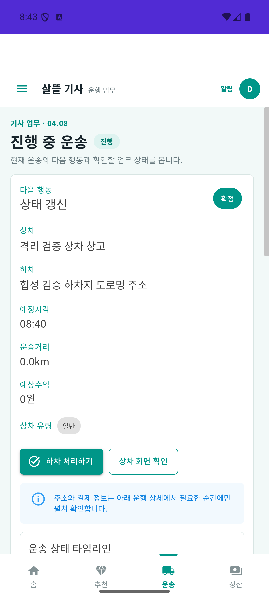
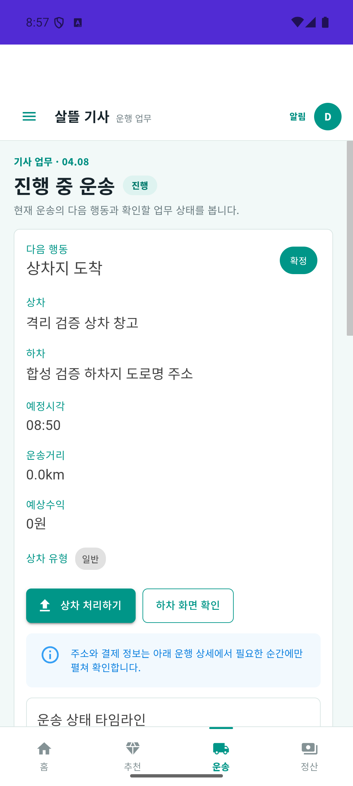
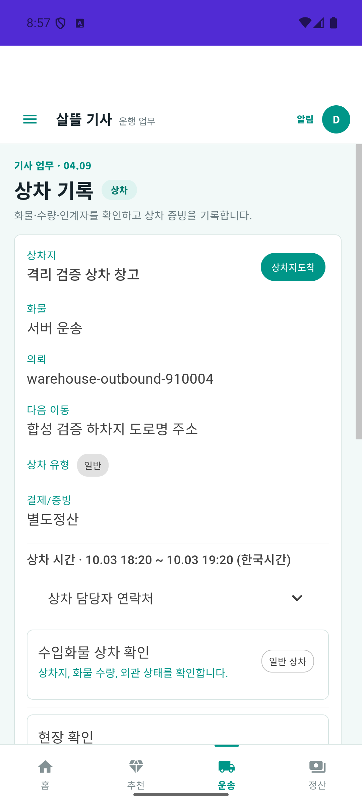
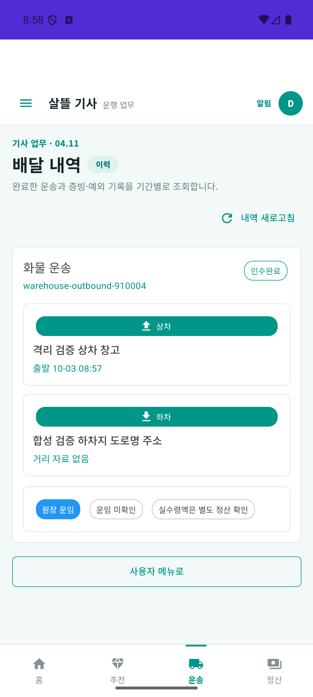

# 창고 출고와 기사 운송 연결 r1 (2026-10-03)

| 커밋 | 변화 | 검증 수준 |
| --- | --- | --- |
| 커밋 전 | 승인된 후불 의뢰의 배차, 실제 도착 API·상하차 단계 연결, 관계형 재시도·단회 재고 차감 | 실제 API/MySQL/Mongo 한 건 완주·재시작 조회. 전체 build 통과·기존 시험7실패 유지·새 실패0 |

[화면 책임·코드·원장 연결](../ProjectOverview/page-docs/cargo-warehouse-journey-r1.md) · [앞선 메뉴·연락처 연결](2026-10-03-cargo-menu-handoff-r1.md).

## 변화와 이유

창고 재위탁은 운송 완료 뒤 정산하는 의뢰를 생성한다. 기존 기사 수락은 결제완료만 허용하여 상차 이후 정산 처리와 서로 기다리는 상태가 됐다. 명시적인 후불 승인 또는 현장수금예정이 확인된 의뢰의 배차를 허용한다. 청구대기 자체는 승인이 아니며 결제·지급 상태를 완료로 바꾸지 않는다. 승인 전·취소·환불·보류·미수·알 수 없는 값은 차단한다.

기존 기사 상차·하차 화면의 도착 확인을 서버 도착 API와 같은 운송 ID 재조회에 연결했다. 도착 저장/재조회 실패 시 완료 입력을 열지 않는다. 이탈·로그아웃·다른 운송 선택 후 늦은 응답을 버리고 이전 작업이 새 작업의 진행 표시를 해제하지 않도록 한다. 사진·서명·기존 화면과 경로를 유지한다.

실제 기사 설치본에서 수락 직후 `확정` 상태를 하차 단계로 취급하는 문제도 발견했다. 기존 `배차확정`과 같은 상차 버튼·경로·지도 대상으로 연결했다. Web의 `상차완료`를 최종 완료로 분류하는 판정 순서도 고쳤다. 운송 중에는 하차지 도착을 안내한다. 새 업무 기능이나 페이지를 추가하지 않는다.

실제 MySQL에서 수락/인계의 수동 트랜잭션이 재시도 전략과 충돌하는 오류를 재현했다. 저장 단위를 실행 전략 내부로 이동하고 외부 후속 처리는 커밋 뒤 실행한다. 같은 기사 수락 재호출은 후속 처리를 반복하지 않는다. 창고 인계는 같은 트랜잭션 안에서 조건부 예약 재고 차감과 출고 확정을 수행하고 DB에 저장된 인계 시각을 사용한다.

JSON의 명시적 시간 오프셋이 서버의 Local DateTime으로 변환되어 DB에는 현지 시계값이 저장되는 문제도 재현했다. 희망 상하차 시각의 검증과 저장에 동일 UTC 정규화를 적용한다. 기존 오프셋 없는 입력은 UTC 계약에 따라 시계값을 보존하며 과거 DB 값은 자동 수정하지 않는다.

## 격리 실행 경계

`eng/Ssalddel.CargoJourneyVerification/`와 `eng/verification/cargo-journey*`는 Development·Simulation·loopback5322의 별도 검증 도구다. 실제 제품 Program·Controller·JWT·권한·MySQL/Mongo를 사용하며 합성 창고/상품9개/출고예정1건만 준비한다. 의뢰·기사 수락·인계·완료는 업무 API로 진행한다. 기존5321 음식배달 환경과 운영 DB는 변경하지 않는다.

추천은 합성 기사 한 명을 명시적으로 선택한 검증용 연결이다. 실제 후보 탐색 알고리즘·물리 운송·실제 결제·은행 지급 증거가 아니다. 포장 준비와 업로드 PNG도 합성 fixture이며 실제 창고 포장 UI나 카메라 촬영 검증으로 표현하지 않는다. 기본 feature flags는 변경하지 않고, 비공개 비밀번호/JWT/HTTP 응답/DB 지문은 Git 제외 artifacts/local에 보관한다.

## 최종 검증

| 구분 | 실행 결과 |
| --- | --- |
| 범위 | 제품 production13·시험/연결9의 코드22경로와 별도 검증 도구10경로. 기존 dirty 파일의 편집 전 사본을 비공개로 보존 |
| 집중 시험 | Fast `20261003-173050` 관련121/121, UTC 수정 Fast `20261003-173832` 창고40/40. 관계형 저장 실패 후 rollback/retry, 영구 실패, 도착 수명 및 시간 오프셋 회귀 포함 |
| 전체 Task | 최종 `20261003-174917`, 전체3.5 build 통과·5,902/5,909. baseline `20261003-165807` 대비 신규80건, 새 실패0. 기존7실패의 이름·메시지·시험 위치는 동일하며 일부 reflection 호출 stack만 다름. 전체 게이트는 미통과 |
| 실제 API·DB r3 | `cargo-journey:351fc3a67dde4d66976582825d8f13d5`, 출고예정910004 → 의뢰 `warehouse-outbound-910004` → 기사 운송1. 실제 로그인·의뢰 생성/재시도·승인·제어 추천·기사 수락/재시도·도착·창고 인계·업로드·상하차 완료·세 역할 재조회 성공 |
| 최종 표본 r4 | `cargo-journey:a20c299737c7466885c8148dc8bbd37f`. 별도 새 볼륨에서 같은 fixture 관계를 처음부터 재현했다. 최종 APK의 상차 안내·도착 저장·완료 목록과 실제 API/DB 완주를 이 표본에 결속 |
| 차단 | 승인 전 수락409 `FreightSettlementNotReady`, 승인 전/다른 의뢰 추천409, 검증키 없는 접근401, 익명 기사 조회401·화주 기사 조회403, 창고 인계 전 상차 완료409 |
| 단회 재고 | 가용9/예약0 → 의뢰 생성 후0/9 → 창고 인계 후0/0. 동시 인계 두 요청은 변경1·재시도1, 이어진 재요청도 재시도. 의뢰/운송/상품 연결 각1·출고 이동/이력 각1·Mongo 완료 문서1 |
| 재시작 | r3 서버 종료/재시작 뒤 같은 runStableId·완료 운송·출고·재고·Mongo 재조회 유지. DB volume과 실패 표본은 보존 |
| 실제 Android | 최종 Debug publish·설치 SHA-256 일치. API36 에뮬레이터, ADB/CDP WebView 입력으로 로그인·확정 상태의 상차 주 버튼·운송1 도착 저장/재조회·같은 의뢰의 인수완료 목록 확인. r3에서는 완료 후 현재 운송 비움도 확인. 사진/서명/기사 수락 전체를 UI로 수행한 증거는 아님 |

의뢰의 결제는 `결제대기`로 남고 운송 완료 후 별도정산은 `미수발생`으로 전환한다. 완료 운송을 결제·기사 지급·입금 완료로 승격하지 않는다. 영업 운임/거리 없는 fixture의 0원 표시는 유효 견적이 아니다.

초기 실패 표본에는 MySQL 트랜잭션 충돌과 시간 오프셋 문제가 각각 남아 있다. 수정된 판본은 새 볼륨에서 시작했다. 재현 도구의 준비 시점/ID 검사 문제는 수정했고 로그인 반복으로 받은429는 기본10회/5분 제한을 유지한 채 연속 단계의 메모리 인증 재사용으로 해소했다. HTTP 성공이나 단위 시험을 세 역할 앱의 전체 입력·사진·서명 완주로 표현하지 않는다.

원시 HTTP/DB 결과·TRX·소스/서버/APK 지문·실제 캡처와 제한은 Git 제외 `artifacts/local/cargo-warehouse-journey-r1/`에 보관한다. 재현 절차는 [검증 도구 README](../../eng/Ssalddel.CargoJourneyVerification/README.md)다.

검증 뒤 전용 서버·프록시·DB 컨테이너와 기사 앱 실행을 종료했다. r1~r4 DB 볼륨과 증거는 보존했으며 기존5321 환경·Android 화면/글씨 설정은 유지했다. 관련 문서의 로컬 링크·이미지159개는 누락 없이 확인했다.

## 실제 기사 화면

다음은 합성 검증 자료의 API36 에뮬레이터 캡처다. 기본1080×2400·density420·font1.0을 유지했다. 수정 전 r3와 최종 r4는 서로 다른 표본이며 같은 ID 숫자만으로 같은 실행이라고 간주하지 않는다. 실제 지점/운송·카메라 사진을 포함하지 않는다. 현재 화면의0원/0km는 미확인 값의 기존 표시이며 유효 견적이 아니다.

| 수락 직후 `확정` | 수정 전 r3 | 최종 APK r4 |
| --- | --- | --- |
| 다음 행동·주 버튼 |  |  |

 

## 남은 우선순위

창고 재위탁의 실제 경로/운임 견적 연결과 미확인 운임·거리의 0 표시, 현재 화면 예정/이력 출발 시각의 한국시간 표시와 MAUI 타임라인의 도착/완료 세부 표시, 상하차 완료 재전송 시 사진 첨부 중복, 화주·창고 전체 앱 입력 및 실제 카메라/서명은 별도 검증 대상이다. 상하차 화면의 시간창 한국시간 표시와 이 예정/이력 시각은 다른 필드다. 기사 홈·추천·예약·월정산·푸시 토큰은 이번 설치본의 격리 호스트에서404가 관찰됐으며 운송 완료 증거로 해소됐다고 판단하지 않는다. 같은 역할의 다른 페이지를 검증할 때 응답 본문·지원 판본·fixture 조건을 먼저 대조한다.

실제 commit 뒤 transient 오류 또는 직접 후속 발행 실패에서는 저장 원장/OS/outbox가 유지되어도 time-promise/relationship/직접 발행이 누락될 수 있다. 이번 정상 완주와 저장 전 retry 시험은 외부 후속 처리의 정확히 한 번 전달을 보증하지 않는다. 내구성 있는 후속 전달은 별도 보완 대상이다.

이번 합성 완주로 운영 배차·정산·입금 완료를 주장하지 않는다. 관련 없는 dirty 작업과 배달 영상/MYBOX를 보존하고 커밋·푸시는 하지 않는다.
