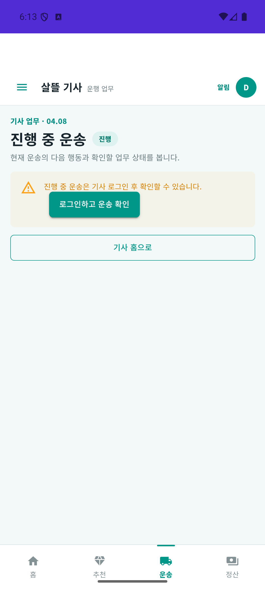
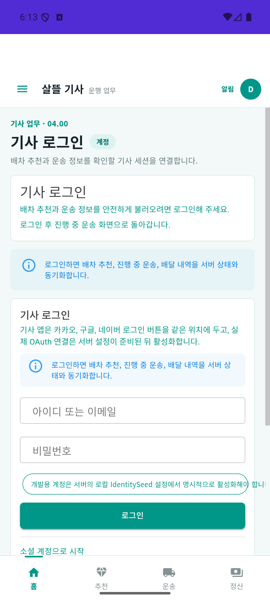
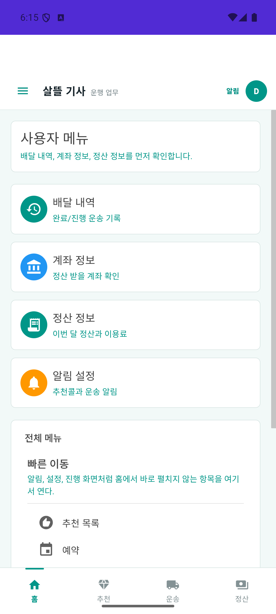

# 화물 기사·MAUI 화주 조회 복귀 r1 (2026-10-03)

| 커밋 | 변화 | 검증 수준 |
| --- | --- | --- |
| 커밋 전 | 기존 화물 앱의 메뉴/현재 운송 진입·로그인 복귀·직접 상세 조회와 화주 목록/선택의 수명 연결 | 실제 소스 집중68/68·최종 관련76/76, 전체 build 통과. 전체5,744/5,751·기존7실패 동일, 실제 운송 완주 미검증 |

[페이지 책임·코드·API 연결](../ProjectOverview/page-docs/cargo-workflow-recovery-r1.md) · [단일 책임 기준](../Architecture/WholeRoadmapPagePrinciple.md).

## 변화와 목적

네이티브 기사 지도 홈의 메뉴와 현재 운송 버튼이 기존 Blazor 화면에 서로 다른 목적 경로를 전달한다. 이전 MainPage가 있으면 먼저 해당 화면으로 복귀한 뒤 활성 Blazor 범위에서 목적 경로를 연다. 숨겨진 WebView에 dispatch를 기다리며 복귀가 멈추는 현상을 실행 확인 후 순서를 보완했다. 새 MainPage는 StartPath로 연다. 캐시 없는 상차·하차 직접 진입은 기존 서버 상세 API로 같은 ID를 조회하며 인증 필요·조회 실패·미확인 상태에서 완료를 허용하지 않는다. 수치 거리 없는 하차 상세는 `거리 미확인`으로 표시한다.

기사 인증의 토큰 판본과 로그인 수명을 분리했다. 만료·확정 인증 거절은 현재 세션만 종료하고 일시 네트워크/서버 오류는 보존한다. 이전 세션의 응답은 새 로그인을 덮거나 종료하지 않는다. 로그인 성공 뒤 푸시 토큰 등록 실패가 업무 복귀를 막지 않게 한다. 진행 중 운송은 이탈 뒤 폴링을 시작하지 않고 인증 변경 시 이전 표시를 정리한다.

MAUI 화주의 운송 목록과 상세 조회는 직렬화하면서 최신 요청·선택 ID·로그인·화면 수명을 확인한다. 선택 변경·로그아웃·이탈 뒤 늦은 결과나 모의 결제 안내를 적용하지 않는다. 같은 계정 재로그인도 새 수명으로 구별하고 토큰 갱신은 같은 수명으로 유지한다.

기존 화면 구성과 서버/API/DB·요금·운송 상태 전이는 유지한다. 연락처·시간창 등록, 창고 인계, 실제 화물 한 건 완주는 후속이다. 별도 Web 화주와 음식 FDriver의 과거 실행을 이번 화물 앱 증거로 합산하지 않는다.

## 시험·빌드·APK

| 검증 | 결과 |
| --- | --- |
| 이번 집중 시험 | 실제 Driver 인증/API·상하차 PageVM과 MAUI 화주 조회/인증 소스68/68. HTTP·저장소·카메라의 플랫폼 경계만 시험 어댑터로 대체 |
| 최종 Fast | `20261003-150206`: 관련76/76·DriverApp/SsalddelApp/시험 프로젝트 build 통과. 선행 확대 Fast `20261003-144236`도107/107 |
| 최종 Task | `20261003-150321`: 전체3.5 build 통과·5,744/5,751·실패7. 작업 전 `20261003-135557`과 실패 이름·오류 메시지·시험 위치 동일·새 실패0. 전체 게이트는 미통과 |
| 기존 검사 정합 | 공용 mapper로 이동한 연락처 매핑과 취소 토큰을 받는 초기 조회의 소스 검사2개를 실제 경로에 맞춤. 기존 연락처·마스킹·복귀 검사는 유지 |
| Driver Android | 최종 Debug APK publish·에뮬레이터 설치. SHA-256 `4f0d74465902033b205a31a243993c42e5c3d32360aafb330bb097c37481d59b`. 물리 기기·출시 검증과 구별 |

원시 TRX·기존 실패 대조·APK·소스 지문·UI 기록은 Git 제외 `artifacts/local/cargo-workflow-recovery-r1/`에 보관한다. 반복된 전체 시험의7실패는 API 분류4개·공식 재료 화면1개·업무 실행 명명1개·통합 Web route 분류1개다. 이 작업의 통과로 전체 회귀나 출시 준비 완료를 선언하지 않는다.

## 실제 Android 화면

최종 APK를 설치한 API36 에뮬레이터에서 네이티브 하단 `운송 보기` → 진행 중 운송, `목록` → 사용자 메뉴의 목적별 복귀를 확인했다. 진행 중 운송의 비로그인 안내 → 로그인 화면에서는 `진행 중 운송` 복귀 문맥을 확인했다. 로그인 성공 후 복귀의 증거는 아니다. 아래 입력란은 비어 있으며 실제 화물·연락처·은행 정보는 없다.

| 현재 운송의 인증 안내 | 로그인 복귀 문맥 | 목록의 사용자 메뉴 복귀 |
| --- | --- | --- |
|  |  |  |

## 실행 범위와 남은 확인

현재 격리 food observer 서버의 합성 계정 로그인은 HTTP200이나 화물 목록·현재 API는404다. 이 환경에서 정상 빈 운송이나 운송 완료로 판정하지 않는다. 실제 운송 데이터/기능 환경 준비 후 동일 ID의 화주 의뢰→기사 수락→창고 인계→상차→하차→완료 내역을 별도로 검증한다.

이번 Android 입력 확인 중 KeyEvent 응답 지연/ANR가 발생했고 원인은 미확정이다. 위 목적별 복귀·로그인 안내의 확인을 로그인 성공 후 복귀나 상하차 완료의 실제 UI 통과로 확대하지 않는다. 네이티브 운송 요약의 미로그인/조회 미확인과 정상 빈 상태 구분도 추가 점검 대상이다. 실제 기기 카메라·서명·완료/예외 명령·실결제·은행 지급·지도 타일/실제 경로도 미검증이다. 영상·MYBOX·관련 없는 dirty 작업·커밋·푸시는 변경하지 않았다.
