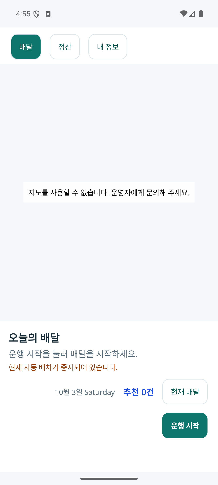
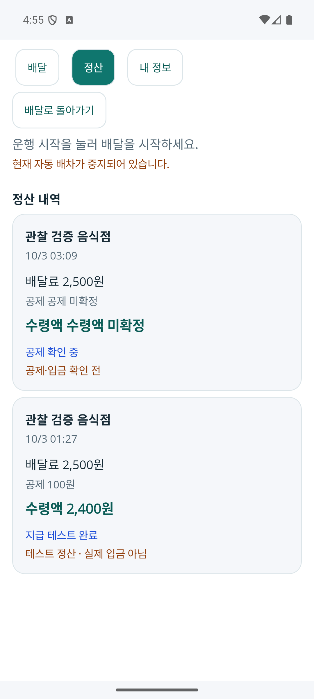
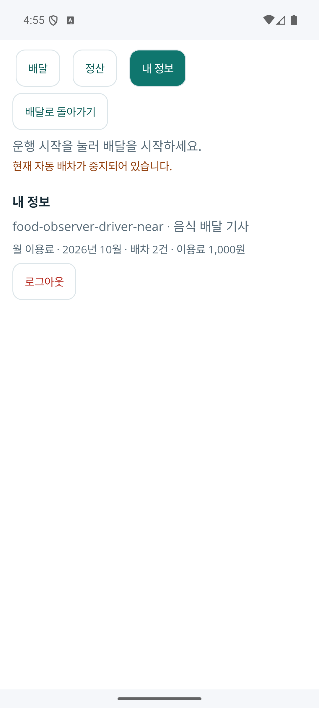

# 기사 앱 배달·정산·내 정보 업무 분리

| 커밋 | 화면 변경 | 검증 수준 |
| --- | --- | --- |
| 커밋 전 | 기존 기사 메인에서 배달·정산·내 정보를 독립 표시하고 업무 복귀 연결 | 실제 Android 에뮬레이터·320 DIP/글씨2.0·스크롤/뒤로/로그인 복귀. 관련60/60·전체 build 통과, 전체5,676/5,683·기존7실패/새 실패0 |

[책임 카드·코드 연결](../ProjectOverview/page-docs/driver-workspace-sections-r1.md) · [페이지 책임 기준](../Architecture/WholeRoadmapPagePrinciple.md) · [시각 디자인 기준](../Architecture/RoleAppVisualDesignStandard.md).

## 무엇을 바꿨는가

기존 `App.CreateWindow`의 root `MainPage`와 `MainPageModel`을 유지하면서 배달·정산·내 정보의 표시 모드와 개별 스크롤 문맥을 분리했다. 배달에는 지도·추천/현재 수행·다음 행동을 두고, 정산과 내 정보에는 기존 완료 정산과 계정/월 이용료를 표시한다. 한 ScrollView의 아래 섹션으로 이동하던 방식에서 각 업무에 진입하고 배달로 복귀하는 방식으로 바꿨다.

기존 `focus` 진입을 유지하고 명시적 배달 복귀·Android 뒤로가기를 연결했다. 영역 전환은 서버 업무 상태나 선택 배달을 바꾸지 않는다. 로그아웃/인증 종료 시 표시 모드와 개인 스크롤 문맥을 초기화한다. 늦게 끝난 초기 조회나 이전 화면 복귀 작업이 새 전환/스크롤을 덮지 않도록 표시 작업의 판본을 대조한다.

배달료·공제·수령액·진행/미확정 안내·경고·빈 상태와 기존 API/DB를 보존한다. GPS·인증·자동 갱신의 기존 수명 경계도 유지하며 표시 모드 전환만으로 모니터를 재생성하거나 API를 호출하지 않는다. 새 기능·요율·서버 상태·Shell root 전환은 추가하지 않는다.

## 대표 화면

최종 APK를 설치한 Android API36 에뮬레이터의 실제 화면이다. 기존 합성 주문2건을 조회했고 새로운 주문이나 지급을 만들지 않았다. 지도 영역의 SDK 미설정 안내는 기존 제한이다.

| 배달 | 정산 | 내 정보 |
| --- | --- | --- |
|  |  |  |

보조 캡처: [변경 전](../assets/changes/2026-10-03-driver-workspace-sections-r1/driver-before.png)은 작업 직전 설치 판본이고, [배달 복귀](../assets/changes/2026-10-03-driver-workspace-sections-r1/driver-back.png)와 [좁은 폭·큰 글씨](../assets/changes/2026-10-03-driver-workspace-sections-r1/driver-font200.png)는 최종 판본이다.

## 검증 상태와 남은 확인

| 검증 | 현재 결과 |
| --- | --- |
| 관련 시험 | Fast `20261003-133847` 관련60/60 통과. 이번 표시/진입/복귀 보완의 새28개 사례 포함 |
| 전체 Task | 최종 `20261003-135557`: 전체 build 통과,5,676/5,683 통과·기존7실패. 이전 `20261003-131243`과 실패 이름·오류 메시지·시험 소스 위치 동일. 전체 게이트는 미통과 |
| 최종 Android APK | 저장/설치 SHA-256 `82ba7fca7cbc1376781a589ada62240bd311e5ad4ae8223e171d27127f829f0b` 일치. 같은 소스6경로 지문을 기록 |
| 실제 모바일 | 세 영역 진입·Android 뒤로/명시적 배달 복귀, 배달/정산 개별 스크롤 위치, HOME 복귀, 로그아웃/재로그인 확인. 로그인 비밀번호 마스킹 유지 |
| 좁은 폭·PNG | 320 DIP·글자 설정2.0에서 버튼 줄바꿈·내용 스크롤·내 정보/로그아웃 접근 확인. 대표6개 등록/검토, 기본 크기·글씨 설정 복원 |

Git 제외 `artifacts/local/driver-workspace-sections-r1/verification.json`에 소스/설치 APK/캡처 지문과 TRX·UI XML 근거를 둔다. 이전 Android 전용 publish 직후 `-NoRestore` Task는 iOS 자산 대상 누락으로 중단했고, 복원을 포함한 위 최종 Task에서 전체 build가 통과했다. 코드 결함 수정이나 assertion 완화로 우회하지 않았다.

기존 Binding104개·문구/입력 안내74개를 모두 보존했다. 표시 상태 추가와 인증 종료 초기화 외 MainPageModel의 업무 소스는 작업 전과 동일하다. 직접 focus와 선택 배달/경로 보존은 모델 시험/소스 대조이며 실제 진행 중 경로·새 추천 수신·401 주입은 이번에 다시 실행하지 않았다. 완료 합성 주문의 공제/수령액 미확정과 기존 모의 정산·실제 입금 아님을 그대로 표시한다.

물리 단말·유효 지도 타일·실제 경로·운영 주문·실제 입금은 이번 구현이나 시험 통과만으로 확인된 것으로 보지 않는다. 관련 없는 dirty 작업과 배달 영상·MYBOX·커밋·푸시는 변경하지 않았다.
