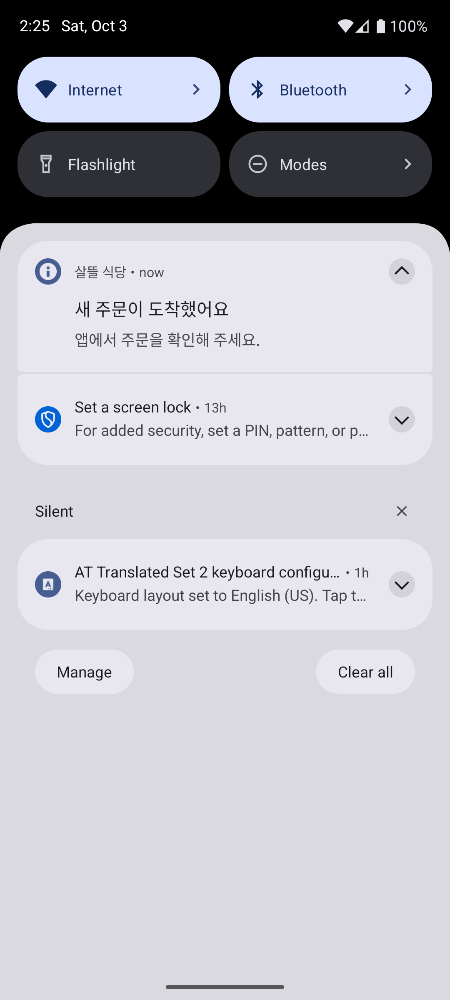
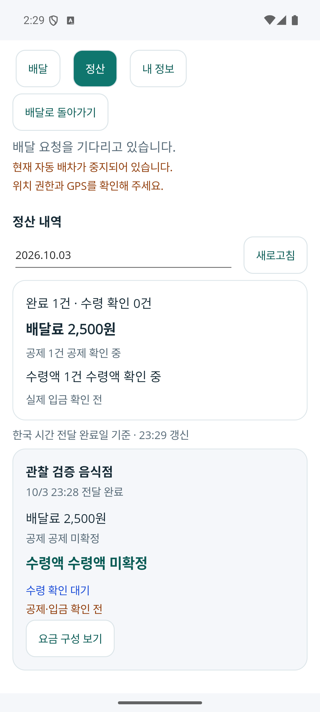
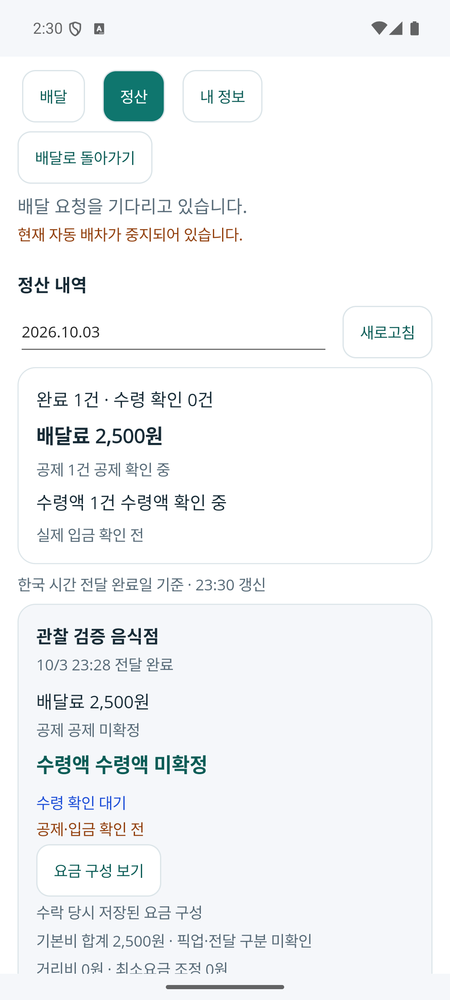
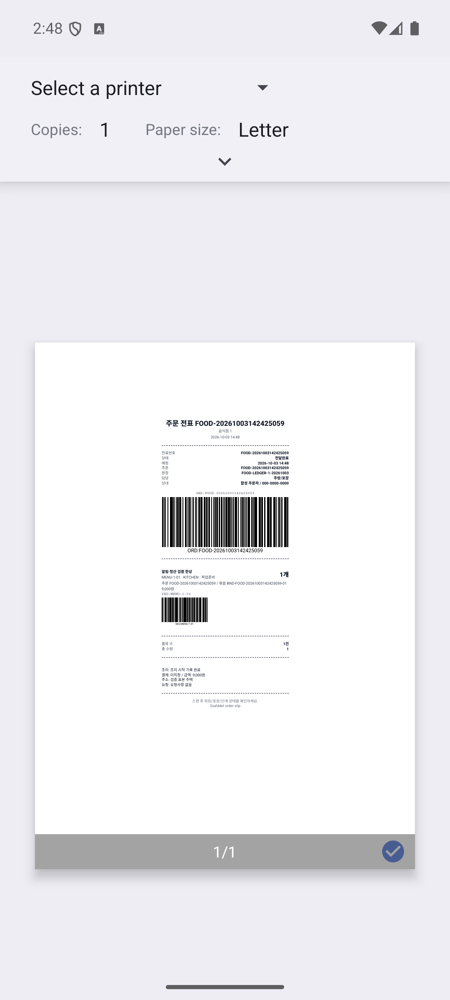

# 음식 새 업무 알림·전표 복구·당일 정산 r1

새 주문·추천을 놓치거나 알림으로 돌아온 뒤 오래된 상태를 사용하는 문제, 이미 수락한 주문의 전표를 다시 출력하려고 수락을 반복하는 문제, 기사 정산에서 최근 40건과 하루 전체 합계를 혼동하는 문제를 보완한다. 음식점·기사의 알림 진입은 서버 정본 조회로 복귀하고 전표 재시도는 수락과 분리한다. 기사 정산은 본인의 한국 시간 전달 완료일 전체 원장과 수락 당시 저장된 요금 구성을 보여준다. [페이지 책임 → 코드·API → DB](../ProjectOverview/page-docs/food-notification-daily-settlement-r1.md)에 업무별 권한·입력·수명을 정리했다.

최종 판본 r7을 동결했다. **Fast 20261003-234233 97/97과 전체 3.5 빌드 통과, Task 20261003-234528 6,259/6,266이다. 신규 94건은 모두 통과했고 기존 실패 7건의 이름·오류·stack이 직전 기준과 같다. 전체 시험 게이트는 미통과다.** 기사·음식점 Debug APK 설치 지문과 격리 Android 실행을 별도로 확인했다.

## 변경 내용

- 음식점 새 주문 알림을 페이지와 독립된 Coordinator에 연결했다. 계정·서버 음식점·주문대기 상태를 확인한 뒤 중복을 억제한다. OS 알림은 일반 제목·본문만 사용하며 주문자 이름·주소·메뉴·금액·연락처를 싣지 않는다. 알림 탭은 같은 소유 계정 인증과 정본 조회 후 기존 상세로 이동한다. 다른 계정·로그아웃·늦은 콜백은 이전 대상을 적용하지 않는다.
- 음식점 앱 재개·재시작에서 기존 인증 복원과 수신함/선택 상세 재조회를 재사용한다. `전표준비Async`는 이미 수락한 주문을 서버에서 읽어 다시 준비하는 독립 조회다. 취소·거절·미수락·조회 실패에서는 오래된 전표를 출력하지 않으며 실패 후 수락 명령을 재실행하지 않는다. Android PrintManager의 인쇄 UI 요청과 물리 인쇄 완료를 구별한다.
- 기사 신규 추천은 명시적인 신규 수신 ON, 서버 유효 상태와 만료 시각을 따라 알린다. 철회·만료·OFF·계정 변경 뒤 로컬 알림을 정리한다. 알림 진입은 최신 업무 공간에서 같은 추천을 찾으며 수락을 자동 실행하지 않는다. 현재 수행 중인 배달은 신규 수신 의사와 별개다.
- 기존 기사 Controller에 `GET api/v1/driver/food-deliveries/settlements/daily?date=yyyy-MM-dd`를 추가했다. 인증 기사 본인만 조회하며 한국 시간 전달 완료일의 모든 완료 원장을 읽는다. 기존 업무 공간의 최근 40건 제한은 유지하고 당일 조회에 적용하지 않는다. 중복 완료·지급 근거를 여러 완료 건으로 세지 않는다.
- 당일 건수·배달료·공제·수령액과 주문별 상세를 연결했다. 금액이 하나라도 미확정이면 해당 전체 합계는 `null`이며 확인된 배달료 부분합을 따로 표시한다. 지급 예정·모의 지급 성공·실제 입금 확인을 구별한다. 현재 은행·PG 확인 근거가 없으므로 실제 입금 금액은 미확인이다.
- 저장된 `요금계산근거Json`을 안전한 상세 DTO로 투영한다. 원금·판본·기사·구성 합계를 검증하고, 이전 분리되지 않은 기본비는 픽업/전달을 추정하지 않는다. 누락·잘못된 근거는 확인 전으로 표시한다. 현재 요율 재계산, 원금 변경, 새 공제 정책·DB migration은 없다.
- 날짜·계정 전환은 이전 조회를 취소하고 늦은 응답을 제외한다. 앱은 응답의 날짜·소유·전체 조회 계약과 완료 건수/행 수를 확인한다. 성공한 빈 완료일, 조회 전, 조회 실패와 미확정 금액은 서로 다른 상태다.

## 시험·실행 상태

| 확인 | 현재 결과 | 검증 범위·경계 |
| --- | --- | --- |
| 서버 당일 집계·저장 요금 근거 | 신규 34/34 통과 | SQLite 55건과 최근 40건 구별, 한국 날짜, 소유, 미확정/0원, 중복·후속 조정, 저장 근거·이전 기본비·비노출 |
| 기사 알림 | 신규 23/23 통과 | 유효 추천·만료·중복·OFF·계정·복귀 수명. 외부 FCM 전달 시험은 아니다. |
| 기사 당일 화면 복구 | 신규 12/12 통과 | 전체 목록, 날짜/계정/이탈·늦은 결과, 계약 오류·JSON 복구, 문화권별 ISO 날짜 |
| 음식점 알림·전표 복구 | 신규 25/25 통과 | 정본·소유·상태·로그아웃·재개·독립 재시도·수락 중복 방지 |
| 관련 Fast·전체 Task | 97/97 및 6,259/6,266 · 전체 3.5 빌드 통과 | 기존 7실패 동일, 새 실패·기존 outcome 변경·시험 삭제 0. 전체 게이트 미통과 |
| 실제 당일 API | 합성 완료 1건·2,500원, 공제/수령액/실입금 null | 익명 401·주문자 403·잘못된 날짜 400·기본 한국 날짜 확인 |
| 기사·음식점 APK | 빌드·설치 SHA-256 일치 | FDriver r3, 음식점 최종 r7 소스 지문에 결속한 Debug 검토본. 공개 APK·물리 단말·출시는 별도 |
| Android 알림·복귀 | 음식점 홈 전환 뒤 새 주문 알림→같은 상세, 기사 새 요청 알림→정본 재조회 | 기사 추천은 만료 뒤 목록/알림을 정리했다. 알림 탭의 자동 수락 없음. 기사 홈 중 지속 조회·강제 종료 신규 알림은 보장하지 않는다. |
| Android 출력·정산 | 같은 음식점 프로세스에서 출력·취소·재출력 반복 3회, 당일 전체/구성 화면 확인 | 시스템 인쇄 UI와 취소만 확인, 종이 출력 없음. 재출력 전후 서버 수락시각/Revision 동일. 날짜·소유 경계와 40건 초과는 시험 근거 |

최초 출력 취소 후 재출력에서 이미 해제한 WebView의 Java 동등 비교가 발생하는 ObjectDisposedException을 실제 로그로 확인했다. 종료 요청을 역순 인덱스로 먼저 제거한 뒤 자원을 해제하도록 수정했고, 최종 설치본에서 같은 프로세스의 반복 출력·취소를 다시 검증했다. 진단은 단계·예외 종류·입력 없는 메서드명만 기록하며 HTML·주문번호·주소·연락처·예외 Message를 로그로 복사하지 않는다.

실제 합성 주문의 음식점 확인은 UI, 기사 수락·조리/픽업/전달 완료는 역할 HTTP API로 실행했다. 기사 위치 권한/GPS는 에뮬레이터 검증 설정을 사용했다. 네 역할 전체 UI 완주·실제 지도·물리 단말·FCM·은행 이체를 완료한 것으로 확대하지 않는다.

## 화면 변경 기록

| 커밋 | 변경 축 | 화면 변경 | 시각 근거 |
| --- | --- | --- | --- |
| 이번 맥락별 커밋 | 음식점 새 주문·전표 복귀 | 알림 허용 보조 행동과 같은 주문의 독립 출력 재시도 | 아래 합성 Android 캡처 |
| 이번 맥락별 커밋 | 기사 새 추천 복귀 | 유효 추천 알림에서 기존 배달 영역으로 복귀 | 아래 합성 Android 캡처 |
| 이번 맥락별 커밋 | 기사 당일 정산 | 날짜·전체 완료 목록·합계·미확정 표시와 접힌 요금 구성 | 아래 합성 Android 캡처 |
| 이번 맥락별 커밋 | 서버·DB 조회 | 당일 전체 원장과 저장 근거의 읽기 전용 projection | 화면 없음 · 격리 실제 API/DB 대조 |

장기 근거는 다음 실제 Android 캡처다. 합성 데이터이며 원시 실행 로그·APK·DB·인증정보는 Git에서 제외한다.

## 적용 한계와 근거 보관

현재 알림은 앱 프로세스와 연결이 유지되는 동안의 Android 로컬 알림이다. 새 FCM receiver/provider 또는 앱 강제 종료·OS 프로세스 제거·Doze 중 새 주문/추천 전달 보장은 구현하지 않았다. 상시 백그라운드 위치 전송을 확인한 변경도 아니다. 알림 권한 거절이 서버의 주문·배차 권한을 바꾸지 않는다.

전표 출력 요청은 Android 인쇄 UI 진입이며 실제 프린터·종이 출력 완료가 아니다. 다른 플랫폼의 기존 JS 출력창 제한도 유지한다. 재시작 복귀는 서버 정본과 기존 인증 복원을 사용하며 미확정 수락 초안의 디스크 영속 복구까지 포함하지 않는다.

정산은 기존 완료 원장·수령 확인·저장된 공제·모의 지급 상태를 조회한다. 합성 주문의 테스트 지급 성공은 실제 PG/은행 이체가 아니며 실제 입금 합계는 미확인 상태를 유지한다. 기존 금융 요율·보험·프로모션 정책과 배달료 원본은 변경하지 않는다.

`dev/mirror-integration`의 관련 없는 dirty 작업을 보존했다. 변경 전 사본·소유 경로·동결 지문과 실행 인계는 Git 제외 `artifacts/local/food-notification-daily-settlement-r1/`의 `server/`, `driver/`, `restaurant/`에 있다. 사용자의 명시 요청에 따라 이전 앱 개선의 선행 의존성과 이번 변경을 맥락별로 커밋한다. Unity·디오라마·자료수집·예비금 prototype의 미커밋 변경은 보존하고 이번 묶음에서 제외한다. 푸시 결과는 실제 원격 지문과 별도 대조한다.
