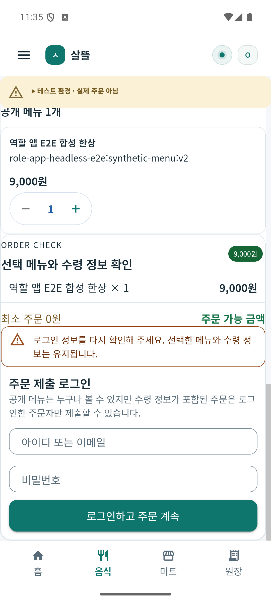
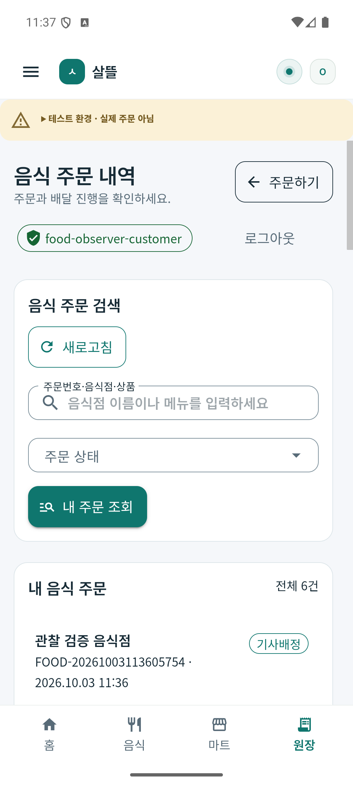
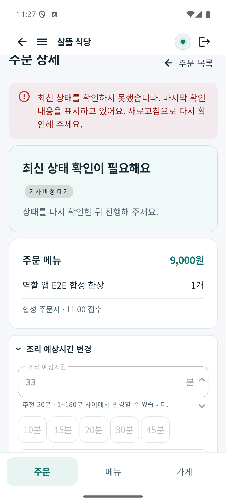
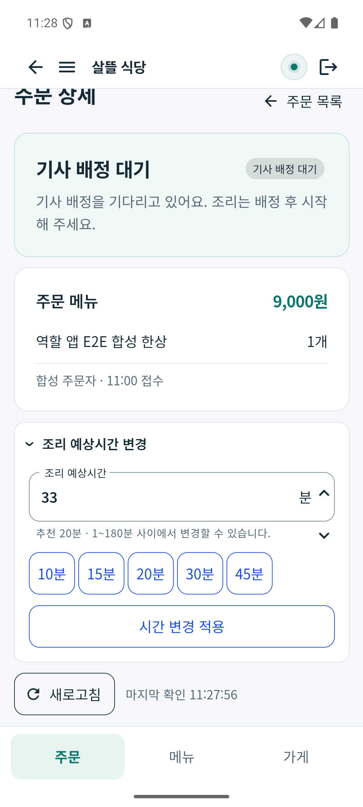
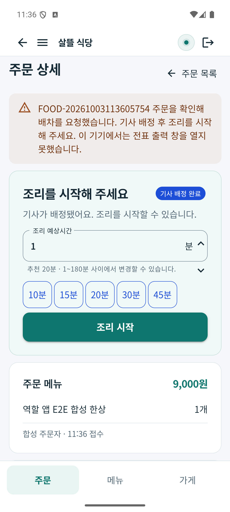

# 음식 배달 상태 갱신·주문 작성 복귀 r1

사용자가 [네 역할 운영 보완 제안서](../Reports/2026-10-03-food-four-role-improvement-proposal.md)의 1순위 구현을 요청했다. [페이지·코드·DB 관계](../ProjectOverview/page-docs/food-state-refresh-r1.md)에 범위와 수명 경계를 정리했다.

## 변경

음식점 상세가 선택 주문의 변경·재연결·주기 조회를 소비한다. 변경 알림과 명령이 겹쳐도 처리가 끝난 뒤 서버를 다시 읽고, 조리시간·거절 사유 작성 내용과 조회 실패 복구를 유지한다. 상세를 나가면 구독과 조회 수명을 종료한다. 공유 실시간 연결의 계정 경계와 명시 로그아웃 종료도 보완한다.

주문 작성은 최종 401 뒤 재로그인 입력으로 복귀하며 메뉴·수령 정보·동일 요청 ID를 보존한다. 같은 계정으로 다시 로그인해 세션 객체가 유지되는 경우도 로그인 세대로 구별한다. 화면 이탈·음식점 변경·재로그인 뒤 이전 성공/실패 응답을 적용하지 않는다.

메뉴·수령 정보를 바꾸는 동안 등록 응답이 늦게 도착하는 경우도 구별한다. 전송 사본과 작성 판본이 달라지면 이전 요청을 취소하고 결과를 적용하지 않으며, 변경한 작성 내용에는 새 요청 ID를 사용한다. 같은 내용의 인증 복구·재시도에는 기존 ID를 유지한다.

## 시험과 빌드

코드·시험 연결은 13경로(production 7·시험/연결 6)다. 관련 기존 시험을 유지하고 새 수명·인증·경합 시험 47건을 추가했다.

| 실행 | 결과 | 경계 |
| --- | --- | --- |
| Fast `20261003-202627` | 관련 118/118, 음식점 Android/Windows·공용 UI·Tests build·diff 통과 | 지정 18경로의 범위 검증 |
| Task `20261003-203149` | 전체 `Ssalddel.v3.5.slnx` build 통과, 전체 시험 6,032/6,039 | 기존 실패 7건으로 전체 게이트 미통과 |
| 작업 전 Task `20261003-192729` 대조 | 5,985/5,992 → 6,032/6,039, 신규 47건 통과·새 실패 0 | 기존 실패의 이름·오류·첫 시험 소스 위치 모두 동일 |
| 음식점·주문자 Debug APK | 두 앱 모두 최종 `SignAndroidPackage` 오류/경고 0, 에뮬레이터 설치 SHA-256 일치 | Release·물리 단말·외부 배포와 별개 |

음식점 상세 source-linked 수명/조회 시험 15건은 빈 마크업의 TestRenderer를 사용한다. 실제 Razor 표시 증거가 아니다. 공유 Hub 계정 소유권 시험 6건도 미접속 Hub 인스턴스의 경합/해제 검증이며 실시간 네트워크 연결 시험과 구별한다. 주문 작성 26건에는 실제 Razor·Mud HtmlRenderer의 세 인증 상태와 늦은 성공/401/503 경합을 포함한다. 아래 설치본 UI는 별도의 실행 근거다.

## 설치본에서 확인한 동작

Android 에뮬레이터 `emulator-5556`의 실제 MAUI 설치본을 ADB/CDP WebView 입력으로 조작했다. 기존 localhost5321 Development/Simulation 서버·공식 업무 API와 합성 계정만 사용했다. 401/503은 이 작업 전용 loopback 프록시로 주입했고, 서버 상태 변경은 정상 권한 API로 수행했다. 비밀번호·토큰·HTTP 본문은 화면/프록시 기록에 남기지 않았다.

| 표본 | 수행·관찰 | 확인하지 않은 범위 |
| --- | --- | --- |
| `FOOD-20261003110052732` | 음식점 UI에서 조리시간37·주문 확인. 작성값33을 둔 채 다른 기기의 정상 API로 서버 조리시간1 변경 → 자동 조회에도33 유지. 상세 GET503에서 마지막 메뉴/상태와33 유지·명령 잠금 → 오류 해제 후 자동 조회로 안내 제거·명령 복구 | 첫 추천은 후보 없음 상태였으며 기사 배정·취소 성공 근거로 쓰지 않음 |
| `FOOD-20261003113605754` | 주문자 UI 메뉴1개·수령 정보 입력 → 제출401 → 로그인 입력 복귀 → 재로그인 뒤 모든 작성값 유지 → 동일 내용 제출200·새 주문 내역 이동. 음식점 UI 조리시간1·주문 확인, 기사 정상 API 수락 → 같은 상세가 수동 새로고침 없이 기사 배정 완료·조리 시작 표시 | 기사 위치 준비·수락은 HTTP. 네 역할 전체 UI 완주·실제 조리/픽업/전달·지급을 수행하지 않음 |

401 전후 요청 ID 보존은 VM·HTTP mock 시험의 근거다. 설치본에서는 메뉴·수령 정보 유지와 정상 주문 등록을 확인했으며 요청 본문을 따로 수집하지 않았다. 취소·재배정 알림, 화면 이탈 뒤 응답 배제·Hub 계정 경계·실제 인터넷 단절/재연결은 코드/시험 근거와 실제 기기 실행을 구별한다. 자동 갱신은 실시간 알림과30초 조회를 함께 사용하므로 이번 표본만으로 특정 알림 전달 지연을 산정하지 않는다.

실제 화면은 412px에서 가로 넘침 없이 표시됐다. 사용자 시각은 기존 에뮬레이터의 UTC 설정이며 한국시간 표시를 새로 검증한 결과는 아니다. 주문 확인 뒤 전표 출력 창 미지원 안내가 표시됐고 실제 전표 인쇄는 하지 않았다. 첫 추천 후보 없음과 새 표본의 기사 위치 안내는 관찰 fixture/투영의 후속 점검이며 이번 상태 갱신 수정으로 해소됐다고 보고하지 않는다.

| 주문 작성 인증 복귀 | 새 주문 등록·배정 내역 |
| --- | --- |
|  |  |

| 음식점 조회503 | 자동 재조회 복구 | 기사 수락 뒤 자동 배정 표시 |
| --- | --- | --- |
|  |  |  |

## 근거와 정리

원시 TRX·소스 지문·APK·설치 지문·제어 오류/화면 JSON·정상 API 결과·기준선 대조는 Git 제외 `artifacts/local/food-state-refresh-r1/`에 보관한다. `verification.json`은 최종 소스와 위 결과를 결속한다. 음식점 APK는 해당 음식점 수정 최종본, 주문자 APK는 주문자 경합 수정 r4 최종본으로 구별한다. 두 설치 APK SHA-256은 아래와 같다.

- 음식점: `873811D80149127DDFF361064804E0446904B4D74E7D6F555CEA9A3EDDC713A1`
- 주문자: `E0660177314EFBE9AFCC28C28DFFDB5C3604152C4744D536DCA1C96902C1DC1D`

전용 프록시를 종료하고 ADB5321 연결을 원래 localhost5321로 복원했다. 이번 WebView9226 연결만 제거하고 기존9224·서버·DB·합성 주문·장치 설정을 보존했다. 임시 오류 설정도 비웠다.

## 적용 경계

새 취소·현장 중단·운영자 검토 버튼은 2순위다. 앱 재시작 뒤 작성 복원·응답 유실 원장 조회는 별도 보완 대상이다. 실제 영업·물리 단말·공개 Release·외부 게시·은행 지급을 수행하지 않았다. 다른 dirty 작업과 배달 영상/MYBOX를 보존했다. commit·push하지 않았다.
