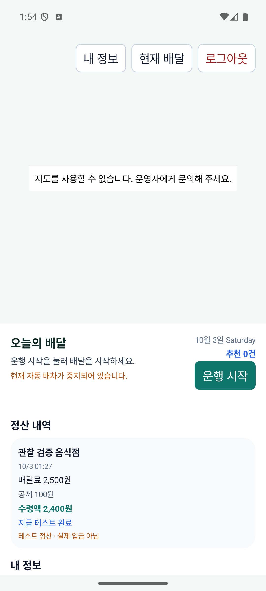
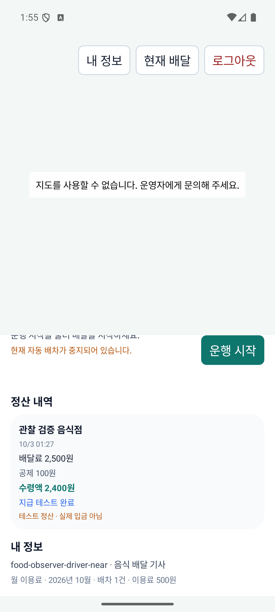
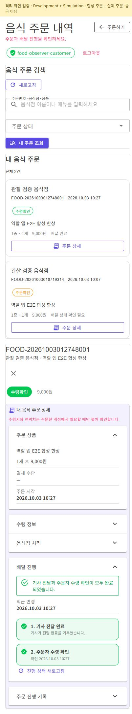
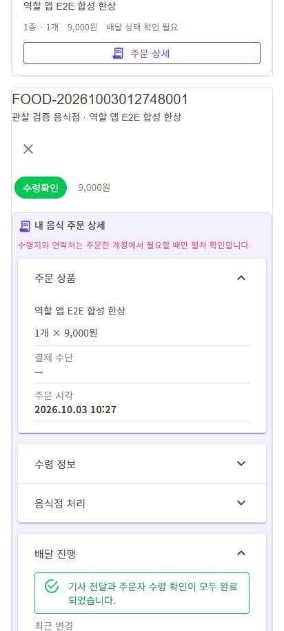
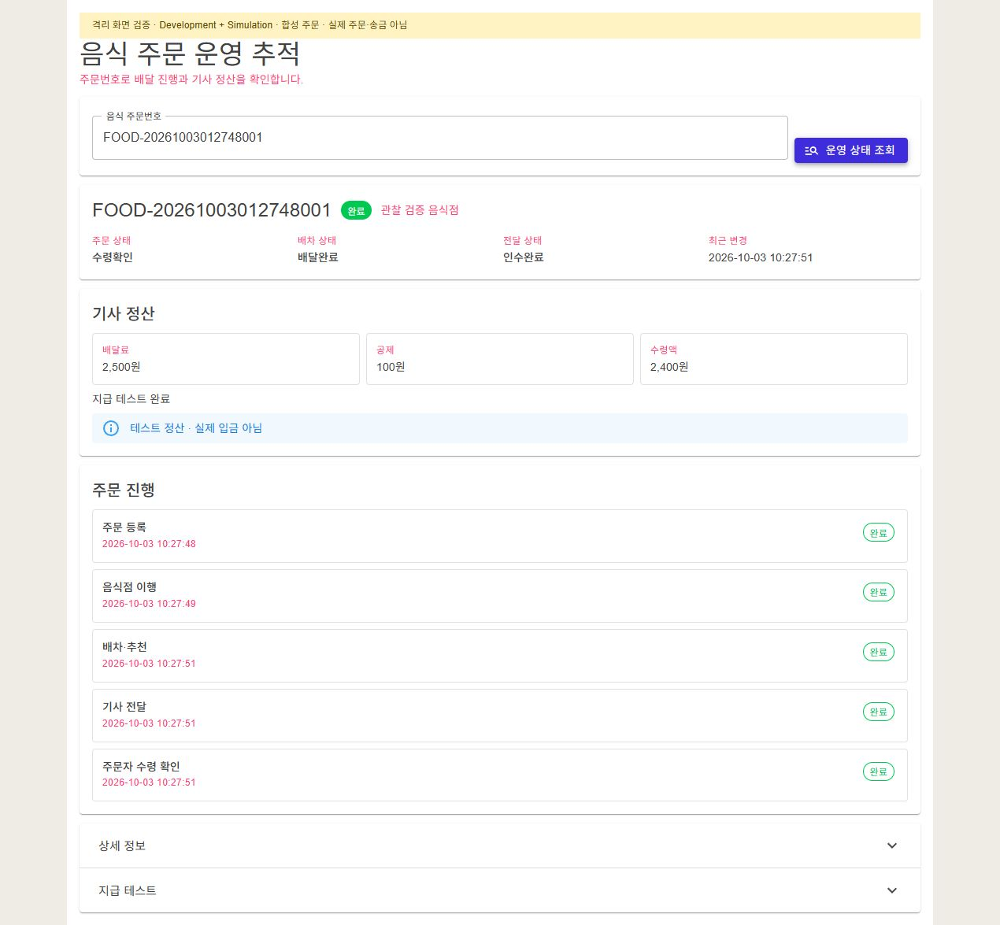

# 주문자·기사·관리자 화면 정보 정리

| 커밋 | 화면 변경 | 검증 수준 |
| --- | --- | --- |
| 커밋 전 | 주문자 기술/중복 설명 제거, 기사 배달/정산 중심 정리, 관리자 상세·지급 테스트 접기 | Android 기사 APK와 실제 공유 Razor의 격리 브라우저 조회. Fast 81/81·전체 build 통과. 전체 시험 5,593/5,600, 작업 전과 같은 7실패 |

[화면과 코드 연결 r2](../ProjectOverview/page-docs/ui-user-simplification-r2.md). 기존 원장·요금·상태 전이·모의 지급 조건을 유지했다.

## 실제 화면

기사의 기본 화면은 요청·수행·정산에 집중하고 월 이용료는 내 정보로 옮겼다. 아래는 실제 API 36 에뮬레이터의 Debug APK다. 합성 주문의 테스트 정산이며 실제 입금이 아니다.

| 기사 정산 | 내 정보 |
| --- | --- |
|  |  |

주문자는 412px에서 제목과 주문하기 버튼, 주문 목록과 수령 완료 단계를 확인했다. 실제 공유 페이지를 정상 인증/Client로 연결한 격리 브라우저이며 전체 MAUI shell 검증은 아니다. 상단 노란 안내는 검증 호스트 표시이며 제품 UI에 추가하지 않았다.

| 주문 목록 | 주문 상세 |
| --- | --- |
|  |  |

관리자는 진행 단계·정산·경고를 기본 화면에서 확인하고 내부 ID·원장/Outbox 설명과 지급 테스트는 펼칠 때만 확인한다. 실제 서버 재조회와 두 패널의 접기·펼치기를 확인했으며 지급 실행 버튼은 누르지 않았다.

유효 지도 타일·물리 휴대폰·운영 데이터·실제 송금은 이번 검증에 포함하지 않았다. 정산 시각·금액은 격리 합성 주문 기준이다. 원시 근거는 `artifacts/local/ui-user-simplification-r2/`, 최종 Task는 `artifacts/local/validation/20261003-110315/`다.
