# 역할 앱 시각 디자인 정돈

| 커밋 | 화면 변경 | 검증 수준 |
| --- | --- | --- |
| 커밋 전 | 기존 내용·기능을 유지하고 주문자·음식점·기사·관리자의 색, 글자, 여백, 표면과 조작 표현을 정돈 | 최종 Android3앱·관리자 웹 실행. 관련131/131·전체 build 통과. 전체5,648/5,655, 기존7실패·새 실패0 |

[공식 자료와 시각 기준](../Architecture/RoleAppVisualDesignStandard.md) · [페이지 책임·소스 연결](../ProjectOverview/page-docs/visual-design-r1.md). Material·Apple HIG·Carbon·WCAG의 공식 자료를 조사한 뒤 중립 배경, 청록 강조, 일관된 위계·간격과 조작 크기를 정했다. 구체적인 색과 크기는 프로젝트의 선택이며 접근성 적합 인증을 받은 것으로 표현하지 않는다.

## 무엇을 바꿨는가

기존 22개 제품 표현 경로에서 큰 그림자와 장식 배경을 줄이고, 제목·상태·금액·주 행동이 서로 구분되게 다듬었다. 목록은 행이나 여백으로 묶고 중첩 표면을 절제했다. Android 네이티브 조작은48 DIP, WebView 주요 조작은48 CSS px를 목표로 하며 서로 같은 단위라고 설명하지 않는다. 기존 시험의 조작 크기 검증1개도44에서48 기준으로 갱신했다.

기사 앱 초기화1개 경로도 보완했다. 실제 시작에서 전역 스타일보다 MainPage가 먼저 생성되는 자원 조회 실패를 재현했다. App 조립 지점에서 전역 자원을 초기화한 뒤 기존 페이지를 생성하도록 순서를 고치고, 페이지 자원을 중복 병합하던 중간안은 제거했다. 모델·DI 등록·Window 이벤트·서버 행동은 유지한다.

문구·바인딩·명령·활성 조건·오류·미확정 표시와 API/DB 연결을 보존한다. 금액·주문 상태·요율을 디자인 변경으로 바꾸지 않으며 기존 수령정보, 상세 정보, 지급 테스트의 접기 조건도 유지한다. 관련 없는 dirty 작업의 HEAD 차이를 이번 작업의 변경량으로 해석하지 않는다.

## 실제 전후 화면

아래는 기존 합성 계정/주문을 사용하는 실제 화면이다. 각 화면의 스크롤 위치와 재조회 시각은 다를 수 있으며 픽셀 차이 전체를 디자인 변경량으로 해석하지 않는다. 최종 PNG는 `docs/assets/changes/2026-10-03-visual-design-r1/`에 보관한다.

| 역할 | 변경 전 | 변경 후 |
| --- | --- | --- |
| 주문자 음식 내역 | 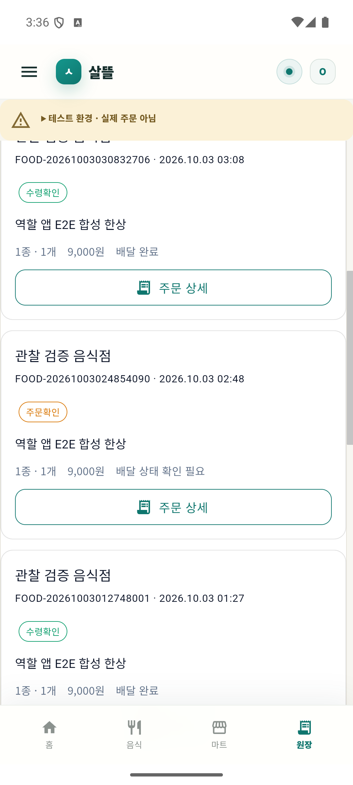 | 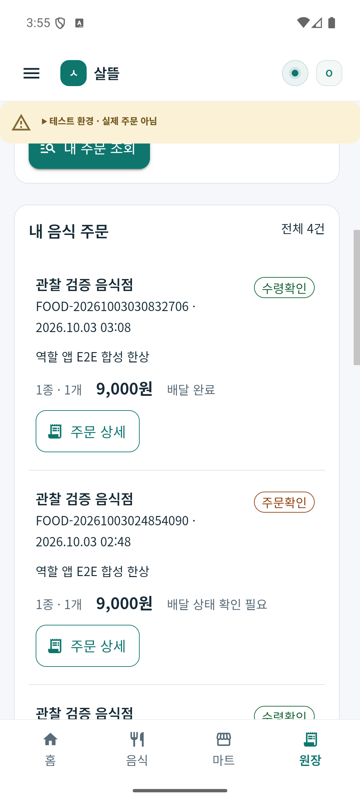 |
| 음식점 주문 목록 | 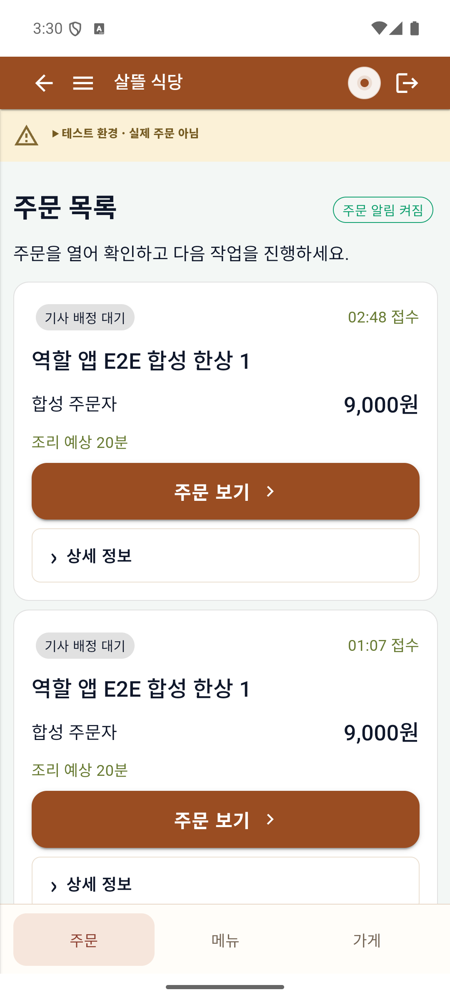 | 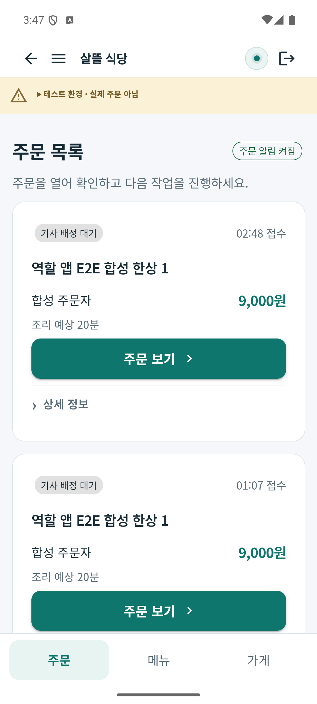 |
| 네이티브 기사 | 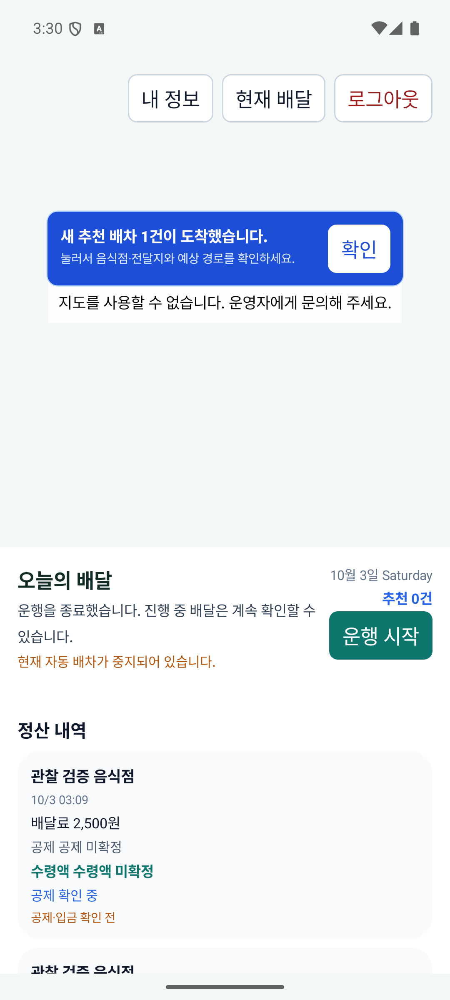 | 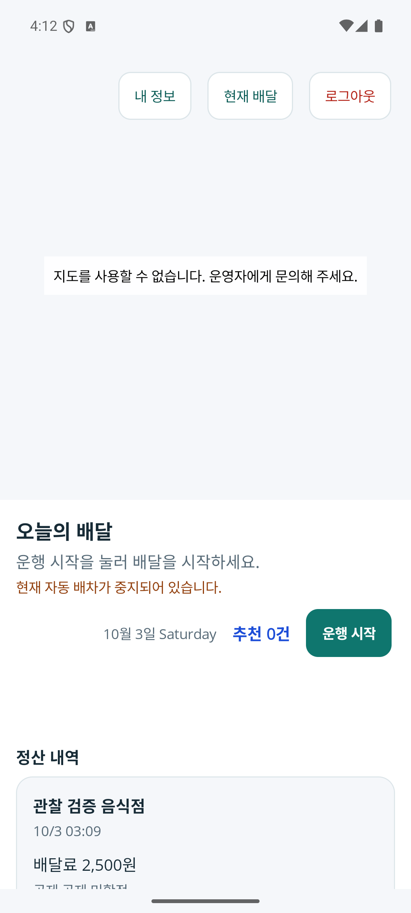 |
| 관리자 주문 추적 | 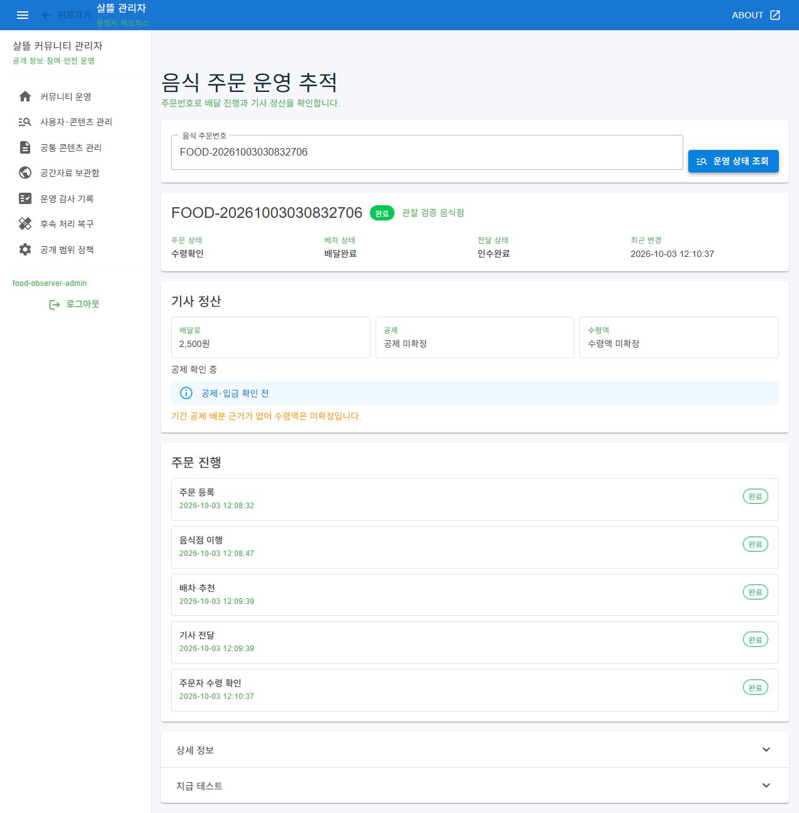 | 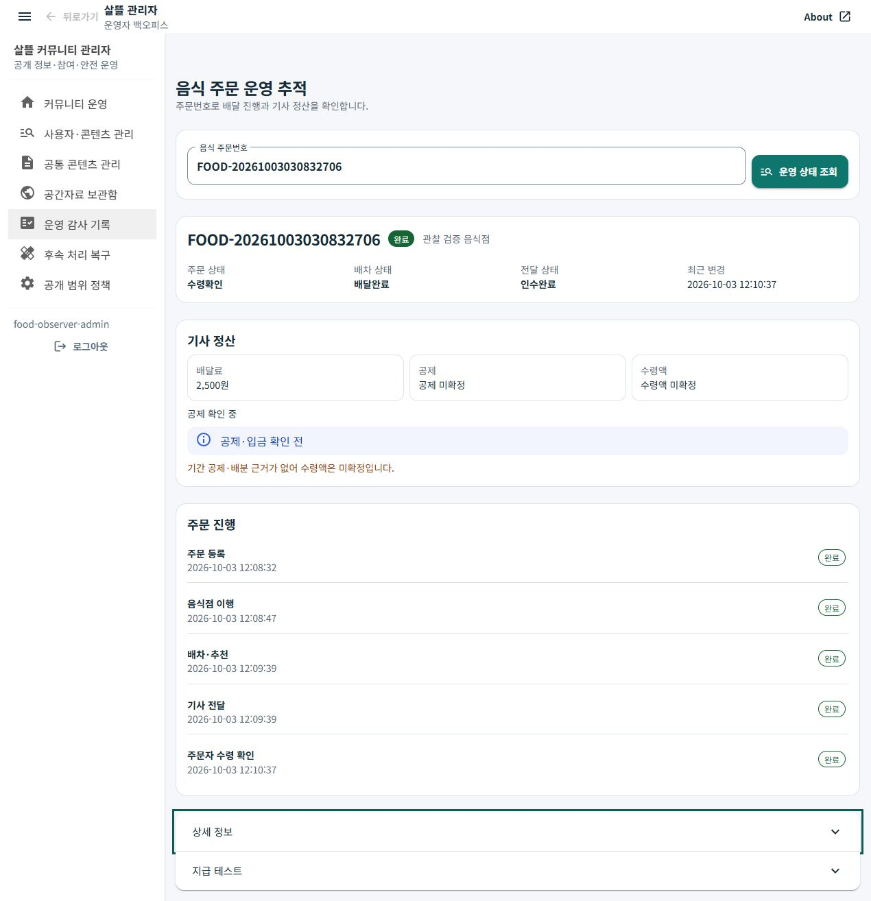 |

관리자는 실제 `SsalddelAdmin` 웹 호스트에서 데스크톱과320px 화면, 키보드 Tab의3px 포커스와 주문 미발견 상태를 확인했다. 합성 주문의 금액·상태와 미확정·테스트 안내를 유지한다. 관리자 로그인 입력 조작과 실제 입금의 증거는 아니다.

음식점은 실제 Android WebView에서412px·320px 주문 목록과 상세를 확인했다. 현재 단계의 행동과 금액을 구분하고 오류·보조 정보는 기존 조건대로 표시한다. 음식점 전후 소스 대조에서 `@code`와 표현 속성 외 마크업의 동일성을 확인했다.

주문자는 최종 Android APK의412px·320px 목록/상세·수령 완료를 확인했다. 기존 주문4건·각9,000원·완료/확인 상태를 유지하며 하단 메뉴가 스크롤 영역 밖에 배치되어 마지막 진행 상태 새로고침과 겹치지 않는다. 전체 화면 테마 상속과 개별 페이지 실행 확인은 구별한다.

기사 변경 전의 남은 추천 알림은 재로그인 후 서버 추천0건으로 갱신되었다. 알림 컴포넌트나 표시 조건을 삭제한 결과가 아니며, 소스 보존 검사에서 해당 바인딩·조건을 대조했다. 기존 배달료2,500원과 공제·수령액 미확정을 유지한다.

최종 기사 APK는 정상 시작·로그인 복원,320 DIP 화면과 Android 글자 설정2.0을 확인했다. 제목/설명은 전체 폭을 쓰고 날짜/추천/운행 버튼은 줄바꿈된다. 정산도 전체 폭의 별도 행으로 표시되어 스크롤로 공제·수령액·확인 안내를 모두 읽을 수 있다. 설정2.0을 모든 글자가 정확히2배이거나 Web200% 확대를 검증한 것으로 해석하지 않는다. 검증 뒤 크기·글자 설정을 원래 값으로 복원했다.

| 좁은 폭·포커스 확인 | 실제 화면 |
| --- | --- |
| 음식점320px 목록 | 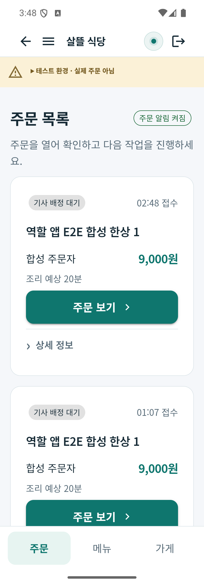 |
| 음식점320px 상세 | 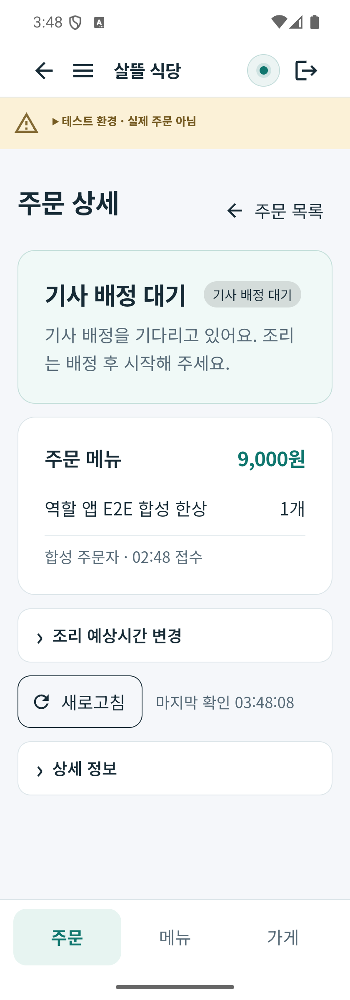 |
| 주문자320px 수령 완료 | 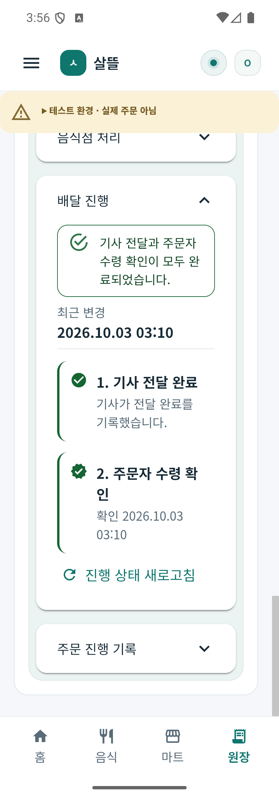 |
| 관리자320px 키보드 포커스 | 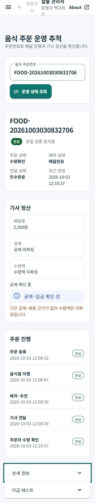 |
| 기사320 DIP·글자 설정2.0 요약 | 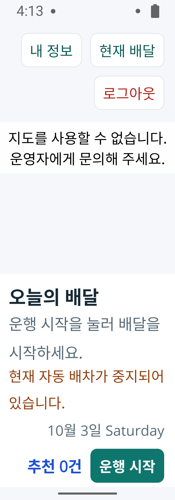 |
| 같은 설정의 정산 스크롤 | 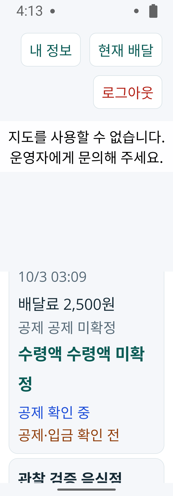 |

## 검증 상태와 남은 확인

| 검증 | 현재 결과 |
| --- | --- |
| 소스 보존 대조 | Root Razor3개와 음식점 @code/표현 외 마크업 동일. 기사104바인딩·75표시값·22조건·명령/이벤트 보존. App 조립 순서 변경은 별도 정규화 대조. 최종24경로 지문 결속 |
| 관련 시험 | Fast131/131 통과. 최종 전체 Task의 같은131개도 모두 통과 |
| 전체 Task | `20261003-131243`: 전체3.5 build 통과,5,648/5,655. 기준 `20261003-120201`과 실패7개 이름·오류·실패한 시험 소스 위치 동일, 새 실패0. 런타임 reflection frame 차이는 원시 기록에 별도 보존. 전체 게이트는 미통과 |
| 관리자 실제 웹 | 데스크톱·320px, Tab 포커스·미발견 상태 확인 |
| 음식점 Android | 412px·320px 목록/상세 확인 |
| 주문자 Android | 최종412px·320px 목록/선택 상세/수령 완료, 하단 메뉴와 스크롤 분리 확인 |
| 기사 Android | 초기 자원 생성 순서 실패 수정 후 최종 시작/인증 복원·320 DIP·글자 설정2.0·정산 스크롤 확인 |
| PNG·APK 지문·링크 | 최종 Debug APK3개 로컬/설치 SHA-256 일치. 실제 전후 PNG 보존, 기준·적용·시각 문서의 로컬 참조 확인 |

공통 테마를 상속하는 화면과 이번에 수동으로 정리·실행 확인한 대표 화면은 별개다. 전수 페이지의 디자인 준수나 모든 빈/로딩/오류 상태를 검증했다고 보고하지 않는다. 기사 정산·내 정보와 관리자 지급 테스트의 독립 업무 분리는 기존 책임 점검의 후속 범위로 남는다.

Community/Figma 디자인과 동기화는 별도 범위다. Web 글자 확대·다크 모드·물리 기기·유효 지도 타일·실제 경로·운영 주문·실제 송금은 이번 실행 확인 범위에 포함하지 않는다. 새로운 기능·페이지·요율·결제 흐름을 추가하지 않았으며 배달 영상·MYBOX·커밋·푸시도 변경하지 않았다.

원시 캡처·소스24경로·설치 APK3개·회귀 비교는 Git 제외 `artifacts/local/visual-design-r1/verification.json`과 같은 폴더에 보관한다. 음식점·기사의 보존 대조는 각각 `artifacts/local/ui-design-r1/`와 `artifacts/local/ui-modern-design-r1/`에 있다. 임시 관리자 호스트/검토 탭을 정리하고 bootstrap 자격 사본을 비웠으며 기존 서버와 검증 계정/주문은 보존했다.
