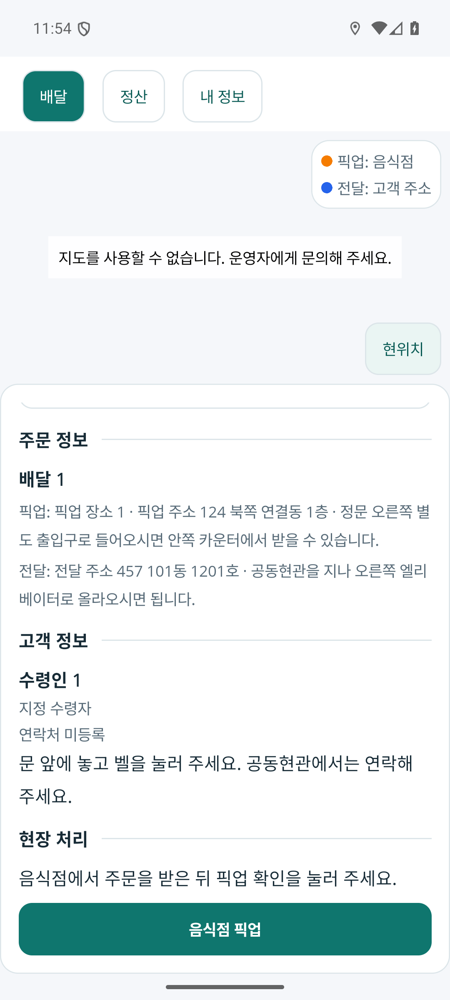
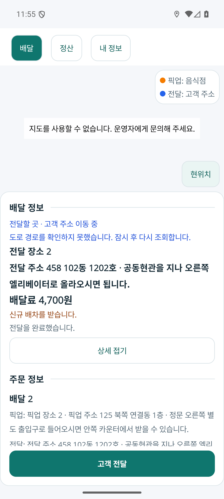
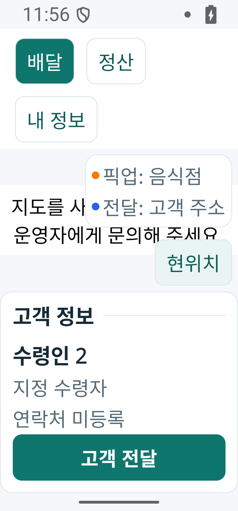

# 기사 배달 카드 정보 섹션 구분

2026-10-04. 현재 배달 카드에서 주문·고객·현장 처리 정보가 이어져 보여 찾기 어려웠다. 같은 카드 안에 제목과 얇은 구분선을 넣어 정보의 맥락을 나눈다. [페이지 책임 카드](../ProjectOverview/page-docs/driver-workspace-sections-r1.md#카드-내부-정보-구분-r3--구현-전-책임-카드)와 [시각 기준](../Architecture/RoleAppVisualDesignStandard.md#나열감을-줄이는-구성-규칙)을 따른다.

## 화면 구성

| 섹션 | 기존 정보와 행동 |
| --- | --- |
| 배달 정보 | 현재 목적지·전체 주소·배달료·진행 및 경로 안내 |
| 주문 정보 | 주문 요약·픽업 장소·전달 주소 |
| 고객 정보 | 실제 수령인·주문자와의 관계·연락처·전달 요청 |
| 현장 처리 | 다음 행동 안내·가게 도착·현장 중단 |

기본 카드와 상세 접기를 유지한다. 고객 정보의 제목·선도 기존 정보의 가시 조건 안에 있다. 본문은 스크롤하고 현재 단계의 주요 버튼은 카드 아래에 고정한다. 메뉴·수량·음식값 등 현재 없는 정보는 추가하지 않았다.

사용자 후속 요청으로 다른 배달 목록·선택 버튼을 제거했다. 현재 배달을 픽업하면 같은 건의 전달 정보로 바뀌고, 전달을 완료하면 다음 남은 배달의 주문·고객·주소·배달료와 주요 버튼이 같은 카드에 표시된다. 서버 재조회에서 완료한 건이 빠지면 다음 남은 건을 선택하는 기존 흐름을 사용한다.

## 코드와 검증

제품 변경은 `FDriverApp/Pages/MainPage.xaml`의 표시 구성과 카드의 다른 배달 선택 제거에 한정한다. 남은 정보·수행 버튼의 바인딩·명령·금액·상태·API/DB와 카드 높이·지도 공간 계산은 유지한다. 선은 기존 중립 경계색의 1 DIP이며 라이트·다크 테마 자원을 따른다. 제목은 기존 섹션 글자 스타일과 접근성 제목 레벨을 사용한다.

| 확인 | 결과 |
| --- | --- |
| Fast `20261004-084828` | FDriverApp 빌드·변경 검사 통과. XAML 변경 범위의 자동 계획은 테스트를 생략한다. |
| Task `20261004-085233` | 전체 솔루션 빌드 통과. 테스트 6,315/6,322 통과, 기존 7개 실패. 기준 `20261004-033045`와 결과 변경 0개이며 실패 이름·오류·전체 스택이 동일하다. 전체 게이트는 미통과다. |
| 설치본 | Debug APK 생성 및 Android 에뮬레이터 설치. 보관 APK와 설치 APK의 SHA-256 일치. |
| 현재 업무 전환 | 앱에서 배달 1 픽업 → 같은 건의 고객 전달 → 완료 후 배달 2의 주소·4,700원·주문·수령인·주요 버튼 자동 표시 확인. 카드에서 다른 배달 목록이 나오지 않는다. |
| 좁은 화면·큰 글자 | 320 DIP·글자 배율 2.0에서 고객 정보 읽기, 본문 양방향 스크롤, 하단 전달 버튼 유지 확인. 실행 후 화면 크기·글자 배율을 원래 값으로 복원했다. |

설치본 SHA-256: `9FA95BDA5E2BD11C1AF957D20151F23F02CEF4B5849F3B040CB237AC69072D74`.

### 확인 화면

한 카드 안의 정보 구분과 고정 행동:

전달 완료 후 다음 건이 같은 카드에 표시되는 화면:

320 DIP·글자 배율 2.0에서 고객 정보와 고정 전달 버튼:

이번 실행은 실제 Android 앱과 로컬 예시 HTTP 응답의 연결 검증이다. 실제 인증·DB·배차·배달·송금은 실행하지 않았다. NAVER SDK ID 미설정으로 실제 지도 타일·핀·도로선·지도 제스처 및 물리 단말은 미검증이다. 명령 실패 시 현재 건 유지와 완료 후 서버 조회 실패 시 재조회 필요는 기존 동작이며, 이번에는 성공 흐름을 화면에서 확인했다.

최종 원시 근거와 검토용 APK는 Git 제외 `artifacts/local/driver-card-focus-r2/`에 보관한다. 이전 섹션 초안의 실행 기록은 `artifacts/local/driver-card-sections-r1/`에 보존한다. 다른 작업의 변경·커밋·푸시는 이번에 다루지 않았다.
