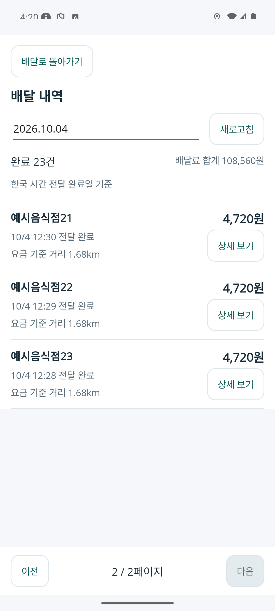
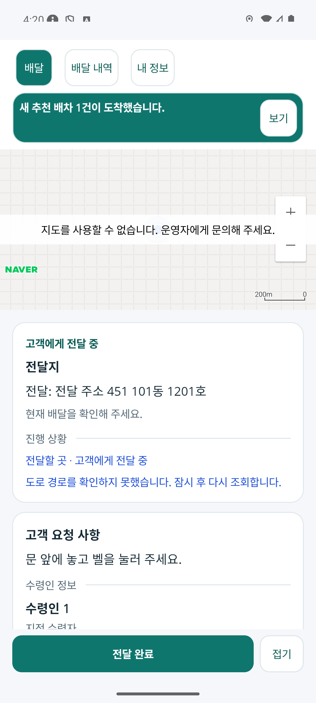

# 기사 내역 조회 중 업무 갱신과 기존 지도 SDK 확인

2026-10-04. 완료 배달의 목록·상세를 보는 동안 현재 배달의 갱신과 위치 전송이 멈추던 페이지 수명 연결을 보완했다. 앱이 활성인 동안에는 내역에서도 수행 상태·위치·새 추천을 갱신하고, 수행 화면으로 돌아오면 최신 단계와 추천을 표시한다. 숨겨진 수행 화면의 지도 경로 조회와 새 위치 권한 대화상자는 실행하지 않는다.

앱 중단·로그아웃·계정 변경·기사 권한 상실은 업무 수명을 끝낸다. 재개 시 현재 화면의 내역 권한 조회와 수행 정본 조회를 함께 실행한다. 같은 계정의 토큰 갱신은 기존 업무 수명을 유지한다. 겹친 재개 요청과 중단 직전의 늦은 응답이 새 감시 또는 위치 리스너를 중복 생성하지 않도록 현재 취소 수명에 결속했다.

[페이지 책임 카드 r3](../ProjectOverview/page-docs/driver-completed-delivery-detail-r1.md)가 현행 기준이다. 목록·상세의 독립 route와 날짜/페이지 복귀, 완료 후72시간의 주문·고객 열람 기한, 기존 요금·정산 원장은 유지했다. 기존 SDK ID는 검토 빌드의 프로세스 환경에만 연결했고 제품 소스·서버 자격 설정·API·DB·지도 공급자를 변경하지 않았다.

## 소스와 시험

제품 변경5경로는 [수행 PageModel](../../FDriverApp/PageModels/MainPageModel.cs), [위치·지도 수명](../../FDriverApp/PageModels/MainPageModel.FoodMap.cs), [추천 알림](../../FDriverApp/PageModels/MainPageModel.FoodNotifications.cs), [앱 Window](../../FDriverApp/App.xaml.cs), [수행 Page](../../FDriverApp/Pages/MainPage.xaml.cs)다. 시험/연결2경로는 [업무 수명 시험](../../Ssalddel.Tests/Clients/FDriverWorkspaceLifetimeTests.cs)과 [시험 지원](../../Ssalddel.Tests/Clients/FDriverLifecycleTestSupport.cs)다.

- Fast `20261004-130629`: 기사 앱·시험 프로젝트 빌드, 관련224/224 통과. 내역의 업무 유지·숨겨진 지도 요청 억제·권한 대화상자 억제·중단/재개·늦은 응답·계정/역할·같은 계정 토큰 갱신을 포함한다.
- Task `20261004-130807`: 전체3.5 빌드 통과,6,437/6,444 통과·기존7실패. 기준 `20261004-123633`과 기존 결과 변경0·추가12건 전부 통과·기존 실패 이름/오류/전체 스택 동일이다. 전체 게이트는 미통과다. 기존 API metadata/분류·통합 beta route·HIOPS 문구·재료 카드 실패를 이 수정으로 해결했다고 표시하지 않는다.
- 격리 HTTP13개 검증: 실제 Controller→UseCase→EF SQLite 조회와 정산 Recorder로 본인23건·다른 기사 제외·본인 완료 상세·동결 요금·정확한 기한 경계·기간 후 금융 정보 유지·개인정보 제외를 확인했다.

진행2건의 운송/시도 행과 유효 추천1건은 검토용 업무 Adapter다. 로그인·운행·위치 수신도 검토용 Bridge이며 실제 배차 엔진·운영 DB·실제 배송·지급을 검증한 것은 아니다. 아래 Android 화면은1080×2400·density420·글자1.0의 전용 에뮬레이터다. 사용자 모바일에 설치한 결과는 아니다.

## 실제 내역 왕복과 중단/재개

| 상세에서 목록 복귀 | 수행 화면 복귀 |
| --- | --- |
|  |  |

[날짜별 목록](../assets/changes/2026-10-04-driver-history-lifetime-map-r1/list-page-one.png)과 [21~23번째2페이지](../assets/changes/2026-10-04-driver-history-lifetime-map-r1/list-page-two.png)를 보고,21번째 행의 [상세](../assets/changes/2026-10-04-driver-history-lifetime-map-r1/detail-loaded.png)에서 [주문·고객 카드](../assets/changes/2026-10-04-driver-history-lifetime-map-r1/detail-private.png)를 확인했다. 뒤로는 [같은 날짜·2페이지](../assets/changes/2026-10-04-driver-history-lifetime-map-r1/list-restored.png)로 복귀했다. 표시 금액·메뉴·주소·고객은 예시다.

목록 조회 중에는 자동 업무 조회5회·위치 전송3회, 상세의 안정된 조회 구간에는 업무 조회19회·위치 전송9회를 확인했다. 상세 HTTP가12.007초 대기하는 동안에도 업무 조회1회·위치 전송1회가 진행됐다. 상세를 본 상태에서 검토 서버의 현재 건을 전달 단계로 바꾸고 새 유효 추천을 교체했다. [수행 복귀 화면](../assets/changes/2026-10-04-driver-history-lifetime-map-r1/work-after-history.png)은 `고객에게 전달 중`과 새 추천 배너를 표시했고, 추천을 자동 수락하지 않았다.

안정 구간의 위치 요청 간격은 약20초다. 기존10초 최소 전송 조건·업무 타이머와 기기 위치 수신 시점의 조합이며 이번 수정에서 주기를 바꾸지 않았다. 명시적인 수행 재진입은 초기 위치 재조회/전송을 별도로 수행한다. 안정 구간을 떠난 뒤 이 명시 요청까지 자동 타이머 중복으로 계산하지 않았다. HTTP 간격은 단일 네이티브 GPS 리스너의 직접 계측이 아니며 단일 소유는 상태 시험으로 별도 검증했다.

상세에서 HOME으로 내린 후 진행 중 요청이 끝난 상태를 약29초 관찰했다. 자동 업무 조회/위치 전송0회였다. 다시 열면 [같은 선택 상세](../assets/changes/2026-10-04-driver-history-lifetime-map-r1/detail-resumed.png)를 재조회하고 업무 조회와 위치 전송도 재개했다. 검토 서버 시각만72시간 이후로 옮긴 후 [열람 종료 화면](../assets/changes/2026-10-04-driver-history-lifetime-map-r1/detail-expired.png)에서 주문·고객 카드가 제외되고 배달료4,720원·공제160원·수령액4,560원·저장 요금 구성은 유지됐다. 기기 시각 변경이나 실제3일 경과를 기다린 검증은 아니다.

첫12초 지연 표본에는 위치 타이머가 겹치지 않아 병행 위치 검증이 충족되지 않았다.20초 표본은 기존 HTTP timeout으로 실패 안내가 나왔으며 근거를 보존했다. 동일 제품에서 다음12초 요청과 자동 위치 타이머가 겹친 표본으로 성공/병행을 확인했다. 시험을 통과시키기 위해 제품 timeout이나 위치 주기를 바꾸지 않았다.

## 기존 네이버 지도 설정과 경로 조회

기존 화물 기사 앱의 SDK 리소스와 Git HEAD가 같고 현재/legacy ID가 일치함을 확인했다. 음식 기사 앱은 `kr.ssalddel.fdriver`, 기존 화물 기사 앱은 `kr.hongdal.driver`로 패키지가 다르다. 기존 ID가 음식 기사 앱에도 등록됐는지는 확인되지 않았다. 서버의 Git 제외 Local 설정에 있는 Directions 자격은 기존 SDK와 같은 ID였고 실제 서비스 구현을 사용해 자동차 도로 경로3개를 조회했다. 외부 HTTP3건 모두200·provider code0이다.

| 도로 응답 | 거리 | 경로점 | 확인 범위 |
| --- | ---: | ---: | --- |
| 검토 위치→현재 픽업 | 1,735m | 87 | 실제 Directions5 자동차 응답 |
| 검토 위치→현재 전달 | 1,957m | 103 | 실제 Directions5 자동차 응답 |
| 다른 건 픽업→전달 | 618m | 41 | 실제 Directions5 자동차 응답 |

좌표는 검토용 공개 지점이며 실제 고객 경로가 아니다. 원본3개와 묶음의 SHA-256에 결속한 사본을 Android 검토 Bridge에서 재사용했다. 기기 NMEA 좌표는 원래 검토 시작점과0.205m 차이가 있어 사본 매칭에서0.5m 이내의 반올림 차이만 허용하고 요청/제공자 좌표와 형상은 보존했다. 다른 위치의 응답은 계속 추정이며 비교5개가 통과했다. 앱의 [픽업 경로 거리/시간](../assets/changes/2026-10-04-driver-history-lifetime-map-r1/provider-pickup.png)과 [전달 경로 거리/시간](../assets/changes/2026-10-04-driver-history-lifetime-map-r1/provider-dropoff.png)에 각각1.7km·약6분과2.0km·약7분이 표시됐다. 거리·시간의 표시 확인과 지도 위 도로선 확인은 별개다. 검토 GPS·사본 재생·실제 제공자 조회를 구별하며 오토바이 통행 가능성 또는 운영 API/실제 배송으로 확대하지 않는다.

SDK3.23.2는 `NCP_KEY_ID`가 있으면 새 `NcpKeyClient`를 선택하고, 해당 값이 없는 경우 legacy `CLIENT_ID`의 `NaverCloudPlatformClient`를 선택한다. 인증 실패 후 자동 fallback은 없다. 기존 화물 Manifest에 두 항목이 모두 있다는 사실로 legacy ID 타입을 확정할 수 없다. [공식 SDK 시작 안내](https://navermaps.github.io/android-map-sdk/guide-ko/1.html)와 [SDK 인증 타입](https://navermaps.github.io/android-map-sdk/reference/com/naver/maps/map/NaverMapSdk.html)을 대조했다.

동일 ID·동일 음식 기사 패키지로 두 Debug APK를 비교했다. 제품 Manifest 그대로의 `NCP_KEY_ID` 빌드와 Git 제외 Manifest override로 `CLIENT_ID`만 선언한 검토 빌드 모두 [지도 인증 실패 안내](../assets/changes/2026-10-04-driver-history-lifetime-map-r1/legacy-map-auth-failed.png)가 나타났다. 빈 SDK 배경에서 주황/파랑 선의 일부가 그려지는 것은 확인했지만 실제 타일과 도로의 정합·전체 경로·픽업/전달 핀·회색 참고선과 지도 제스처는 검증 완료가 아니다. 정확한 provider 오류 코드가 없으므로401·429·800 또는 패키지 등록 오류로 원인을 단정하지 않는다. [Directions5 성공](https://api.ncloud-docs.com/docs/application-maps-directions5)은 SDK 지도 서비스 인증 성공과 다른 근거다.

추가로 확인할 항목은 Naver Cloud의 해당 Application에서 기존 키 타입, Mobile Dynamic Map 서비스 선택/사용 상태, Android 앱 패키지 `kr.ssalddel.fdriver` 등록, 오류 코드와 사용 제한이다. 콘솔의 계정·키·서비스·허용 패키지는 이번에 변경하지 않았다. 키 값은 문서·PNG·소스·CLI·진단 출력에 기록하지 않았다.

## 실행 근거와 인계

내역 수명 검증의 설치 APK SHA-256은 `BACD467D20DBA472651C731E051142449944E5FE04FAD07F48A383FC3983B815`, legacy 인증 비교 APK는 `4352AE7FB9B86DFE4372C06A7FC0705CA86DEA3E66D7B6B947A41CDF2DAFB930`이며 각각 보관/설치 사본이 일치했다. SDK 포함 APK와 제공자 원본·원시 로그는 Git 제외 `artifacts/local/driver-history-lifetime-r1/`에서만 보관한다. 제품/시험7경로의 최종 지문과 문서 PNG11개의 원시/사본 지문이 모두 일치한다. 키 값을 주입한 빌드 프로세스는 종료됐으며 private helper의 미설정 환경 복원(null/빈 문자열 차이)도 별도 보완·확인했다.

운영 DB·물리 휴대폰·실배달·FCM/강제 종료 신규 수신·은행/PG 입금·운영 배포는 별도다. 기존 [목록·상세 r2 실행](2026-10-04-driver-history-routes-r1.md)과 이전 SDK 미설정 기록은 이력으로 보존한다. 전용 GPS/Bridge/Backend/에뮬레이터4개는 PID·시작 시각·실행 파일과 전용AVD를 확인한 뒤 정리했고5374/5375와 본 작업의ADB reverse를 해제했다. 공유ADB 서버는 중단하지 않았다. 다른 dirty 작업과 배달 영상/MYBOX를 유지하며 커밋·푸시는 하지 않았다. 문서6개의 link 대조에서 기존 누락1개 외 새 누락0, 문서 Fast `20261004-132950`와 diff 검증도 통과했다.
