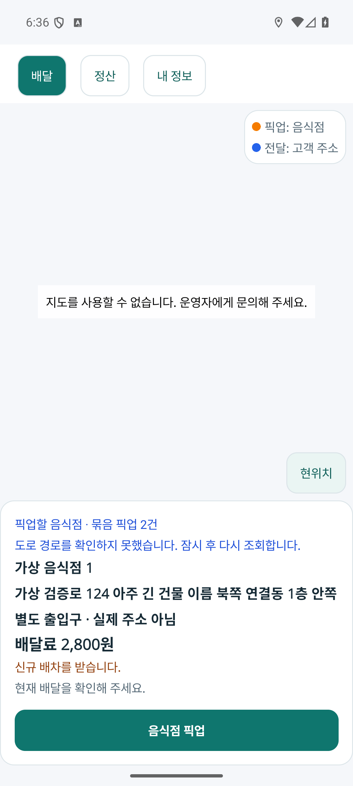
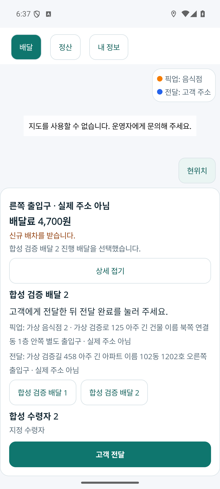
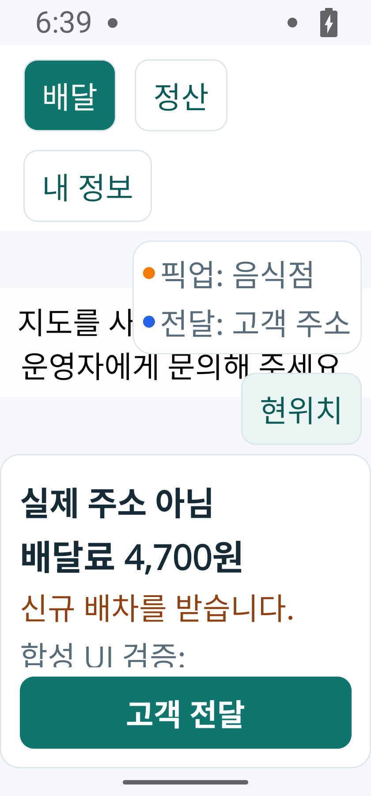

# 음식 배달 기사 지도 중심 수행 화면 r2

2026-10-04. 현재 처리하는 한 건의 다음 목적지·전체 주소·배달료와 행동을 지도 아래 카드로 묶었다. [구현 전 책임 카드](../ProjectOverview/page-docs/driver-workspace-sections-r1.md#지도-중심-수행-화면-보완-r2--구현-전-책임-카드)를 따른다. 기존 배달·정산·내 정보 및 인증·현장 예외 흐름을 유지한다.

사용자 후속 요청으로 예시 화면 문구와 설명을 [일반 UI·UX 용어](2026-10-04-driver-ui-language-r1.md)로 정리했다. 이 문서의 기존 캡처와 검증 기록은 해당 실행 시점의 이력으로 보존한다.

## 화면과 상태

- 현재 건의 픽업 핀은 주황, 전달 핀은 파랑이며 다른 건의 핀은 회색이다. 현재 건은 GPS에서 다음 목적지 하나까지, 다른 수락 건은 픽업→전달 참고 경로로 구별한다. 회색 참고 도로선을 먼저 그리고 현재 도로선을 위에 그린다. 추정 응답은 실선으로 그리지 않는다.
- 아래 카드의 기본 정보는 현재 건의 전체 주소·단계·개별 배달료와 서버가 허용한 주 행동이다. 상세·다른 배달·수령 정보 및 운행·신규 수신 설정을 펼칠 수 있다. 카드 본문은 스크롤하고 주 행동은 고정한다. 카드 전체는 접었을 때 사용 가능 높이40%, 펼쳤을 때70% 이내다. 큰 글자에서도 지도 범례와 현위치 버튼이 겹치지 않도록 두 컨트롤의 실측 높이와 여백을 지도에 우선 확보한다.
- 에뮬레이터에서 전체 화면의 당겨서 새로고침이 카드의 역방향 스크롤을 가로채는 문제를 확인했다. 새로고침을 배달 카드 본문·정산·내 정보의 각 스크롤 영역으로 제한했다. 지도 조작과 고정 주 행동은 새로고침 영역 밖에 둔다.
- 핀/목록은 명시적인 기존 배달 선택을 사용한다. 완료 후 기존 서버 목록의 다음 건을 표시하며 앱이 배차 순서를 최적화하지 않는다. 서버가 픽업 완료를 확인한 뒤 파랑 전달 경로로 바뀐다. 음식 준비 완료를 가게 도착이나 픽업 버튼 표시만으로 확정하지 않는다.
- 현재 위치는 포그라운드 단일 서비스의1초 수신 요청으로 계속 표시하고 서버 전송은 기존10초 주기를 유지한다. 사용자가 지도를 움직이면 따라가기를 멈추고 현위치 버튼으로 복귀한다. 사용자 줌을 보존한다.
- 최초 위치 권한 요청과 사용자의 `위치 다시 확인`만 권한 대화상자를 요청한다. 자동 복구·재개·서버 위치 전송은 권한을 다시 묻지 않는다. GPS 수신 실패 시 현재 선을 지우고 수신을60초 간격으로 재시도한다. 앱 이탈/중지에서 수신·현재 조회를 취소한다.

## 경로 조회와 실패

`FDriverMapRouteState`는 요청을 한 번에 하나씩 처리하며 현재 건을 우선한다. 선택/단계/목적지가 바뀌면 즉시 현재 경로를 조회하고 같은 다른 건의 픽업→전달 참고 경로는 캐시한다. 이동 재조회는 최소30초 후100m 이동 또는 도로선50m 이탈을 서로 다른 유효 GPS 두 개로 확인한 경우다.30초보다 오래됐거나5초보다 미래인 GPS는 사용하지 않으며 정확도 오류가 큰 위치로 이탈을 확정하지 않는다. 실패·추정 응답은60초 후 재시도한다.

계정·페이지 수명·선택·목적지 판본이 지난 응답은 적용하지 않는다. GPS가 이동한 동안 유효한 같은 목적지 응답을 모두 버리지는 않으며 조회 시 원점·시각·출처를 보존한다. GPS 실패 후에는 새 GPS를 기다린다. 현재 위치 미확인을 지도 중심 좌표로 대체하지 않는다.

페이지 → `MainPageModel.FoodMap/FoodPresentation` → 기존 기사 경로/업무 API를 재사용한다. 네이티브 카메라 상태는 `FDriverMapCameraState`, 기기 수신은 `IFDriverLocationService/FDriverLocationService`가 소유한다. 외부 API DTO·DB·요금·배차·업무 권한을 변경하지 않았다.

## 검증

소스/순수 상태 시험, 프로젝트 빌드, 최종 APK, 에뮬레이터 화면과 실제 지도 제공자 검증을 구별한다.

| 검증 | 결과 |
| --- | --- |
| 범위 Fast | `20261004-033021`: FDriverApp·시험 프로젝트 빌드, 관련265/265, 공백 검사 통과 |
| 전체 Task | `20261004-033045`: 전체 솔루션 빌드 통과,6,315/6,322 통과. 기존7실패가 남아 전체 게이트는 미통과 |
| 작업 전 대조 | 기준 `20261003-234528`의6,266건 모두 유지. 기존 결과 변경·삭제·새 실패0, 기존7실패의 이름·오류·전체 스택 정확히 동일 |
| 신규 시험 | 경로 상태23·카메라13·카드15·모델 통합5, 합계56/56 통과. 이동/이탈·지연 응답·GPS 상실/권한·단일 리스너·단계별 색상/표시 순서·지도 공간 확보 포함 |
| 최종 Android APK | Debug 빌드 오류0·기존 SDK 미설정/Android 알림 경고9. 보관 APK와 설치 후 회수한 APK의 SHA-256 동일: `470AFFE1B61E7AA6364C74C4BF9801414B1A8C44C292DC107A5CCBEEA81106F4` |
| 실제 Android 화면 | 독립 인메모리 HTTP fixture로 현재 건 선택→개별 주소/금액/주 행동 변경, 픽업 확인→전달 단계, 완료→남은 건 표시, 정산/내 정보 왕복, HOME 복귀 후 새 GPS·현위치 활성화 확인 |
| 320 DIP·글자2.0 | 본문 양방향 스크롤·긴 주소/개별 금액·고정 수행 버튼 확인. 펼친 카드에서도 전달 범례 문구의 끝777px와 현위치 버튼 시작843px 사이66px 확보. 화면 크기/글자 설정을 원래대로 복원 |
| 실제 지도 제공자 | SDK ID 미설정으로 타일·실제 핀/도로선·지도 위 제스처·네이티브 카메라 이동은 미검증. 현재/참고 경로와 색상·순서·따라가기의 상태 시험 및 핸들러 연결 검증과 구별 |

Task 실패 상세와 전체 스택 대조는 `task-baseline-comparison.json`에 보존한다. 신규 실패가 없다는 사실과 전체 검증 게이트 통과는 구별한다.

원시 로그·가상 HTTP fixture·APK·검증 지문은 Git 제외 `artifacts/local/driver-map-first-r2/`에 보관한다. 이 fixture는 실제 API/DB·도로 제공자가 아니며 기존 공유 서버/DB를 변경하지 않는다. SDK 설정이 없는 환경의 안내 화면을 지도 타일/도로선 정상 렌더링으로 보고하지 않는다.

최종 APK는 로컬 fixture 주소를 사용하는 검토용 Debug 빌드다. 실제 기사 계정·주소·입금·운영 DB·물리 단말 실행의 증거가 아니다. 작업 중 생성한 이전 APK/캡처와 최종 `release-*` 캡처를 구별하며 `verification.json`에 소스·APK·화면 지문을 결속한다. 이번 작업의 commit/push는 수행하지 않았다.

## 실제 실행 화면

모두 위 최종 APK의 에뮬레이터 캡처이며 상호·주소·수령자는 합성 데이터다. 지도 영역에는 SDK 미설정 안내가 표시된다.

기본 카드: 다음 목적지 전체 주소와 개별 배달료, 고정된 픽업 행동.

다른 수락 건을 선택한 상세 카드: 선택된 건의 금액·단계·수령 정보와 전달 행동. 본문은 스크롤 중인 위치다.

320 DIP·글자2.0: 본문을 금액까지 스크롤한 상태에서도 범례/현위치가 겹치지 않고 전달 버튼을 유지한다. 큰 글자에서 SDK 미설정 안내 일부는 범례 뒤에 가려지므로 안내 화면 전체 가독성은 추가 개선 여지가 있다.

