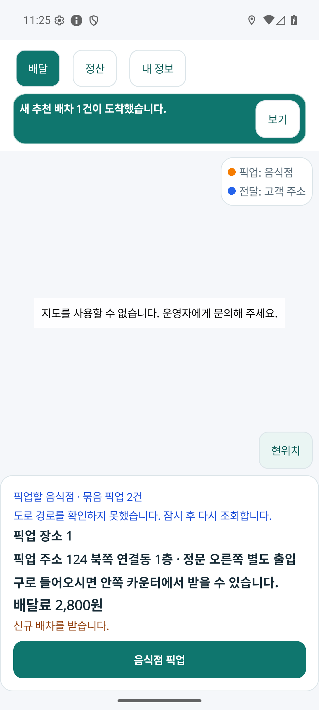
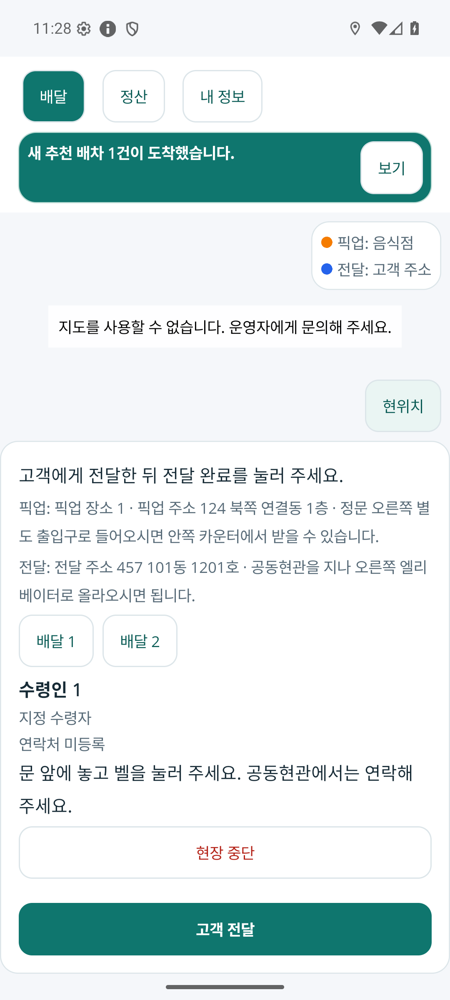
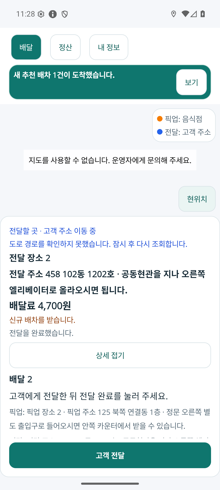

# 기사 앱 화면 문구와 설명 정리

2026-10-04. 기사님이 화면을 이해하기 쉽도록 일반적인 UI·UX 용어로 설명하고, 예시 화면에도 일상적인 배달 문구를 사용한다. [화면 문구 기준](../Architecture/RoleAppVisualDesignStandard.md#화면-문구와-설명)을 따른다.

## 화면 읽는 순서

| 화면 요소 | 확인할 내용 |
| --- | --- |
| 지도 | 내 위치, 픽업 장소, 전달 장소와 이동 경로 |
| 현재 배달 카드 | 지금 갈 장소의 주소, 배달료, 진행 상태 |
| 주요 버튼 | 현재 단계에 맞는 음식점 도착·픽업·전달 완료 |
| 상세 정보 | 다른 배달 선택, 수령인과 전달 요청 |
| 운행·수신 설정 | 운행 시작·종료와 새 배달 요청 수신 |

현재 배달은 픽업 단계에서 주황색, 전달 단계에서 파란색으로 구별하고 다른 배달은 회색으로 표시한다. 상세 정보는 필요할 때 펼쳐 본다. 설명에서는 카드, 목록, 버튼과 기사님의 다음 행동을 중심으로 말한다.

## 문구 정리

예시 화면의 제목은 “배달 1”, 음식점은 “음식점 1”, 목적지는 “픽업 장소 1”·“전달 장소 1”, 받는 사람은 “수령인 1”로 표시한다. 픽업 후에는 “음식을 픽업했습니다”, 전달 후에는 “전달을 완료했습니다”로 안내한다. 오류도 “배달 정보를 불러오지 못했습니다. 잠시 후 다시 시도해 주세요”처럼 필요한 행동을 알려 준다.

이번 표현은 기존 MainPage가 서버 응답의 배달 제목·장소·수령인·안내를 표시하는 방식에 맞춘다. 제품 코드에 해당 개발용 이름이 고정돼 있던 것은 아니며, 앞서 사용한 예시 데이터의 표시값을 정리했다.

## 화면과 검증

새 화면은 같은 기사 앱 APK에 문구를 정리한 예시 데이터를 연결해 확인한다. 배달 처리·금액·색상·지도 갱신 로직은 기존 [지도 중심 수행 화면](2026-10-04-driver-map-first-r2.md)과 같다. 아래 예시 데이터는 실제 배달·입금 기록이 아니며 내부 `synthetic` 표시와 ID·실행 모드는 유지한다. 이전 실행 기록과 캡처도 보존한다.

Android 에뮬레이터에서 현재 배달의 장소·주소·금액, 상세 정보의 배달 선택·수령인·전달 요청, 픽업 및 전달 완료 안내를 확인했다. 아래는 화면을 수정하지 않은 실제 앱 캡처다.

| 현재 배달 카드 | 상세 정보 | 전달 완료 안내 |
| --- | --- | --- |
|  |  |  |

검증한 화면 문구에 “합성 검증 배달” 등 개발용 표시는 없다. 픽업 후 “음식을 픽업했습니다.”, 전달 후 “전달을 완료했습니다.”를 표시하며, 완료 후 다음 배달 정보를 유지한다. 내 정보도 “기사 · 음식 배달 기사”로 표시된다. 예시 데이터 구문 검사와 기존 자체 점검 8개도 통과했다. 제품 소스와 APK는 r2와 동일하며 새 빌드나 배포는 하지 않았다.

지도 SDK ID가 설정되지 않아 실제 지도 타일·핀·도로선은 이번에도 미검증이다. 캡처의 지도 사용 불가 안내를 그대로 보존했다. 문구 확인을 실제 배달 수행·입금 확인으로 확대하지 않는다. 원시 근거는 Git 제외 `artifacts/local/driver-ui-language-r1/`에 보관한다.
