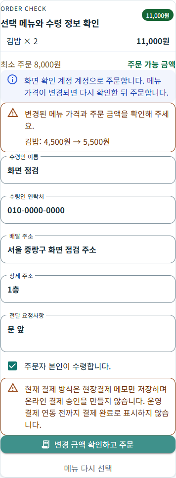

# 주문 작성·조리시간 변경 복구 r2

2026-10-04. 사용자가 후속 보완안의 1번과 4번을 승인했다. [페이지 책임·코드/API·DB](../ProjectOverview/page-docs/order-workflow-polish-r2.md)를 바탕으로 기존 주문 업무에서 변경된 입력과 미확정 요청을 구별했다.

## 변경 결과

| 화면 | 문제 | 수정 후 행동 |
| --- | --- | --- |
| 주문 작성 | 메뉴 비공개·삭제·품절의 예외가 서버 오류가 되어 접수 확인에 머무름 | 저장 전 확정400과 오류 코드를 반환한다. 수령 입력을 유지하고 메뉴 재조회·다른 음식점 선택으로 복귀한다. |
| 주문 금액 확인 | 작성 중 가격이 바뀌어도 확인 없이 최신 금액으로 저장 가능 | 최신 메뉴 GET 후 이전/현재 단가를 표시하고, 변경 금액을 확인하는 버튼에서만 새 ID로 주문한다. |
| 동일 주문 복구 | 이미 접수된 요청이 최신 메뉴 조건 때문에 다시 거절될 수 있음 | 주문자+요청 ID의 기존 결과를 먼저 반환한다. 응답 유실·5xx는 기존 payload/ID를 보존하며 자동 POST하지 않는다. |
| 음식점 조리시간 변경 | 응답 유실 뒤 같은 ID에 다른 시간·사유가 담기고 안내가 입력값을 따름 | 원래 변경 입력·ID·revision을 보존하고 GET 확인부터 수행한다. 이미 처리됐으면 POST 없이 실제 적용 시간을 표시한다. |

추가 선택 필드의 기본값false는 기존 클라이언트의 가격 재계산을 유지한다. 원장·상품·진행 이력은 기존 테이블을 사용하며 스키마·요금·정산·배차 정책을 변경하지 않았다. 저장 후 일반 예외는 확정 입력 오류로 오분류하지 않는다. 같은 계정의 인증 만료와 다른 계정·명시 로그아웃을 구별하며 음식점 요청 복구는 현재 프로세스 메모리 범위다.

## 검증

최종 Fast `20261004-153840`의 관련 **198/198**과 전체3.5 빌드가 통과했다. 서버는 실제 Controller→Handler→메뉴 검증→EF InMemory DB 시험으로 검사했으며 HTTP 호스트 실행과 구별한다. 음식점은 같은 요청의 전체 payload·기존 통신 재시도·GET/POST 순서·충돌·인증 수명과 상세 성공 안내를 검사했다. 상위 화면의 조립 책임을 유지하고, 확정 거절 안내는 주문 상세 영역에 둔다. 조리시간 구조 시험도 요청 객체 직접 생성 대신 보존한 전체 요청으로의 변환을 검사하도록 갱신했다.

Chrome390×844에서 실제 제품 Razor/CSS를 링크한 미리보기의 정상 주문·가격 변경 거절·명시 가격 확인·접수 완료·품절 복귀를 조작했다. 여섯 상태 모두 넘침0·브라우저 오류0이다. 가격 확인 GET 뒤 POST는1회 그대로였고, 확인 버튼 뒤 새 ID·최신 단가·기존 수령 입력으로 두 번째 POST를 보냈다. 정상 주문은1POST, 품절은1POST 뒤 명시 제외 안내와 수령 입력 보존을 확인했다. 서비스·저장소는 모의 메모리이며 실제 운영 API/DB·실기기 검증으로 확대하지 않는다. 격리 브라우저와 미리보기 서버를 종료했다.

최종 Task `20261004-154057`의 **전체3.5 빌드가 통과**했다. 전체 시험은 **6,614/6,621**이다. 기준 `20261004-145843`의 기존7실패와 이름·메시지·전체스택이 정확히 같으며 새실패0·기존결과변경0·삭제0이다. 새43케이스는 모두 통과했다. 전체 시험 게이트는 기존7실패로 미통과다. 대조 원시는 `task-final-result-comparison.json`에 있다.

변경 범위는 제품·시험27경로와 문서·대표 화면7경로다. 제품·시험27경로는 최종 실행 전후 SHA-256 변경0이다. 기존 구조 시험 한 개는 요청 전체를 보존하는 새 구현에 맞춰 변환·확인 경로를 검사하도록 갱신했고 이름과 멱등 재시도·판본 충돌 검사는 유지했다. 수정 전 사본과 최종 지문은 `final-scope-manifest.json`에서 대조할 수 있다.

원시 사본·경로·SHA-256·로그·로컬 미리보기는 Git 제외 `artifacts/local/order-workflow-polish-r2/`에 보관한다. 실제 운영 HTTP/DB·MAUI WebView·물리 단말·앱 재시작·실결제·지도·Unity·영상/MYBOX·커밋·푸시는 이번 작업의 실행 증거가 아니다.

## 실제 주문 작성 화면

실제 제품 Razor/CSS를 연결한 로컬 모의 서비스에서 촬영했다. 변경 단가와 확인 버튼이 있는 상태다.

[품절 메뉴 제외 후 수령 정보 유지 화면](../assets/changes/order-workflow-polish-r2/05-unavailable-menu-card.png)
