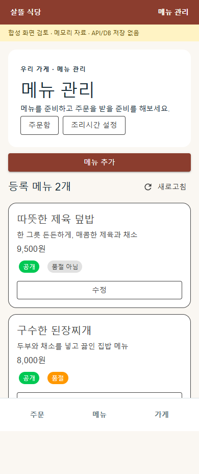
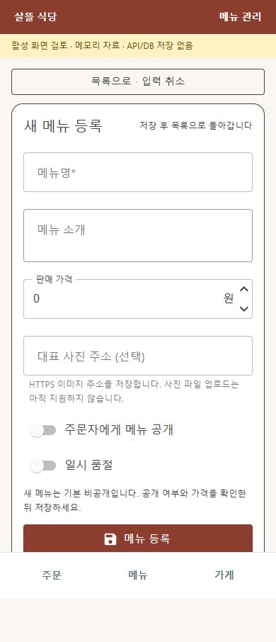

# 역할 앱 기존 페이지 보완 r1

2026-10-04. 사용자가 지도 작업을 제외한 화물·음식점·주문자의 일곱 가지 보완을 승인했다. [페이지 책임·코드/API·DB](../ProjectOverview/page-docs/role-app-polish-r1.md)에 연결한다. 기존 업무와 입력을 보존하면서 실패 뒤 이어가기와 계정·페이지의 정보 수명을 정리했다.

## 변경 결과

| 번호 | 역할·화면 | 수정 후 행동 |
| --- | --- | --- |
| 1 | 화주 의뢰 수정 | 연락처만 수정할 때 화물 수량·취급 조건 등 원값을 유지한다. 화물 종류를 실제 바꿀 때도 기존 전체 값에 종류만 반영한다. |
| 2 | 음식점 메뉴 관리·로그인 | 인증 만료 후 같은 계정으로 돌아오면 입력과 미확정 등록 ID를 복원한다. 로그인 이동을 허용하고 자동 저장은 하지 않는다. 다른 계정·명시 로그아웃·앱 종료에는 초안을 폐기한다. |
| 3 | 화물 상하차 완료 | 동일 ObjectName과 동일 완료 사진 종류의 순차 재시도에서 최초 첨부를 유지한다. 다른 사진·다른 증빙 종류는 별도 기록한다. |
| 4 | 주문자 주문 상세 | 같은 주문의 조회 중·일시 실패에 이전 상세와 입력을 유지하고 취소·수령 확인을 잠근다. 앱 복귀·연결 복구 뒤 서버 정본을 조회한다. |
| 5 | 음식점 주문 상세 | 기존 요청사항을 메뉴 카드의 구분선 아래 표시한다. 배차 불가·조리 후 재배정 대기는 현재 단계에서 필요한 최근 안내를 읽는다. |
| 6 | 화물 기사 내역 | 계정·페이지 이탈·겹친 조회의 늦은 응답을 배제하고 국내 시각을 일관되게 표시한다. |
| 7 | 주문자 주문 작성 | 제출 전 원래 요청과 ID를 저장한다. 앱 재시작 후 GET으로 본인 접수 여부를 먼저 확인하고, 미접수일 때만 사용자가 같은 요청을 다시 제출한다. |

화물 상세와 시험 범위는 [개별 기록](2026-10-04-cargo-role-polish-r1.md), 음식점은 [메뉴 복귀·주문 안내](../ProjectOverview/page-docs/restaurant-role-polish-r1.md), 주문 상세는 [조회 복구](../ProjectOverview/page-docs/orderer-refresh-polish-r1.md)에 둔다.

## 주문 제출과 인증 경계

- 추가 GET `api/v1/food-orders/client-requests/{requestId:guid}`는 인증한 주문자의 기존 주문번호만 조회한다. 주문·배차·조리·원장을 다시 실행하지 않는다. 다른 계정과 미접수는404, 익명은401이며 테이블 변경은 없다.
- 모바일은 SecureStorage, 웹은 현재 탭의 sessionStorage에 원래 주문 payload와 ID를 저장한다. 자격 정보는 포함하지 않는다. 404 조회만으로 자동 POST하지 않으며 명시 재제출에도 저장된 ID와 payload를 유지한다.
- 인증 만료는 저장된 미확정 주문을 유지하고, 명시 로그아웃은 정리한다. 저장소 정리 실패에도 화면의 인증 상태와 개인 상세를 숨기고 오류를 남긴다. 이전 계정의 늦은 응답이 새 계정의 표시를 바꾸지 않게 한다.
- 웹 탭 종료 이후의 영속 복원, 앱 프로세스 종료 후 음식점 메뉴 초안 복원, 동시에 실행된 여러 증빙 쓰기의 전체 exactly-once 보장은 이번 변경에 포함되지 않는다.

## 검증

최종 관련 시험은 Fast `20261004-145754`의 **409/409**다. 앞선 전체 역할 앱 빌드와 수리 후 서버·공용 UI·웹 빌드, 최종 Task `20261004-145843`의 **전체3.5 빌드가 통과**했다. 최종 전체 시험은 **6,571/6,578**이며 기존 실패7개의 이름·메시지·전체 스택이 기준 `20261004-135108`과 정확히 같다. 새 실패0·기존 공통 이름의 결과 변경0이다. 전체 시험 게이트는 기존7실패로 미통과다.

전체 사례는 기준보다123개 늘었다. 이름 비교에는 의미를 유지한 대체2개도 기록한다. 같은 주문의 일시 실패 시험은 상세 보존에 맞춰 이름·기대값을 갱신했고, 화물 내역의 이전 inline 구조 시험은 전용 ViewModel 위임·같은 로그인 복귀·상태/정리 계약을 검사하는 별도 시험으로 교체했다. 다른 화물 페이지4개의 기존 검사는 유지했다. 비교 원본과 대체 이름은 `task-final-result-comparison.json`에서 확인한다.

메뉴 도구는 제품 초기화를 포함한 처리11검사와 모의 HTTP34검사를 통과했다. 실제 제품 Razor와 CSS를 링크한 로컬 미리보기의 Chrome 390×844에서 목록→메뉴명·8,500원 입력→저장→등록 메뉴 목록 복귀를 직접 실행했다. 세 상태 모두 가로 넘침과 브라우저 실행 오류가 없었다. 메모리 자료이며 실제 영업 API/DB·로그인 왕복·MAUI WebView·물리 단말 증거는 아니다. 연결된 브라우저가 없어 별도 격리 headless 브라우저를 사용했고 종료했다. 미리보기 서버도 종료했다.

| 확인 근거 | 결과 |
| --- | --- |
| 주문자 복구·상세 Razor 렌더 | 접수 성공/미접수/오류/처리중, 이전 상세·행동 잠금의 실제 HTML 시험 통과. 화면 렌더로 자동 POST하지 않음 |
| 서버/HTTP·저장 | 본인 접수 결과 조회·원장 불변, 모의 HTTP GET/401/404/5xx, 탭 저장·정리 실패·손상값·ID 보존 시험 통과 |
| 소스 결속 | 최종 제품·시험·지원72경로의 SHA-256이 최종 Task 중·후에 동일함 |
| 별도 확인 대상 | 실제 운영 HTTP/DB·SecureStorage 물리 실행·앱 재시작·로그인 왕복·역할 앱 실기기 화면·실송금은 이번 새 실행으로 검증하지 않음 |

## 실제 메뉴 화면

390px 목록과 편집 화면이며 내용·색·기존 구성은 유지한다.

[저장 후 목록 복귀 화면](../assets/changes/role-app-polish-r1/03-menu-saved-list.png)

원시 소스 사본·경로·지문·검증 로그는 Git 제외 `artifacts/local/role-app-polish-r1/`에 보관한다. 네이버 지도는 기존 인증 확인 대기 상태이며 이번 작업에서 변경하지 않았다. 실결제·은행 입금·Unity·영상/MYBOX·커밋·푸시는 수행하지 않았다.
