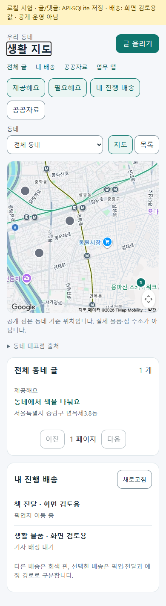
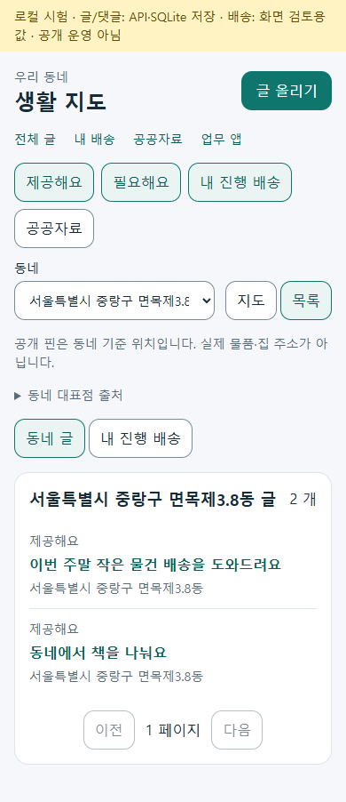
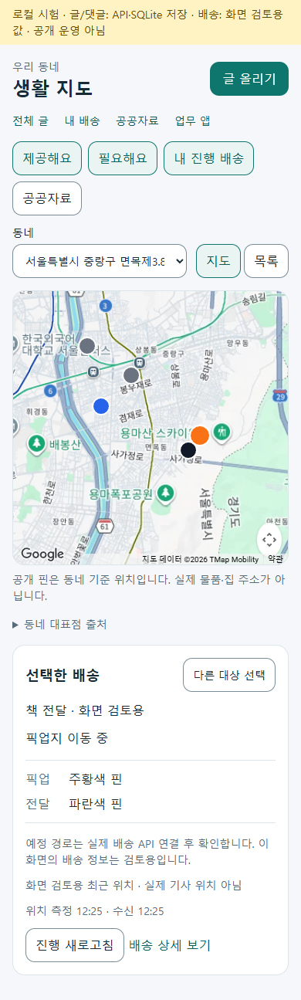
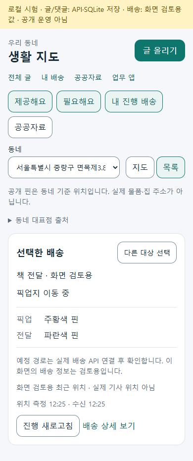

# 공통 생활 지도 홈 · 2026-10-05 r1

일반 이용자의 생활 진입을 `/community/map`으로 모으고, 공개 동네의 제공·필요 글과 로그인한 본인의 진행 중인 생활 배송을 지도 또는 목록에서 탐색하도록 연결했다. 물품 작성, 배송 접수, 선정 기사 정보 제공 동의와 업무 수행은 기존 독립 화면에 둔다. 페이지 책임과 기본값은 [공통 생활 지도 홈 책임 카드](../ProjectOverview/page-docs/neighborhood-map-home-r1.md)가 소유한다. 기존 [생활 교류 최소판 r6](../AI/Planning/공통/PLAN-OPERATIONS-NEIGHBORHOOD-MICRO-HUB/exchange-mvp.r6.md)와 [서버 배차 r7](../AI/Planning/공통/PLAN-OPERATIONS-NEIGHBORHOOD-MICRO-HUB/server-dispatch.r7.md)의 업무·개인정보 경계를 유지한다.

이 기록의 검증 수준은 **집중·전체 시험과 Android 소스 빌드·Debug APK 생성 완료 / 공개 글의 실제 HTTP·SQLite·Web Google 타일 확인 / 개인 배송은 화면 시험 자료 / 휴대폰·Android 지도 타일·Azure 실행 미검증**이다. 이전 r7의 시험·화면 결과를 이번 지도 구현의 실행 증거로 사용하지 않으며 아래에 이번 실행 번호와 범위를 기록한다.

## 페이지 → 코드 → API/저장

| 화면·정보 | 책임과 코드 연결 | API·저장 경계 |
| --- | --- | --- |
| 생활 지도 `/community/map` | Web `Ssalddel.WebApp.Pages.CommunityNeighborhoodMapPage`·Android `SsalddelApp.Components.Pages.CommunityNeighborhoodMapPage` → 공용 `NeighborhoodExchangeMapPage`·`NeighborhoodExchangeMapViewModel` → `NeighborhoodExchangeMapClient` | 동네/표시 항목/지도·목록 탐색만 수행. 선택만으로 글 저장·배송 접수·기사 수락을 하지 않음 |
| 공개 동네·제공/필요 글 | `생활교류지도Controller` → `생활교류지도조회UseCase` → `Official생활교류공개지역Source`와 기존 게시글 원장 | `GET api/v1/community/exchange/map/regions`, `GET .../map`, `GET .../map/posts`. 지역별 제공/필요 건수와 동네별 20건 목록; 정확 주소·개별 물품 좌표 없음 |
| 글 작성·수정 | 기존 `커뮤니티게시글생성Service`·`커뮤니티게시글발행UseCase` → `NeighborhoodExchangeRegionSelectionPolicy` | `platform_community_posts.PublicNeighborhoodRegionKey`에 사용자가 선택한 검증된 행정동 키만 저장. 공개 동네 선택은 선택 사항 |
| 본인 배송 지도 | `NeighborhoodExchangeMapClient`·기존 `NeighborhoodDeliveryClient` → `생활배송의뢰Controller` → `생활배송지도Service` | 본인 의뢰의 `GET api/v1/common/neighborhood-deliveries/{requestId}/map`. 공개 글 조회와 분리하며 선택한 본인 의뢰만 표시 |
| 지도 표시 | `INeighborhoodMapHost` → Web `NeighborhoodGoogleMapHost`; Android `MauiNeighborhoodMapHost` → `NeighborhoodNativeMapBridge` → `NeighborhoodNativeMapView`·`NeighborhoodNativeMapViewHandler` | 표시 어댑터는 원장·배차·운임 권위를 가지지 않음. 타일·인증 실패 시 목록 유지 |
| 화면 설정 기억 | `INeighborhoodMapPreferenceStore` → Web localStorage / Android Preferences | 선택 레이어·지도/목록 모드·공개 동네 키만 기기별 저장. 개인정보와 진행 배송 선택은 저장하지 않음 |

명시 진입 옵션, 기기에 기억된 설정, 첫 기본값 순으로 화면을 구성한다. 첫 기본값은 제공·필요·본인 진행 배송 레이어이며 로그인하지 않은 이용자는 공개 교류를 탐색한다. 지역 선택·목록 보기·물품 작성 복귀와 표시 항목 변경은 같은 탐색 문맥을 유지하고, 실패·빈 목록·재조회 상태를 구분한다. 등록과 수행 화면을 지도 홈에 복제하지 않는다.

Web의 기존 전문 역할 선택 화면 `Ssalddel.WebApp.Pages.Home`은 `/apps`로 보존한다. 생활 지도는 공통 생활 진입을 맡고, 화면의 `업무 앱` 링크로 기존 01~05 역할 WebApp을 선택할 수 있다. Android도 기존 역할 선택 진입을 유지한다. 선택형 공공자료 레이어는 기존 지역 농수산 관측 client/API를 사용하며 시도 대표점 자료를 공개 동네 물품과 구분한다.

## 공개 지역 자료와 판본

초기 지원은 서울 **광진구 4동·동대문구 10동·중랑구 16동, 총30행정동**이다. 전국이나 서울 전체 지원으로 표시하지 않는다. 공식 자료에 있는 동네 대표점만 사용하며 사용자 배송 주소, 기기 GPS, 비공개 디오라마 manifest를 공개 지역의 근거로 사용하지 않는다.

| 자료 | 출처·이용조건 | 이번 적용과 한계 |
| --- | --- | --- |
| 서울특별시 상권분석서비스(영역-행정동), OA-22160 | [서울 열린데이터광장](https://data.seoul.go.kr/dataList/OA-22160/S/1/datasetView.do), 저작권자 서울특별시·제공기관 서울신용보증재단. 공공누리 제1유형, 출처표시·상업적 이용·변경 가능. [공공데이터포털 연결 및 이용조건](https://www.data.go.kr/data/15147263/fileData.do)도 대조 | 2026-10-05 공식 다운로드 사본의 425행에서 행정동 코드·명칭·중심 X/Y만 사용. 파일 실제 수정일은 **2023-10-31**. 포털 제목의 2025-06-11이나 페이지 갱신일을 현행 경계 판본으로 바꾸지 않음 |
| 좌표계와 단위 | 공식 페이지와 ZIP의 PRJ는 EPSG:5181, Korea 2000 Central Belt. 공급 X/Y 단위는 m | 공개 대표점을 WGS84 위도·경도(도)로 변환. 개인 주소를 지오코딩하거나 주거·픽업 위치로 추정하지 않음 |
| 행정안전부 행정기관 코드 | [행정기관·관할구역 변경내역 공식 게시물](https://www.mois.go.kr/frt/bbs/type001/commonSelectBoardArticle.do?bbsId=BBSMSTR_000000000052&nttId=124059)의 `jscode20260301`, 시행 기준 2026-03-01 | 새로 다운로드한 KIKcd_H에서 미말소 코드·명칭을 대조. 서울 8자리 코드 끝에 `00`을 보완한 10자리 `region:kr:hjd:*` 키를 사용. MOIS 원본 ZIP은 재배포하지 않음 |
| 파생 공개 카탈로그 | `Official생활교류공개지역Source` | 대표점·코드·지역명·상위 지역 키와 출처 URL/판본/SHA-256/라이선스만 반환. 현행 경계 도형이나 실제 물품 위치를 뜻하지 않음 |

서울 사본 SHA-256은 `969f7033bd3609a5fd586790f5b2cfedc638d7647ef45c78f9c75e1dabf79f68`, MOIS 사본은 `8af8c1f122d67d43518f58b37aea6eea7986f2809062f24e2e03465f21ae7a08`이다. 새 공식 다운로드가 과거 사본과 같은 바이트라는 사실은 판본 유지 근거이며, 과거 비공개 디오라마의 배포 승인 상태를 승격한 것은 아니다. 다운로드·좌표계·코드 대조·파생30행의 로컬 기록은 `artifacts/local/public-data/neighborhood-map/20261005/derivation-receipt.json`에 있다.

공급 페이지는 월간 갱신으로 설명하지만 이번 실행 카탈로그는 위 판본을 동결한 사본이다. 자동 갱신·전국 확장·경계 최신화는 구현하지 않았으며, 추가 지역은 새 공식 자료의 이용조건·판본·코드·대표점을 대조한 후 편입한다. 금액·통화는 지역 자료에 해당하지 않는다.

## 게시글 저장·지역 필터

`20261005110000_AddCommunityPublicNeighborhoodRegion` migration은 기존 게시글에 nullable `varchar(80)` 열과 지도 집계용 복합 인덱스를 추가한다. 기존 글에 임의의 동네를 채우는 기본값이나 backfill SQL은 없다. 지역 미선택 글은 목록에 계속 남고 지도에는 `UnlocatedPostCount`로만 집계한다. 미지원 키가 남아 있는 기록은 `UnsupportedRegionPostCount`로 구분하며 근처 동네에 옮기거나 핀을 추정하지 않는다.

선택 지역은 제공/필요 생활 교류 글에만 지정할 수 있고, 서버의 검증된 공개 지역 source에 없으면 발행·수정·지역 조회를 거절한다. 기존 작성자/비밀번호 수정 권한을 먼저 통과하며 지역 선택이 권한을 대신하지 않는다. 공개 지도 집계와 목록은 삭제·예약·취소·신고·다른 업무 글을 제외한다. 이번 변경은 배송 의뢰·개별 거래 완료·신뢰 이력을 생성하지 않는다.

## 개인정보·경로 표시

- 공개 지도 핀은 동네별 제공·필요 글을 모아 보여주는 대표점이다. 실제 물품·주거·픽업·전달 위치가 아님을 표시하고 공개 응답에 정확 주소·연락처·기사 GPS를 추가하지 않는다.
- 본인 배송 지도는 인증 계정과 의뢰 소유권을 확인한다. 공개 집계 API나 공개 글 원장에 본인 배송 좌표를 복사하지 않는다. 개인 좌표 응답은 기존 보호 전송을 사용하고 controller에서 `private, no-store`를 지정한다.
- 예정 경로는 명시 조회로 받는 도로 참고 결과다. 경로 출처·자동차 기준·조회 시각과 안내를 표시하며 실제 이동 이력이나 오토바이 전용 경로로 설명하지 않는다. 경로가 없을 때 두 지점을 직선으로 이어 실제 도로 경로처럼 만들지 않는다.
- 최근 기사 위치는 현재 확정 배정의 서버 증적과 맞고 배정 이후 측정·수신된 위치만 제공한다. 측정 시각과 서버 수신 시각 모두10분 이내이고 미래 시각이 아닌지 검사한다. 미배정·근거 없음·위치 없음·종결을 구별한다.
- 계정 변경·의뢰 전환·재배정·종결·화면 이탈 때 이전 개인 핀·경로·최근 위치를 제거하고 늦게 도착한 이전 조회 응답을 적용하지 않는다. 기기 설정에는 주소·연락처·경로·기사 위치·인증 값·의뢰 번호를 저장하지 않는다.
- 선정 기사에게 주소·연락처·요청사항을 제공하는 별도 동의와 철회는 [r7의 기존 경계](2026-10-05-neighborhood-server-dispatch-r1.md#동의재시도지급)를 유지한다. 지도 선택을 제공 동의나 기사 수락으로 간주하지 않는다.

## 설정과 운영 제약

| 연결 | 현재 구성과 검증할 조건 |
| --- | --- |
| Web Google 지도 | 기존 runtime client를 재사용. `GoogleMaps:BrowserApiKey`와 허용 출처가 필요. 현재 키 공급 API는 Development·루프백 요청·루프백 Origin 조건만 허용하므로 Azure 공개 호스트의 지도 준비 완료가 아님. 키가 없거나 출처가 막히면 목록으로 안내 |
| Android Google 지도 | `GoogleMapsAndroidApiKey`가 Android manifest placeholder로 들어감. Android 네이티브 소스 빌드와 Debug APK 생성을 확인했으며 SDK 키는 미설정 상태. Web 브라우저 키를 Android 키로 재사용하지 않고 Maps SDK·실제 패키지·서명 인증서에 제한된 별도 기기용 키를 설정해야 함. APK 생성과 실제 타일 로드는 구별하며 callback 또는 빌드 성공만으로 타일 성공을 주장하지 않음 |
| 서버 도로 예정 경로 | 기존 `NaverCloudDirections` 서버 설정을 사용하며 서버 비밀키를 브라우저·APK에 전달하지 않음. 외부 결과에 실제 경로 geometry가 없으면 경로 표시를 보류. Google 바탕지도와 도로 자료는 공급자가 다르므로 출처와 공급자별 표시 허용 범위를 유지하며 이번 문서가 이용조건 검증을 대신하지 않음 |
| 생활 배송 업무 | 기존 인증·2.0 국내 운송 기능 활성 조건과 운영 모드를 유지. 공개 동네 조회가 생활 배송 접수·자동 배차·직접 지급·실수금 관문을 열지 않음 |
| 지원 기기 | 이번 지도 표시 대상은 Web와 Android. 다른 플랫폼은 목록 탐색을 제공하며 기존 전문 역할 앱·세계 공개자료 지도를 제거하지 않음 |

## 검증 상태

이번 실행에서 [NAVER Maps 서비스 이용약관 2025-03-20 판](https://xv-ncloud.pstatic.net/images/provision/%5B%EB%AF%BC%EA%B0%84%5DMaps%EC%84%9C%EB%B9%84%EC%8A%A4%EC%9D%B4%EC%9A%A9%EC%95%BD%EA%B4%80_v0.4_(CLEAN)_1742433558704.pdf)과 [Directions 5 공식 API 안내](https://api.ncloud-docs.com/docs/en/application-maps-directions5)를 대조했다. 해당 공개 문서에서는 다른 바탕지도 사용을 명시적으로 금지하는 조항을 찾지 못했다. 이는 공급자의 개별 사용 승인이 아니라 확인한 문서 범위의 해석이다. 약관의 결과 저장·별도 DB 재사용 제한에 따라 선택·명시 새로고침 때만 경로를 요청하고 서버·기기 저장소에 보관하지 않는다. 화면에서 NAVER Directions와 자동차 참고 경로임을 표시한다. [Google 공식 API 보안 기준](https://developers.google.com/maps/api-security-best-practices)에 따라 웹 키와 Android 패키지·서명 제한 키를 분리한다.

| 항목 | 현재 증거 |
| --- | --- |
| 공식 원본·이용조건·좌표계·코드 대조 | 새 공식 다운로드, 파일 SHA-256과 PRJ·DBF425행 확인, MOIS 미말소코드와 초기30동 대조 완료. 현재 경계 최신화 검증 아님 |
| 최종 Fast | `artifacts/local/validation/20261005-121456/`의 통합 빌드 **오류0·경고100**, 집중 시험 **93/93 통과**. 공개 지역/교류11, 개인 배송 지도·위치54, 공용 지도 VM19, 기존 게시 처리9건. Android 네이티브 지도 소스와 공유 client/UI의 빌드 포함 |
| 최종 Task | `artifacts/local/validation/20261005-123154/`의 빌드 **오류0·경고95**, 전체 시험 **7,168/7,168 통과**. 앞선 `20261005-122632`의 `/apps` capability 미분류와 기존 `/community` 시작 경로 기대값 2건은 새 진입 구조에 맞춰 수정한 후 재실행. 경고는 패키지·nullable·분석기 항목과 새 시험의 `Assert.Single` 작성 권고를 포함하며 오류와 구별 |
| 공개 서버 시험 | `NeighborhoodExchangeMapTests` **11/11 통과**. 실제 SQLite 발행→저장→재조회→수정→지역 필터, 공개 대상 제외, nullable migration 정의, 서비스 부재·미지원 키·타인 수정 거절. 운영 MySQL에 migration을 적용한 증거는 아님 |
| 실제 공개 HTTP·SQLite·Web 화면 | `artifacts/local/community-map-home-r1/ui-verification.json`: 공식30동과 공개 글의 실제 HTTP/SQLite 연결, 동네 선택→작성→지도 복귀, 설정 저장, 명시적 빈 레이어, 320/390/1100px 폭 확인. 브라우저 페이지 오류0. 아래 PNG4장에 현재 화면 보관 |
| 실제 Web Google 타일 | 같은 `ui-verification.json`의 `actualGoogleTiles=true`와 지도 PNG에서 확인. Development·루프백에서 실제 Google 바탕지도를 표시한 증거이며 Android·Azure 타일 확인으로 확대하지 않음 |
| 개인 배송 화면 | 같은 기록의 `privateDeliveryFixture=true`. 진행 배송 선택·픽업/전달 핀·최근 위치·목록 화면은 **명시적 화면 시험 자료**로 확인. 실제 기사 배정·GPS 수신·Naver 경로 API 호출·현장 배송 수행 증거가 아님 |
| 지도 renderer 동작 시험 | `renderer-verification.json`: Google SDK 대역으로 픽업 주황색/전달 파란색 경로, 레이어 변경 시 viewport 유지, hide 시 개인정보 제거, 늦은 렌더 제거 확인. `sdkFixture=true`, `actualTiles=false`이며 위 실제 Google 타일 검증과 별도 |
| 실제 외부 예정 경로 | 실제 Naver 호출·현재 배정/GPS를 연결한 예정 경로는 미검증. 서버/위치 정책 시험과 SDK 대역 경로 표시를 실제 API/라이딩 결과로 설명하지 않음 |
| Android·APK·단말·Azure | Android 네이티브 소스 빌드와 최신 코드·런타임을 내장한 Debug APK 생성 성공(오류0·경고2). 서명 검증·16KiB ZIP 정렬·ARM64/x86_64 assembly store·런타임·사본 해시 일치 확인. 기기용 SDK 키 미설정, 개인 휴대폰 설치·실행·실제 타일, Azure 공개 통신은 미검증. 기존 APK/업무 화면 결과를 이 변경으로 확대하지 않음 |

이번 요청에서 커밋·푸시·배포를 하지 않았다. 검증 호스트의 공개 글은 실제 로컬 HTTP/SQLite 기록이고 개인 배송은 화면 검토용 자료다. 둘 다 실제 거래 완료·기사 위치·실지급이나 공개 운영 실적으로 사용하지 않는다.

개발용 APK는 `artifacts/local/community-map-home-r1/ssalddel-life-map-debug-no-map-key.apk`에 보존했다. SHA-256은 `26232bc1d111cce8a203a4466f728bf428359b537ece7f0d10244d73aa8f7529`, 용량132,133,462바이트다. SDK 키가 없는 이 APK를 지도·공개 서버가 준비된 배포본으로 사용하지 않는다. 서명 확인은 Android SDK가 실제로 선택한 JDK 경로를 찾아 실행했으며, 첫 기본 환경의 `JAVA_HOME` 미설정 실패도 로컬 작업 기록과 구별한다.

## 대표 화면

390px Web 화면이다. Google 바탕지도는 실제 타일이며 공개 글은 로컬 HTTP/SQLite 기록이다. 배송 화면의 물건·상태·픽업/전달 핀·최근 위치는 화면 검토용 자료이고 실제 기사 위치가 아니다. 예정 경로의 실제 Naver 연결은 확인 전이다.

