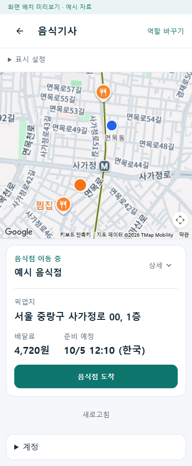
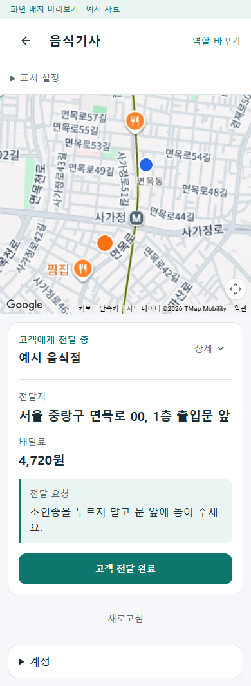

# 실제 Google 지도의 기사 화면 미리보기 r14

사용자가 휴대폰 연결 없이 지도를 적용한 모습을 요청했다. 기존 공통 기사 화면에 실제 Google 웹 지도와 예시 픽업·전달 위치를 연결했고 수락 전·픽업 중·전달 중 화면을 확인했다. 업무 자료는 예시이고 바탕지도는 실제 Google 타일이다.

## 구현

- `eng/RoleWorkspacePreview`는 제품 `NeighborhoodGoogleMapHost`, `GoogleMapsBrowserRuntimeClient`와 두 지도 JavaScript를 링크해 재사용한다. 제품 지도·업무 로직과 앱 설정은 변경하지 않았다.
- 지도 모듈은 빌드 출력 사본의 고정 두 경로에서 제공한다. 프로젝트 외부 파일을 StaticWebAssets로 등록했을 때 비어 있는 응답을 주던 로컬 파일 연결을 바로잡았다. 최종 HTTP 응답과 제품 원본 바이트 일치를 확인했다.
- 브라우저 키는 프로세스 설정으로만 공급한다. 키 응답은 `Development`, 루프백 접속과 고정 루프백 Origin 조건을 확인하고 `no-store`로 반환한다. 키의 실제 값을 소스·문서·캡처·검증 로그에 남기지 않았다.
- 기존 주황 픽업·파랑 전달 표시, 상태별 핵심 카드, 상세 접기와 지도 표시 설정을 유지한다. 예시 경로를 실제 도로 경로로 만들어 넣지 않았다.

지도 로더는 [Google Maps JavaScript API 공식 안내](https://developers.google.com/maps/documentation/javascript/load-maps-js-api)의 런타임 로딩 방식을 기존 제품 코드로 실행한다. Android 지도 키는 브라우저 키와 분리하는 [Google API 보안 기준](https://developers.google.com/maps/api-security-best-practices)을 유지한다.

## 실제 검증

`artifacts/local/google-map-web-preview-r14/ui-verification.json`과 화면 PNG가 원시 근거다.

| 확인 | 결과 |
| --- | --- |
| 전용 미리보기 빌드 | 오류 0, 경고 0 |
| 수락 전·픽업 중·전달 중 | 실제 타일 준비 후 안내 제거, 픽업·전달 마커와 핵심 카드 표시 |
| 상호작용 | 지도 확대·이동, 핀 켜기/끄기, 상세 열기 확인 |
| 모바일 화면 폭 | 390px·320px에서 가로 넘침 없음 |
| 지도 모듈 | 두 파일 HTTP 200·JavaScript MIME·제품 원본 바이트 일치 |
| 키 응답 보호 | Origin 없음/외부 Origin은 404, 로컬 허용 Origin은 200·no-store |
| 브라우저 | 페이지 오류·콘솔 오류 0 |

공통 Fast `20261005-192912`·Task `20261005-193003`의 변경 형식 검사를 통과했다. 현재 검증기는 `eng/RoleWorkspacePreview` 경로를 지침 전용으로 분류하므로 이 두 실행의 제품 빌드·시험은 생략됐다. 위 전용 미리보기 빌드와 실제 브라우저 검증은 별도 실행 결과이며 전수 제품 시험을 이번에 재실행했다고 보고하지 않는다. 이번 담당 밖의 기준선 831개 파일 해시는 유지됐고 문서 상대 링크와 키 값 미포함도 확인했다.

이전 r13의 Android 위치 권한과 r12의 완료 확인·기사 카드는 보존했다. 이번 범위는 개발 미리보기와 실제 웹 지도 표시다. Android 네이티브 SDK 타일·기기 GPS·휴대폰 설치·실제 배차와 서버/DB 업무 완료·도로 경로 조회·Azure 공개 통신·결제 계정 변경은 검증하거나 수행하지 않았다. 커밋·푸시·외부 배포도 하지 않았다.

## 확인 화면

실제 Google 지도 위의 주황 픽업·파랑 전달 지점이다. 주소·금액·주문·상태는 기존 예시 자료이며 Google 로고·저작권 표시를 유지했다.

재실행과 설정은 [미리보기 안내](../../eng/RoleWorkspacePreview/README.md)를 따른다. 로컬 주소는 `http://127.0.0.1:5392/workspace/food-driver?scenario=pickup`이며 허용 Origin도 같은 고정 주소다.
