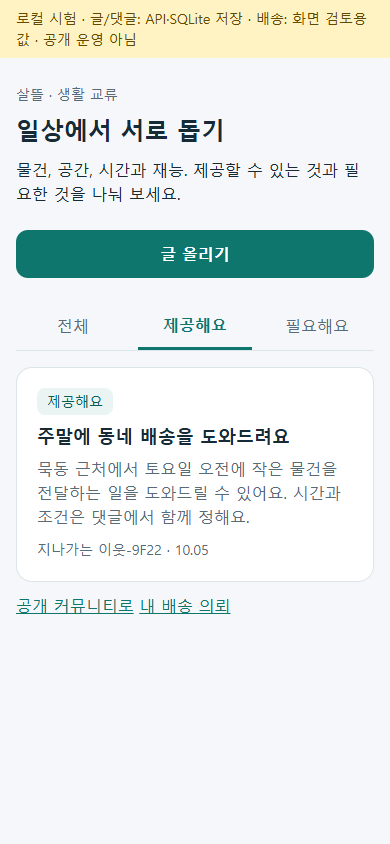
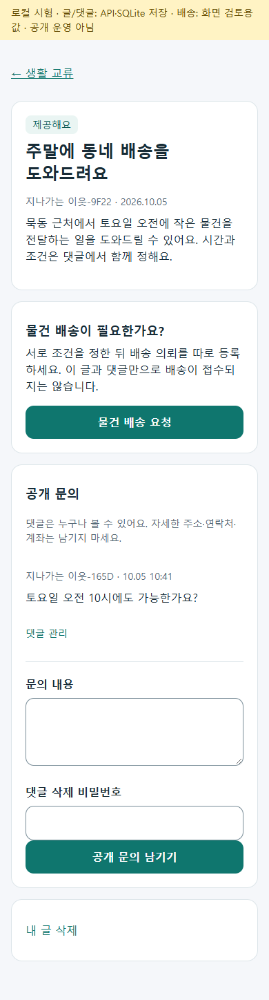
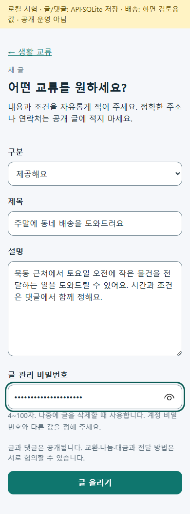

# 일반인 생활 교류 최소판 · 2026-10-05 r1

제공할 것과 필요한 것을 공개 글로 올리고, 다른 사람이 상세 화면에서 문의할 수 있게 기존 게시글 기능을 단순한 세 화면으로 연결했다. 글·댓글의 삭제 비밀번호와 서버 권한을 재사용하며 고정 업무 역할 선택·플랫폼 결제·주소 등록을 강제하지 않는다. 현재 방향과 페이지 책임은 [r6](../AI/Planning/공통/PLAN-OPERATIONS-NEIGHBORHOOD-MICRO-HUB/exchange-mvp.r6.md), 사용자 후속 서버 배차 요청은 [r7](../AI/Planning/공통/PLAN-OPERATIONS-NEIGHBORHOOD-MICRO-HUB/server-dispatch.r7.md)다.

## 화면과 저장

- 목록 `/community/exchange`: 전체·제공·필요, 서버 20건 페이지 처리, 빈/조회 실패/재시도.
- 작성 `/community/exchange/write`: 구분·제목·설명·관리 비밀번호, 전송 중 잠금, 미확정 등록 시 초안 유지와 목록 확인 안내.
- 상세 `/community/exchange/posts/{id}`: 원문·공개 문의·댓글 삭제/신고·본인 글 삭제, 기존 삭제/권한 검증.
- `SsalddelApp` 홈/커뮤니티 메뉴와 01 웹 앱 메뉴에서 진입한다. 공용 컴포넌트·페이지 VM·기존 client/API/게시글 DB를 사용하며 새 테이블이나 마이그레이션은 없다. 입력 비밀번호는 URL/로그/초안 저장에 넣지 않는다.
- r5의 중단된 미검증 지역 재고·예약 스캐폴드는 로컬 보관 후 DI/EF/컴파일 입력에서 분리했다. 기존 다른 dirty 변경은 보존하고 해당 코드가 사용 가능한 기능이라는 설명도 정정했다.

## 실행 근거

관련 시험 최초 29/29 통과 후, 실제 화면 수명에서 발견한 중복 Dispose 오류를 수정해 게시/문의 관련 30/30을 확인했다. 생활 배송 확장까지 포함한 최종 Fast `20261005-105502`는 3.5 솔루션 빌드 오류0·경고132, 집중 시험128/128 통과다. 통합 Task 결과는 [배송 변경 기록](2026-10-05-neighborhood-server-dispatch-r1.md)에서 함께 관리한다. 별도 01 웹 앱 빌드 오류0·경고0, 통합 앱 Windows 빌드 오류0·기존 인증 파일 경고4였다.

루프백 검증 호스트는 실제 제품 공유 UI·HTTP client → 같은 계약의 로컬 API → 기존 생산용 UseCase/게시판 쓰기 정책 → SQLite를 사용한다. 별도 브라우저의 문의, 재조회와 서버 재시작 후 같은 글/댓글 보존, 제공/필요 필터, 비밀번호 오류403, 390px/320px 수평 넘침 없음, 1100px 표시와 브라우저 오류0을 확인했다. 호스트의 합성 자료·익명/개인정보 어댑터와 후속 이벤트 실행 생략은 [실행 도구 README](../../eng/NeighborhoodExchangePreview/README.md)에 명시했다. 이것은 원래 서버의 전체 인증/기능 플래그/외부 알림 검증이 아니다.

Figma 연결 도구가 제공되지 않아 node 생성/동기화·Figma screenshot은 미확인이다. 대응은 생활 교류 목록 → `CommunityExchangePage`/`ExchangeList`, 작성 → `CommunityExchangeWritePage`/`ExchangeWrite`, 상세 → `CommunityExchangeDetailPage`/`ExchangeDetail`이며 공용 역할 디자인 토큰과 기존 커뮤니티 진입을 재사용한다. 이후 [생활 배송 변경](2026-10-05-neighborhood-server-dispatch-r1.md)에서 명시적인 본인 배송 의뢰를 기존 화물 원장/큐에 연결했다. 실제 기기 설치·Azure·외부 공개 운영·실제 기사 배차/수행·금전 이체·확인된 거래 신뢰 이력은 별도다. 커밋·푸시는 이번 요청에 포함되지 않았다.

## 대표 화면

검증용 로컬 시험 글과 문의이며 실제 이용자의 거래 기록이 아니다.

