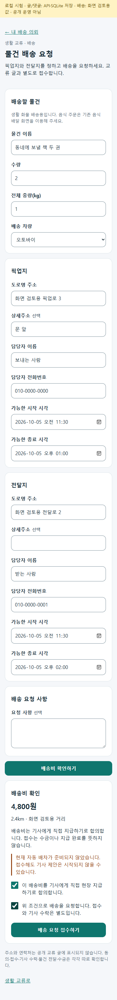
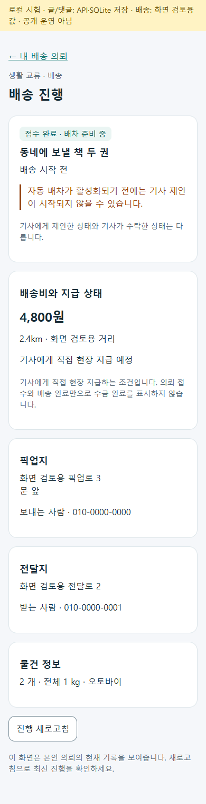
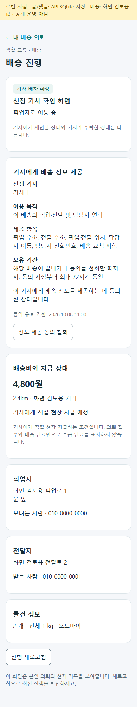

# 생활 배송 접수와 서버 배차 연결 · 2026-10-05 r1

공개 생활 교류 글과 별도로 본인 배송 의뢰를 접수하고, 서버 견적 확인 후 기존 화물 원장과 배차 대기열로 연결했다. 배송 의뢰 접수와 기사 수락을 구별하며 플랫폼 결제를 강제하지 않는다. 현재 최소판은 기사에게 직접 현장 지급하기로 합의하는 생활 화물이며 음식 주문은 기존 음식 전용 흐름을 유지한다. 기준과 페이지 책임은 [r7](../AI/Planning/공통/PLAN-OPERATIONS-NEIGHBORHOOD-MICRO-HUB/server-dispatch.r7.md)다.

## 페이지 → 코드 → API/저장

| 화면 | 책임과 연결 | 저장·실패 경계 |
| --- | --- | --- |
| 내 배송 의뢰 `/community/exchange/deliveries` | 공용 `NeighborhoodDeliveryList`/조회 VM → 본인 의뢰 목록, 20건 페이지 | 다른 사람의 의뢰 제외. 목록 화면에는 상세 주소·전화번호 없음 |
| 배송 요청 `/community/exchange/deliveries/new` | 동의 → 물건/장소/시간 → 서버 견적 → 직접 지급 합의 → 명시 접수 | 주소 변경 시 견적 폐기. 서버 금액 변경 시 새 확인. 미확정 요청의 입력/ID를 보존해 재확인 |
| 진행 `/community/exchange/deliveries/{requestId}` | 공용 상세/조회 VM → 본인 원장 상태·배송비·지급 예정·선정 기사 정보 제공 동의/철회 | 접수·제안·수락·종결 구별. 계정 변경 시 이전 개인정보 제거·늦은 응답 무시 |
| MAUI `/community/login` | 기존 계정 인증만 처리 후 허용된 생활 교류 경로로 복귀 | 인증 화면/업무 화면 분리, 외부 복귀 주소 거절, 로그인으로 자동 접수하지 않음 |

Web/MAUI는 같은 공유 컴포넌트·client·VM을 사용한다. `api/v1/common/neighborhood-deliveries`의 `quote`, 등록, `mine`, 본인 상세, `driver-disclosure`를 새 controller/adapter로 연결했다. 배송 API는 인증·국내 운송 2.0 기능 경계를 유지하고, 일반 계정에 화주/사업자 역할 선택을 요구하지 않는다.

`생활배송의뢰UseCase` → 기존 화주 의뢰 생성/조회/현장지급 처리 → `운송의뢰배차대기Service` → 기존 `화주운송의뢰`·`운송원장`·화물 실행 투영을 사용한다. 신청 동의는 기존 동의 증적, 선정 기사 정보 제공 동의는 기존 `운송이벤트`에 기록한다. 새 테이블·마이그레이션은 없다. 서버가 주소를 다시 확인하고 운임을 계산하며 임의 입력 좌표나 공개 글의 금액으로 요금을 확정하지 않는다. 위치/운임 연결이 없으면 실패하고 화면 시험값으로 대체하지 않는다.

## 동의·재시도·지급

- 신청 동의의 소유자·출처·문안·철회를 확인하고, 선정 기사·추천 차수·제공 목적/항목·기한을 확인하는 별도 제공 동의를 추가했다. 철회·재배정·종결·72시간 경과·원 신청동의 무효 시 기사에게 상세 정보를 제공하지 않는다. 실제 주소/전화번호를 동의 사건에 복제하지 않는다.
- 생활 배송 추천·공개 배차·전국콜의 상세 주소/정확 좌표를 가리고, 관계없는 기사 의뢰 상세를 차단했다. 현재·목록·상세·작업공간·문제 신고 응답에도 같은 별도 동의 조건을 적용한다. 서버 fingerprint/동의 증적 참조가 담긴 내부 정산메모와 운송 내부 메모/첨부는 기사 응답에서 제외한다. 기존 다른 화물 흐름은 유지한다.
- 동일 요청 ID와 입력 fingerprint를 기존 원장에 보관한다. 응답 유실·원장 저장 후 큐 실패는 같은 요청으로 재개하고, 내용이 다른 재송신은 거절한다. 잠금은 단일 서버 프로세스 범위이며 여러 서버에서 동시에 등록하는 공개 운영에는 DB 유일 키가 필요하다.
- 직접 지급 합의는 `현장수금예정`이다. 수금·입금·은행 지급 완료를 만들어 내지 않는다. 자동 추천은 기존 `Operational`/기능 활성 조건을 따르며 꺼져 있으면 화면에 배차 준비 중으로 표시한다.

## 검증

최종 Fast `20261005-105502`: 3.5 솔루션 빌드 오류0·경고132, 관련 시험 **128/128 통과**. 최종 Task `20261005-105628`: 같은 솔루션 빌드 오류0·경고55, 전체 시험 **7,084/7,084 통과**. 경고는 기존 Android 패키지 제약·nullable·분석기 항목이며 새 생활 배송 파일의 경고는 없다. 로그와 TRX는 `artifacts/local/validation/<실행 번호>/`에 있다. 제품 Web·공유 UI·서버와 통합 앱 Android/Windows 빌드 경계를 포함하며 실제 기기 실행과 구별한다.

집중 시험은 공개 교류/기존 게시 처리30, 생활 배송 원장/큐·별도 동의22, UI 상태10, 메타데이터/인증 복귀/신청 동의42, 실제 기사 조회 개인정보21, 요청 전송 보호3개다. 처음 발견한 Sender 시험 연결 오류, 공개 배차 EF 조회 오류, 정상 게시 글 상태 비교와 내부 메모 제거 위치를 수정한 뒤 통과했다. 소스 변경 도중 실행한 빌드에 이전 게시 상태 문자열이 남아 있던 기록은 보존하고, 소스를 안정화한 재빌드와 최종 Fast/Task를 근거로 삼는다.

글/문의는 실제 공유 UI → HTTP → 생산용 UseCase/정책 → SQLite로 저장·재조회하고 서버 재시작 후 같은 글/댓글 보존을 확인했다. 배송 화면은 같은 제품 UI/VM과 화면 검토용 client로 동의→입력→견적→접수→목록/상세 및 선정 기사 동의→철회를 확인했다. 주소 변경 시 견적 재확인, 목록의 주소/전화번호 미노출, 390px/320px 수평 넘침 없음, 배송 요청 사항을 포함한 제공 항목, 브라우저 오류0을 확인했다. 배송 화면 검증은 실제 서버 배차 실행 증거가 아니다. 최종 호스트 빌드 오류0·경고0이며 화면/재시작 결과는 `artifacts/local/neighborhood-exchange-mvp-r1/`의 `ui-verification.json`·`restart-verification.json`·`delivery-ui-verification.json`에 있다. [검증 호스트](../../eng/NeighborhoodExchangePreview/README.md)는 루프백 전용이며 운영 배포 대상이 아니다.

격리 서버 시험은 실제 기존 화주 생성·조회·현장지급 Command와 화물 배차 큐/원천 분류를 사용한다. EF InMemory 및 주소·운임·동의·Mongo 투영·외부 실행 대역을 실제 운영 DB/거리 API/푸시와 구별한다. Figma 도구 미제공으로 node 동기화·Figma 화면은 미확인이며 공용 역할 디자인 토큰과 기존 커뮤니티 진입을 사용했다.

다중 서버 동시 접수, 운영 설정의 실제 운임/자동 추천/기사 수락·픽업·전달 완주, Azure 공개 운영, 개인 휴대폰 설치, 실수금/입금은 별도 검증이 남는다. 이 변경으로 무료/분할 배송 정책, 일반인 음식 제조 연결, 완료 거래 인증/공개 신뢰 이력을 추가하지 않았다. 이번 요청에서는 커밋·푸시·배포를 하지 않았다.

## 대표 화면

화면 시험용 물건·주소·연락처이며 실제 거래·기사 배차 자료가 아니다.

