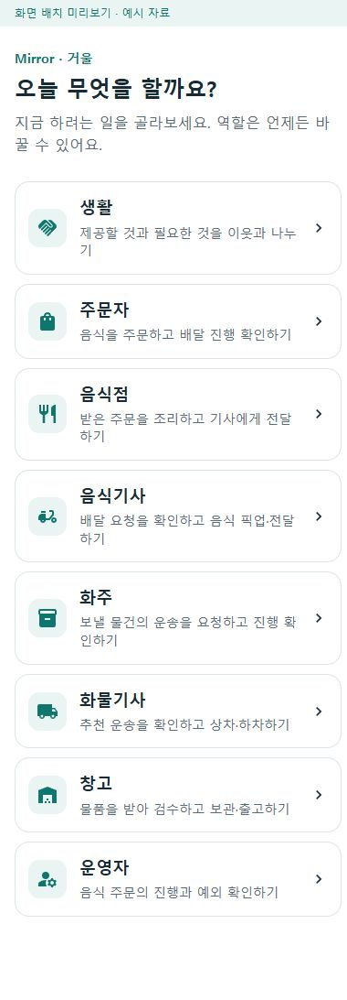

# 여덟 역할의 첫 진입 안내 r19

홈의 역할 설명이 명사 중심이고 주문자를 모든 상품 구매 화면처럼 표현해 처음 들어온 이용자가 현재 할 일을 파악하기 어려웠다. [여덟 입장 검토](../ProjectOverview/page-docs/role-entry-review-r19.md)와 [홈 책임](../ProjectOverview/page-docs/role-map-workspace-r11.md#처음-이용하는-사람의-역할-선택-r19)을 먼저 정리한 뒤 설명을 현재 구현의 행동으로 다듬었다.

- 생활의 제공/필요 교류, 음식 주문·조리·픽업/전달, 운송 의뢰·상하차, 물품 검수·보관/출고, 음식 주문 예외 확인을 짧은 행동으로 설명한다.
- 같은 앱에서 역할을 바꿀 수 있다는 안내를 유지한다. 여덟 키·이름·순서·아이콘·route·선택 표시·로그인/권한은 보존한다.
- 홈 표제와 제품 Web/통합 앱 홈 제목을 현행 Mirror(거울)로 맞춘다. 내부 Ssalddel 식별자와 다른 페이지의 표시명을 일괄 변경하지 않는다.
- 중개 수수료보다 자율적 교류·생활 개선을 우선하는 사용자 방향을 공통 결정에 기록하고, 선택적 후원·광고는 미정 후보로 유지한다. 광고/후원 UI·결제·요금·정산·외부 공개나 영상 게시를 실행하지 않는다.

## 검증

- Fast `20261005-235300`: 공통 UI·Web·통합 앱 빌드와 관련 시험 99/99 통과.
- Task `20261005-235603`: 제품 3.5 솔루션 빌드 오류 0·경고 56, 전체 시험 7,625/7,625 통과. 경고는 기존 종속성/플랫폼 경고이며 이번 홈 변경의 오류는 없다.
- 공통 예시 웹과 통합 앱 Android 별도 빌드 오류/경고 0.
- 실제 브라우저에서 홈 320/390px의 여덟 설명·링크, 로그인 양식 없음, 390px의 주문자·화주·운영자 진입과 홈 복귀를 확인했다. 다섯 화면의 가로 넘침과 새 검증 탭의 브라우저 오류는 0이다.
- 작업 시작 시 기존 dirty 파일 912개 중 이번 소유 범위 밖 902개의 해시와 HEAD·branch가 유지됐다. commit/push는 하지 않았다.

원시는 Git 제외 `artifacts/local/role-entry-review-r19/`의 검증 로그·`ui-checks.json`·`preservation.json`에 보관한다. 이번 화면은 공통 표시 코드에 예시 자료를 연결한 실행이며 지도 키가 없는 안내 상태다. 실제 제품 생활 지도, 여덟 역할의 모든 상태, 지도 타일/GPS·운영 서버/DB 업무·휴대폰/Azure·공개 운영 완료로 확대하지 않는다.

## 화면

[320px 홈](../assets/changes/2026-10-05-role-entry-review-r19/home-320.jpg) · [390px 홈](../assets/changes/2026-10-05-role-entry-review-r19/home-390.jpg)

