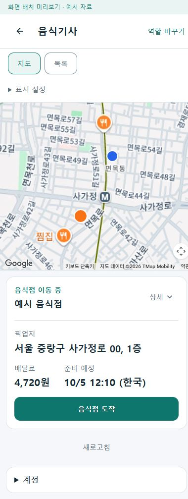
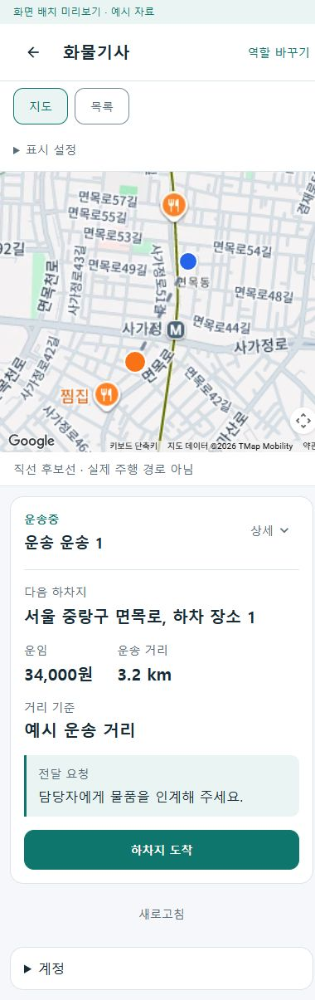
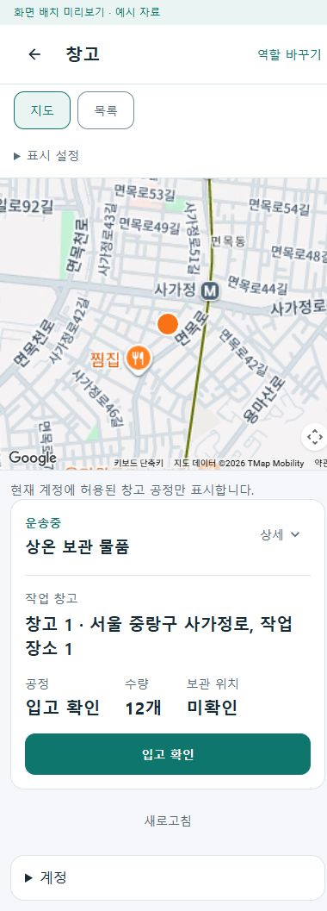
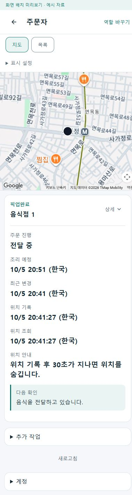
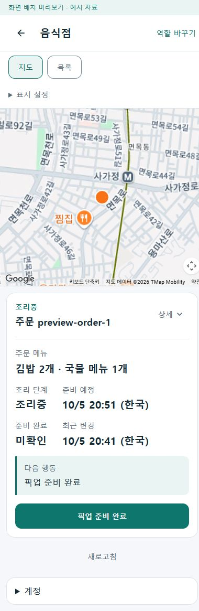
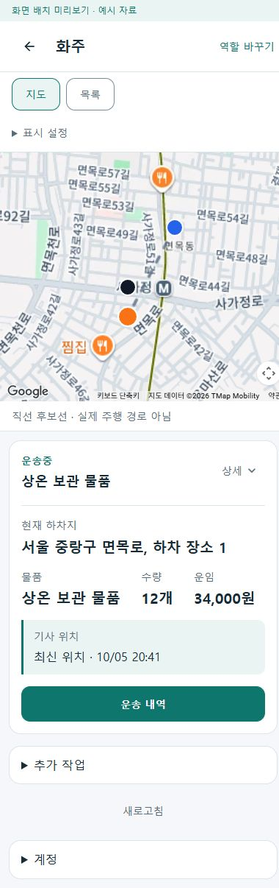
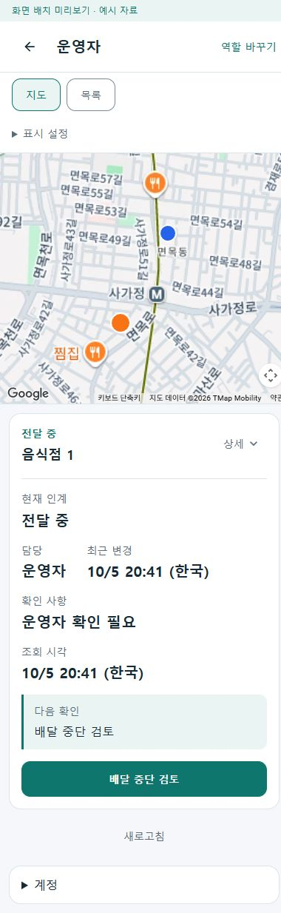

# 지도 위치·정보 갱신과 역할별 기본 카드 r16

사용자가 역할 지도 조사에서 제안한 1·2·3 진행을 승인했다. 지도 카메라를 움직이면 내 위치도 바뀌던 화물 지도 표시와 오래된 위치·카드 갱신을 보완하고, 기존 자료로 역할별 기본 카드를 만들었다. 역할·업무 상태별 최종 카드 구성은 사용자 후속 검토 대상으로 남긴다.

현재 `Implemented / ValidatedLocal / CardReviewPending / DeviceRuntimePending`. [구현 계획](../AI/Planning/공통/PLAN-OPERATIONS-NEIGHBORHOOD-MICRO-HUB/role-map-reliability.implementation.r16.md), [페이지 책임](../ProjectOverview/page-docs/role-map-workspace-r11.md#위치-갱신과-역할별-기본-카드-r16), [역할·상태별 카드 검토표](../ProjectOverview/page-docs/role-state-card-review-r16.md)에 범위와 후속 판단을 연결한다.

## 바뀐 동작

- 화물 네이티브 지도는 카메라 중심·복귀지와 서버에서 수신한 최근 위치를 분리한다. 위치를 알 수 없거나 10분 기준을 지나면 위치점과 그 위치에서 시작하는 선을 숨긴다. 예시 위치·갱신 시각·복귀지를 실제 GPS 근거로 사용하지 않는다. 연결을 종료한 지도 콜백도 이후 지도에 적용되지 않게 한다.
- 같은 위치 기준을 추천 목록에 적용한다. 위치·상차 좌표를 확인하지 못하면 거리와 가까운순위는 미확인이며 가짜 좌표에서 계산하지 않는다. 반경·가까운순은 위치 확인 후 사용할 수 있고, 전체 목록·수익순은 유지한다.
- 공통 역할 화면은 표시 중인 역할을 최소 15초 간격으로 재조회한다. 지도 사용 여부와 별도로 표시 수명을 확인하고, 1초 간격으로 유효 시간이 지난 핀·연결 경로를 제거한다. 지도 사용이 어려우면 목록으로 전환할 수 있다. 새 조회 응답을 기다리는 동안 기존 카드가 사라지지 않는다.
- 자동 조회 실패에는 마지막 확인 정보라는 안내를 남기고 새 조회 전까지 업무 처리를 막는다. 401·403에는 비공개 카드와 지도를 제거한다. 명령·로그아웃·확인창이 진행 중이면 자동 조회하지 않는다. 지도 무효화·수동 새로고침도 명령 처리에 끼어들지 않으며 처리 후 조회로 상태를 확인한다.
- 음식 기사·화물 기사·창고는 완료된 선택에서 다음 현재 업무로 넘어갈 때 카드·선택·첫 지도 자료를 함께 바꾼다. 주문자·음식점·화주·운영자의 명시적 선택은 유지한다.
- 선택한 화물 운송의 상하차 좌표는 기존 기사 소유 상세 조회에 연결했다. 명시적 의뢰 관계가 일치하고 개인정보 제공이 허용된 경우만 제공한다. 운송번호로 추정한 관계나 요약 자료를 좌표 근거로 바꾸지 않는다. 계약에 nullable 좌표 네 개를 추가했으며 DB 구조와 원장은 변경하지 않았다.
- 화주·화물 기사·창고·주문자·음식점·운영자의 기존 정보를 기본 카드에 표시한다. 주문자의 위치 기록과 조회 시각은 구별하고 30초가 지난 기사 핀을 숨긴다. 화주의 원천 수신 시각이 없는 경우 클라이언트 변환 시각으로 채우지 않는다. 운영자의 선택적 지도 자료 조회 장애는 주문 카드 조회와 분리하되 인증·권한 오류와 사용자 취소를 삼키지 않는다.

생활의 기존 업무 화면, 음식·화물 업무 구분, 로그인·등록·입력·스캔·증빙·정산과 독립 페이지는 유지한다. 이번 기본 카드의 항목·길이·강조 순서는 최종 디자인이 아니다. 특히 주문자와 음식점의 시각 항목 중 무엇을 상세로 옮길지는 검토표에 남겼다.

## 검증

원시 결과는 `artifacts/local/role-map-reliability-r16/`와 아래 검증 디렉터리에 있다.

| 확인 | 이번 실행 결과 |
| --- | --- |
| Fast `20261005-203528` | 제품 3.5 전체 빌드 오류 0, 관련 시험 243/243 통과 |
| Task `20261005-203725` | 제품 3.5 전체 빌드 오류 0, 전수 시험 7,561/7,561 통과 |
| Android 전용 빌드 | 별도 `DriverApp` Android 오류 0·경고 33, `SsalddelApp` Android 오류 0·경고 2. 네이티브 지도·공통 카드 소비 코드 컴파일이며 실제 SDK 화면·GPS 실행과 구분 |
| 미리보기 별도 빌드 | 오류 0·경고 0 |
| 실제 브라우저 | 실제 Google 바탕지도와 공통 UI에 예시 자료 연결. 기본 카드 일곱 역할, 320px·390px 가로 넘침 없음 |
| 화면 상태 확인 | 주문자 위치 만료·목록 전환, 음식점 기본/상세·재조리, 운영자 지도 자료 실패, 화물·창고의 완료 대상에서 다음 현재 업무 선택 |
| 브라우저 오류 | 서버 재시작 후 새 검증 탭의 일곱 기본 화면에서 오류 0. 이전 탭의 재시작 중 재접속 오류와 구별 |
| 위치·상태 회귀 | 누락·미래·만료 위치, 느린 조회 중 만료 제거, 권한 상실, 숨김/복귀, 명령 중 조회 차단, 명시적 선택·소유 운송 관계·정보 제공 보류를 시험 |

첫 Task에서 기존 정적 카드 렌더 시험 5개가 새 `IJSRuntime` 등록을 받지 못해 실패했다. 시험 환경에 정적 렌더용 의존성을 등록한 뒤 Fast·Task를 다시 실행해 위 결과를 확인했다. 미리보기 첫 빌드의 실행 중 DLL 잠금도 해당 로컬 미리보기만 종료한 후 재빌드로 해소했다. Android 첫 실행의 전역 `TargetFrameworks` 덮어쓰기로 참조 라이브러리 복원 대상이 어긋난 문제는 해당 옵션을 제거하고 Android 대상만 선택해 재빌드하여 해소했다. 제품 빌드에는 기존 패키지·nullable 등 경고가 남아 있으며 경고 0이라고 보고하지 않는다.

예시 호스트에서 주문자·음식점·운영자·화주·화물 기사·창고는 실제 제품 adapter에 예시 DTO를 공급한다. 음식 기사 화면은 기존 r14 예시 카드와 공통 UI를 보존한다. 예시의 `actual` 자료 표시는 분기 재현용이며 실제 주문·배차·GPS·원장 증거가 아니다. 제품 업무 명령·업로드·지급은 실행하지 않는다. 지도 로딩은 기존 브라우저 키를 프로세스 설정에서만 사용하고 Android 키·외부 배포 설정을 변경하지 않았다.

기존 HEAD와 dirty 작업은 유지했고 작업 밖 기준선 1,066개 파일의 해시 유지를 확인했다. 휴대폰 설치·실제 GPS·Android 타일/키·실제 서버/DB 업무 완료·Azure 통신·commit/push는 수행하지 않았다.

## 확인 화면

바탕지도는 실제 Google 지도이고 카드·위치·상태는 화면 상단에 표시한 예시 자료다. 로고와 저작권 표시는 보존한다.

| 음식 기사 | 화물 기사 | 창고 |
| --- | --- | --- |
|  |  |  |

| 주문자 | 음식점 | 화주 | 운영자 |
| --- | --- | --- | --- |
|  |  |  |  |

[상태별 추가 화면과 검토 항목](../ProjectOverview/page-docs/role-state-card-review-r16.md)에서 상세, 목록, 위치 만료와 다음 업무를 비교한다. 예시 실행과 지원 상태는 [미리보기 안내](../../eng/RoleWorkspacePreview/README.md)에 있다.
