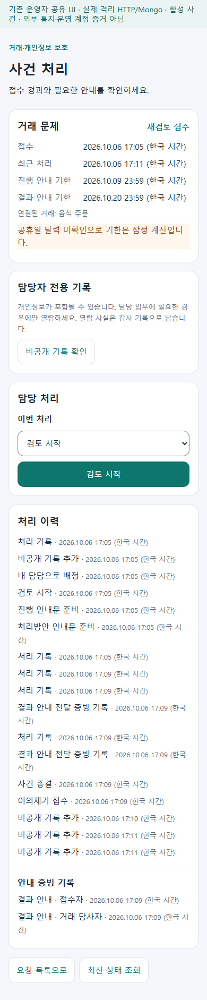
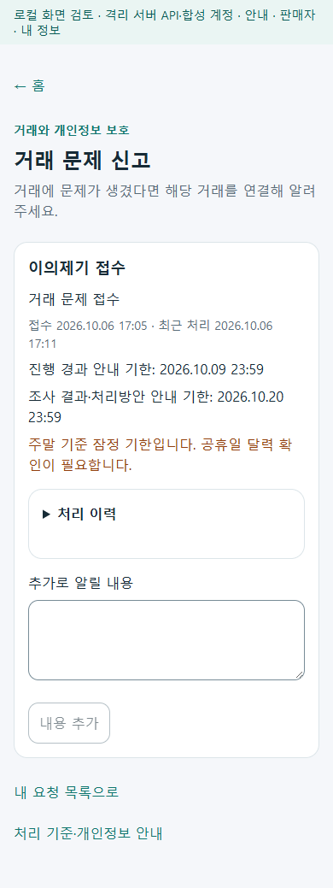
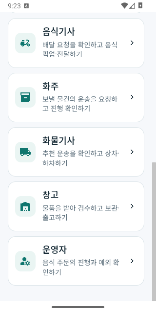
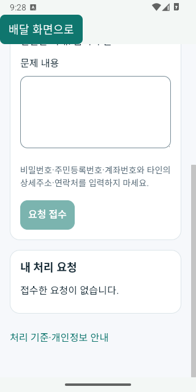

# 본인 APK 업무 검증 r26

로그인 후 원래 보호 요청으로 돌아가지 못하는 흐름과 사용자 추가 내용을 서버의 비공개 증빙 계약으로 보내지 않던 부분을 수정했다. 음식 기사 앱의 실제 주문 문제 접수와 운영자의 사건 처리 화면을 기존 API에 연결했다. 첫 목표는 본인의 APK 시험 사용이다. [페이지 책임과 범위](../ProjectOverview/page-docs/apk-workflow-completion-r26.md)를 기준으로 기존 음식·화물 분리와 운영 준비 관문을 유지한다.

## 화면과 업무 연결

- 통합 앱·웹·주문자·음식점 로그인은 안전한 로컬 보호 화면과 사건·원천 식별자를 유지한다. 주문자는 독립 `/login`에서 기존 인증 서비스를 사용하며 로그인만으로 업무를 제출하지 않는다.
- 사용자 추가 내용은 `PrivateEvidence`로 보낸다. 통신 결과가 불명확한 같은 사건의 재시도는 원래 요청 ID·판본·본문을 유지한다. 사건·계정 전환, 401/403과 이탈은 비공개 입력·응답·미확정 요청을 정리하고 늦은 이전 응답을 무효화한다.
- 음식 기사 앱의 수행/완료 상세에서 문제 접수는 독립 화면으로 이동한다. 서버가 주는 원본 `OrderNo`를 연결하고 상호나 제목으로 주문을 추론하지 않는다. 이전 서버가 이 필드를 주지 않으면 해당 진입을 제공하지 않는다. 같은 기사 계정의 재로그인 복귀는 15분 내 원천에 한정한다.
- 웹·모바일 운영자 앱은 `/privacy-support` 목록과 상세에서 담당자 지정·현재 허용 행동·통지 근거·이의제기를 다룬다. 상세 조회 후 안내 시각을 입력할 수 있고 현재 시각의 최종 판정은 서버가 한다. 상세 조회가 실패해도 목록으로 돌아갈 수 있다.
- 담당 운영자의 명시적 비공개 기록 열람만 감사 API를 호출한다. 일반 응답에는 원문을 넣지 않는다. 안내 준비와 실제 전달 증빙을 구분하며 증빙 없는 종결을 완료로 표시하지 않는다.

실제 설치본에서 세 가지 화면 접근 문제를 추가로 발견했다. 현재 수행 카드의 상세 명령이 추천 배달이 있을 때만 열려 문제 접수에 접근할 수 없었다. 현재 수행도 상세를 펼칠 수 있도록 조건 한 줄을 수정하고 픽업 이동·픽업 대기·전달 상태의 실제 명령 회귀를 추가했다. 통합 앱의 역할 홈은 전역 `body` 스크롤을 막으면서 역할 layout 안에 스크롤 주체가 없어 아래 역할에 접근할 수 없었다. 역할 layout 자체에 화면 높이와 내부 스크롤 경계를 지정했다. 음식 기사 문제 접수 WebView도 아래 접수 버튼까지 스크롤할 수 없어 지원 전용 layout 안에 내부 스크롤 경계를 추가했다. 설치본에서 앱 자체 scoped CSS 묶음이 이 규칙을 포함하지 않는 것을 확인해, 실제 로드되는 `app.css`에 지원 화면 클래스만의 규칙을 뒀다. 이전 APK·실패 화면·소스 결속을 보존하고 수정 후 설치본을 다시 검증했다.

## 실제 서버와 공유 화면 시험

기존 사용자 DB와 r24 시험 DB를 사용하지 않고 `mirror-r26-food-check`의 고유 물리 볼륨 3개로 격리했다. Development·Simulation과 합성 계정·0.250km 경로 자료를 사용했다. 최종 서버 이미지는 현재 서버·계약 소스의 빌드 전후 지문 변화 0개와 `/verification/health` 응답 204에 결속한다. `/health/ready`는 일부 다른 DB migration 준비 항목으로 503이며 전체 플랫폼 운영 준비 완료로 해석하지 않는다.

같은 `FOOD-20261006080046167` 주문을 실제 공유 Razor → client → HTTP → MySQL/Mongo로 처리했다. 정상 업무 진행은 초기 시험 이미지에서 완료했고 최종 서버 이미지에서는 보존된 같은 주문의 HTTP·DB 상태를 재확인했다. 최종 이미지에서 전체 업무를 새로 반복한 증거로 확대하지 않는다. 주문 생성은 실제 역할 client가 준비했고, 음식점 인지·기사 선행 배정·조리·준비·픽업·전달·주문자 수령 확인·운영자 확인·기사 완료 목록과 상세는 화면으로 진행했다. 주문 작성 화면에서 처음부터 생성한 시험 또는 APK로 네 역할 모두 완주한 시험으로 확대하지 않는다.

같은 주문의 지원 사건은 사용자 접수·추가 증빙·운영자 담당 지정·검토·안내 준비·종결·사용자 이의제기까지 연결했다. 통지 증빙 없는 종결은 409로 거절됐다. 성공 종결에 넣은 두 당사자 전달 근거는 **시험용 합성 증빙**이며 외부 메시지를 발송하지 않았다. 중복 요청 재응답, 본문 충돌/낡은 판본의 409, 관리 권한 403, 다른 요청자의 상세 404, 일반 응답의 비공개 원문 미노출 등 12회 경계 검사를 실제 API로 확인했다.

DB의 최종 주문은 `수령확인`, 배차는 `배달완료`다. 정산은 세전 2,500원·`AwaitingDeductions`·수령액 미확정·`NotRequested`이며 실제 지급이 아니다.

원시 근거는 Git 제외 `artifacts/local/apk-completion-r26/`의 `server/result.json`, `real-ui/`, `real-support-ui/`, `actual-api-guards.json`, `food-database-state.jsonl`, `support-database-state.json`에 보존한다. 종합 결속은 `actual-workflow-evidence.json`, 최종 스타일을 적용한 320/390px 18화면(오류·가로 넘침 0)은 `final-styled-readonly-ui/verification.json`이다. 이 캡처는 해당 공유 UI 소스·DLL·CSS에 결속되며 이후 네이티브 지원 layout 수정의 실행 증거는 별도 APK 캡처로 확인한다. 초기 하네스 실패와 최종 성공을 함께 남겼다. 원문·인증 정보는 `.private/`에 보관하고 공유 문서에 넣지 않는다.

## 설치와 공개 운영의 구분

두 Debug APK는 0.1.26/26, Android 최소 API 24, arm64-v8a/x86_64, 루프백 5362 시험 서버를 대상으로 만든다. USB `adb reverse`와 실행 중인 시험 서버가 필요한 개인 시험용이며 Azure에 연결되는 배포본이 아니다. 선택 소스의 전후 지문·APK 서명·판본·ABI·내장 런타임·사본 해시를 별도 검사한다. 16KB 검사는 ZIP 정렬이며 네이티브 ELF 호환성 전체를 인증하지 않는다.

실제 휴대폰·GPS·지도 공급자·Azure HTTPS·신원기관·외부 메시지·실제 입금과 공개 운영 준비는 별도 확인 대상이다. 지도 미설정 시 목록 대체 화면을 유지한다. MAUI의 네이티브 WebView 이탈은 비동기 정리를 시작하므로 즉시 메모리 폐기 완료의 증거로 확대하지 않는다. [프레임워크 해당 판본](https://raw.githubusercontent.com/dotnet/maui/10.0.20/src/BlazorWebView/src/Maui/Android/BlazorWebViewHandler.Android.cs)을 대조했다.

최종 설치본에서는 통합 앱의 홈을 손가락으로 스크롤해 여덟 역할 모두에 접근하고, 서버에서 가져온 현재 픽업 업무와 배달료 2,500원을 확인했다. 음식 기사 앱에서는 현재 업무 상세 펼치기 → 같은 원본 주문의 문제 접수 → 하단 접수 버튼까지 스크롤 → 배달 화면 복귀를 확인했다. 시험용 내용을 작성하고 이탈한 뒤 다시 열었을 때 입력이 비어 있고 접수 버튼이 비활성인 것도 확인했다. 이 네이티브 확인에서는 요청을 제출하거나 배달 상태를 변경하지 않았다.

완료 목록과 상세에는 1건·2,500원·요금 기준 거리 0.25km·완료 3일 뒤의 열람 기한·공제/수령액 미확정이 표시됐다. 소유한 시험 gateway만 일시 정지해 상세 조회 실패 안내와 주문·고객 정보 숨김을 확인했고, 복구 후 새로고침으로 원래 상세가 돌아왔다. 단순 USB reverse 해제는 기존 연결이 유지돼 불확실했던 시도로 별도 보존한다. 실제 3일 경과에 따른 차단과 실제 휴대폰의 동작은 이번 설치 확인에 포함하지 않는다. 실행 증거 39개와 21개 검사는 `emulator/runtime-verification.json`에 최종 APK 해시·현재 소스 지문과 함께 결속했다.

## 최종 검증과 인계

| 항목 | 결과와 근거 |
| --- | --- |
| Fast | 관련 13개 시험 묶음 266개 통과. `artifacts/local/validation/20261006-182557/` |
| Task | 전체 3.5 솔루션 빌드 오류 0, 시험 8,053개 통과·환경 조건 2개 건너뜀. `artifacts/local/validation/20261006-182729/` |
| 실제 HTTP·DB·공유 화면 | 같은 완료 주문과 지원 사건, 실제 API 경계 12회, 최종 스타일 320/390px 18화면 통과. 원문·통지는 합성 시험 자료이며 실제 지급 없음 |
| APK 소스·파일 | 선택한 앱·공통 입력 2,203개 전후 지문 변화 0. 두 APK의 서명·0.1.26/26·ABI·내장 런타임·ZIP 정렬·전달 사본 SHA-256 통과 |
| Android 설치 | 소유 에뮬레이터 API 36/x86_64에 두 APK 설치 성공, 설치된 base APK 해시와 전달 파일 일치. `emulator/installed-packages.json` |
| APK 화면 | 최종 설치본의 역할 홈·현재 업무·지원 화면 스크롤·입력 정리·복귀·완료 목록/상세·연결 실패/재조회 21개 검사 통과. `emulator/runtime-verification.json` |
| 작업 범위 | 이번 변경 96개 파일, 범위 밖 변경 0. 기존 HEAD·branch·관련 없는 작업 보존, stage 없음. `scope-verification.json` |

Task에서 건너뛴 두 시험은 별도 환경 변수를 요구하는 Mongo integration 시험이다. 이번 실제 HTTP/MySQL/Mongo 시나리오와 그 시험의 실행 여부는 구분한다. 빌드의 기존 경고와 최초 실패·이전 판본을 보존했으며 성공한 최종 기록으로 이전 실패를 덮어쓰지 않는다.

마지막 스타일 수정은 음식 기사 앱에만 적용됐다. 통합 앱과 공통 입력의 변경 0개 및 이전 APK 해시 일치를 확인해 통합 앱 APK를 보존하고 기사 앱만 다시 만들었다. 두 설치된 base APK와 전달 사본의 최종 SHA-256은 일치한다. `apk-source-verification.json`의 `retainedApp`에 보존 근거를 남겼다.

개인 USB 시험용 [설치·검증 안내](../../artifacts/local/apk-completion-r26/apk/설치-검증-안내.md), [통합 앱 APK](../../artifacts/local/apk-completion-r26/apk/Mirror-r26-usb-debug.apk), [음식 기사 APK](../../artifacts/local/apk-completion-r26/apk/FoodDriver-r26-usb-debug.apk)는 Git 제외 로컬 인계 자료다. PC의 격리 시험 서버와 USB reverse 연결을 준비하고 현재 시험 계정 파일을 사용한다. 운영 비밀번호·원본 영상·개인정보를 저장소에 추가하지 않는다.

공유 화면의 대표 확인:

최종 Android 설치본의 대표 확인:

