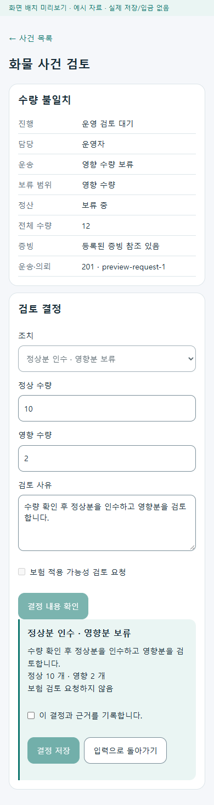
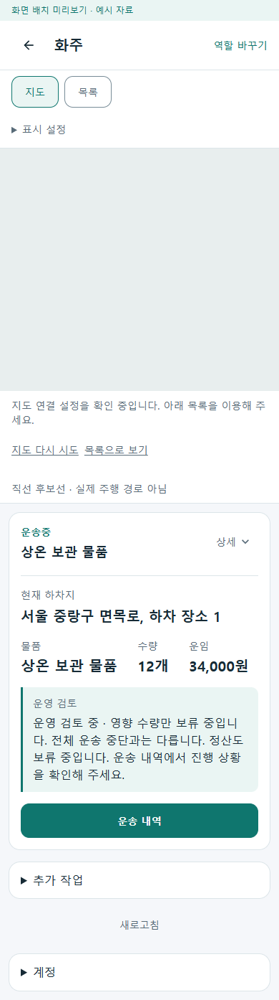
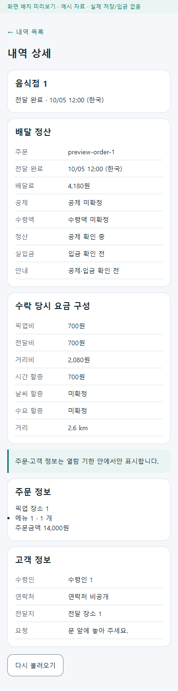
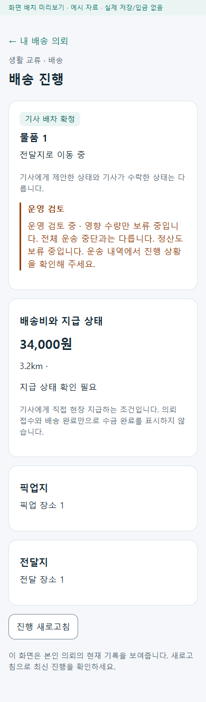
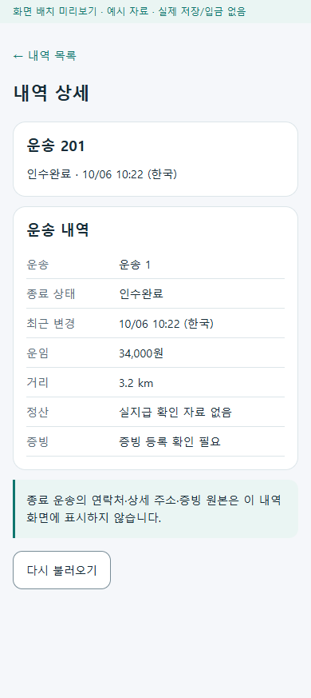

# 역할 간 업무 연결 보완 r21

[r20 조사](2026-10-06-role-handoff-audit-r20.md)의 H01~H03을 구현했다. 기존 서버 기능을 통합 역할 화면에 연결하고, 현재 업무와 사건 검토·과거 내역의 책임을 분리했다. [구현 전 책임 카드](../ProjectOverview/page-docs/role-map-workspace-r11.md#역할-간-인계-보완-r21--구현-전-페이지-책임)가 범위를 소유한다.

## 변경과 코드·API·원장 관계

| 보완 | 화면과 결과 | 기존 연결 |
| --- | --- | --- |
| H01 운영자 화물 사건 | 운영 업무→사건 목록→독립 검토. 현재 사건·운송·의뢰·revision을 확인하고 정상/영향 수량·결정·근거를 기록한다. 제출 확인에는 동결한 수량과 보험 검토 요청도 표시한다. | `CargoIncidentWorkspace` / `CargoIncidentReviewViewModel`→`GET api/v1/admin/transports/incidents`, `PUT …/{incident}/decision`→기존 사건·의뢰·운송 원장. |
| H02 화주·생활 보류 안내 | 기본 카드에 전체 운송 / 영향 수량 / 정산 보류를 구별한다. 원래 운송 단계는 유지한다. 재개·종료 사건을 현재 보류로 표시하지 않으며, 구판 응답의 미확인 범위를 전체 중단으로 채우지 않는다. | `CargoIncidentPresentation`→화주 응답의 기존 사건·보류 필드. `CargoWorkspaceAdapters`와 `NeighborhoodDeliveryDetail`이 같은 표시를 소비한다. |
| H03 통합 기사 내역 | 현재 업무→목록→상세→현재 업무. 음식은 한국 날짜의 전달 완료 정산 기록, 화물은 종료·취소·중단 기록이다. 목록 날짜와 현재 선택한 업무를 복귀 링크에 보존한다. | `DriverHistoryWorkspace` / `DriverHistoryViewModel`→기존 음식 일별 정산·완료 상세, 기사 화물 목록·상세 API→각 원장. |

웹 통합 앱의 route는 `/workspace/operator/cargo-incidents`, `/workspace/operator/cargo-incidents/{IncidentId}/review`, `/workspace/{RoleKey}/history`, `/workspace/{RoleKey}/history/{RecordId}`다. 통합 MAUI 앱도 같은 공통 컴포넌트를 사용한다. `RoleSecondaryFrame`은 표시·복귀·조회 상태만 맡고 검토 결정이나 내역 조회 규칙은 각 ViewModel이 소유한다. 현재 업무 카드에 다른 배달 목록을 추가하지 않았다.

운영 결정의 응답이 불명확하면 같은 요청 ID·본문으로 다시 시도한다. 저장 응답 뒤 읽기만 실패한 경우에는 PUT을 다시 보내지 않고 GET으로 확인한다. 다른 사건·운송·의뢰 응답이나 revision 충돌은 완료로 처리하지 않는다. 계정 변경과 늦은 응답은 기존 역할 수명 관리로 차단한다. 권한·기능 조회 거절을 정상 빈 목록으로 숨기지 않는다.

음식 내역의 요금 구성은 수락 당시 저장된 값을 읽으며 공제·입금 미확정을 0원이나 지급 완료로 바꾸지 않는다. 주문·고객 상세는 서버가 허용한 열람 상태·서버 시각·기한을 따르고, 조회 소요시간을 뺀 뒤 화면이 열린 중에도 만료 정보를 지운다. 화물 종료 내역에는 주소·연락처·증빙 원본을 표시하지 않는다. 공개 contract/API, DB, 인증·기능 플래그, 운임·보험·세금·지급 정책은 변경하지 않았다.

## 실제 화면 확인

로컬 `RoleWorkspacePreview`에서 **제품 공통 컴포넌트**를 예시 DTO에 연결해 Chromium으로 320·390px를 확인했다. 지도 키는 공급하지 않았으므로 지도 안내·목록 대체 상태다. 24개 렌더 상태와 6개 이동 흐름에서 가로 넘침·브라우저 오류 0, 검사한 조작 영역 48px 이상을 확인했다. 목록→검토→확인→입력 복귀와 두 기사 목록→상세→목록→현재 업무, 조회 날짜/선택 보존, 만료 정보 비표시, 빈 상태·403·404 안내를 검증했다. 대표 PNG는 예시 장소·인물·식별자만 포함한다.

| 운영자 사건 검토 | 화주 기본 보류 안내 |
| --- | --- |
|  |  |

| 음식 기사 상세 | 생활 배송 보류 안내 | 화물 기사 상세 |
| --- | --- | --- |
|  |  |  |

Figma `01 Community`의 생활 배송 카드와 MAUI `NeighborhoodDeliveryDetail`의 대응은 보류 안내 한 구간 추가다. 기존 토큰을 사용하고 route·contract는 유지했다. 이 세션에는 Figma 조회·편집 도구가 없어 frame/node 확인과 갱신을 수행하지 못했다. 위 PNG는 실제 공통 웹 렌더이며 Figma 또는 MAUI 단말 캡처가 아니다. 운영 검토·기사 내역은 기존 역할 작업공간 기준을 따른다.

## 검증 범위

- 신규 26개 사례를 포함한 집중 테스트 136/136 통과. 권한/기능 거절, 정상 빈 목록, 동결 제출·같은 요청 재시도, 저장 뒤 조회 전용 재확인, 충돌, 다른 응답/계정, 정상·영향 수량, 내역 읽기 전용, 서버 기한 만료와 개인정보 제거를 확인했다.
- Fast `20261006-101559`와 Task `20261006-101723` 통과. 처음 발견한 웹 기사 앱의 의도치 않은 페이지 자동 포함 오류를 통합 작업공간 파일명으로 수정했다. 현재 `Ssalddel.v3.5.slnx` 소비 앱 빌드와 집중/전수 테스트가 통과한다.
- Task 전수 **7,651/7,651** 통과, 실패/건너뜀 0. 검증 범위 25개 코드·책임 문서 경로다. 이후 미리보기 날짜 예시를 조회 날짜와 맞추고 미리보기 빌드·화면 검증을 다시 실행했다. 제품 코드는 전수 검증 뒤 변경하지 않았다. 추가한 변경 기록·목차·PNG와 최종 링크/범위 검사는 별도로 확인한다.
- 최종 통합 앱 Android 빌드 오류/경고 0, Windows 빌드 오류 0. Windows에는 기존 `AuthApiService.cs` 98·99행의 CS8601 경고 2개가 남는다. 공통 미리보기 빌드 오류/경고 0. 모두 빌드 근거이며 단말 실행 근거가 아니다.
- 전체 변경은 35개 경로다. 시작 기준선 917개 중 범위 밖 기존 dirty 파일 905개는 SHA-256이 일치한다. 기존 삭제 2개, HEAD·branch·stage도 유지했다. 로컬 문서 링크 436개 누락 0을 확인했다.

원시 로그·TRX·시작 해시·파일 범위·검증 JSON은 Git 제외 `artifacts/local/role-handoff-fixes-r21/`에 있다. 자동 화면 검증은 `eng/RoleWorkspacePreview/verify-handoff-ui.cjs`이며 설치된 Playwright와 브라우저를 사용한다. 미리보기에서는 결정 저장·증빙 업로드·외부 지급을 차단한다. 실제 제품 서버/DB에서 여러 계정의 업무를 끝낸 결과, 휴대폰 설치·GPS·Azure·실입금·전체 역할/상태 검증은 아니다. commit/push·공개 배포는 수행하지 않았다.
